# Diagramas do Domínio

Modelo de dados do ConectaFapes dividido por subdomínio, para leitura fácil. O primeiro é o **panorama geral** (nível de subdomínio); os demais detalham as tabelas de cada área e suas ligações. Nós tracejados são tabelas de outra área citadas como âncora.

## Panorama geral

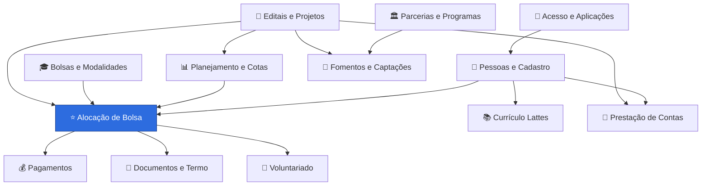

> Para o mapa completo com todas as 110 tabelas, veja [[_banco-de-dados]].

## Bolsas e Modalidades

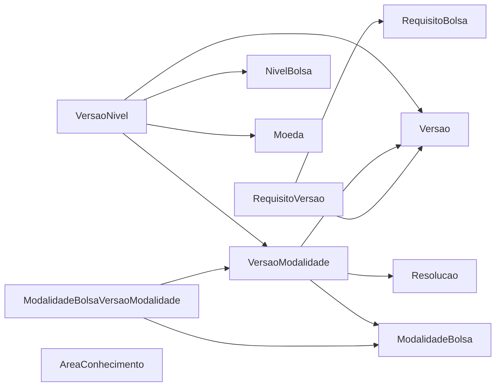

## Alocação de Bolsa (núcleo)

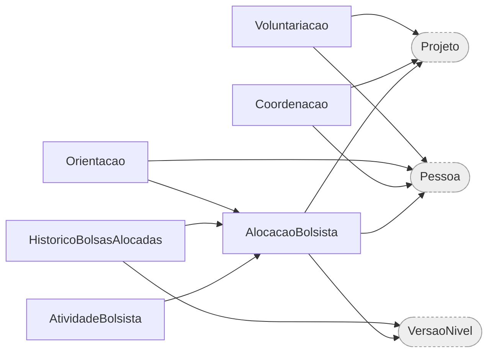

## Pessoas e Cadastro

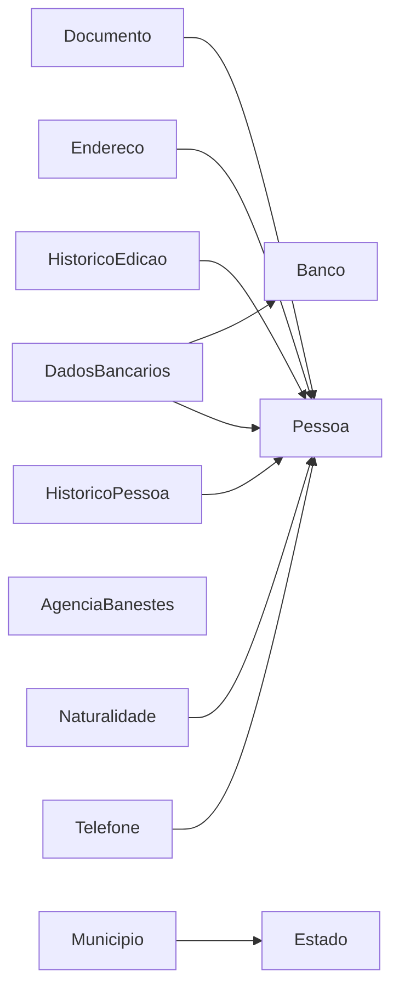

## Editais e Projetos

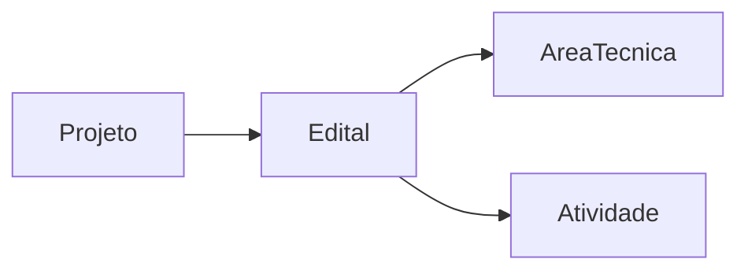

## Planejamento e Cotas

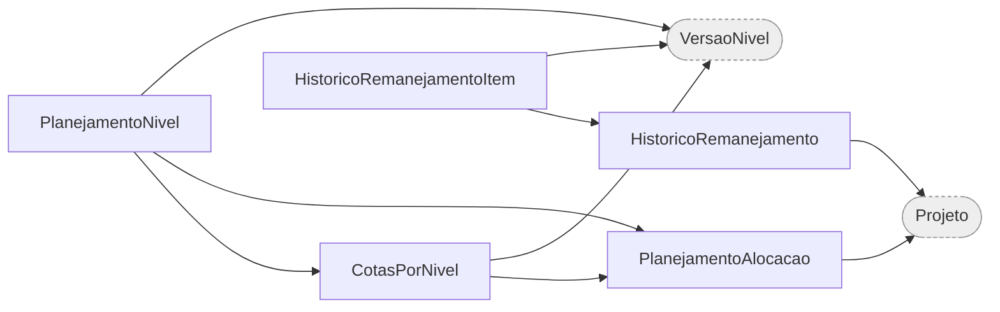

## Pagamentos

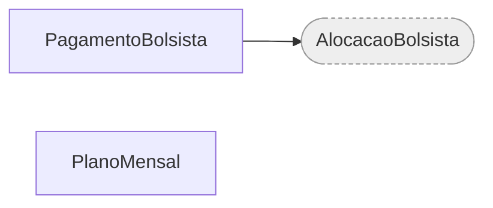

## Documentos e Termo

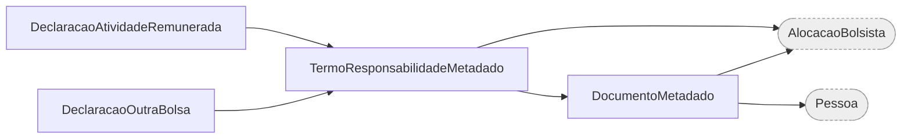

## Acesso e Aplicações

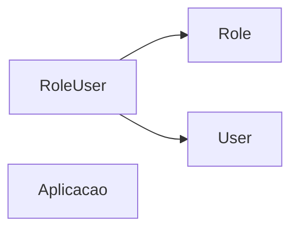

## Parcerias e Programas

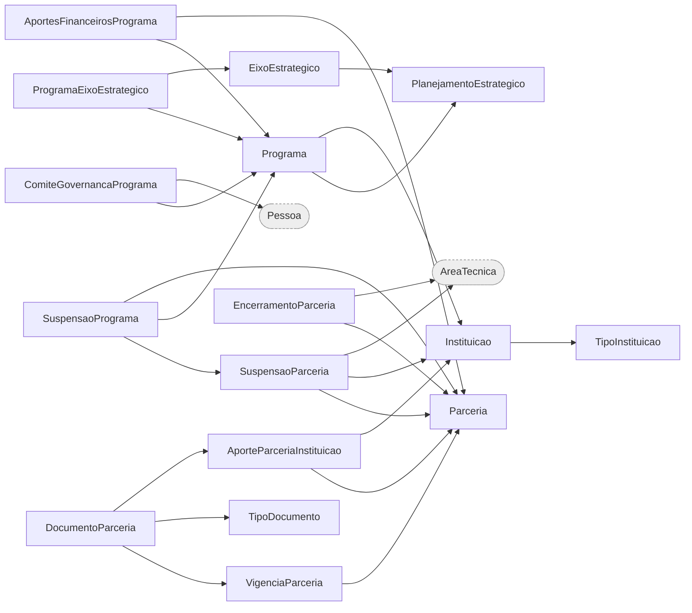

## Fomentos, Captações e Formulários

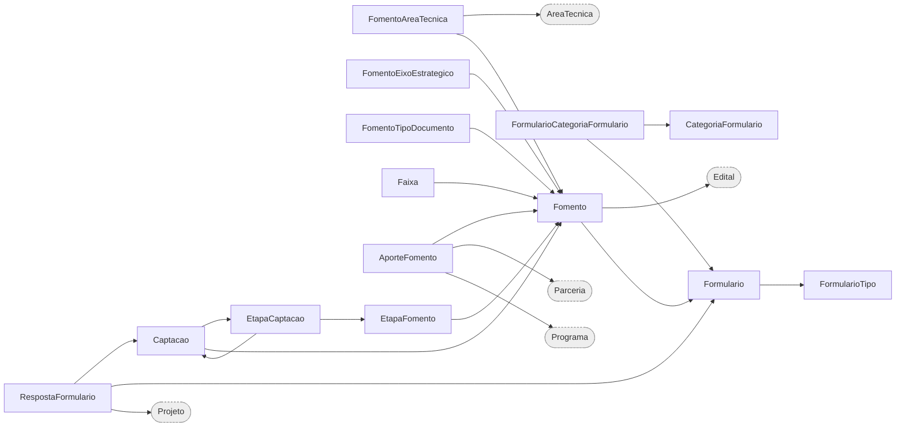

## Currículo Lattes

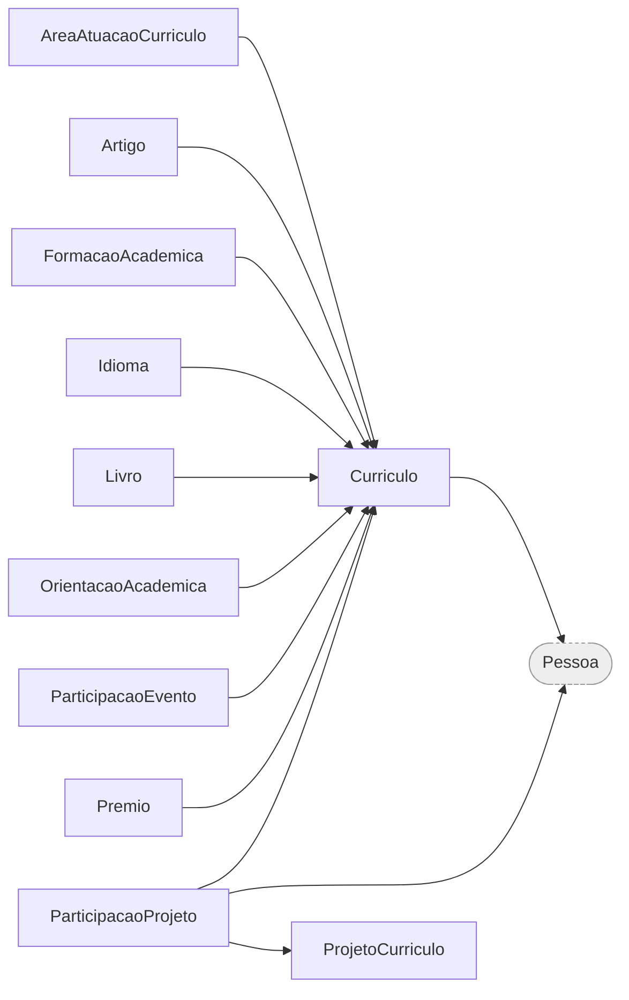

## Prestação de Contas

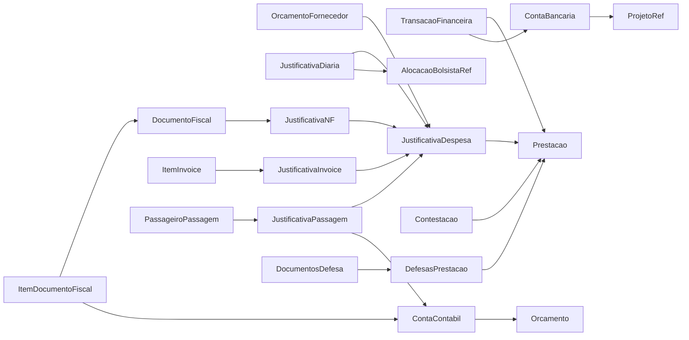
