# Diagramas do Domínio

Modelo de dados do ConectaFapes dividido por subdomínio, para leitura fácil. O primeiro é o **panorama geral** (nível de subdomínio); os demais detalham as tabelas de cada área e suas ligações. Nós tracejados são tabelas de outra área citadas como âncora.

## Panorama geral

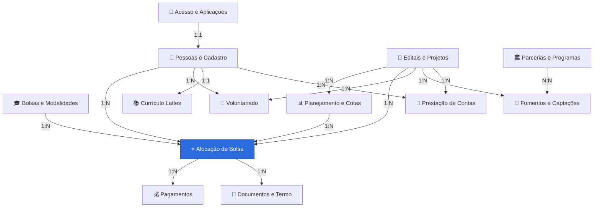

> **Como ler a cardinalidade** nos diagramas por área (notação ER, pé‑de‑galinha): `||` = exatamente um · `o{` = zero ou muitos. Assim `Pessoa ||--o{ AlocacaoBolsista` lê‑se *"uma Pessoa tem muitas Alocações; cada Alocação pertence a uma Pessoa"* (1:N). Tabelas de junção (com dois vínculos 1:N) representam relações N:N.

> Para o mapa completo com todas as 110 tabelas, veja [[_banco-de-dados]].

## Bolsas e Modalidades

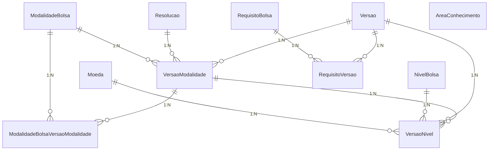

## Alocação de Bolsa (núcleo)

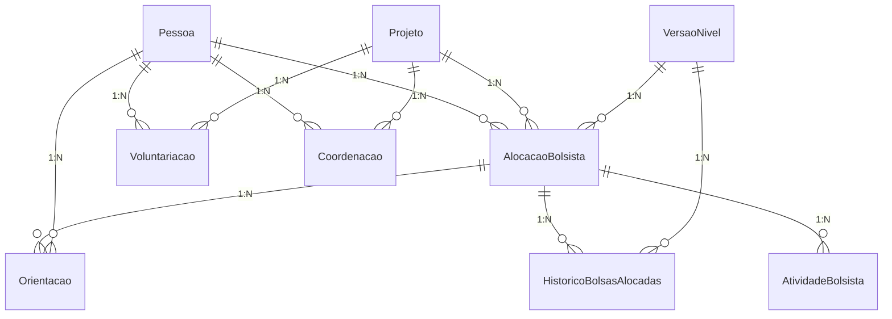
_Entidades de outras áreas citadas como âncora:_ `Pessoa`, `Projeto`, `VersaoNivel`.

## Pessoas e Cadastro

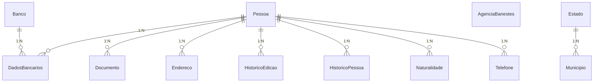

## Editais e Projetos

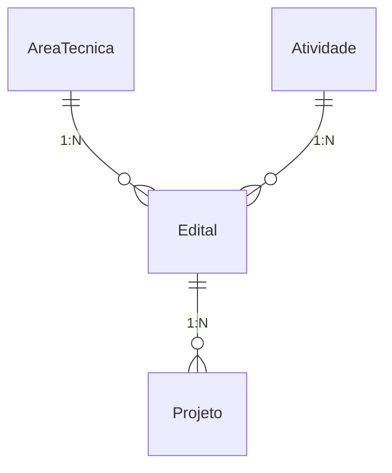

## Planejamento e Cotas

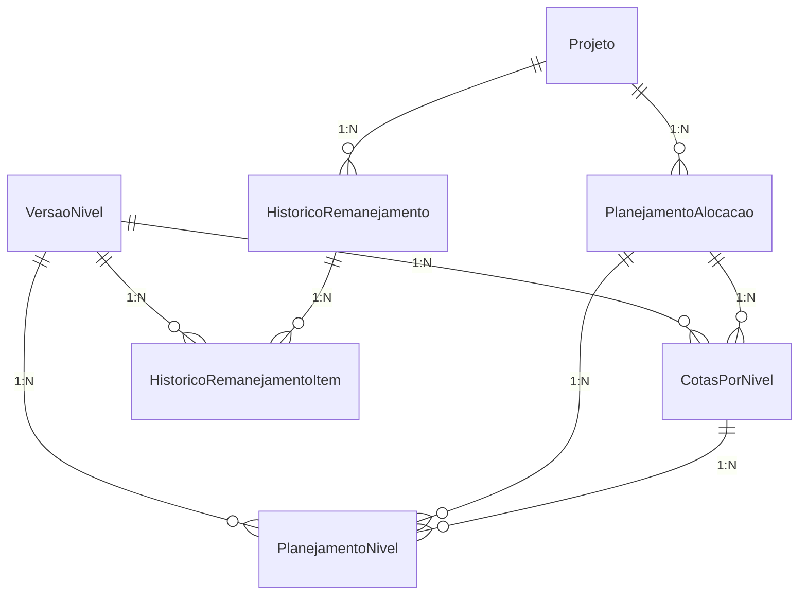
_Entidades de outras áreas citadas como âncora:_ `Projeto`, `VersaoNivel`.

## Pagamentos

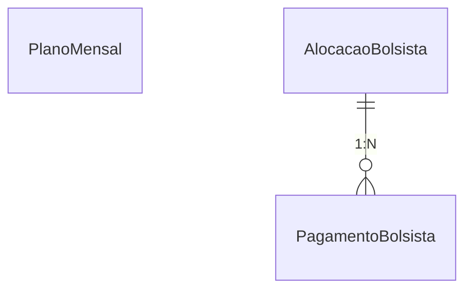
_Entidades de outras áreas citadas como âncora:_ `AlocacaoBolsista`.

## Documentos e Termo

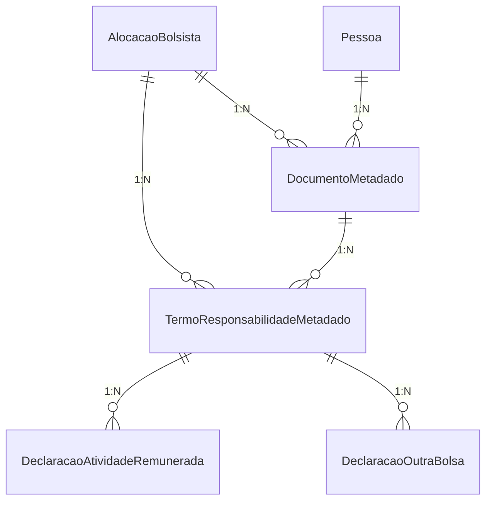
_Entidades de outras áreas citadas como âncora:_ `AlocacaoBolsista`, `Pessoa`.

## Acesso e Aplicações

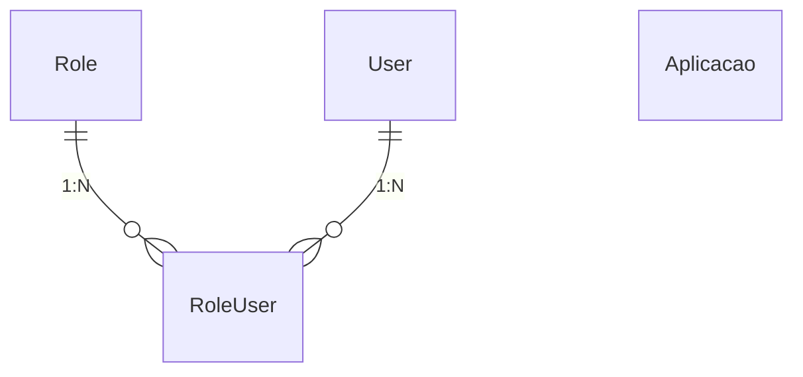

## Parcerias e Programas

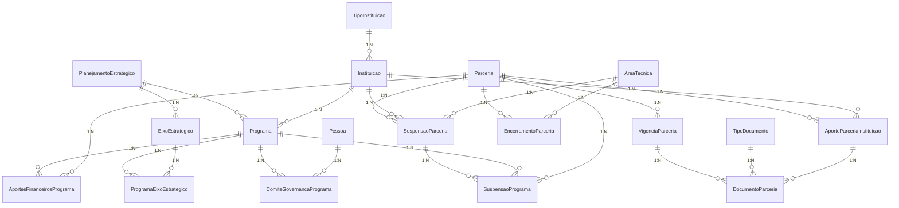
_Entidades de outras áreas citadas como âncora:_ `AreaTecnica`, `Pessoa`.

## Fomentos, Captações e Formulários

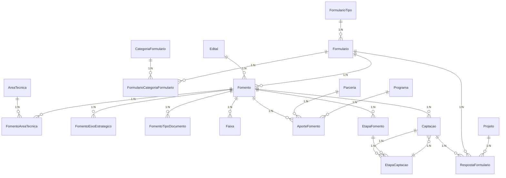
_Entidades de outras áreas citadas como âncora:_ `AreaTecnica`, `Edital`, `Parceria`, `Programa`, `Projeto`.

## Currículo Lattes

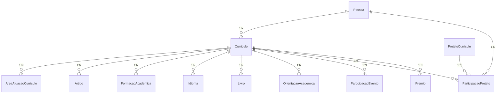
_Entidades de outras áreas citadas como âncora:_ `Pessoa`.

## Prestação de Contas

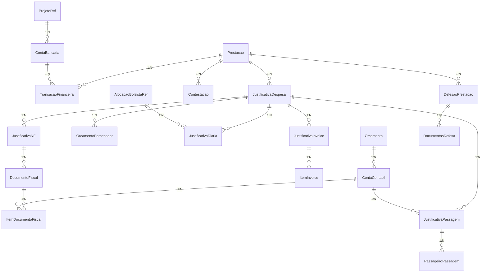
