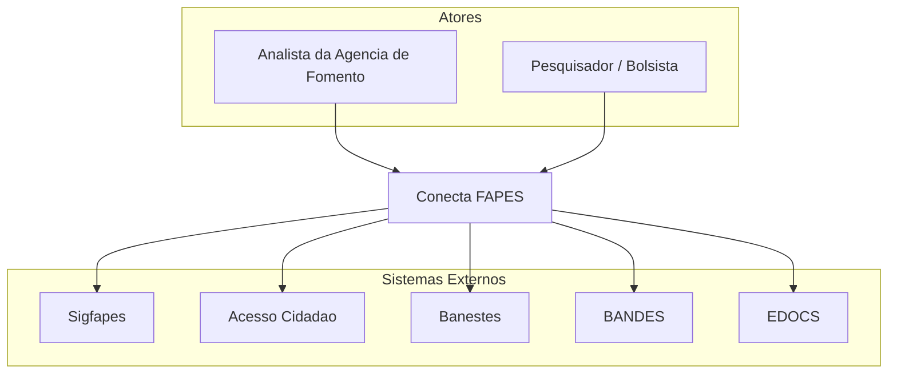

# Arquitetura - Visao Geral

[← Voltar para Arquitetura](README.md)

## Visao Geral

O ConectaFAPES e desenvolvido pelo **LEDS (Laboratorio de Extensao em Desenvolvimento de Solucoes) do IFES Campus Serra** para a agencia de fomento. O sistema e composto por modulos independentes que compartilham um banco de dados comum (SQL Server), seguindo uma arquitetura modular com Clean Architecture e CQRS no backend. A autenticacao e federada via Acesso Cidadao e a autorizacao e gerenciada pelo OpenFGA, aplicando uma estrategia de Defense in Depth com Zero Trust.

## Diagrama de Contexto (C4 - Level 1)

## Diagrama de Containers (C4 - Level 2)

O detalhamento formal dos containers ainda nao foi consolidado neste documento. Nesta rodada, a referencia arquitetural de containers permanece distribuida entre a stack tecnologica abaixo, as ADRs da pasta [`adr/`](adr/) e os documentos complementares desta pasta. A evolucao proposta para composicao orientada a tela via BFF, preservando o gateway tecnico como camada de seguranca e roteamento, esta registrada em [ADR-005](adr/ADR-005-adocao-bff.md).

## Stack Tecnologico

| Camada | Tecnologia | Observacoes |
|--------|------------|-------------|
| Front-end | Vue.js / NuxtUI | Conforme [ADR-002](adr/ADR-002-frontend-vue-nuxtui.md) |
| Back-end | C# / .NET (Clean Architecture + CQRS) | Conforme [ADR-001](adr/ADR-001-backend-csharp-clean-architecture-cqrs.md) |
| Banco de Dados | Microsoft SQL Server | Instancia unica com schemas por dominio ([ADR-003](adr/ADR-003-banco-de-dados-sql-server.md)) |
| Autenticacao | Acesso Cidadao (OpenID Connect) | SSO do governo do ES |
| Autorizacao | OpenFGA | RBAC + ABAC com modelo Defense in Depth / Zero Trust ([ADR-007](adr/ADR-007-autorizacao-openfga.md)) |
| Infraestrutura | Docker + Kubernetes (Prodest) | Conforme [ADR-004](adr/ADR-004-infraestrutura-docker-kubernetes.md) |
| CI/CD | GitHub Actions + GHCR | Build, testes e deploy automatizado |
| Background Jobs | Hangfire | Processamento assincrono de remessas e importacoes ([ADR-009](adr/ADR-009-hangfire-background-jobs.md)) |
| Armazenamento de Objetos | MinIO | Upload de PDFs, orcamentos e documentos fiscais ([ADR-010](adr/ADR-010-minio-armazenamento-objetos.md)) |
| Integracao Fiscal | SERPRO | Consulta e validacao de NF-e via API OAuth2 |
| BI | PowerBI via AirFlow | Dashboards analiticos |
| Documentacao | MkDocs Material | Portal de documentacao do projeto |
