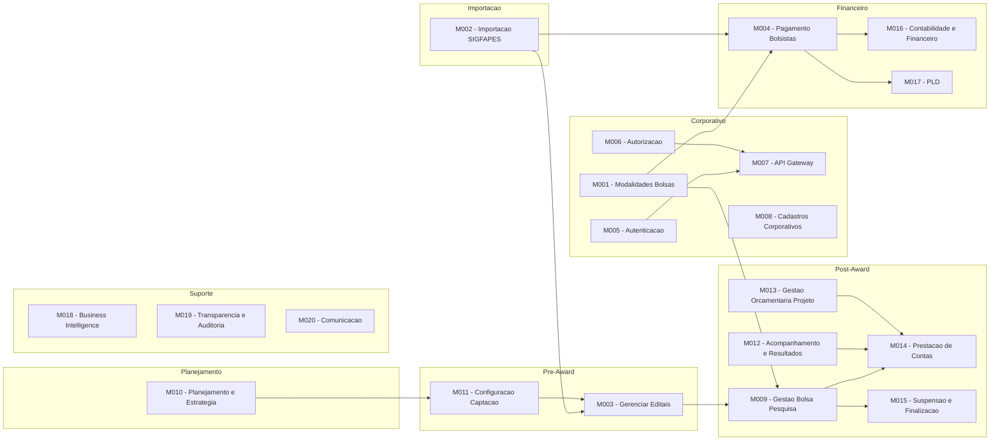
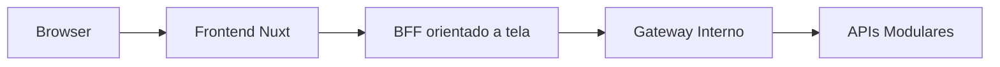

# Arquitetura - Modulos e Integracoes

[← Voltar para Arquitetura](README.md)

## Modulos

## Integracoes Externas

| Sistema | Tipo | Descricao |
|---------|------|-----------|
| Sigfapes | Importacao automatica de dados | Importacao de editais, projetos, equipes, bolsistas e historico de pagamentos do sistema legado. Dados intermediados pelo banco ConectaFapesJobImportacaoDB |
| Acesso Cidadao | Autenticacao (OpenID Connect) | SSO do governo do ES ([docs.acessocidadao.es.gov.br](https://docs.acessocidadao.es.gov.br)). Unico ponto de autenticacao de usuarios |
| OpenFGA | Autorizacao | Motor de decisao de acesso (PDP). Avalia politicas RBAC/ABAC em tempo real |
| Banestes | Pagamento (remessa/retorno) | Integracao via arquivos de remessa e retorno (@-EDI). Envio e recebimento atualmente manuais |
| BANDES | Pagamento | Transferencia de recursos financeiros para projetos |
| EDOCS | Documentos | Anexacao de documentos de pagamento gerados pelo sistema |

## Componentes de Backend

| Componente | Descricao |
|------------|-----------|
| **Conect Admin** | Modulo administrativo principal. Gerencia importacoes do Sigfapes, modelos de dominio (editais, projetos, alocacoes, bolsistas) e operacoes do back-office da agencia de fomento |
| **Dashboard Pagamento** | Painel analitico de gastos por edital, projeto e bolsista. Consolida dados financeiros para tomada de decisao |
| **Modulo Pagamento** | Operacionaliza o pagamento de bolsas via integracao com Banestes (arquivos de remessa/retorno @-EDI) e geracao de documentos para BANDES e EDOCS |
| **Gerenciamento de Usuarios** | Ultima barreira de acesso. Verifica se o usuario possui cadastro ativo no sistema apos autenticacao e autorizacao, aplicando restricoes adicionais (ex.: bloqueio por inatividade) |

## Evolucao Proposta: BFF

O [ADR-005](adr/ADR-005-adocao-bff.md) propoe introduzir uma camada de Backend for Frontend (BFF) para jornadas que agregam dados de varios modulos. A proposta nao substitui os contratos modulares nem transforma o M007 em BFF; o gateway continua sendo a camada tecnica de roteamento, autenticacao e enforcement.

Na fase inicial recomendada, o BFF pode ser implementado no proprio Nuxt/Nitro para compor queries e alguns fluxos multi-etapa com forte necessidade de experiencia integrada. Se a complexidade operacional crescer, a camada pode evoluir para BFFs logicos separados por canal, como back-office e front-office.

## Decisoes de Arquitetura

As decisoes de arquitetura sao registradas como ADRs (Architecture Decision Records) na pasta [`adr/`](adr/).
