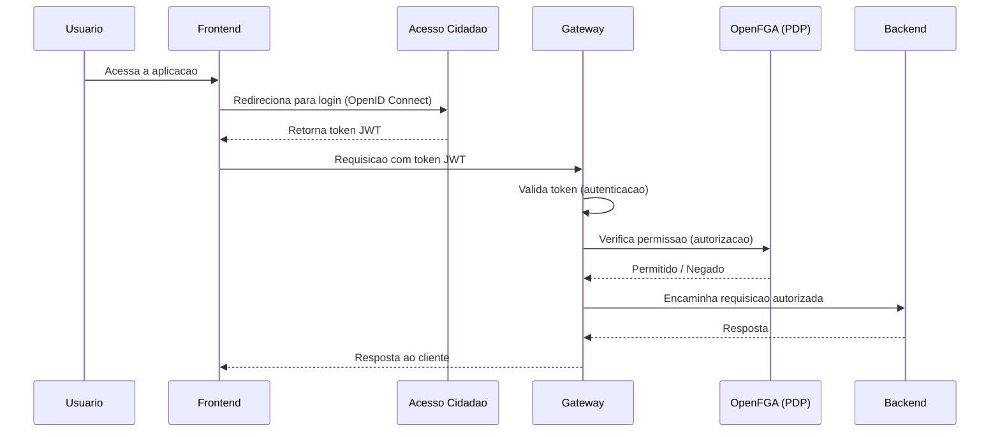
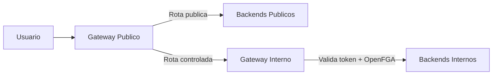

# Arquitetura - Acesso e Seguranca

[← Voltar para Arquitetura](README.md)

## Perfis de Acesso

O sistema possui tres perfis de acesso distintos:

| Perfil | Descricao | Exemplos de Persona |
|--------|-----------|---------------------|
| **Publico Interno da agencia de fomento** | Servidores e analistas da agencia de fomento que acessam o back-office para gestao administrativa, financeira e tecnica | Analista da Area Tecnica, SUCON |
| **Publico Externo (Coordenadores / Pesquisadores)** | Pesquisadores, bolsistas e coordenadores que acessam o front-office para submissao de propostas, acompanhamento de projetos e prestacao de contas | Coordenador, Bolsista, Participante de Projeto |
| **Sysadmin** | Administradores do sistema responsaveis pela configuracao de politicas de acesso, gestao de usuarios e manutencao da plataforma | Equipe LEDS/IFES |

O controle de acesso combina RBAC (Role-Based Access Control) para permissoes baseadas em perfil e ABAC (Attribute-Based Access Control) para regras contextuais, como restricao a editais da propria area tecnica.

## Fluxo de Autenticacao e Autorizacao

A autenticacao e feita via **Acesso Cidadao** (SSO do governo do ES) usando o protocolo **OpenID Connect**. A autorizacao segue a estrategia **Defense in Depth + Zero Trust**, onde cada camada valida independentemente o acesso.

## Componentes de Autorizacao (XACML adaptado)

| Componente | Papel | Descricao |
|------------|-------|-----------|
| **PAP** (Policy Administration Point) | Configuracao de politicas | Interface para criacao e manutencao de politicas de acesso, perfis e usuarios |
| **PIP** (Policy Information Point) | Coleta de contexto | Captura rotas, recursos e objetos envolvidos na requisicao para alimentar a decisao |
| **PDP** (Policy Decision Point) | Decisao | OpenFGA avalia as politicas contra o contexto e emite decisao (permitir/negar) |
| **PEP** (Policy Enforcement Point) | Aplicacao | Gateway e backends aplicam a decisao do PDP, bloqueando requisicoes nao autorizadas |

## Gateways

O sistema opera com dois gateways que separam trafego publico e controlado:

| Gateway | Funcao | Detalhes |
|---------|--------|----------|
| **Gateway Publico** | Ponto de entrada unico | Resolve rotas publicas (portal de transparencia, consultas abertas) e redireciona rotas que exigem autenticacao para o Gateway Interno |
| **Gateway Interno** | Autorizacao granular | Valida token JWT, consulta OpenFGA para verificar permissoes e encaminha a requisicao ao backend correspondente. Aplica rate limiting e logging |

## Impacto da Proposta de BFF

O [ADR-005](adr/ADR-005-adocao-bff.md) registra a proposta de incluir uma camada de BFF entre o frontend e o gateway interno para compor respostas aderentes a cada tela. Essa proposta preserva a estrategia de seguranca atual:

- o BFF nao substitui o Gateway Publico nem o Gateway Interno;
- a identidade do usuario deve ser propagada do frontend para o BFF e do BFF para o gateway interno;
- a decisao de autorizacao continua em OpenFGA, aplicada pelo gateway e confirmada pelos backends quando necessario;
- o BFF nao acessa banco diretamente e nao se torna dono de regras centrais de negocio.

## Seguranca

Politicas de seguranca aplicadas ao desenvolvimento e operacao do sistema:

| Area | Politica | Detalhes |
|------|----------|----------|
| **Desenvolvimento seguro** | Praticas de codificacao segura | Code reviews obrigatorios, testes de seguranca (SAST/DAST) integrados ao pipeline de CI/CD |
| **Gestao de acesso** | Principio do menor privilegio | Usuarios recebem apenas as permissoes minimas necessarias. RBAC e obrigatorio para todos os perfis; ABAC complementa com regras contextuais |
| **Criptografia** | Dados em transito e em repouso | TLS para todas as comunicacoes; dados sensiveis criptografados no banco de dados |
| **Monitoramento** | Logging e auditoria | Atividades criticas dos usuarios sao registradas em log. Logs protegidos contra alteracao nao autorizada e retidos conforme politica de retencao |
| **Autenticacao** | Acesso Cidadao (OpenID Connect) | Autenticacao federada via SSO do governo do ES; nenhuma credencial armazenada localmente |
| **Autorizacao** | Defense in Depth + Zero Trust | Validacao em multiplas camadas (gateway, backend, banco) com OpenFGA como motor de decisao |
