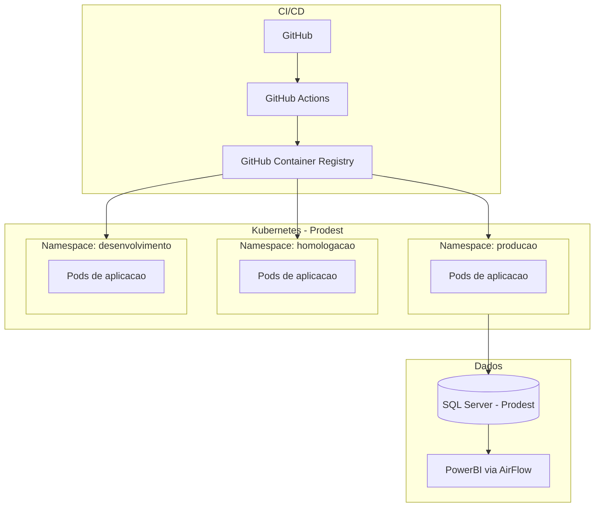

# Arquitetura - Dados e Operacao

[← Voltar para Arquitetura](README.md)

## Banco de Dados

O sistema utiliza **Microsoft SQL Server** como SGBD, mantido pela Prodest. A estrategia adotada e de banco unico com schemas por dominio (conforme [ADR-003](adr/ADR-003-banco-de-dados-sql-server.md)).

| Banco de Dados | Finalidade | Detalhes |
|----------------|------------|----------|
| **ConectaFapesDB** | Banco principal | Armazena todos os dados gerados e consumidos pelo sistema. Organizado em schemas por dominio: `corporativo`, `planejamento`, `fomento`, `financeiro`, `suporte`, `importacao` |
| **ConectaFapesJobImportacaoDB** | Staging de importacao | Banco intermediario para importacao e sincronizacao de dados do Sigfapes. Os dados sao validados e transformados antes de serem movidos para o banco principal |
| **ConectaFapesJobsDB** | Jobs e agendamentos | Banco dedicado a jobs do sistema e tarefas agendadas (ex.: sincronizacao periodica, geracao de relatorios, processamento de filas) |

O acesso ao banco de dados e exclusivo pela camada de Infrastructure do backend; nenhum cliente externo acessa o banco diretamente. Mesmo com a proposta de BFF registrada em [ADR-005](adr/ADR-005-adocao-bff.md), a composicao orientada a tela nao altera esta regra: o BFF consome APIs modulares e nao acessa bancos de dados diretamente.

## Servicos de Infraestrutura Complementares

Alem do SQL Server, o sistema utiliza servicos auxiliares para armazenamento de arquivos, cache/filas e processamento em background:

### MinIO (Armazenamento de Objetos S3)

Servico compativel com S3 para armazenamento de arquivos gerados pelo sistema.

| Bucket (variavel de ambiente) | Modulo | Descricao |
|-------------------------------|--------|-----------|
| `BUCKET_GUIAS` | M004 | Guias de liberacao em PDF (Banestes e Bandes) |
| `BUCKET_REMESSAS` | M004 | Arquivos de remessa e retorno bancario (largura fixa) |
| `BUCKET_RELACOES` | M004 | Relacoes e relatorios de pagamento (PDF, CSV, ZIP) |

### Redis (Cache e Filas)

Conexao opcional e nao-bloqueante (variavel `REDIS`). Utilizado como cache distribuido e filas para processamento assincrono.

| Fila | Modulo | Descricao |
|------|--------|-----------|
| `pagamentobolsista.remessa.cadastro` | M004 | Retornos de remessa de cadastro bancario |
| `pagamentobolsista.remessa.pagamento` | M004 | Retornos de remessa de pagamento |
| `pagamentobolsista.remessa.cadastro.dlq` | M004 | Dead-letter queue de cadastro |
| `pagamentobolsista.remessa.pagamento.dlq` | M004 | Dead-letter queue de pagamento |

### Hangfire (Jobs em Background)

Servidor dedicado (`ConectaFapes.Hangfire`) com SQL Server storage (variavel `SQL_HANGFIRE_SERVER`), dashboard em `/hangfire` e heartbeat de 30 segundos.

| Job | Modulo | Frequencia | Descricao |
|-----|--------|------------|-----------|
| `gerar-editais-competencia` | M004 | A cada 10 min | Gera instancias de EditalCompetencia para o plano mensal vigente |
| `definir-plano-mensal` | M004 | Mensal | Define o plano mensal atual (ativa/desativa `EhAtual`) |
| `cancelar-cotas-com-alocacao-cancelada` | M004 | A cada 2 min | Cancela cotas quando alocacoes sao canceladas |
| `finalizar-alocacoes-bolsas-passadas` | M004 | A cada 2 min | Finaliza bolsas com prazo expirado |
| `processar-cancelamento-alocacao` | M004 | A cada 5 min | Processa cancelamentos de alocacao |
| `processar-retorno-remessa-cadastro` | M004 | A cada 3 min | Consome fila Redis e processa retornos de cadastro |
| `processar-retorno-remessa-pagamento` | M004 | A cada 3 min | Consome fila Redis e processa retornos de pagamento |

### SERPRO (Consulta de NF-e)

Integracao com a API do SERPRO para validacao de Notas Fiscais Eletronicas. Utilizada pelo modulo M014 (Prestacao de Contas).

| Aspecto | Detalhe |
|---------|---------|
| **Autenticacao** | OAuth2 com cache de token via `SerproTokenService` |
| **Servicos** | `SerproNfeService` — consulta NF-e por chave de acesso (44 digitos) |
| **Tipos suportados** | NF-e (produto) e NFS-e (servico) |
| **Deteccao de arquivo** | Automatica — XML, PDF ou imagem |

### Backend de Prestacao de Contas (Projeto Separado)

O modulo M014 possui um backend independente (`ConectaFapes.PrestacaoContas.*`) com seu proprio AppDbContext e SQL Server. Esta separacao e uma decisao de implementacao atual, nao necessariamente definitiva.

| Aspecto | Detalhe |
|---------|---------|
| **Projeto** | `ConectaFapes.PrestacaoContas.API`, `.Application`, `.Domain`, `.Infrastructure` |
| **Base URL** | `/api/prestacao-de-contas/{entidade}` |
| **Banco** | SQL Server proprio (separado do ConectaFapesDB) |
| **Servicos externos** | SERPRO, MinIO, Redis (opcional) |
| **Logging** | Serilog com rolling diario |
| **Middleware** | AuditMiddleware, ExceptionHandlingMiddleware (RFC 7807), PerformanceMonitoringMiddleware |

> **Debito tecnico:** Entidades financeiras (ContaBancaria, Orcamento, ContaContabil, TransacaoFinanceira) estao neste backend mas pertencem conceitualmente a M016/M013. Ver [M014/backlog.md](../implementation/modules/M014-prestacao-contas/backlog.md#debito-tecnico).

### ValidaAI (Validacao de Documentos por IA)

Servico externo de validacao automatica de documentos de bolsistas, utilizado pelo Portal Coordenador (M009).

| Aspecto | Detalhe |
|---------|---------|
| **Tipo** | API externa de validacao por IA |
| **Uso** | Analise automatica de documentos enviados por bolsistas (EP-08 do Portal Coordenador) |
| **Modulo** | M009 (Gestao Bolsista) |
| **Integracao** | `ValidaAiService` na camada Infrastructure do backend do portal |

> **Nota:** Servico identificado no codigo do backend do portal (`ExternalServices/ValidaAiService`). Documentacao de contrato e SLA pendente.

## Ambiente de Operacao

O sistema opera em containers orquestrados por Kubernetes, hospedado na infraestrutura da **Prodest** (empresa de TI do governo do ES).

| Aspecto | Detalhes |
|---------|----------|
| **Containers** | Cada modulo e empacotado como imagem Docker |
| **CI/CD** | GitHub Actions para build, testes e deploy automatizado |
| **Registro de imagens** | GitHub Container Registry (GHCR) |
| **Orquestracao** | Kubernetes gerenciado pela Prodest |
| **Isolamento** | Namespaces separados para producao, homologacao e desenvolvimento |
| **Banco de dados** | SQL Server mantido pela Prodest |
| **BI** | Integracao com PowerBI via AirFlow para dashboards analiticos |

## Referencias

- [Acesso Cidadao — Documentacao](https://docs.acessocidadao.es.gov.br)
- [OpenFGA — Documentacao](https://openfga.dev/docs)
- [ADR-001 — Backend C# com Clean Architecture e CQRS](adr/ADR-001-backend-csharp-clean-architecture-cqrs.md)
- [ADR-002 — Frontend Vue com NuxtUI](adr/ADR-002-frontend-vue-nuxtui.md)
- [ADR-003 — Banco de Dados SQL Server](adr/ADR-003-banco-de-dados-sql-server.md)
- [ADR-004 — Infraestrutura Docker e Kubernetes](adr/ADR-004-infraestrutura-docker-kubernetes.md)
- [ADR-005 — Adocao de BFF para composicao de interfaces](adr/ADR-005-adocao-bff.md)
- [ADR-006 — Reconciliacao da documentacao M004](adr/ADR-006-reconciliacao-m004-pagamento-bolsista.md)
- [Visao do Produto](../discovery/product-vision.md)
