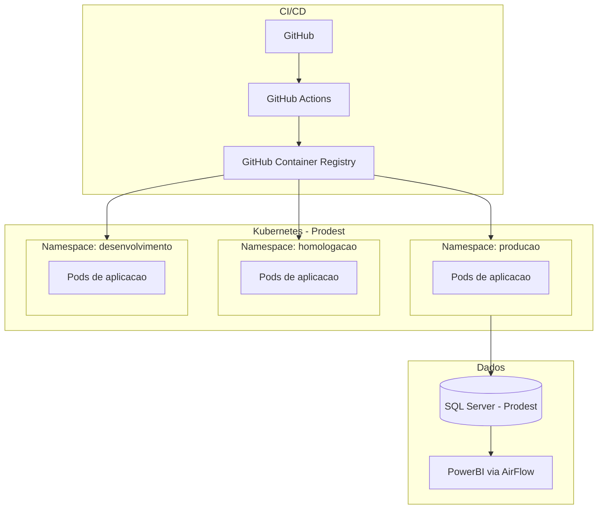

# Arquitetura - Dados e Operacao

[← Voltar para Arquitetura](README.md)

## Banco de Dados

O sistema utiliza **Microsoft SQL Server** como SGBD, mantido pela Prodest. A estrategia adotada e de banco unico com schemas por dominio (conforme [ADR-003](adr/ADR-003-banco-de-dados-sql-server.md)).

| Banco de Dados | Finalidade | Detalhes |
|----------------|------------|----------|
| **ConectaFapesDB** | Banco principal | Armazena todos os dados gerados e consumidos pelo sistema. Organizado em schemas por dominio: `corporativo`, `planejamento`, `fomento`, `financeiro`, `suporte`, `importacao` |
| **ConectaFapesJobImportacaoDB** | Staging de importacao | Banco intermediario para importacao e sincronizacao de dados do Sigfapes. Os dados sao validados e transformados antes de serem movidos para o banco principal |
| **ConectaFapesJobsDB** | Jobs e agendamentos | Banco dedicado a jobs do sistema e tarefas agendadas (ex.: sincronizacao periodica, geracao de relatorios, processamento de filas) |

O acesso ao banco de dados e exclusivo pela camada de Infrastructure do backend; nenhum cliente externo acessa o banco diretamente. Mesmo com a proposta de BFF registrada em [ADR-005](adr/ADR-005-adocao-bff.md), a composicao orientada a tela nao altera esta regra: o BFF consome APIs modulares e nao acessa bancos de dados diretamente.

## Ambiente de Operacao

O sistema opera em containers orquestrados por Kubernetes, hospedado na infraestrutura da **Prodest** (empresa de TI do governo do ES).

| Aspecto | Detalhes |
|---------|----------|
| **Containers** | Cada modulo e empacotado como imagem Docker |
| **CI/CD** | GitHub Actions para build, testes e deploy automatizado |
| **Registro de imagens** | GitHub Container Registry (GHCR) |
| **Orquestracao** | Kubernetes gerenciado pela Prodest |
| **Isolamento** | Namespaces separados para producao, homologacao e desenvolvimento |
| **Banco de dados** | SQL Server mantido pela Prodest |
| **BI** | Integracao com PowerBI via AirFlow para dashboards analiticos |

## Referencias

- [Acesso Cidadao — Documentacao](https://docs.acessocidadao.es.gov.br)
- [OpenFGA — Documentacao](https://openfga.dev/docs)
- [ADR-001 — Backend C# com Clean Architecture e CQRS](adr/ADR-001-backend-csharp-clean-architecture-cqrs.md)
- [ADR-002 — Frontend Vue com NuxtUI](adr/ADR-002-frontend-vue-nuxtui.md)
- [ADR-003 — Banco de Dados SQL Server](adr/ADR-003-banco-de-dados-sql-server.md)
- [ADR-004 — Infraestrutura Docker e Kubernetes](adr/ADR-004-infraestrutura-docker-kubernetes.md)
- [ADR-005 — Adocao de BFF para composicao de interfaces](adr/ADR-005-adocao-bff.md)
- [Visao do Produto](../discovery/product-vision.md)
