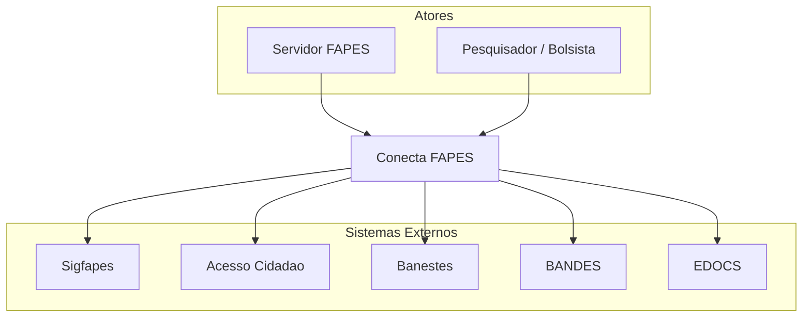
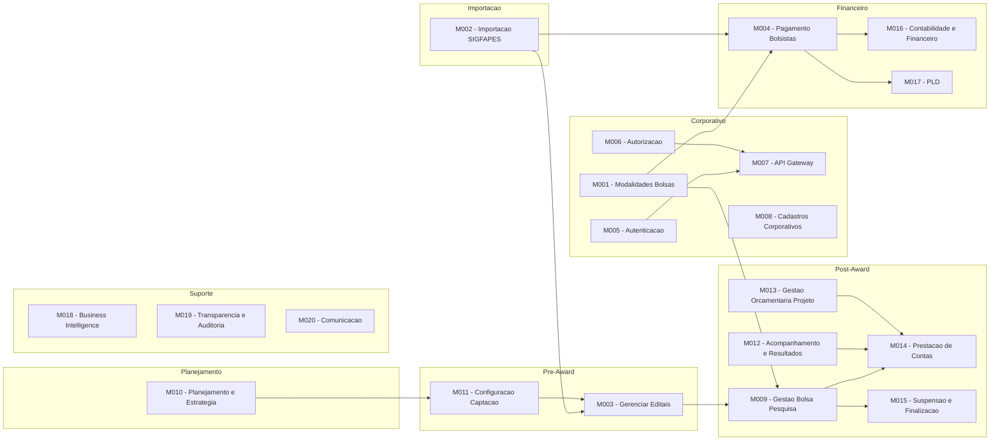
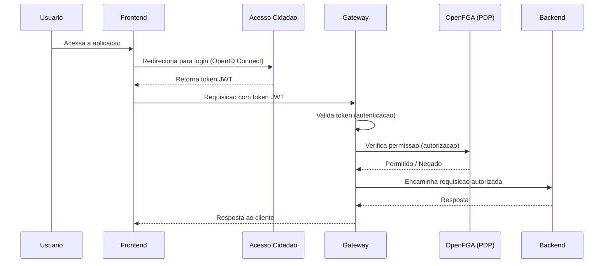
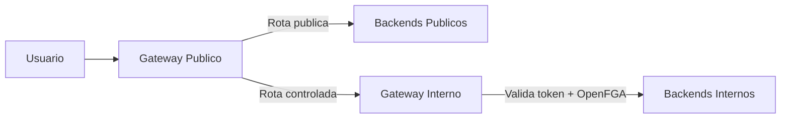
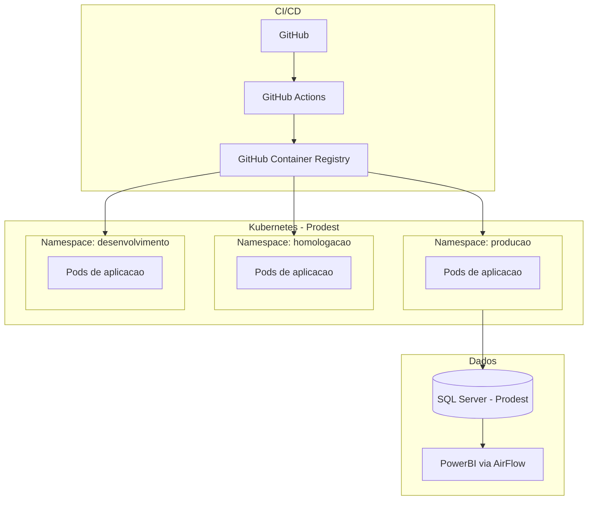

# Arquitetura - Conecta FAPES

Visao geral da arquitetura do projeto Conecta FAPES.

[← Voltar ao Backlog Central](../backlog-product.md)

---

## Visao Geral

O ConectaFAPES e desenvolvido pelo **LEDS (Laboratorio de Extensao em Desenvolvimento de Solucoes) do IFES Campus Serra** para a FAPES. O sistema e composto por modulos independentes que compartilham um banco de dados comum (SQL Server), seguindo uma arquitetura modular com Clean Architecture e CQRS no backend. A autenticacao e federada via Acesso Cidadao e a autorizacao e gerenciada pelo OpenFGA, aplicando uma estrategia de Defense in Depth com Zero Trust.

## Diagrama de Contexto (C4 - Level 1)

<!-- Diagrama mostrando o sistema Conecta FAPES e seus atores/sistemas externos -->

## Diagrama de Containers (C4 - Level 2)

<!-- Diagrama mostrando os containers/servicos que compõem o sistema -->

## Stack Tecnologico

<!-- Liste as tecnologias utilizadas no projeto -->

| Camada | Tecnologia | Observacoes |
|--------|------------|-------------|
| Front-end | Vue.js / NuxtUI | Conforme [ADR-002](adr/ADR-002-frontend-vue-nuxtui.md) |
| Back-end | C# / .NET (Clean Architecture + CQRS) | Conforme [ADR-001](adr/ADR-001-backend-csharp-clean-architecture-cqrs.md) |
| Banco de Dados | Microsoft SQL Server | Instancia unica com schemas por dominio ([ADR-003](adr/ADR-003-banco-de-dados-sql-server.md)) |
| Autenticacao | Acesso Cidadao (OpenID Connect) | SSO do governo do ES |
| Autorizacao | OpenFGA | RBAC + ABAC com modelo Defense in Depth / Zero Trust |
| Infraestrutura | Docker + Kubernetes (Prodest) | Conforme [ADR-004](adr/ADR-004-infraestrutura-docker-kubernetes.md) |
| CI/CD | GitHub Actions + GHCR | Build, testes e deploy automatizado |
| BI | PowerBI via AirFlow | Dashboards analiticos |
| Documentacao | Docusaurus | Portal de documentacao do projeto |

## Modulos

## Integracoes Externas

| Sistema | Tipo | Descricao |
|---------|------|-----------|
| Sigfapes | Importacao automatica de dados | Importacao de editais, projetos, equipes, bolsistas e historico de pagamentos do sistema legado. Dados intermediados pelo banco ConectaFapesJobImportacaoDB |
| Acesso Cidadao | Autenticacao (OpenID Connect) | SSO do governo do ES ([docs.acessocidadao.es.gov.br](https://docs.acessocidadao.es.gov.br)). Unico ponto de autenticacao de usuarios |
| OpenFGA | Autorizacao | Motor de decisao de acesso (PDP). Avalia politicas RBAC/ABAC em tempo real |
| Banestes | Pagamento (remessa/retorno) | Integracao via arquivos de remessa e retorno (@-EDI). Envio e recebimento atualmente manuais |
| BANDES | Pagamento | Transferencia de recursos financeiros para projetos |
| EDOCS | Documentos | Anexacao de documentos de pagamento gerados pelo sistema |

## Decisoes de Arquitetura

As decisoes de arquitetura sao registradas como ADRs (Architecture Decision Records) na pasta [`adr/`](adr/).

---

## Perfis de Acesso

O sistema possui tres perfis de acesso distintos:

| Perfil | Descricao | Exemplos de Persona |
|--------|-----------|---------------------|
| **Publico Interno FAPES** | Servidores e analistas da FAPES que acessam o back-office para gestao administrativa, financeira e tecnica | Analista da Area Tecnica, SUCON |
| **Publico Externo (Coordenadores / Pesquisadores)** | Pesquisadores, bolsistas e coordenadores que acessam o front-office para submissao de propostas, acompanhamento de projetos e prestacao de contas | Coordenador, Bolsista, Participante de Projeto |
| **Sysadmin** | Administradores do sistema responsaveis pela configuracao de politicas de acesso, gestao de usuarios e manutencao da plataforma | Equipe LEDS/IFES |

O controle de acesso combina RBAC (Role-Based Access Control) para permissoes baseadas em perfil e ABAC (Attribute-Based Access Control) para regras contextuais (ex.: acesso restrito a editais da propria area tecnica).

---

## Fluxo de Autenticacao e Autorizacao

A autenticacao e feita via **Acesso Cidadao** (SSO do governo do ES) usando o protocolo **OpenID Connect**. A autorizacao segue a estrategia **Defense in Depth + Zero Trust**, onde cada camada valida independentemente o acesso.

### Componentes de Autorizacao (XACML adaptado)

| Componente | Papel | Descricao |
|------------|-------|-----------|
| **PAP** (Policy Administration Point) | Configuracao de politicas | Interface para criacao e manutencao de politicas de acesso, perfis e usuarios |
| **PIP** (Policy Information Point) | Coleta de contexto | Captura rotas, recursos e objetos envolvidos na requisicao para alimentar a decisao |
| **PDP** (Policy Decision Point) | Decisao | OpenFGA avalia as politicas contra o contexto e emite decisao (permitir/negar) |
| **PEP** (Policy Enforcement Point) | Aplicacao | Gateway e backends aplicam a decisao do PDP, bloqueando requisicoes nao autorizadas |

---

## Gateways

O sistema opera com dois gateways que separam trafego publico e controlado:

| Gateway | Funcao | Detalhes |
|---------|--------|----------|
| **Gateway Publico** | Ponto de entrada unico | Resolve rotas publicas (portal de transparencia, consultas abertas) e redireciona rotas que exigem autenticacao para o Gateway Interno |
| **Gateway Interno** | Autorizacao granular | Valida token JWT, consulta OpenFGA para verificar permissoes e encaminha a requisicao ao backend correspondente. Aplica rate limiting e logging |

---

## Componentes de Backend

| Componente | Descricao |
|------------|-----------|
| **Conect Admin** | Modulo administrativo principal. Gerencia importacoes do Sigfapes, modelos de dominio (editais, projetos, alocacoes, bolsistas) e operacoes do back-office FAPES |
| **Dashboard Pagamento** | Painel analitico de gastos por edital, projeto e bolsista. Consolida dados financeiros para tomada de decisao |
| **Modulo Pagamento** | Operacionaliza o pagamento de bolsas via integracao com Banestes (arquivos de remessa/retorno @-EDI) e geracao de documentos para BANDES e EDOCS |
| **Gerenciamento de Usuarios** | Ultima barreira de acesso. Verifica se o usuario possui cadastro ativo no sistema apos autenticacao e autorizacao, aplicando restricoes adicionais (ex.: bloqueio por inatividade) |

---

## Banco de Dados

O sistema utiliza **Microsoft SQL Server** como SGBD, mantido pela Prodest. A estrategia adotada e de banco unico com schemas por dominio (conforme [ADR-003](adr/ADR-003-banco-de-dados-sql-server.md)).

| Banco de Dados | Finalidade | Detalhes |
|----------------|------------|----------|
| **ConectaFapesDB** | Banco principal | Armazena todos os dados gerados e consumidos pelo sistema. Organizado em schemas por dominio: `corporativo`, `planejamento`, `fomento`, `financeiro`, `suporte`, `importacao` |
| **ConectaFapesJobImportacaoDB** | Staging de importacao | Banco intermediario para importacao e sincronizacao de dados do Sigfapes. Os dados sao validados e transformados antes de serem movidos para o banco principal |
| **ConectaFapesJobsDB** | Jobs e agendamentos | Banco dedicado a jobs do sistema e tarefas agendadas (ex.: sincronizacao periodica, geracao de relatorios, processamento de filas) |

O acesso ao banco de dados e exclusivo pela camada de Infrastructure do backend — nenhum cliente externo acessa o banco diretamente.

---

## Seguranca

Politicas de seguranca aplicadas ao desenvolvimento e operacao do sistema:

| Area | Politica | Detalhes |
|------|----------|----------|
| **Desenvolvimento seguro** | Praticas de codificacao segura | Code reviews obrigatorios, testes de seguranca (SAST/DAST) integrados ao pipeline de CI/CD |
| **Gestao de acesso** | Principio do menor privilegio | Usuarios recebem apenas as permissoes minimas necessarias. RBAC e obrigatorio para todos os perfis; ABAC complementa com regras contextuais |
| **Criptografia** | Dados em transito e em repouso | TLS para todas as comunicacoes; dados sensiveis criptografados no banco de dados |
| **Monitoramento** | Logging e auditoria | Atividades criticas dos usuarios sao registradas em log. Logs protegidos contra alteracao nao autorizada e retidos conforme politica de retencao |
| **Autenticacao** | Acesso Cidadao (OpenID Connect) | Autenticacao federada via SSO do governo do ES; nenhuma credencial armazenada localmente |
| **Autorizacao** | Defense in Depth + Zero Trust | Validacao em multiplas camadas (gateway, backend, banco) com OpenFGA como motor de decisao |

---

## Ambiente de Operacao

O sistema opera em containers orquestrados por Kubernetes, hospedado na infraestrutura da **Prodest** (empresa de TI do governo do ES).

| Aspecto | Detalhes |
|---------|----------|
| **Containers** | Cada modulo e empacotado como imagem Docker |
| **CI/CD** | GitHub Actions para build, testes e deploy automatizado |
| **Registro de imagens** | GitHub Container Registry (GHCR) |
| **Orquestracao** | Kubernetes gerenciado pela Prodest |
| **Isolamento** | Namespaces separados para producao, homologacao e desenvolvimento |
| **Banco de dados** | SQL Server mantido pela Prodest |
| **BI** | Integracao com PowerBI via AirFlow para dashboards analiticos |

---

## Referencias

- [Acesso Cidadao — Documentacao](https://docs.acessocidadao.es.gov.br)
- [OpenFGA — Documentacao](https://openfga.dev/docs)
- [ADR-001 — Backend C# com Clean Architecture e CQRS](adr/ADR-001-backend-csharp-clean-architecture-cqrs.md)
- [ADR-002 — Frontend Vue com NuxtUI](adr/ADR-002-frontend-vue-nuxtui.md)
- [ADR-003 — Banco de Dados SQL Server](adr/ADR-003-banco-de-dados-sql-server.md)
- [ADR-004 — Infraestrutura Docker e Kubernetes](adr/ADR-004-infraestrutura-docker-kubernetes.md)
- [Visao do Produto](../discovery/product-vision.md)
