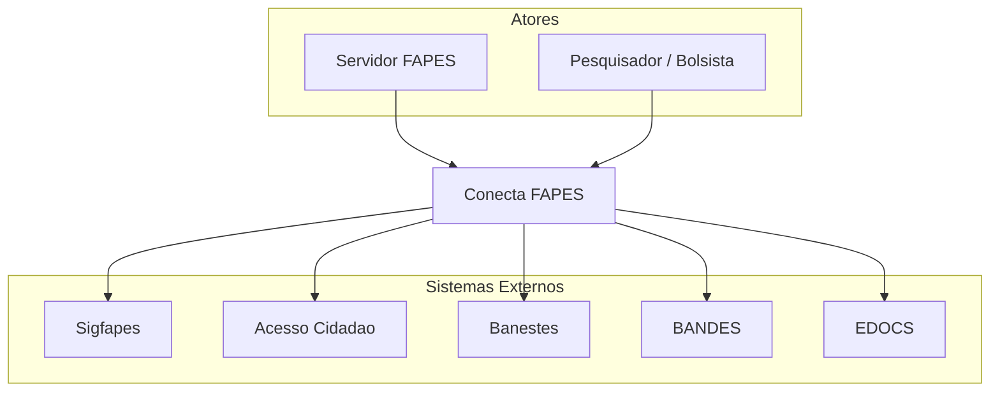
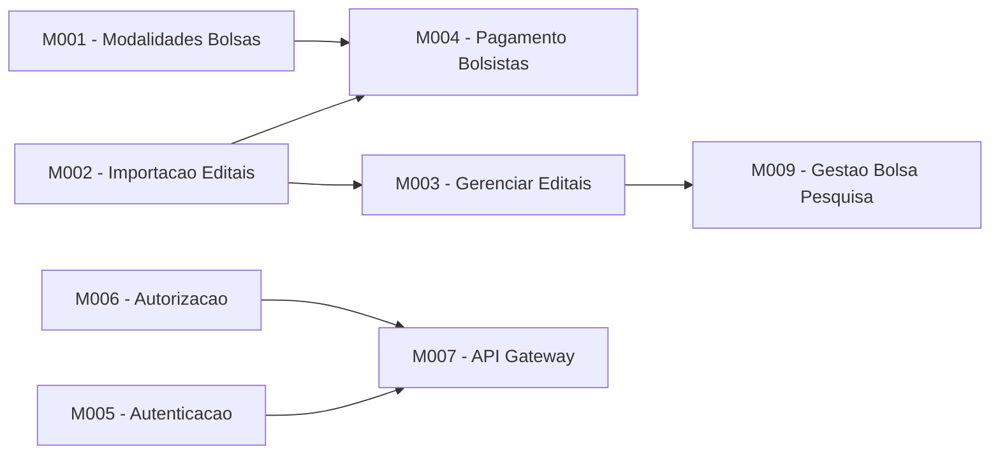

# Arquitetura - Conecta FAPES

Visao geral da arquitetura do projeto Conecta FAPES.

[← Voltar ao Backlog Central](../backlog-product.md)

---

## Visao Geral

<!-- Descreva aqui a visao de alto nivel da arquitetura do sistema -->

## Diagrama de Contexto (C4 - Level 1)

<!-- Diagrama mostrando o sistema Conecta FAPES e seus atores/sistemas externos -->

## Diagrama de Containers (C4 - Level 2)

<!-- Diagrama mostrando os containers/servicos que compõem o sistema -->

## Stack Tecnologico

<!-- Liste as tecnologias utilizadas no projeto -->

| Camada | Tecnologia | Observacoes |
|--------|------------|-------------|
| Front-end | - | - |
| Back-end | - | - |
| Banco de Dados | - | - |
| Autenticacao | Acesso Cidadao / OpenFGA | - |
| Infraestrutura | Kubernetes | - |
| CI/CD | GitLab CI / GitHub Actions | - |
| Documentacao | Docusaurus | - |

## Modulos

## Integracoes Externas

| Sistema | Tipo | Descricao |
|---------|------|-----------|
| Sigfapes | Importacao de dados | Editais, Projetos, Alocacoes, Pessoas |
| Acesso Cidadao | Autenticacao | SSO do governo do ES |
| OpenFGA | Autorizacao | Controle de acesso granular |
| Banestes | Pagamento | Cadastro de bolsistas e remessa/retorno |
| BANDES | Pagamento | Transferencia de recursos |
| EDOCS | Documentos | Anexacao de documentos de pagamento |

## Decisoes de Arquitetura

As decisoes de arquitetura sao registradas como ADRs (Architecture Decision Records) na pasta [`adr/`](adr/).
