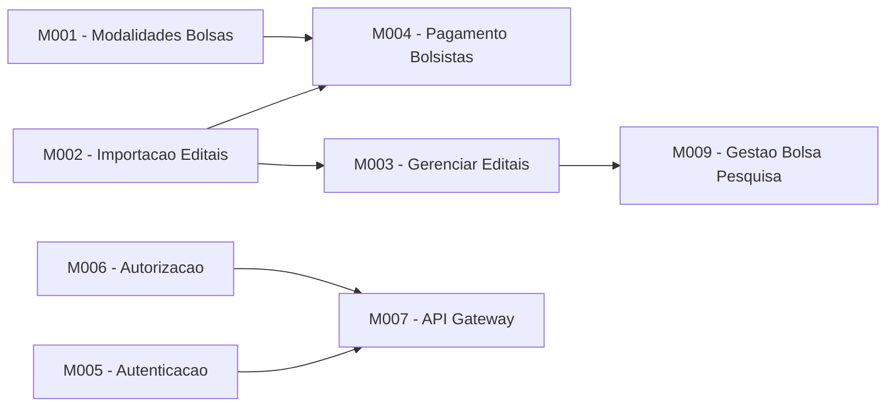

# Product Backlog - Conecta FAPES

Backlog central do produto. Ponto de entrada unico para a visao executiva e navegacao para os sub-backlogs de cada modulo.

Visao detalhada do produto com fundamentacao legal: [product-vision.md](discovery/product-vision.md)

---

## Visao Geral do Produto

Conecta FAPES e uma plataforma de apoio a pesquisa, desenvolvimento e inovacao da FAPES (Fundacao de Amparo a Pesquisa e Inovacao do Espirito Santo). O sistema gerencia o ciclo completo de fomento: desde o planejamento estrategico e captacao de propostas, passando pela contratacao e execucao de iniciativas, ate o pagamento de bolsistas e prestacao de contas.

---

## Dominios

| Dominio | Sub-dominio | Descricao | Modulos |
|---------|-------------|-----------|---------|
| **1. Corporativo e Administrativo** | 1.1 Acesso e Seguranca (IAM) | Autenticacao, portais back/front-office e portal de transparencia | M005, M006, M007 |
| | 1.2 Pessoas e Organizacoes | Cadastro de pessoas fisicas, instituicoes, unidades e dirigentes | - |
| | 1.3 Cadastros Basicos | Estrutura organizacional da agencia, tabelas geograficas, areas de conhecimento e rubricas | - |
| | 1.4 Modalidades de Bolsa | Cadastro e versionamento de modalidades, niveis e requisitos de bolsas | M001 |
| **2. Planejamento e Estrategia** | 2.1 Planejamento Estrategico | Plano estrategico e eixos que orientam programas de fomento | - |
| | 2.2 Gestao de Parcerias | Cooperacao com entidades publicas e privadas, aportes e aditivos | - |
| | 2.3 Gestao de Programa | Cadastro de programas, comites gestores, dotacao orcamentaria e captacoes | - |
| **3. Fomento — Pre-Award** | 3.1 Configuracao da Captacao | Elaboracao do edital, formularios, revisores e parametrizacao | - |
| | 3.2 Fases da Captacao | Submissao, analise documental, analise de merito, contratacao e deposito | M002, M003 |
| **4. Fomento — Post-Award** | 4.1 Acompanhamento de Iniciativas | Dashboards de monitoramento para coordenador, FAPES e SECONT | M003 |
| | 4.2 Gestao de Resultados | Submissao e analise de relatorios tecnicos e contestacao | - |
| | 4.3 Gestao Orcamentaria do Projeto | Adicoes orcamentarias, rubricas e remanejamentos | - |
| | 4.4 Prestacao de Contas | Submissao de documentos fiscais, analise, auditoria e contestacao | - |
| | 4.5 Gestao de Bolsistas de Equipe | Ciclo de vida das bolsas, plano de trabalho, voluntarios e coordenador adjunto | M009 |
| | 4.6 Suspensao e Finalizacao | Suspensao temporaria e encerramento definitivo de projetos | - |
| **5. Financeiro** | 5.1 Contabilidade | Escrituracao contabil, vinculacao de contas e dashboard contabil | - |
| | 5.2 Financeiro | Contas bancarias, fluxo de caixa, conciliacao e controle de saldo | - |
| | 5.3 Pagamentos | Marcos de pagamento, bolsas, parcelas, auxilios, Banestes/BANDES | M004 |
| | 5.4 Prevencao a Lavagem de Dinheiro (PLD) | KYC, monitoramento de transacoes, bloqueios, COAF e conflito de interesse com PJ | - |
| **6. Suporte e Inteligencia** | 6.1 Business Intelligence | Paineis analiticos de programas, projetos, bolsas e resultados | - |
| | 6.2 Transparencia e Auditoria | Portal de dados abertos, relatorios SECONT e trilha de auditoria | - |
| | 6.3 Comunicacao | Servico de envio de notificacoes e comunicados por email | - |
| **7. Importacao SIGFAPES** | 7.1 Importacao de Editais | Importar e conciliar editais do sistema legado | M002 |
| | 7.2 Importacao de Projetos | Importar projetos contratados, equipes e conciliar duplicidades | M002 |
| | 7.3 Importacao de Pessoas | Importar pesquisadores, coordenadores, bolsistas e resolver duplicidades | M002 |
| | 7.4 Importacao de Pagamentos | Importar historico financeiro de bolsas, auxilios e parcelas | M002 |
| | 7.5 Gestao da Importacao | Monitorar execucao, reprocessar erros e dashboard de progresso da migracao | M002 |

---

## Modulos e Sub-Backlogs

| ID | Modulo | Dor do Cliente | Capacidade (Solucao) | KPI de Sucesso | % Desenv. | Sub-Backlog |
|----|--------|----------------|----------------------|----------------|-----------|-------------|
| M001 | Modalidades de Bolsas | Modalidades, niveis e requisitos de bolsas sao controlados manualmente via planilhas, gerando inconsistencias entre resolucoes e dados cadastrados | Permitir o cadastro e manutencao de Modalidades, Niveis e Requisitos de Bolsas vinculados as Resolucoes da FAPES | Reducao de inconsistencias cadastrais; tempo de cadastro de nova modalidade | 0% | [backlog](modules/M001-modalidade-bolsa/backlog.md) |
| M002 | Importacao SIGFAPES | Dados de editais, projetos, pessoas e pagamentos precisam ser digitados manualmente a partir do Sigfapes, causando retrabalho e erros de transcricao | Importar automaticamente do Sigfapes editais, projetos, equipes, pessoas e historico de pagamentos | Percentual de registros importados automaticamente; reducao de erros de transcricao | 0% | [backlog](modules/M002-importacao-editais/backlog.md) |
| M003 | Gerenciar Editais | Falta de visibilidade consolidada sobre editais, projetos, bolsistas e alocacoes dificulta a tomada de decisao para pagamentos | Prover visualizacoes de dados de Editais, Projetos, Bolsistas e Alocacoes para apoio a decisao | Tempo medio de consulta para tomada de decisao; satisfacao do usuario com as visualizacoes | 0% | [backlog](modules/M003-gerenciar-editais/backlog.md) |
| M004 | Pagamento de Bolsistas | Geracao de folhas de pagamento e comunicacao com Banestes/BANDES e feita por processos manuais, sujeitos a atrasos e erros que impactam bolsistas | Gerar folhas de pagamento e operacionalizar o pagamento via integracao com Banestes e BANDES, gerando documentos para EDOCS | Percentual de pagamentos processados no prazo; reducao de erros em folha | 0% | [backlog](modules/M004-pagamento-bolsista/backlog.md) |
| M005 | Autenticacao e Auditoria | Sem controle granular de acesso, qualquer usuario autenticado pode acessar dados sensiveis sem rastro de auditoria | Implementar autenticacao integrada ao Acesso Cidadao com autorizacao em nivel de dados e logs de auditoria | Cobertura de controle de acesso; percentual de acoes auditadas | 0% | [backlog](modules/M005-autenticacao/backlog.md) |
| M006 | Autorizacao | Permissoes de acesso sao rigidas e nao permitem delegacao de funcoes, travando processos quando responsaveis estao ausentes | Gerenciar autorizacoes e delegacao de funcoes com politicas flexiveis via OpenFGA | Tempo medio de concessao/revogacao de acesso; incidentes de acesso indevido | 0% | [backlog](modules/M006-autorizacao/backlog.md) |
| M007 | API Gateway | Servicos expostos diretamente sem camada unificada de roteamento, autenticacao e rate limiting, aumentando superficie de ataque | Gateway centralizado para roteamento, autenticacao e controle de acesso das APIs | Disponibilidade do gateway; latencia media das requisicoes; incidentes de seguranca | 0% | [backlog](modules/M007-api-gateway/backlog.md) |
| M009 | Gestao Bolsa Pesquisa | Acompanhamento do ciclo de vida das bolsas (alocacao, vigencia, renovacao, encerramento) e feito de forma descentralizada e sem visao integrada | Gestao integrada do ciclo de vida das bolsas de pesquisa, da alocacao ao encerramento | Taxa de bolsas com acompanhamento em dia; tempo medio de processamento de renovacao | 0% | [backlog](modules/M009-gestao-bolsa-pesquisa/backlog.md) |

---

## Funcionalidades Sem Modulo (Backlog Futuro)

Funcionalidades identificadas na [visao do produto](discovery/product-vision.md) que ainda nao possuem modulo atribuido.

### Corporativo / Administrativo

| Funcionalidade | Fundamentacao Legal |
|---------------|---------------------|
| Cadastro de Instituicoes de Ensino e Pesquisa | Art. 4 |
| Cadastro de Unidades Organizacionais e hierarquia | - |
| Cadastro de Reitor, Diretores e Chefes | Art. 4 |
| Dashboard de Iniciativas por unidade organizacional | Art. 3 |
| Cadastrar Area Tecnica | - |
| Cadastro de Cidades / Regioes | - |
| Cadastro de Areas de Conhecimento | - |
| Rubricas Financeiras | - |
| Suspender Pessoa (FAPES) | Art. 30, II |
| Cadastro automatico de pessoas Front-office | Art. 4 |
| Cadastro automatico de pessoas Back-office via API Organograma | Art. 30 |

### Planejamento e Estrategia

| Funcionalidade | Fundamentacao Legal |
|---------------|---------------------|
| Cadastrar Plano Estrategico | - |
| Cadastrar Eixo Estrategico | - |
| Cadastrar Programa | Art. 4, 3; Art. 14, VII |
| Cadastro de Comite Gestor | Art. 12 |
| Dashboard de Programas | Art. 14, VII; Art. 3, 3 |
| Cadastrar Parceria | Art. 3, X; Art. 28, I |
| Associar Parceria a Programa | Art. 3, X; Art. 14, VII |
| Cadastrar Entidade Parceira | Art. 3, X |
| Registrar Aporte Financeiro do Parceiro | Art. 25, III; Art. 28, II |
| Registrar Aditivo de Tempo da Parceria | Art. 28, I; Art. 6, par. unico |
| Registrar Aditivo de Aporte da Parceria | Art. 25, III; Art. 28, II |
| Acompanhar Execucao da Parceria | Art. 3, II; Art. 15, III |
| Encerrar Parceria | Art. 15, III |
| Dashboard de Parcerias | Art. 3, 3; Art. 14, VII |

### Fomento - Pre-Award (Captacao e Selecao)

| Funcionalidade | Fundamentacao Legal |
|---------------|---------------------|
| Dashboard do Processo Seletivo | Art. 4; Art. 14, IX |
| Templates de Formularios (Avaliacao e Submissao) | Art. 4, 1 e 2; Art. 15, III |
| Gestao de Revisores Ad Hoc | Art. 4, 2; Art. 12 |
| Configurar/Instanciar Processo de Captacao | Art. 15, I; Art. 5, I |
| Submeter Proposta (Pesquisador) | Art. 4 |
| Avaliacao de Habilitacao | Art. 4, 1 |
| Avaliacao de Merito | Art. 4, 2; Art. 12 |
| Publicar Resultados (Intermediario e Final) | Art. 3, 3; Art. 14, IX |
| Contratar Iniciativa (Termo de Outorga) | Art. 28, I; Art. 3, X |

### Fomento - Post-Award (Execucao)

| Funcionalidade | Fundamentacao Legal |
|---------------|---------------------|
| Dashboard de Iniciativas Contratadas | Art. 3, II |
| Gestao de Resultados (submissao, analise, contestacao) | Art. 12, 2; Art. 18 |
| Solicitar / Aprovar Adicao Orcamentaria | Art. 25 e 26 |
| Solicitar / Aprovar Adicao de Rubrica | - |
| Remanejamento Orcamentario | Art. 25 e 26 |
| Prestacao de Contas de Servico | Art. 27, II; Art. 3, 1 |
| Prestacao de Contas de Diarias | Art. 27, II; Art. 3, 1 |
| Prestacao de Contas de Passagens Aereas | Art. 27, II; Art. 3, 1 |
| Analisar / Recusar Prestacao de Contas | Art. 15, III |
| Auditar Prestacao de Contas (SECONT) | Art. 15, III; Art. 27, II |
| Plano de Trabalho do Bolsista | Art. 4, 1 |
| Gerir Voluntarios e Coordenador Adjunto | - |
| Suspender / Finalizar Projetos | Art. 3, II; Art. 6, par. unico |

### Financeiro

| Funcionalidade | Fundamentacao Legal |
|---------------|---------------------|
| Cadastro de Contas-Contabeis | Art. 5, III; Art. 25 |
| Associar Contas com Iniciativas/Programas/Parcerias | Art. 25, III |
| Dashboard Contabil e Financeiro | Art. 25, III; Art. 3, 3 |
| Cadastro de Contas Bancarias | Art. 25, I; Art. 27, II |
| Fluxo de Caixa | Art. 25, III; Art. 5, III |
| Conciliacao Bancaria | Art. 25, III; Art. 27, II |
| Controle de Saldo por Conta | Art. 25, III |
| Dashboard Financeiro | Art. 25, III; Art. 3, 3 |
| Bolsas Unac (nao seriada) | Art. 3, VII; Art. 14, VIII |
| Bolsas Mestrado e Doutorado | Art. 3, VII; Art. 15, III |
| Pagamento de Auxilios | Art. 28, II |
| Pagamento das Parcelas dos Projetos | Art. 16; Art. 25 |
| Servico Remessa/Retorno Banestes (@-EDI) | Art. 16; Art. 25, III |
| Gestao de Pagamento Duplicado | Art. 27, II; Art. 25, III |
| Gestao de Pagamento a Maior | Art. 27, II; Art. 25, III |

### Prevencao a Lavagem de Dinheiro (PLD)

| Funcionalidade | Fundamentacao Legal |
|---------------|---------------------|
| Verificacao Cadastral (KYC) | Art. 4, 1; Art. 6, par. unico |
| Monitoramento de Transacoes Atipicas | Art. 25, III; Art. 27, II |
| Alertas de Operacoes Suspeitas | Art. 25, III; Art. 6, par. unico |
| Analise e Tratamento de Alertas | Art. 6, par. unico; Art. 15, III |
| Bloqueio Preventivo de Pagamento | Art. 16; Art. 25, III |
| Reporte ao COAF | Art. 25, III; Art. 6, par. unico |
| Consulta a Listas Restritivas | Art. 4, 1; Art. 6, par. unico |
| Trilha de Auditoria PLD | Art. 6, par. unico; Art. 15, III; Art. 27, II |
| Analise de Conflito de Interesse com PJ | Art. 6, par. unico; Art. 4, 1 |
| Dashboard PLD | Art. 25, III; Art. 3, 3 |

### Suporte e Inteligencia

| Funcionalidade | Fundamentacao Legal |
|---------------|---------------------|
| BI (versao simplificada) | Art. 5, II; Art. 3, 3 |
| Analise de Resultados | Art. 12, 2; Art. 18 |
| Dashboard com dados dos projetos | Art. 3, II; Art. 3, 3 |
| Portal de Transparencia (dados abertos de fomento) | Art. 3, 3 |
| Relatorios de Execucao Financeira para SECONT | Art. 25, III; Art. 15, III |
| Exportacao de Dados para Auditoria | Art. 27, II; Art. 25, III |
| Trilha de Auditoria | Art. 6, par. unico; Art. 15, III |
| Dashboard de Indicadores de Transparencia | Art. 3, 3; Art. 5, II |
| Envio de Email | - |

---

## Dependencias entre Modulos



---

## Estrutura de Arquivos

```
docs/
├── backlog-product.md                  # Este documento (ancora central)
├── conecta-product-vision.md           # Visao detalhada com fundamentacao legal
├── architecture/
│   ├── README.md
│   └── adr/
└── modules/
    └── {M00x-name}/
        ├── README.md                   # Dominio + Regras de Negocio
        ├── backlog.md                  # EPICs + Rastreabilidade
        ├── modelo-estrutural.md        # Diagrama de classes + Dicionario
        ├── modelo-comportamental.md    # Diagramas de estado
        └── epics/
            └── EPIC-M00x-NNN.md        # Contexto + US com Gherkin
```
