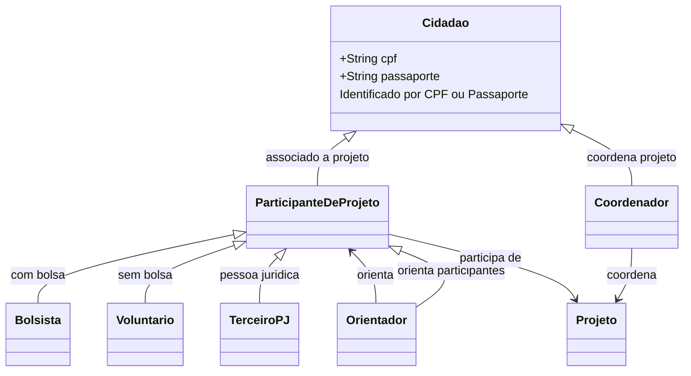
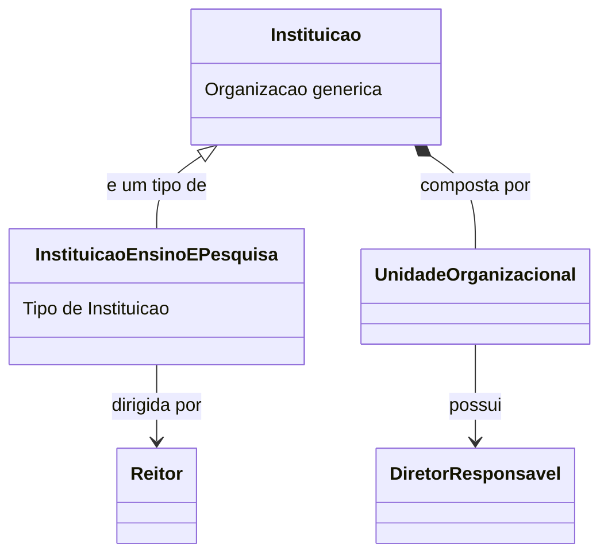
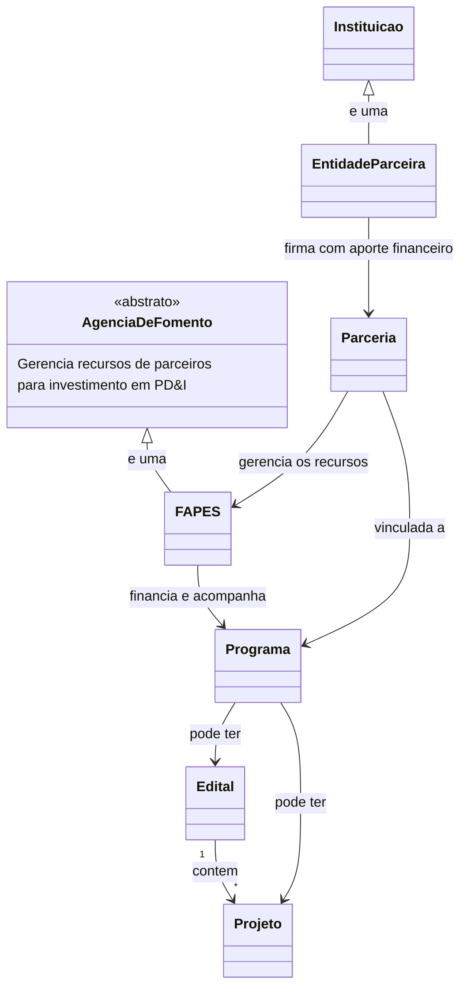
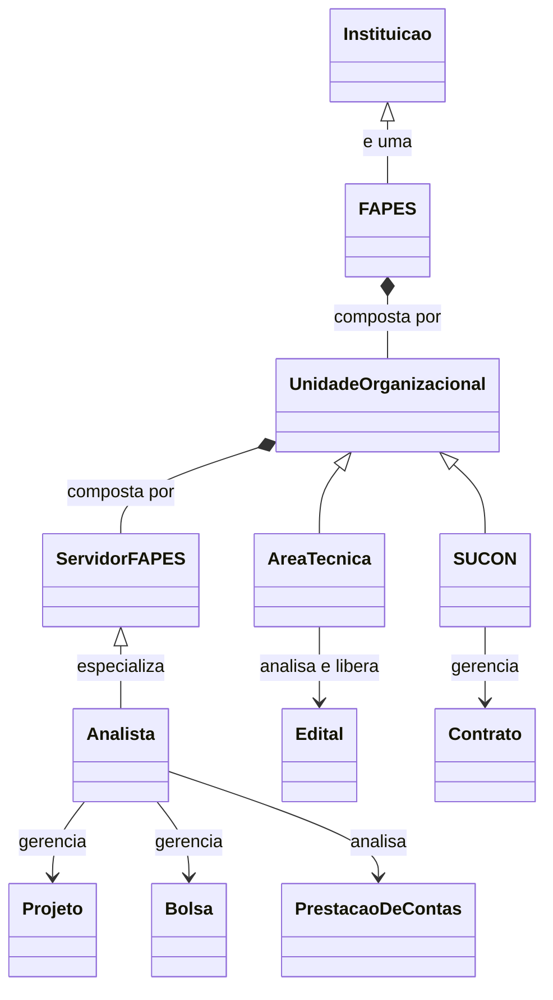
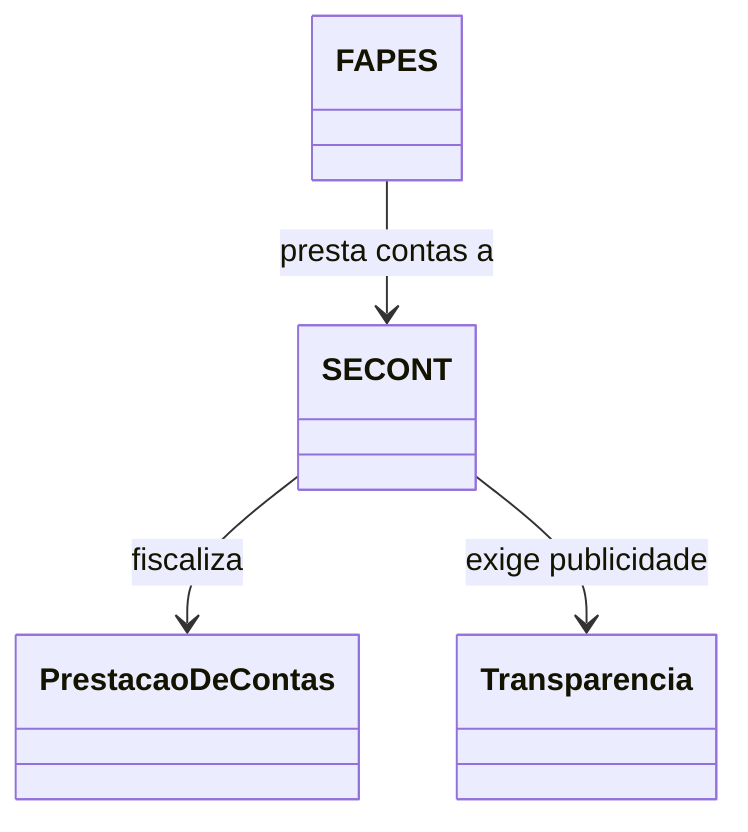
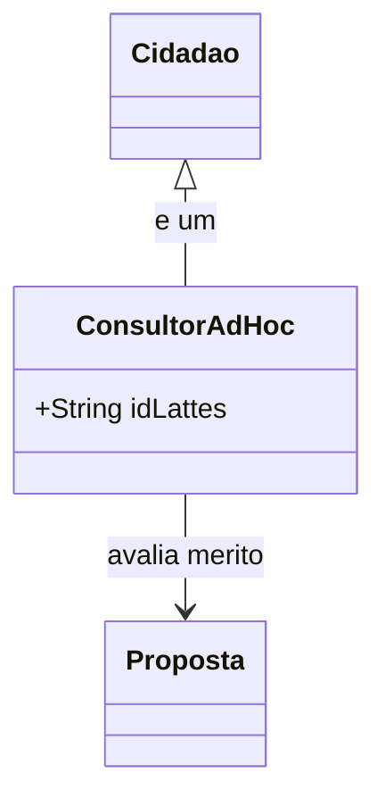
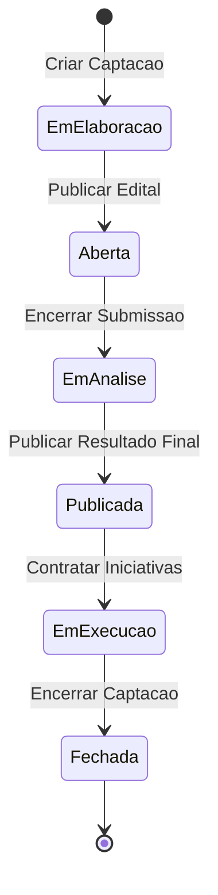
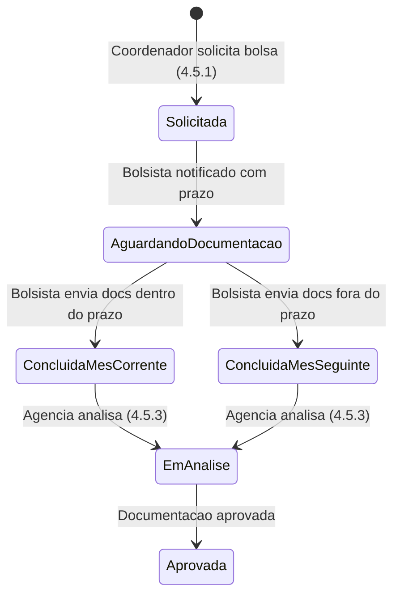

# ConectaFAPES - Visao do Produto

## Proposito

O ConectaFAPES e a plataforma digital da FAPES (Fundacao de Amparo a Pesquisa e Inovacao do Espirito Santo) para a gestao do ciclo completo de fomento a pesquisa, ao desenvolvimento e a inovacao. O sistema substitui processos manuais e fragmentados por fluxos digitais integrados — do planejamento estrategico a prestacao de contas.

## Personas

### Comunidade Cientifica

Personas externas que interagem com a FAPES como beneficiarias, proponentes ou participantes de projetos.

O Cidadao e a persona base. Ao se associar a um projeto, torna-se Participante de Projeto. O Participante com bolsa e um Bolsista; sem bolsa, e um Voluntario. O Orientador e um Participante de Projeto responsavel pela orientacao de outros participantes. Um Terceiro (PJ) e uma pessoa juridica que participa do projeto. O Coordenador e o responsavel pela coordenacao do projeto.

| Persona | Descricao |
|---------|-----------|
| **Cidadao** | Pessoa que acessa o portal publico da FAPES para consultar editais, programas e resultados |
| **Participante de Projeto** | Cidadao associado a um projeto de pesquisa |
| **Bolsista** | Participante de projeto com bolsa ativa vinculada |
| **Voluntario** | Participante de projeto sem bolsa associada |
| **Terceiro (PJ)** | Pessoa juridica que participa de um projeto como prestadora de servico ou fornecedora |
| **Coordenador** | Cidadao responsavel pela coordenacao de um projeto ou iniciativa contratada |
| **Orientador** | Participante de projeto responsavel pela orientacao de outros participantes em programas de pos-graduacao |

### Instituicoes

Uma Instituicao e uma organizacao generica. Uma Instituicao de Ensino e Pesquisa e um tipo de Instituicao. Toda Instituicao e composta por Unidades Organizacionais, e cada Unidade possui um Diretor ou responsavel. A Instituicao de Ensino e Pesquisa possui um Reitor como dirigente maximo.

| Persona | Descricao |
|---------|-----------|
| **Reitor** | Dirigente maximo de uma Instituicao de Ensino e Pesquisa |
| **Diretor / Responsavel** | Responsavel por uma Unidade Organizacional dentro de uma Instituicao |

### Parceiros e Agencia de Fomento

A FAPES e uma agencia de fomento — entidade que gerencia recursos financeiros de parceiros para investimento em pesquisa, desenvolvimento e inovacao (PD&I). Entidades Parceiras firmam parcerias com a FAPES mediante aporte financeiro, e a FAPES administra esses recursos vinculando-os a programas e projetos.

| Persona | Descricao |
|---------|-----------|
| **Agencia de Fomento** | A FAPES é uma Agencia estadual que gerencia recursos financeiros de parceiros para investimento em PD&I |
| **Entidade Parceira** | Instituicao (publica ou privada) que firma parceria com a FAPES mediante aporte financeiro para execucao conjunta de programas e projetos |

### FAPES (Interno)

Personas internas da FAPES responsaveis pela operacao e administracao do sistema.

| Persona | Descricao |
|---------|-----------|
| **Analista da Area Tecnica da Agencia** | Funcionario da FAPES responsavel pela gestao administrativa, financeira e tecnica |
| **Analista** | Servidor lotado em uma Area Tecnica, responsavel por gerenciar projetos, bolsas e prestacoes de contas |
| **Area Tecnica** | Unidade organizacional da FAPES, composta por servidores, responsavel pela analise e liberacao de editais e pagamentos |
| **SUCON** | Superintendencia de Contratos e Convenios — unidade organizacional da FAPES |

### Orgaos de Controle e Transparencia

Orgaos governamentais que exigem conformidade, publicidade e prestacao de contas da FAPES.

| Persona | Descricao |
|---------|-----------|
| **SECONT** | Secretaria de Controle e Transparencia do Espirito Santo ([secont.es.gov.br](https://secont.es.gov.br/)) — orgao responsavel pela fiscalizacao, auditoria e transparencia da administracao publica estadual |

### Avaliadores Externos

Especialistas externos convidados para avaliacao de merito tecnico-cientifico. Um Consultor Ad Hoc e um Cidadao com curriculo Lattes cadastrado.

| Persona | Descricao |
|---------|-----------|
| **Consultor Ad Hoc** | Cidadao com curriculo Lattes, convidado como avaliador externo de merito tecnico-cientifico |

## Fundamentacao Legal

Este documento referencia artigos da **LEC 978/2021** — Lei Complementar que dispoe sobre a Fundacao de Amparo a Pesquisa e Inovacao do Espirito Santo (FAPES). Ver o [Anexo: Referencia dos Artigos](#anexo-referencia-dos-artigos-lec-9782021) no final deste documento.

---

## 1. Corporativo e Administrativo

Dados mestres transversais a toda a organizacao, gestao de identidades e parametros do sistema.

### 1.1 Acesso e Seguranca (IAM)

Gestao de identidades, autenticacao e controle de acesso aos portais da plataforma. Inclui integracao com o Acesso Cidadao (SSO do governo do ES) e o portal de transparencia aberto ao publico.

| # | Funcionalidade | Descricao | Persona | Fundamentacao Legal |
|---|---------------|-----------|---------|---------------------|
| 1.1.1 | Autenticacao via Acesso Cidadao | Sistema de autenticacao unica do governo do ES para acesso aos portais | Todos | Art. 3, 3 |
| 1.1.2 | Portal Back-office | Ambiente de acesso dos servidores da FAPES para gestao administrativa, financeira e tecnica | Analista da Area Tecnica da Agencia | Art. 16 a 19 |
| 1.1.3 | Portal Front-office | Ambiente de acesso dos participantes de projeto para submissao, acompanhamento e prestacao de contas | Participante de Projeto, Bolsista | Art. 4; Art. 3, 1 |
| 1.1.4 | Portal da Transparencia | Portal aberto ao publico para consulta de projetos financiados, bolsas pagas e resultados da agencia, sem necessidade de autenticacao | Cidadao, SECONT | Art. 3, 3 |
| 1.1.5 | Cadastro automatico Front-office | Cadastro automatico de pessoas no portal do participante de projeto | Participante de Projeto | Art. 4 |
| 1.1.6 | Cadastro automatico Back-office (API Organograma) | Importacao automatica de servidores e cargos via API do Organograma do Estado do ES, evitando cadastro manual | Analista da Area Tecnica da Agencia | Art. 30 |

### 1.2 Pessoas e Organizacoes

Cadastro e manutencao de pessoas fisicas (beneficiarios, pesquisadores, consultores), instituicoes de ensino e pesquisa, e suas respectivas unidades organizacionais e dirigentes.

| # | Funcionalidade | Descricao | Persona | Fundamentacao Legal |
|---|---------------|-----------|---------|---------------------|
| 1.2.1 | Cadastro de Pessoa | Registrar dados de beneficiarios, pesquisadores e consultores ad hoc | Analista da Area Tecnica da Agencia | Art. 4, 2 e 3 |
| 1.2.2 | Suspender Pessoa | Registrar alteracoes funcionais e movimentacoes internas de pessoas | Analista da Area Tecnica da Agencia | Art. 30, II |
| 1.2.3 | Cadastro de Instituicoes de Ensino e Pesquisa | Registrar dados de instituicoes e seus representantes | Analista da Area Tecnica da Agencia | Art. 4 |
| 1.2.4 | Cadastro de Unidades Organizacionais e hierarquia | Definir a estrutura organizacional das instituicoes parceiras | Analista da Area Tecnica da Agencia | — |
| 1.2.5 | Cadastro de Reitor, Diretores e Chefes | Registrar dirigentes e responsaveis por unidades organizacionais | Analista da Area Tecnica da Agencia | Art. 4 |
| 1.2.6 | Dashboard de Iniciativas por unidade organizacional | Consolidar informacoes de programas, projetos e acoes por unidade | Analista da Area Tecnica da Agencia | Art. 3, 3 |

### 1.3 Cadastros Basicos

Dados de referencia e parametros do sistema: estrutura organizacional da agencia (areas tecnicas e servidores), tabelas geograficas, areas de conhecimento e rubricas financeiras.

| # | Funcionalidade | Descricao | Persona | Fundamentacao Legal |
|---|---------------|-----------|---------|---------------------|
| 1.3.1 | Cadastrar Unidade Organizacional da Agencia (Area Tecnica) | Definir a estrutura organizacional da agencia para gestao de editais, projetos e pagamentos | Analista da Area Tecnica da Agencia | Art. 16 |
| 1.3.2 | Cadastro de Servidores da Agencia | Registrar servidores com vinculo a suas respectivas areas tecnicas | Analista da Area Tecnica da Agencia | Art. 30 |
| 1.3.3 | Vincular Servidor a Area Tecnica | Lotar cada servidor em uma area tecnica para gestao de editais, projetos e pagamentos | Analista da Area Tecnica da Agencia | Art. 16 |
| 1.3.4 | Cadastro de Cidades | Manter cadastro de cidades do estado | Analista da Area Tecnica da Agencia | — |
| 1.3.5 | Cadastro de Regioes | Manter cadastro de regioes (agrupamento de cidades) | Analista da Area Tecnica da Agencia | — |
| 1.3.6 | Cadastro de Areas de Conhecimento | Manter tabela de areas de conhecimento (ex: Ciencias Exatas e da Terra) | Analista da Area Tecnica da Agencia | — |
| 1.3.7 | Rubricas Financeiras | Manter cadastro de rubricas para classificacao de despesas | Analista da Area Tecnica da Agencia | — |
| 1.3.8 | Definir Minimo de Avaliadores Ad Hoc | Configurar o numero minimo padrao de avaliacoes exigidas por iniciativa em nivel de sistema; este valor pode ser substituido pelo parametro especifico definido na configuracao de cada captacao | Analista da Area Tecnica da Agencia | Art. 4, 2; Art. 12 |

### 1.4 Modalidades de Bolsa (M001)

Cadastro e manutencao das modalidades, niveis e requisitos de bolsas definidos por resolucoes da FAPES. Inclui versionamento de modalidades para preservar o historico conforme novas resolucoes sao publicadas.

| # | Funcionalidade | Descricao | Persona | Fundamentacao Legal |
|---|---------------|-----------|---------|---------------------|
| 1.4.1 | Cadastro de Modalidades (Bolsas/Niveis) | Cadastrar programas de concessao de bolsas organizadas por modalidade e nivel | Analista da Area Tecnica da Agencia | Art. 3, VII; Art. 14, I e VII |
| 1.4.2 | Cadastro de Resolucoes | Registrar resolucoes que criam ou alteram modalidades de bolsas | Analista da Area Tecnica da Agencia | Art. 14, VIII; Art. 3, 3 |
| 1.4.3 | Cadastro de Niveis | Registrar niveis dentro de cada modalidade com valores e requisitos | Analista da Area Tecnica da Agencia | Art. 3, VII; Art. 37 |
| 1.4.4 | Cadastro de Requisitos de Niveis | Definir requisitos de elegibilidade por nivel de bolsa | Analista da Area Tecnica da Agencia | Art. 14, I e VI; Art. 2 |
| 1.4.5 | Atualizar Valores de Bolsa | Atualizar valores de apoio financeiro conforme novas resolucoes | Analista da Area Tecnica da Agencia | Art. 14, VII; Art. 25, III |

---

## 2. Planejamento e Estrategia

Definicao de diretrizes, orcamentos de alto nivel e programas de fomento.

### 2.1 Planejamento Estrategico

Definicao do plano estrategico da agencia e seus eixos, que orientam a criacao de programas de fomento e a alocacao de recursos.

| # | Funcionalidade | Descricao | Persona | Fundamentacao Legal |
|---|---------------|-----------|---------|---------------------|
| 2.1.1 | Cadastrar Plano Estrategico | Definir o plano estrategico da agencia com objetivos e metas | Analista da Area Tecnica da Agencia | — |
| 2.1.2 | Cadastrar Eixo Estrategico | Criar eixos estrategicos que agrupam programas de fomento | Analista da Area Tecnica da Agencia | — |

### 2.2 Gestao de Parcerias

Parcerias sao instrumentos de cooperacao entre a FAPES e entidades publicas ou privadas para a execucao conjunta de programas, projetos e acoes de fomento. Uma parceria esta sempre vinculada a um programa, pode ter mais de um parceiro, e pode envolver cofinanciamento, compartilhamento de infraestrutura ou cooperacao tecnica. Parcerias podem receber aditivos de tempo e de aporte financeiro, sendo que cada aditivo deve ter um documento comprobatorio anexado.

| # | Funcionalidade | Descricao | Persona | Fundamentacao Legal |
|---|---------------|-----------|---------|---------------------|
| 2.2.1 | Cadastrar Parceria | Registrar instrumento de cooperacao entre a agencia e uma entidade parceira | Analista da Area Tecnica da Agencia | Art. 3, X; Art. 28, I |
| 2.2.2 | Associar Parceria a Programa | Vincular uma parceria a um programa de fomento | Analista da Area Tecnica da Agencia | Art. 3, X; Art. 14, VII |
| 2.2.3 | Cadastrar Entidade Parceira | Registrar dados da instituicao que firma parceria com a agencia | Analista da Area Tecnica da Agencia | Art. 3, X |
| 2.2.4 | Definir Termos e Condicoes da Parceria | Estabelecer clausulas, prazos e obrigacoes da parceria | Analista da Area Tecnica da Agencia | Art. 28, I; Art. 6, par. unico |
| 2.2.5 | Registrar Aporte Financeiro do Parceiro | Registrar valores aportados pelo parceiro para execucao conjunta | Analista da Area Tecnica da Agencia | Art. 25, III; Art. 28, II |
| 2.2.6 | Acompanhar Execucao da Parceria | Monitorar andamento, entregas e prestacao de contas da parceria | Analista da Area Tecnica da Agencia | Art. 3, II; Art. 15, III |
| 2.2.7 | Adicionar Parceiro a Parceria | Vincular mais de uma entidade parceira a uma mesma parceria | Analista da Area Tecnica da Agencia | Art. 3, X |
| 2.2.8 | Registrar Aditivo de Tempo | Prorrogar a vigencia da parceria com documento comprobatorio anexado | Analista da Area Tecnica da Agencia | Art. 28, I; Art. 6, par. unico |
| 2.2.9 | Registrar Aditivo de Aporte | Registrar aporte financeiro adicional do parceiro com documento comprobatorio anexado | Analista da Area Tecnica da Agencia | Art. 25, III; Art. 28, II |
| 2.2.10 | Encerrar Parceria | Formalizar o encerramento com prestacao de contas final | Analista da Area Tecnica da Agencia | Art. 15, III |
| 2.2.11 | Dashboard de Parcerias | Painel consolidado com status e indicadores de todas as parcerias | Analista da Area Tecnica da Agencia | Art. 3, 3; Art. 14, VII |

### 2.3 Gestao de Programa

Cadastro e acompanhamento de programas de fomento, incluindo vinculacao a eixos estrategicos, dotacao orcamentaria, comites gestores e captacao de iniciativas. Um programa pode receber aporte economico oriundo de um percentual de parceria, e pode ter aditivos de tempo e de aporte financeiro.

| # | Funcionalidade | Descricao | Persona | Fundamentacao Legal |
|---|---------------|-----------|---------|---------------------|
| 2.3.1 | Cadastrar Programa | Cadastrar programas de fomento com acoes apoiadas e modalidade de financiamento | Analista da Area Tecnica da Agencia | Art. 4 e 3; Art. 14, VII |
| 2.3.2 | Associar Programa a Eixo Estrategico | Vincular um programa a um eixo do plano estrategico | Analista da Area Tecnica da Agencia | — |
| 2.3.3 | Cadastro de Comite Gestor | Manter cadastro de membros de camaras e comites para avaliacao de merito | Analista da Area Tecnica da Agencia | Art. 12 |
| 2.3.4 | Adicionar Recursos Financeiros ao Programa | Registrar dotacao orcamentaria conforme LOA/LDO/PPA | Analista da Area Tecnica da Agencia | Art. 25 |
| 2.3.5 | Visualizar Captacoes de Iniciativas | Consultar propostas captadas vinculadas ao programa | Analista da Area Tecnica da Agencia | — |
| 2.3.6 | Adicionar Aporte de Parceria ao Programa | Vincular um percentual do aporte financeiro de uma parceria como recurso do programa | Analista da Area Tecnica da Agencia | Art. 25, III; Art. 28, II; Art. 3, X |
| 2.3.7 | Registrar Aditivo de Tempo do Programa | Prorrogar a vigencia do programa com documento comprobatorio anexado | Analista da Area Tecnica da Agencia | Art. 28, I; Art. 6, par. unico |
| 2.3.8 | Registrar Aditivo de Aporte do Programa | Registrar aporte financeiro adicional ao programa com documento comprobatorio anexado | Analista da Area Tecnica da Agencia | Art. 25, III; Art. 28, II |
| 2.3.9 | Dashboard de Programas | Painel consolidado com informacoes de programas apoiados e financiamentos | Analista da Area Tecnica da Agencia | Art. 14, VII; Art. 3, 3 |

---

## 3. Fomento — Pre-Award (Captacao e Selecao)

Fluxo desde a publicacao do edital a contratacao da iniciativa.

### 3.1 Configuracao da Captacao

Preparacao e configuracao dos instrumentos necessarios para a captacao de iniciativas. Uma captacao e formalizada por meio de um documento chamado **Edital** e pode estar associada a um **Programa** ou a uma **Parceria**. Ha dois tipos de captacao: **Chamada Publica** (edital aberto a qualquer proponente elegivel) e **Demanda Induzida** (solicitacao direcionada a instituicoes ou pesquisadores especificos). A configuracao inclui definicao de periodo, cronograma, formularios, valor aportado e cadastro de revisores.

**Ciclo de vida da Captacao:**

| # | Funcionalidade | Descricao | Persona | Fundamentacao Legal |
|---|---------------|-----------|---------|---------------------|
| 3.1.1 | Criar Captacao | Configurar uma nova captacao (Chamada Publica ou Demanda Induzida) definindo tipo, periodo de inscricao, cronograma de etapas e valor aportado | Analista da Area Tecnica da Agencia | Art. 15, I; Art. 14, VII |
| 3.1.2 | Elaborar Edital | Formalizar as regras da captacao em um documento publico contendo publico alvo, cronograma, requisitos e condicoes | Analista da Area Tecnica da Agencia | Art. 15, I |
| 3.1.3 | Definir Tipo de Captacao | Classificar a captacao como Chamada Publica (aberta) ou Demanda Induzida (direcionada) | Analista da Area Tecnica da Agencia | Art. 15, I |
| 3.1.4 | Definir Cronograma da Captacao | Estabelecer datas de abertura, encerramento de inscricoes, avaliacao, resultado intermediario e resultado final | Analista da Area Tecnica da Agencia | Art. 15, I |
| 3.1.5 | Associar Captacao a Programa ou Parceria | Vincular a captacao a um programa de fomento ou a uma parceria e seu respectivo orcamento | Analista da Area Tecnica da Agencia | Art. 14, VII; Art. 25; Art. 3, X |
| 3.1.6 | Definir Valor Aportado da Captacao | Informar o valor total disponivel para a captacao a partir dos recursos do programa ou da parceria | Analista da Area Tecnica da Agencia | Art. 25, III; Art. 28, II |
| 3.1.7 | Cadastro de Categorias de Formulario | Criar e manter categorias para classificar formularios (ex: submissao, avaliacao, habilitacao, prestacao de contas) | Analista da Area Tecnica da Agencia | Art. 4, 1; Art. 15, I |
| 3.1.8 | Buscar Formulario no Dynamic Forms | Consultar e importar formularios do sistema externo Dynamic Forms, categorizando-os conforme a finalidade | Analista da Area Tecnica da Agencia | Art. 4, 1; Art. 3, 1 |
| 3.1.9 | Associar Formulario de Submissao a Captacao | Vincular um formulario de submissao (importado do Dynamic Forms) a captacao para recebimento de propostas | Analista da Area Tecnica da Agencia | Art. 4, 1; Art. 3, 1 |
| 3.1.10 | Associar Formulario de Avaliacao a Captacao | Vincular um formulario de avaliacao de merito (importado do Dynamic Forms) a captacao para uso pelos revisores | Analista da Area Tecnica da Agencia | Art. 4, 2; Art. 15, III |
| 3.1.11 | Gestao de Revisores Ad Hoc | Cadastrar e selecionar especialistas para avaliacao de merito | Analista da Area Tecnica da Agencia | Art. 4, 2; Art. 6, par. unico |
| 3.1.12 | Configurar/Parametrizar Captacao | Definir regras, prazos e etapas da captacao; permite sobrescrever o minimo de avaliadores ad hoc definido nos cadastros basicos (1.3.8) com um valor especifico para esta captacao | Analista da Area Tecnica da Agencia | Art. 15, I; Art. 3, 3 |
| 3.1.13 | Dashboard da Captacao | Painel para acompanhar etapas de habilitacao, merito e resultados | Analista da Area Tecnica da Agencia | Art. 4, 1 e 2; Art. 14, IX |

### 3.2 Fases da Captacao de Iniciativas

Uma iniciativa e qualquer proposta de trabalho apoiada pela agencia: projeto de pesquisa, visita tecnica, publicacao de livro, participacao em evento cientifico, organizacao de evento cientifico, entre outros tipos. Uma captacao possui as seguintes fases, executadas em sequencia. Aplica-se tanto a Chamadas Publicas quanto a Demandas Induzidas.

#### Fase 1: Periodo de Submissao

Periodo em que a captacao esta aberta para recepcao de propostas de iniciativas.

| # | Funcionalidade | Descricao | Persona | Fundamentacao Legal |
|---|---------------|-----------|---------|---------------------|
| 3.2.1 | Publicar Captacao | Publicar a captacao (edital ou demanda induzida) no sitio eletronico, abrindo o periodo de submissao | Analista da Area Tecnica da Agencia | Art. 15, I; Art. 3, 3 |
| 3.2.2 | Submeter Proposta de Iniciativa | Enviar proposta de iniciativa para avaliacao pela agencia dentro do periodo de submissao | Cidadao | Art. 4 |
| 3.2.3 | Prorrogar Periodo de Submissao | Estender o prazo de recepcao de propostas, publicando a nova data no sitio eletronico | Analista da Area Tecnica da Agencia | Art. 15, I; Art. 3, 3 |
| 3.2.4 | Encerrar Periodo de Submissao | Fechar o recebimento de propostas conforme cronograma vigente | Analista da Area Tecnica da Agencia | Art. 15, I |

#### Fase 2: Analise Documental

Verificacao da documentacao de habilitacao do coordenador e da proposta submetida.

| # | Funcionalidade | Descricao | Persona | Fundamentacao Legal |
|---|---------------|-----------|---------|---------------------|
| 3.2.5 | Analisar Documentacao do Coordenador | Verificar habilitacao, documentacao e elegibilidade do coordenador proponente, consultando API de nada consta e API de empregabilidade | Analista da Area Tecnica da Agencia | Art. 4, 1 |
| 3.2.6 | Aprovar ou Reprovar Habilitacao | Registrar decisao sobre a habilitacao documental da proposta | Analista da Area Tecnica da Agencia | Art. 4, 1; Art. 6, par. unico |
| 3.2.7 | Publicar Resultado da Analise Documental | Divulgar lista de propostas habilitadas e inabilitadas | Analista da Area Tecnica da Agencia | Art. 3, 3 |
| 3.2.8 | Receber/Responder Recurso da Analise Documental | Processar recursos administrativos dos proponentes inabilitados | Analista da Area Tecnica da Agencia | Art. 14, IX; Art. 6, par. unico |

#### Fase 3: Analise de Merito

Avaliacao tecnico-cientifica das propostas habilitadas por consultores ad hoc e camaras de assessoramento.

| # | Funcionalidade | Descricao | Persona | Fundamentacao Legal |
|---|---------------|-----------|---------|---------------------|
| 3.2.9 | Encaminhar Propostas para Avaliacao de Merito | Distribuir propostas habilitadas para consultores ad hoc; o avaliador recebe notificacao por e-mail com a lista de propostas e link de acesso ao sistema, onde realiza a avaliacao diretamente | Analista da Area Tecnica da Agencia | Art. 4, 2; Art. 12 |
| 3.2.10 | Avaliar Merito da Proposta | Consultor ad hoc avalia a proposta e emite parecer tecnico-cientifico | Consultor Ad Hoc | Art. 4, 2; Art. 12 |
| 3.2.11 | Receber Parecer dos Consultores Ad Hoc | Registrar pareceres dos avaliadores externos | Analista da Area Tecnica da Agencia | Art. 4, 2 e 3; Art. 15, II |
| 3.2.12 | Substituir Avaliador Ad Hoc | Caso o avaliador nao responda a solicitacao dentro do prazo, o servidor FAPES designa outro consultor, que recebe nova notificacao por e-mail com link de acesso ao sistema | Analista da Area Tecnica da Agencia | Art. 4, 2; Art. 12 |
| 3.2.13 | Pagar Avaliador Ad Hoc | Registrar e processar o pagamento do avaliador ad hoc somente se a avaliacao tiver sido concluida, integrado ao sistema de pagamento da agencia | Analista da Area Tecnica da Agencia | Art. 16; Art. 25, III |
| 3.2.14 | Publicar Resultado Intermediario | Divulgar classificacao parcial das propostas avaliadas | Analista da Area Tecnica da Agencia | Art. 3, 3 |
| 3.2.15 | Receber/Responder Recurso da Analise de Merito | Processar recursos administrativos sobre a avaliacao de merito | Analista da Area Tecnica da Agencia | Art. 14, IX; Art. 6, par. unico |
| 3.2.16 | Publicar Resultado Final | Divulgar resultado definitivo homologado da captacao | Analista da Area Tecnica da Agencia | Art. 14, IX; Art. 3, 3 |
| 3.2.17 | Receber/Responder Recurso do Resultado Final | Processar recursos administrativos interpostos contra o resultado final homologado e publicar a resposta oficial | Analista da Area Tecnica da Agencia | Art. 14, IX; Art. 6, par. unico |

#### Fase 4: Contratacao

Formalizacao das iniciativas aprovadas: emissao e assinatura do termo de outorga e abertura de conta bancaria.

| # | Funcionalidade | Descricao | Persona | Fundamentacao Legal |
|---|---------------|-----------|---------|---------------------|
| 3.2.18 | Gerar Termo de Outorga | Emitir o instrumento formal de fomento para a iniciativa aprovada | Analista da Area Tecnica da Agencia | Art. 28, I |
| 3.2.19 | Assinar Termo de Outorga | Coordenador assina o termo formalizando o compromisso | Coordenador | Art. 28, I; Art. 3, X |
| 3.2.20 | Mudar Status para Contratada | Alterar o status da iniciativa para contratada apos assinatura | Analista da Area Tecnica da Agencia | — |
| 3.2.21 | Abrir Conta da Iniciativa no Banco | Coordenador providencia a abertura de conta bancaria da iniciativa contratada | Coordenador | — |

#### Fase 5: Deposito do Aporte Financeiro

Transferencia dos recursos financeiros para a conta da iniciativa, quando aplicavel. Esta fase so ocorre se a captacao possuir aporte financeiro definido.

| # | Funcionalidade | Descricao | Persona | Fundamentacao Legal |
|---|---------------|-----------|---------|---------------------|
| 3.2.22 | Depositar Aporte Financeiro | Efetuar a transferencia dos recursos da agencia para a conta da iniciativa contratada | Analista da Area Tecnica da Agencia | Art. 28, II; Art. 25, III |
| 3.2.23 | Confirmar Recebimento do Aporte | Coordenador confirma o recebimento dos recursos na conta da iniciativa | Coordenador | Art. 27, II |

---

## 4. Fomento — Post-Award (Execucao e Acompanhamento)

Fluxo de execucao do projeto contratado a sua finalizacao.

### 4.1 Acompanhamento de Iniciativas

Paineis de acompanhamento para os diferentes perfis: coordenador monitora seus projetos, agencia monitora todas as iniciativas, e SECONT fiscaliza externamente.

| # | Funcionalidade | Descricao | Persona | Fundamentacao Legal |
|---|---------------|-----------|---------|---------------------|
| 4.1.1 | Dashboard de Iniciativas (Coordenador) | Painel do coordenador para acompanhar seus projetos contratados | Coordenador | Art. 3, II; Art. 3, 3 |
| 4.1.2 | Dashboard de Iniciativas (FAPES) | Painel da agencia para monitorar todas as iniciativas contratadas | Analista da Area Tecnica da Agencia | Art. 3, II; Art. 3, 3 |
| 4.1.3 | Dashboard de Iniciativas (SECONT) | Painel de fiscalizacao para acompanhamento externo das iniciativas | SECONT | Art. 3, 3; Art. 15, III |

### 4.2 Gestao de Resultados

Gestao dos resultados esperados e entregues pelo projeto: solicitacao de mudancas, submissao de relatorios tecnicos, analise pela agencia e contestacao pelo coordenador.

| # | Funcionalidade | Descricao | Persona | Fundamentacao Legal |
|---|---------------|-----------|---------|---------------------|
| 4.2.1 | Solicitar Mudancas de Resultados | Coordenador solicita alteracao nos resultados esperados da iniciativa, registrando a justificativa e os novos valores propostos | Coordenador | — |
| 4.2.2 | Aprovar Mudancas de Resultados | Analista da area tecnica avalia a solicitacao com visibilidade comparativa entre a linha base (resultados prometidos na proposta original), os valores solicitados pelo coordenador e os resultados ja entregues, decidindo pela aprovacao ou rejeicao | Analista da Area Tecnica da Agencia | — |
| 4.2.3 | Submissao dos Resultados | Coordenador submete relatorios tecnicos para apreciacao | Coordenador | Art. 12, 2; Art. 18 |
| 4.2.4 | Analisar Resultados | Agencia avalia relatorios tecnicos e prestacao de contas | Analista da Area Tecnica da Agencia | Art. 12, 2; Art. 18; Art. 15, III |
| 4.2.5 | Contestar Prestacao de Contas | Coordenador contesta parecer da prestacao de contas | Coordenador | — |

### 4.3 Gestao Orcamentaria do Projeto

Controle orcamentario do projeto em execucao: adicoes orcamentarias, inclusao de rubricas de despesa e remanejamento de recursos entre rubricas.

| # | Funcionalidade | Descricao | Persona | Fundamentacao Legal |
|---|---------------|-----------|---------|---------------------|
| 4.3.1 | Solicitar Adicao Orcamentaria | Coordenador solicita aumento do orcamento do projeto | Coordenador | Art. 25 e 26 |
| 4.3.2 | Aprovar Adicao Orcamentaria | Agencia avalia e aprova o acrescimo orcamentario | Analista da Area Tecnica da Agencia | Art. 25 e 26 |
| 4.3.3 | Cancelar Adicao Orcamentaria | Agencia cancela uma solicitacao de adicao orcamentaria | Analista da Area Tecnica da Agencia | — |
| 4.3.4 | Solicitar Adicao de Rubrica | Coordenador solicita inclusao de nova rubrica de despesa | Coordenador | — |
| 4.3.5 | Aprovar Adicao de Rubrica | Agencia avalia e aprova a nova rubrica | Analista da Area Tecnica da Agencia | — |
| 4.3.6 | Remanejamento Orcamentario | Coordenador solicita transferencia de recursos entre rubricas | Coordenador | Art. 25 e 26 |
| 4.3.7 | Aprovar Remanejamento | Agencia avalia e aprova o remanejamento solicitado; a aprovacao e automatica quando o remanejamento ocorre entre subrubricas dentro da mesma rubrica, dispensando analise manual | Analista da Area Tecnica da Agencia | — |
| 4.3.8 | Visualizar Remanejamento | Consultar historico de remanejamentos do projeto | Analista da Area Tecnica da Agencia | — |
| 4.3.9 | Remanejar Bolsa | Coordenador transfere bolsa entre participantes do projeto | Coordenador | Art. 3, VII; Art. 14, VIII |

### 4.4 Prestacao de Contas

Fluxo de prestacao de contas do projeto: importacao de extratos bancarios, submissao eletronica pelo coordenador, analise pela agencia, auditoria pela SECONT e contestacao.

| # | Funcionalidade | Descricao | Persona | Fundamentacao Legal |
|---|---------------|-----------|---------|---------------------|
| 4.4.1 | Leitura do Extrato Bancario | Importar e conferir extrato bancario do projeto | Analista da Area Tecnica da Agencia | Art. 27, II |
| 4.4.2 | Submeter Prestacao de Contas de Produto | Submissao composta pelo documento fiscal (nota fiscal) e pelos orcamentos que embasaram a aquisicao; o sistema valida o XML da nota fiscal junto ao SERPRO e rejeita o documento caso a nota ja tenha sido utilizada neste ou em qualquer outro projeto — cada nota fiscal so pode ser vinculada a um unico projeto e registrada uma unica vez | Coordenador | Art. 27, II; Art. 3, 1 |
| 4.4.3 | Submeter Prestacao de Contas de Servico | Submissao composta pelo documento fiscal (nota fiscal de servico ou recibo) e pelos orcamentos que embasaram a contratacao | Coordenador | Art. 27, II; Art. 3, 1 |
| 4.4.4 | Submeter Prestacao de Contas de Diarias | Submissao composta pela autorizacao de diaria e pelos comprovantes de hospedagem e alimentacao | Coordenador | Art. 27, II; Art. 3, 1 |
| 4.4.5 | Submeter Prestacao de Contas de Passagens Aereas | Submissao composta pelo bilhete aereo, comprovante de embarque e pelos orcamentos que embasaram a aquisicao da passagem | Coordenador | Art. 27, II; Art. 3, 1 |
| 4.4.6 | Analisar Documentacao da Prestacao de Contas | Analista verifica documentacao tecnica e financeira | Analista da Area Tecnica da Agencia | Art. 15, III |
| 4.4.7 | Recusar Prestacao de Contas | Analista recusa a prestacao de contas informando o motivo da recusa; o coordenador e notificado e pode solicitar nova avaliacao apos correcao | Analista da Area Tecnica da Agencia | Art. 15, III |
| 4.4.8 | Solicitar Reavaliacao da Prestacao de Contas | Coordenador corrige as pendencias apontadas e solicita nova rodada de analise da prestacao de contas recusada | Coordenador | Art. 27, II |
| 4.4.9 | Auditar Prestacao de Contas | SECONT fiscaliza e audita as prestacoes de contas | SECONT | Art. 15, III; Art. 27, II |
| 4.4.10 | Contestar Prestacao de Contas | Coordenador contesta parecer da analise | Coordenador | — |

### 4.5 Gestao de Bolsistas de Equipe (M009)

Gestao dos bolsistas e membros da equipe do projeto: ciclo de vida das bolsas (solicitacao, submissao de documentos, aprovacao, cancelamento e suspensao), inclusao e remocao de voluntarios e designacao do gestor responsavel.

A solicitacao de bolsa e um processo em duas etapas: (1) o coordenador inicia a solicitacao e (2) o bolsista envia a documentacao dentro do prazo definido. A solicitacao somente e concluida apos o envio da documentacao. A competencia do pagamento e determinada pelo momento do envio: documentacao enviada dentro do prazo e aprovada para o mes corrente; enviada fora do prazo, e aprovada para o mes seguinte.

| # | Funcionalidade | Descricao | Persona | Fundamentacao Legal |
|---|---------------|-----------|---------|---------------------|
| 4.5.1 | Solicitar Bolsa | Coordenador inicia a solicitacao de bolsa para um participante do projeto, informando obrigatoriamente: o papel que ele exercera no projeto e a entrega do projeto a qual sua atuacao esta relacionada; o bolsista possui uma secao dedicada ao seu plano de trabalho (4.5.9); a solicitacao so e concluida apos o bolsista enviar a documentacao (4.5.2) | Coordenador | Art. 4; Art. 3, VII |
| 4.5.2 | Submissao de Documentos da Bolsa | Bolsista envia documentacao para habilitacao dentro do prazo definido; se enviada no prazo, a bolsa e aprovada para o mes corrente; se fora do prazo, aprovada para o mes seguinte | Bolsista | Art. 4, 1 |
| 4.5.3 | Aprovar Solicitacao de Bolsa e Documentos | Agencia analisa e aprova a solicitacao e documentos | Analista da Area Tecnica da Agencia | — |
| 4.5.4 | Cancelar Solicitacao de Bolsa | Coordenador cancela uma solicitacao de bolsa | Coordenador | Art. 3, VII; Art. 15, III |
| 4.5.5 | Suspender Solicitacao de Bolsa | Coordenador suspende temporariamente uma bolsa ativa | Coordenador | Art. 3, VII; Art. 6, par. unico |
| 4.5.6 | Visualizar Remanejamento de Bolsa | Consultar historico de remanejamentos de bolsas | Analista da Area Tecnica da Agencia | — |
| 4.5.7 | Gerir Voluntario | Incluir, alterar ou remover voluntarios do projeto | Coordenador | — |
| 4.5.8 | Gerir Gestor do Projeto (Coordenador Adjunto) | Designar ou alterar o Coordenador Adjunto do projeto, responsavel por apoiar e substituir o coordenador principal na gestao das atividades | Coordenador | — |
| 4.5.9 | Plano de Trabalho do Bolsista | Secao dedicada ao plano de trabalho do bolsista, contendo as atividades previstas, cronograma de execucao, papel no projeto e entregas relacionadas; vinculado a solicitacao de bolsa (4.5.1) | Coordenador, Bolsista | Art. 4, 1 |

### 4.7 Suspensao e Finalizacao de Projetos

Fluxos administrativos para suspensao temporaria ou encerramento definitivo de projetos em execucao, com aprovacao da agencia e prestacao de contas final.

| # | Funcionalidade | Descricao | Persona | Fundamentacao Legal |
|---|---------------|-----------|---------|---------------------|
| 4.7.1 | Solicitar Suspensao de Projeto | Solicitar a suspensao temporaria de um projeto em execucao | Coordenador, Analista da Area Tecnica da Agencia | Art. 3, II; Art. 6, par. unico |
| 4.7.2 | Aprovar Suspensao | Agencia avalia e aprova a suspensao solicitada | Analista da Area Tecnica da Agencia | — |
| 4.7.3 | Suspender Projeto | Efetivar a suspensao do projeto, interrompendo atividades | Analista da Area Tecnica da Agencia | — |
| 4.7.4 | Solicitar Finalizacao de Projeto | Solicitar o encerramento formal de um projeto | Coordenador, Analista da Area Tecnica da Agencia | — |
| 4.7.5 | Aprovar Finalizacao | Agencia avalia e aprova o encerramento | Analista da Area Tecnica da Agencia | — |
| 4.7.6 | Finalizar Projeto | Efetivar o encerramento do projeto com prestacao de contas final | Analista da Area Tecnica da Agencia | — |

---

## 5. Financeiro

Execucao financeira, controle de contas bancarias, fluxo de caixa, pagamentos e contabilidade.

### 5.1 Contabilidade

Escrituracao contabil da agencia: cadastro de contas, vinculacao a programas e projetos, e painel de monitoramento financeiro.

| # | Funcionalidade | Descricao | Persona | Fundamentacao Legal |
|---|---------------|-----------|---------|---------------------|
| 5.1.1 | Cadastro de Contas-Contabeis | Organizar escrituracao contabil da agencia conforme LOA/LDO/PPA | Analista da Area Tecnica da Agencia | Art. 5, III; Art. 25, I e II |
| 5.1.2 | Associar Contas com Iniciativas/Programas/Editais/Parcerias | Vincular registros contabeis a programas, projetos e parcerias | Analista da Area Tecnica da Agencia | Art. 25, III |
| 5.1.3 | Dashboard Contabil e Financeiro | Painel para monitorar registros contabeis e financeiros | Analista da Area Tecnica da Agencia, SECONT | Art. 25, III; Art. 3, 3 |

### 5.2 Financeiro

Controle de contas bancarias, fluxo de caixa e gestao financeira dos recursos da agencia, programas, projetos e parcerias.

| # | Funcionalidade | Descricao | Persona | Fundamentacao Legal |
|---|---------------|-----------|---------|---------------------|
| 5.2.1 | Cadastro de Contas Bancarias | Registrar e manter contas bancarias vinculadas a agencia, programas, projetos e parcerias | Analista da Area Tecnica da Agencia | Art. 25, I; Art. 27, II |
| 5.2.2 | Fluxo de Caixa | Acompanhar entradas e saidas financeiras por periodo, programa, projeto ou parceria, com projecoes de saldo | Analista da Area Tecnica da Agencia | Art. 25, III; Art. 5, III |
| 5.2.3 | Conciliacao Bancaria | Reconciliar extratos bancarios com os registros contabeis do sistema | Analista da Area Tecnica da Agencia | Art. 25, III; Art. 27, II |
| 5.2.4 | Controle de Saldo por Conta | Monitorar saldo disponivel por conta bancaria com alertas de limite minimo | Analista da Area Tecnica da Agencia | Art. 25, III |
| 5.2.5 | Dashboard Financeiro | Painel consolidado com posicao financeira, saldos, fluxo de caixa e movimentacoes por programa e projeto | Analista da Area Tecnica da Agencia, SECONT | Art. 25, III; Art. 3, 3 |

### 5.3 Pagamentos (M004)

Execucao financeira de pagamentos: marcos de liberacao, processamento de bolsas (padrao, Unac, mestrado/doutorado), parcelas de projetos, auxilios e integracao com Banestes e BANDES.

| # | Funcionalidade | Descricao | Persona | Fundamentacao Legal |
|---|---------------|-----------|---------|---------------------|
| 5.3.1 | Gestao dos Marcos de Pagamento | Definir marcos e cronogramas de liberacao financeira | Analista da Area Tecnica da Agencia | Art. 28, II; Art. 25, I |
| 5.3.2 | Dashboard de Pagamentos | Painel para acompanhar pagamentos autorizados e executados | Analista da Area Tecnica da Agencia | Art. 16; Art. 25, III |
| 5.3.3 | Pagamento de Bolsas Padrao (Seriada) | Processar pagamento de bolsas com parcelas regulares | Analista da Area Tecnica da Agencia | Art. 3, VII; Art. 25, III |
| 5.3.4 | Pagamento de Bolsas Unac (nao seriada) | Processar pagamento de bolsas de programas especificos | Analista da Area Tecnica da Agencia | Art. 3, VII; Art. 14, VIII |
| 5.3.5 | Pagamento de Bolsas Mestrado e Doutorado | Processar pagamento de bolsas de capacitacao cientifica | Analista da Area Tecnica da Agencia | Art. 3, VII; Art. 15, III |
| 5.3.6 | Pagamento de Parcelas dos Projetos | Autorizar e executar pagamentos de parcelas orcamentarias | Analista da Area Tecnica da Agencia | Art. 16; Art. 25 e 26 |
| 5.3.7 | Pagamento de Auxilios | Processar pagamento de auxilios concedidos | Analista da Area Tecnica da Agencia | Art. 28, II; Art. 25 e 26 |
| 5.3.8 | Aprovar Pagamento de Parcelas de Bolsas | Area tecnica libera recursos para pagamento de bolsas | Area Tecnica | Art. 28, II; Art. 25, III |
| 5.3.9 | Geracao de Documento de Pagamento para Bandes | Gerar documento para transferencia de recursos via BANDES | Analista da Area Tecnica da Agencia | — |
| 5.3.10 | Monitorar Folha de Pagamento | Acompanhar execucao e status das folhas de pagamento | Analista da Area Tecnica da Agencia | Art. 16; Art. 25, III |
| 5.3.11 | Servico de Remessa/Retorno Banestes (@-EDI) | Integrar com Banestes para envio de remessas e conciliacao de retornos | Analista da Area Tecnica da Agencia | Art. 16; Art. 25, III |

### 5.4 Prevencao a Lavagem de Dinheiro (PLD)

Controles e verificacoes para prevencao a lavagem de dinheiro e ao financiamento do terrorismo, conforme exigencias legais aplicaveis a entidades que gerenciam recursos publicos e de parceiros. A FAPES, como agencia de fomento que administra aportes financeiros de entidades parceiras e executa pagamentos a bolsistas e projetos, deve implementar mecanismos de monitoramento, verificacao e reporte de operacoes suspeitas. Inclui tambem a analise de conflitos de interesse entre os membros do projeto e as pessoas juridicas (PJ) contratadas, impedindo que o coordenador ou participantes tenham vinculo societario, familiar ou empregaticio com os fornecedores contratados pelo projeto.

| # | Funcionalidade | Descricao | Persona | Fundamentacao Legal |
|---|---------------|-----------|---------|---------------------|
| 5.4.1 | Verificacao Cadastral (KYC) | Verificar dados cadastrais de beneficiarios, coordenadores e entidades parceiras contra bases publicas (CPF/CNPJ, PEP, sancoes) antes de efetuar pagamentos ou firmar parcerias | Analista da Area Tecnica da Agencia | Art. 4, 1; Art. 6, par. unico |
| 5.4.2 | Monitoramento de Transacoes Atipicas | Identificar automaticamente transacoes financeiras fora do padrao esperado (valores, frequencia, destino) em pagamentos de bolsas, auxilios e parcelas de projetos | Analista da Area Tecnica da Agencia | Art. 25, III; Art. 27, II |
| 5.4.3 | Alertas de Operacoes Suspeitas | Gerar alertas automaticos quando transacoes atenderem criterios de risco predefinidos para analise manual | Analista da Area Tecnica da Agencia, SECONT | Art. 25, III; Art. 6, par. unico |
| 5.4.4 | Analise e Tratamento de Alertas | Servidor analisa alertas gerados, registra parecer e decide sobre bloqueio ou liberacao da operacao | Analista da Area Tecnica da Agencia | Art. 6, par. unico; Art. 15, III |
| 5.4.5 | Bloqueio Preventivo de Pagamento | Bloquear preventivamente um pagamento quando identificada operacao suspeita, ate conclusao da analise | Analista da Area Tecnica da Agencia | Art. 16; Art. 25, III |
| 5.4.6 | Reporte ao COAF | Gerar comunicacao de operacoes suspeitas ao Conselho de Controle de Atividades Financeiras (COAF) conforme legislacao vigente | Analista da Area Tecnica da Agencia | Art. 25, III; Art. 6, par. unico |
| 5.4.7 | Consulta a Listas Restritivas | Verificar pessoas e entidades contra listas de sancoes nacionais e internacionais (OFAC, ONU, UE) | Analista da Area Tecnica da Agencia | Art. 4, 1; Art. 6, par. unico |
| 5.4.8 | Trilha de Auditoria PLD | Registrar log completo de todas as verificacoes, alertas, analises e decisoes de PLD para fiscalizacao | SECONT, Analista da Area Tecnica da Agencia | Art. 6, par. unico; Art. 15, III; Art. 27, II |
| 5.4.9 | Dashboard PLD | Painel com indicadores de risco, alertas pendentes, operacoes bloqueadas e reportes ao COAF | Analista da Area Tecnica da Agencia, SECONT | Art. 25, III; Art. 3, 3 |
| 5.4.10 | Analise de Conflito de Interesse com PJ | Verificar automaticamente se o coordenador ou qualquer participante do projeto possui vinculo com a pessoa juridica contratada — societario (socio ou administrador do CNPJ), familiar (parente ate segundo grau) ou empregaticio (funcionario ou prestador da PJ); a contratacao e bloqueada quando identificado conflito, exigindo analise manual e justificativa registrada pelo analista | Analista da Area Tecnica da Agencia | Art. 6, par. unico; Art. 4, 1 |

---

## 6. Suporte e Inteligencia

Servicos transversais de apoio, analise de dados, transparencia e integracoes.

### 6.1 Business Intelligence

Paineis analiticos para consolidar dados de programas, projetos, bolsas e auxilios, apoiando a tomada de decisao e o acompanhamento de resultados.

| # | Funcionalidade | Descricao | Persona | Fundamentacao Legal |
|---|---------------|-----------|---------|---------------------|
| 6.1.1 | BI (versao simplificada) | Consolidar dados de programas, projetos, bolsas e auxilios em paineis analiticos | Analista da Area Tecnica da Agencia | Art. 5, II; Art. 3, 3 |
| 6.1.2 | Analise de Resultados | Apoiar avaliacao de resultados e relatorios tecnicos dos projetos | Analista da Area Tecnica da Agencia | Art. 12, 2; Art. 18; Art. 15, III |
| 6.1.3 | Dashboard com Dados dos Projetos | Painel com indicadores de acompanhamento dos projetos apoiados | Analista da Area Tecnica da Agencia, SECONT | Art. 3, II; Art. 3, 3 |

### 6.2 Transparencia e Auditoria

Funcionalidades voltadas ao cumprimento das obrigacoes de transparencia publica e ao atendimento das demandas da [SECONT](https://secont.es.gov.br/), orgao de controle do Governo do Espirito Santo.

| # | Funcionalidade | Descricao | Persona | Fundamentacao Legal |
|---|---------------|-----------|---------|---------------------|
| 6.2.1 | Portal de Transparencia (dados abertos de fomento) | Publicar dados abertos sobre projetos, bolsas e resultados da agencia | Cidadao, SECONT | Art. 3, 3 |
| 6.2.2 | Relatorios de Execucao Financeira para SECONT | Gerar relatorios de execucao financeira para fiscalizacao externa | SECONT | Art. 25, III; Art. 15, III |
| 6.2.3 | Exportacao de Dados para Auditoria | Exportar dados estruturados para auditoria e controle externo | SECONT | Art. 27, II; Art. 25, III |
| 6.2.4 | Trilha de Auditoria | Registrar log de todas as acoes administrativas realizadas no sistema | SECONT, Analista da Area Tecnica da Agencia | Art. 6, par. unico; Art. 15, III |
| 6.2.5 | Dashboard de Indicadores de Transparencia | Painel com indicadores de cumprimento das obrigacoes de transparencia | SECONT, Analista da Area Tecnica da Agencia | Art. 3, 3; Art. 5, II |

### 6.3 Comunicacao

Servicos de comunicacao da plataforma: notificacoes e comunicados enviados por email aos usuarios do sistema.

| # | Funcionalidade | Descricao | Persona | Fundamentacao Legal |
|---|---------------|-----------|---------|---------------------|
| 6.3.1 | Envio de Email | Servico de envio de notificacoes e comunicados por email | Todos | — |

### 6.4 Integracoes (M002)

Servicos de integracao com sistemas legados: importacao automatica de dados do Sigfapes para alimentar a plataforma com informacoes de editais, projetos e alocacoes.

| # | Funcionalidade | Descricao | Persona | Fundamentacao Legal |
|---|---------------|-----------|---------|---------------------|
| 6.4.1 | Servico de Importacao de Dados (SIGFAPES) | Importar dados do sistema legado Sigfapes para a plataforma | Analista da Area Tecnica da Agencia | Art. 25, III; Art. 27, II |
| 6.4.2 | Atualizar Servico de Importacao | Manter aderencia e confiabilidade do servico de importacao | Analista da Area Tecnica da Agencia | Art. 25, III |

---

## Anexo: Referencia dos Artigos (LEC 978/2021)

Fonte: Lei Complementar 978/2021 — Dispoe sobre a Fundacao de Amparo a Pesquisa e Inovacao do Espirito Santo (FAPES).

| Artigo | Tema | Funcionalidades Relacionadas |
|------|------------------------------|
| Art. 2 | Finalidades da FAPES | 1.4.4 |
| Art. 3, 1 | Prestacao de contas eletronica e simplificada | 1.1.3, 3.1.3, 4.4.2, 4.4.3, 4.4.4, 4.4.5 |
| Art. 3, 3 | Publicidade no sitio eletronico | 1.1.1, 1.4.2, 2.2.11, 2.3.6, 3.2.1, 3.2.2, 3.2.3, 3.2.8, 3.2.10, 5.1.3, 6.1.1, 6.1.3 |
| Art. 3, II | Acompanhamento de projetos apoiados | 2.2.6, 4.1.1, 4.1.2, 4.7.1, 6.1.3 |
| Art. 3, VII | Concessao de bolsas e auxilios | 1.4.1, 1.4.3, 4.5.1, 4.5.4, 4.5.5, 4.5.6, 5.2.3, 5.2.4, 5.2.5 |
| Art. 3, X | Parcerias com entidades publicas e privadas | 2.2.1, 2.2.2, 2.2.3, 2.2.7, 3.3.2 |
| Art. 4 | Apoio financeiro mediante solicitacao | 1.1.5, 1.2.3, 2.3.1, 3.2.4, 4.5.1 |
| Art. 4, 1 | Habilitacao e documentacao exigida | 1.1.5, 3.1.3, 3.2.4, 3.2.5, 4.5.2 |
| Art. 4, 2 | Avaliacao de merito por consultores ad hoc | 3.1.2, 3.1.4, 3.2.6, 3.2.7 |
| Art. 4, 2 e 3 | Registro de beneficiarios e consultores | 1.2.1 |
| Art. 5, I | Registrar selecao e julgamento | 3.2.2 |
| Art. 5, II | Programas, projetos, bolsas e auxilios | 6.1.1 |
| Art. 5, III | Escrituracao contabil | 5.1.1 |
| Art. 6, par. unico | Motivacao e transparencia dos atos | 1.2.2, 2.2.4, 3.1.4, 3.2.9, 3.2.15, 3.2.17, 4.5.5, 4.7.1 |
| Art. 12 | Camaras e comites de avaliacao de merito | 2.3.3, 3.2.6, 3.2.7, 3.2.12 |
| Art. 12, 2 | Avaliacao de relatorios tecnicos | 4.2.3, 4.2.4, 6.1.2 |
| Art. 14, I | Definicao de politicas | 1.4.4 |
| Art. 14, VI | Definicao de politicas | 1.4.4 |
| Art. 14, VII | Decisao sobre programas e financiamento | 1.4.1, 1.4.5, 2.2.2, 2.3.1, 2.3.6 |
| Art. 14, VIII | Procedimentos operacionais aprovados | 1.4.2, 4.5.6, 5.2.4 |
| Art. 14, IX | Homologacao de resultados e recursos | 3.1.1, 3.2.2, 3.2.6, 3.2.9, 3.2.10, 3.2.15, 3.2.16, 3.2.17 |
| Art. 15, I | Editais de chamamento | 3.2.1, 3.2.3 |
| Art. 15, II | Pareceres para aprovacao | 3.2.7 |
| Art. 15, III | Prestacao de contas tecnica e financeira | 2.2.6, 2.2.10, 3.1.2, 4.2.3, 4.2.4, 4.4.6, 4.4.7, 4.4.9, 4.5.4, 5.2.5, 6.1.2 |
| Art. 16 | Autorizacao de pagamentos | 3.2.13, 5.2.2, 5.2.6, 5.2.10, 5.2.11 |
| Art. 18 | Relatorios tecnicos | 4.2.3, 4.2.4, 6.1.2 |
| Art. 25 | Registros contabeis e financeiros (LOA/LDO/PPA) | 2.3.4, 4.3.1, 4.3.2, 4.3.6, 5.1.1, 5.2.1 |
| Art. 25, I | Planejamento orcamentario | 4.3.1, 4.3.6, 5.1.1, 5.2.1 |
| Art. 25, III | Registros contabeis e financeiros | 1.1.2, 1.4.5, 2.2.5, 3.2.13, 5.1.2, 5.1.3, 5.2.2, 5.2.3, 5.2.8, 5.2.10, 5.2.11, 6.4.1, 6.4.2 |
| Art. 26 | Ajustes orcamentarios | 4.3.1, 4.3.2, 4.3.6, 5.2.6, 5.2.7 |
| Art. 27, II | Prestacao de contas | 4.4.1, 4.4.2, 6.4.1 |
| Art. 28, I | Instrumentos de fomento | 2.2.1, 2.2.4, 2.2.8, 3.3.1 |
| Art. 28, II | Liberacao de recursos financeiros | 2.2.5, 2.2.9, 5.2.1, 5.2.7, 5.2.8 |
| Art. 30 | Recursos humanos | 1.1.6, 1.2.1, 1.3.2 |
| Art. 30, II | Movimentacoes internas | 1.2.2 |
| Art. 37 | Politicas de capacitacao | 1.4.3 |
