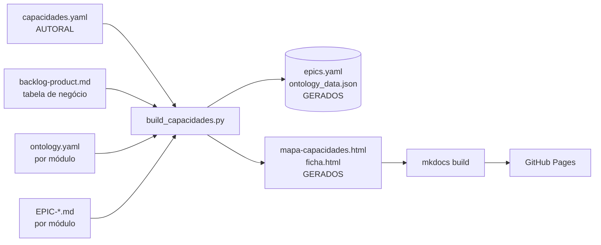

# Mapa de Capacidades & Fichas — Dados e Build

Como o **[Mapa de Capacidades](../mapa-capacidades.md)** (grafo) e as **[Fichas de Módulo](../fichas.md)** são montados, de onde vêm os dados e **onde você atualiza cada coisa**.

> Regra de ouro: edite **as fontes versionadas**. Os HTMLs e os dados consolidados são **gerados** — nunca edite à mão.

## Como funciona

Um único script — [`tools/build_capacidades.py`](https://github.com/leds-conectafapes/conectafapes-project/blob/main/tools/build_capacidades.py) — lê as fontes, mescla e gera as duas páginas interativas. Ele roda **automaticamente a cada build** do MkDocs (via [`tools/mkdocs_hooks.py`](https://github.com/leds-conectafapes/conectafapes-project/blob/main/tools/mkdocs_hooks.py), no `on_pre_build`), tanto local (`mkdocs serve`) quanto no CI (GitHub Pages).



## Onde editar o quê

| O que mudar | Onde editar | Fonte |
|---|---|---|
| Importância, impacto técnico, domínio, nível, status | [`data/capacidades.yaml`](capacidades.yaml) (bloco do módulo) | autoral |
| Arestas transversais (auth, gateway, notificação, integração) | [`data/capacidades.yaml`](capacidades.yaml) → `habilita:` | autoral |
| **Negócio** — dor, benefício, KPI, % (20 módulos) | [`management/backlog-product.md`](../management/backlog-product.md) (tabela "Modulos e Sub-Backlogs") | reuso |
| **Negócio** — refino, `impacto_negocio`, `valor_publico`, e M021–M024 | [`data/capacidades.yaml`](capacidades.yaml) → bloco `negocio:` | autoral |
| Entidades, eventos, arestas estruturais (import/ref) | `implementation/modules/Mxxx/ontology.yaml` | reuso |
| Epics, user stories, dependências de epic | `implementation/modules/Mxxx/epics/EPIC-*.md` | reuso |
| **`valor`** de um epic (1 linha) | seção `## Valor` no `EPIC-*.md` | reuso |

## Esquema do `capacidades.yaml`

Cada módulo:

```yaml
- id: M009
  nome: "Gestão de Bolsista"
  slug: gestao-bolsista
  dominio: post_award        # corporativo|plataforma|pre_award|post_award|financeiro|inteligencia
  nivel: post_award          # coluna no grafo (cadeia de valor)
  status: planejado          # entregue|andamento|homol|validacao|planejado|especificado
  transversal: false         # true => infra que liga a quase tudo (arestas ocultas por padrão)
  importancia: 4             # 1–5 (estratégico)
  impacto: alto              # baixo|medio|alto|critico — blast-radius TÉCNICO (o que para se cair)
  proposito: "..."
  entidades_chave: [...]
  habilita:                  # ARESTA canônica: este módulo VIABILIZA o destino
    - { modulo: M004, tipo: dados }   # tipo: dados|evento|workflow|infra
  negocio:                   # opcional — refina/cobre o que não vem do backlog
    dor: "..."               # impacto no negócio (a dor que resolve)
    beneficio: "..."         # valor entregue
    impacto_negocio: alto    # criticidade p/ a missão
    kpis: ["...", "..."]
    valor_publico: "..."
    percent_desenv: 35
    casos:                   # casos concretos de impacto por funcionalidade (aparecem na ficha)
      - funcionalidade: "Remanejamento de bolsa"
        problema: "Processo manual via e-mail, sem controle."
        beneficio: "Coordenador remaneja sem intervenção da FAPES; sem planilha."
```

`depende_de` **não** é mantido à mão — o site deriva invertendo `habilita`.

## De onde vem o "negócio"

- **Automático**: o build lê a tabela de [`backlog-product.md`](../management/backlog-product.md) → `dor`, `beneficio` (coluna Capacidade), `kpis` (coluna KPI), `percent_desenv` (% Desenv.). Cobre os 20 módulos da tabela.
- **Refino/override**: o bloco `negocio:` no `capacidades.yaml` sobrescreve campo a campo e adiciona `impacto_negocio` / `valor_publico`. Use também para M021–M024 (fora da tabela).

## `valor` do epic

Para a frase de valor aparecer na ficha (em vez do objetivo), adicione no `EPIC-*.md`:

```markdown
## Valor

Emite o termo e publica no DOE automaticamente — elimina o trâmite manual.
```

Sem `## Valor`, a ficha mostra o `## Objetivo` como fallback.

## Rodar local

```bash
# só regenerar os dados/HTML (rápido)
python tools/build_capacidades.py

# servir o site inteiro (o hook regenera no build)
mkdocs serve   # http://127.0.0.1:8000/mapa-capacidades/
```

## Publicar

`git push` na branch `main` → workflow [`docs-pages.yml`](https://github.com/leds-conectafapes/conectafapes-project/blob/main/.github/workflows/docs-pages.yml) roda `pip install -r requirements.txt` + `mkdocs build` (o hook regenera) e publica no GitHub Pages. Sem passo manual.

## Gerados — NÃO editar

São sobrescritos a cada build:

- `docs/data/epics.yaml` (snapshot dos epics)
- `docs/data/ontology_data.json` (snapshot do grafo estrutural)
- `docs/assets/mapa-capacidades.html` e `docs/assets/ficha.html` (no `.gitignore`)

Os templates `docs/assets/*.tmpl.html` **são** versionados — é neles que se mexe no visual/JS.

## Receitas

**Novo módulo** → adicione o bloco em `capacidades.yaml` (com `dominio`, `nivel`, `importancia`, `impacto`, `habilita`, `negocio`). Se tiver `ontology.yaml`/epics, são incorporados automático.

**Nova aresta de dependência** → se for estrutural, ela já vem do `import`/`ref` da `ontology.yaml`; se for transversal (infra), adicione em `habilita:` no `capacidades.yaml`.

**Módulo sem dados de negócio na ficha** → preencha a linha dele na tabela do `backlog-product.md` ou um bloco `negocio:` no `capacidades.yaml`.
