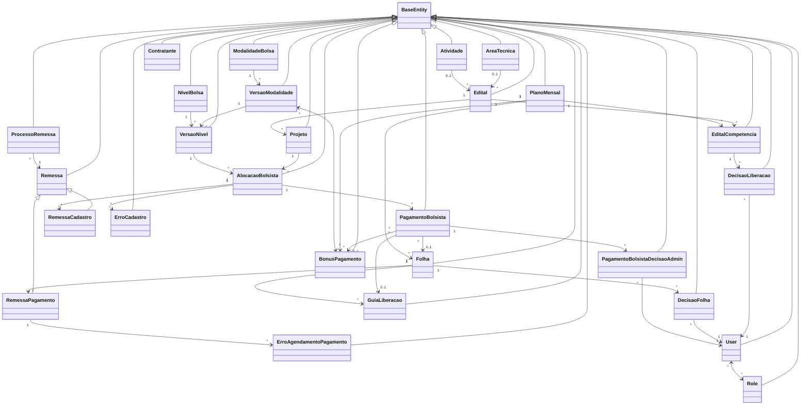
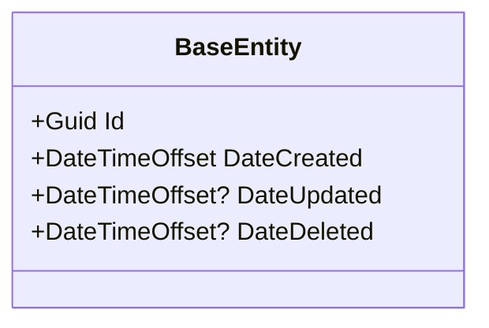
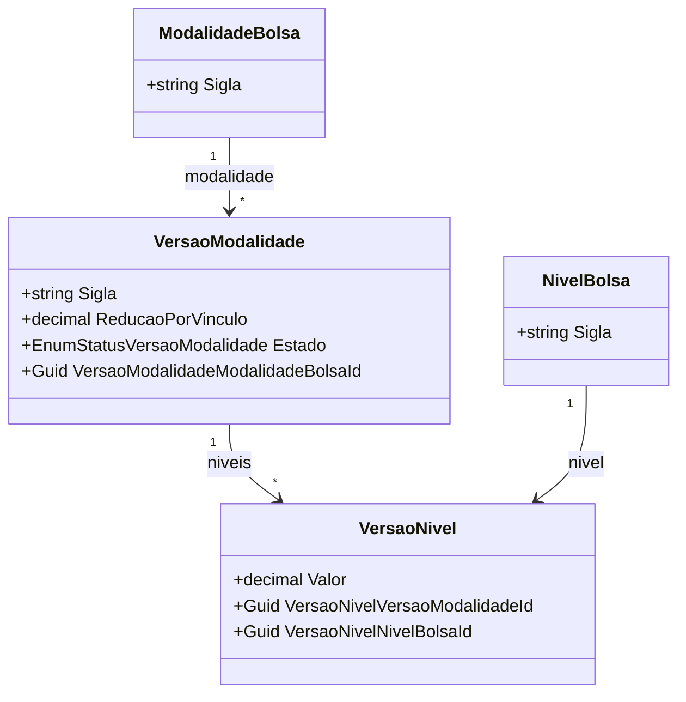
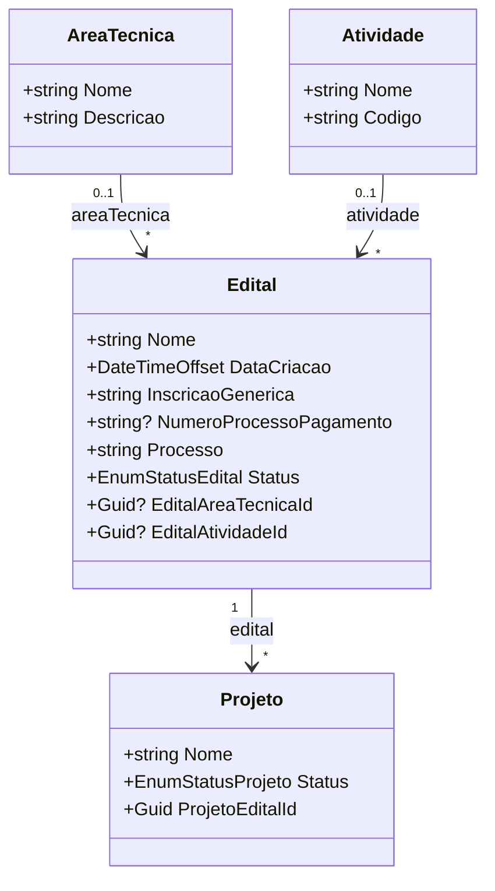
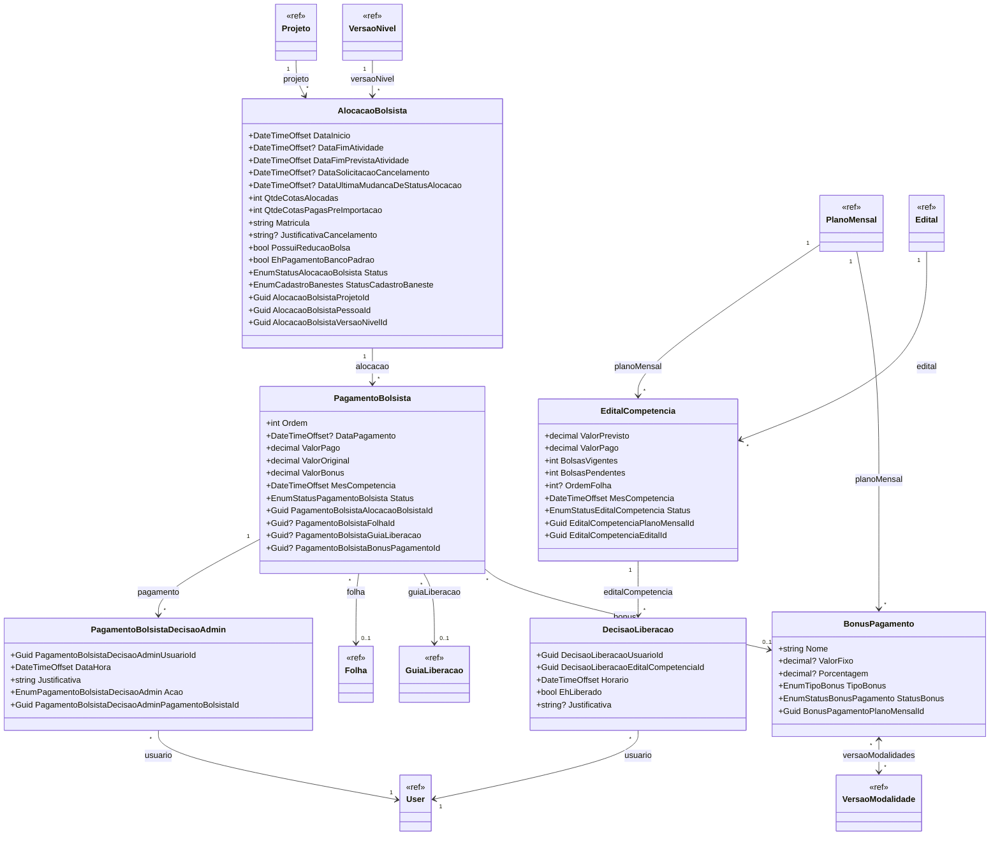
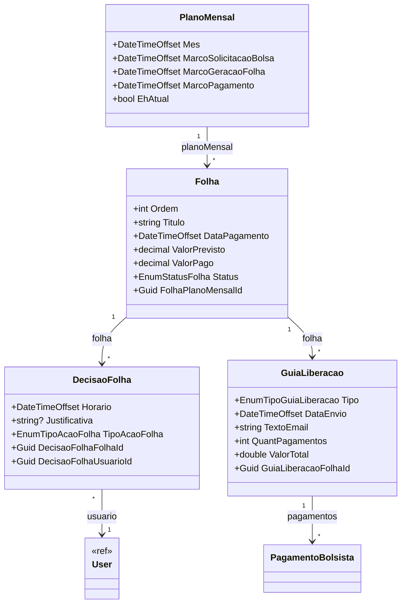
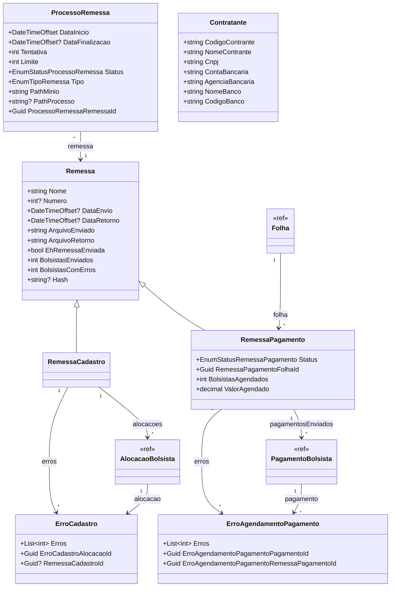
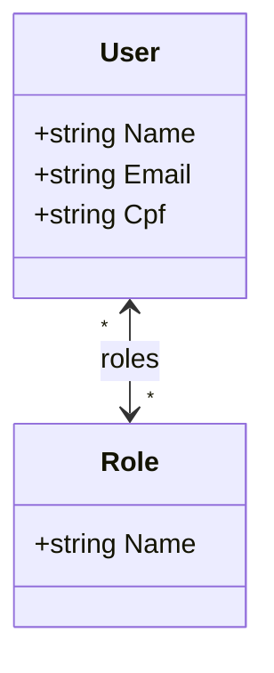

# Entidades de Dominio — PagamentoBolsistas

> **Documento depreciado.** A documentacao canonica deste modulo migrou para [implementation/modules/M004-pagamento-bolsista/modelo-estrutural.md](../../implementation/modules/M004-pagamento-bolsista/modelo-estrutural.md). Ver [ADR-006](../../architecture/adr/ADR-006-reconciliacao-m004-pagamento-bolsista.md).

## Indice

- [1. Visao Geral](#1-visao-geral)
- [2. Classe Base — BaseEntity](#2-classe-base--baseentity)
- [3. Cadastro de Modalidades e Bolsas](#3-cadastro-de-modalidades-e-bolsas)
- [4. Editais e Projetos](#4-editais-e-projetos)
- [5. Alocacao e Gestao de Bolsistas](#5-alocacao-e-gestao-de-bolsistas)
- [6. Plano Mensal e Folha de Pagamento](#6-plano-mensal-e-folha-de-pagamento)
- [7. Remessas e Processos Bancarios](#7-remessas-e-processos-bancarios)
- [8. Usuarios e Controle de Acesso](#8-usuarios-e-controle-de-acesso)
- [9. Enumeracoes Referenciadas](#9-enumeracoes-referenciadas)

---

## 1. Visao Geral

As entidades de dominio do sistema **ConectaFapes — Pagamento Bolsistas** estao organizadas em 6 modulos principais dentro de `ConectaFapes.Domain/Entities/PagamentoBolsistas`:

- **Cadastro de Modalidades e Bolsas** — Modalidades de bolsa, niveis e versoes de niveis/modalidades.
- **Editais e Projetos** — Editais, areas tecnicas, atividades e projetos.
- **Alocacao e Gestao de Bolsistas** — Alocacoes de bolsistas, pagamentos, bonus, decisoes administrativas e competencias de editais.
- **Plano Mensal e Folha de Pagamento** — Planos mensais, folhas de pagamento, decisoes de folha e guias de liberacao.
- **Remessas e Processos Bancarios** — Remessas de cadastro e pagamento, erros, processos de remessa e contratantes.
- **Usuarios e Controle de Acesso** — Usuarios e perfis de acesso (roles).

Todas as entidades herdam de `BaseEntity`, que fornece campos de identificacao e auditoria.

### Diagrama de Visao Geral

---

## 2. Classe Base — BaseEntity

Todas as entidades herdam de `BaseEntity` (`ConectaFapes.Common.Domain.BaseEntities`), que fornece os seguintes campos:

| Propriedade | Tipo | Nullable | Descricao |
|---|---|---|---|
| Id | Guid | Nao | Identificador unico da entidade |
| DateCreated | DateTimeOffset | Nao | Data de criacao do registro |
| DateUpdated | DateTimeOffset? | Sim | Data da ultima atualizacao |
| DateDeleted | DateTimeOffset? | Sim | Data de exclusao logica (soft delete) |

---

## 3. Cadastro de Modalidades e Bolsas

### 3.1 Diagrama de Classes

### 3.2 Dicionario de Dados

> Todas as entidades herdam as propriedades de [BaseEntity](#2-classe-base--baseentity).

#### ModalidadeBolsa

| Propriedade | Tipo | Nullable | Descricao |
|---|---|---|---|
| Sigla | string | Nao | Sigla da modalidade de bolsa |

#### NivelBolsa

| Propriedade | Tipo | Nullable | Descricao |
|---|---|---|---|
| Sigla | string | Nao | Sigla do nivel da bolsa |

#### VersaoModalidade

| Propriedade | Tipo | Nullable | Descricao |
|---|---|---|---|
| Sigla | string | Nao | Sigla da versao da modalidade |
| ReducaoPorVinculo | decimal | Nao | Percentual de reducao por vinculo |
| Estado | EnumStatusVersaoModalidade | Nao | Status da versao da modalidade |
| VersaoModalidadeModalidadeBolsaId | Guid | Nao | FK para ModalidadeBolsa |

#### VersaoNivel

| Propriedade | Tipo | Nullable | Descricao |
|---|---|---|---|
| Valor | decimal | Nao | Valor monetario do nivel da bolsa |
| VersaoNivelVersaoModalidadeId | Guid | Nao | FK para VersaoModalidade |
| VersaoNivelNivelBolsaId | Guid | Nao | FK para NivelBolsa |

---

## 4. Editais e Projetos

### 4.1 Diagrama de Classes

### 4.2 Dicionario de Dados

> Todas as entidades herdam as propriedades de [BaseEntity](#2-classe-base--baseentity).

#### AreaTecnica

| Propriedade | Tipo | Nullable | Descricao |
|---|---|---|---|
| Nome | string | Nao | Nome da area tecnica |
| Descricao | string | Nao | Descricao da area tecnica |

#### Atividade

| Propriedade | Tipo | Nullable | Descricao |
|---|---|---|---|
| Nome | string | Nao | Nome da atividade |
| Codigo | string | Nao | Codigo identificador da atividade |

#### Edital

| Propriedade | Tipo | Nullable | Descricao |
|---|---|---|---|
| Nome | string | Nao | Nome do edital |
| DataCriacao | DateTimeOffset | Nao | Data de criacao do edital |
| InscricaoGenerica | string | Nao | Inscricao generica do edital |
| NumeroProcessoPagamento | string? | Sim | Numero do processo de pagamento |
| Processo | string | Nao | Numero do processo |
| Status | EnumStatusEdital | Nao | Status do edital |
| EditalAreaTecnicaId | Guid? | Sim | FK para AreaTecnica |
| EditalAtividadeId | Guid? | Sim | FK para Atividade |

#### Projeto

| Propriedade | Tipo | Nullable | Descricao |
|---|---|---|---|
| Nome | string | Nao | Nome do projeto |
| Status | EnumStatusProjeto | Nao | Status do projeto |
| ProjetoEditalId | Guid | Nao | FK para Edital |

---

## 5. Alocacao e Gestao de Bolsistas

### 5.1 Diagrama de Classes

### 5.2 Dicionario de Dados

> Todas as entidades herdam as propriedades de [BaseEntity](#2-classe-base--baseentity).

#### AlocacaoBolsista

| Propriedade | Tipo | Nullable | Descricao |
|---|---|---|---|
| DataInicio | DateTimeOffset | Nao | Data de inicio da alocacao |
| DataFimAtividade | DateTimeOffset? | Sim | Data efetiva de fim da atividade |
| DataFimPrevistaAtividade | DateTimeOffset | Nao | Data prevista para fim da atividade |
| DataSolicitacaoCancelamento | DateTimeOffset? | Sim | Data da solicitacao de cancelamento |
| DataUltimaMudancaDeStatusAlocacao | DateTimeOffset? | Sim | Data da ultima mudanca de status |
| QtdeCotasAlocadas | int | Nao | Quantidade de cotas alocadas |
| QtdeCotasPagasPreImportacao | int | Nao | Quantidade de cotas pagas antes da importacao |
| Matricula | string | Nao | Matricula do bolsista |
| JustificativaCancelamento | string? | Sim | Justificativa para cancelamento |
| PossuiReducaoBolsa | bool | Nao | Indica se possui reducao na bolsa |
| EhPagamentoBancoPadrao | bool | Nao | Indica se o pagamento e pelo banco padrao |
| Status | EnumStatusAlocacaoBolsista | Nao | Status da alocacao do bolsista |
| StatusCadastroBaneste | EnumCadastroBanestes | Nao | Status do cadastro no Banestes (default: PENDENTE) |
| AlocacaoBolsistaProjetoId | Guid | Nao | FK para Projeto |
| AlocacaoBolsistaPessoaId | Guid | Nao | FK para Pessoa |
| AlocacaoBolsistaVersaoNivelId | Guid | Nao | FK para VersaoNivel |

#### PagamentoBolsista

| Propriedade | Tipo | Nullable | Descricao |
|---|---|---|---|
| Ordem | int | Nao | Numero de ordem do pagamento |
| DataPagamento | DateTimeOffset? | Sim | Data em que o pagamento foi efetuado |
| ValorPago | decimal | Nao | Valor efetivamente pago (original + bonus) |
| ValorOriginal | decimal | Nao | Valor original da bolsa |
| ValorBonus | decimal | Nao | Valor de bonus |
| MesCompetencia | DateTimeOffset | Nao | Mes de competencia do pagamento |
| Status | EnumStatusPagamentoBolsista | Nao | Status do pagamento |
| PagamentoBolsistaAlocacaoBolsistaId | Guid | Nao | FK para AlocacaoBolsista |
| PagamentoBolsistaFolhaId | Guid? | Sim | FK para Folha |
| PagamentoBolsistaGuiaLiberacao | Guid? | Sim | FK para GuiaLiberacao |
| PagamentoBolsistaBonusPagamentoId | Guid? | Sim | FK para BonusPagamento |

#### PagamentoBolsistaDecisaoAdmin

| Propriedade | Tipo | Nullable | Descricao |
|---|---|---|---|
| PagamentoBolsistaDecisaoAdminUsuarioId | Guid | Nao | FK para User (usuario que tomou a decisao) |
| DataHora | DateTimeOffset | Nao | Data e hora da decisao |
| Justificativa | string | Nao | Justificativa da decisao administrativa |
| Acao | EnumPagamentoBolsistaDecisaoAdmin | Nao | Tipo de acao administrativa |
| PagamentoBolsistaDecisaoAdminPagamentoBolsistaId | Guid | Nao | FK para PagamentoBolsista |

#### EditalCompetencia

| Propriedade | Tipo | Nullable | Descricao |
|---|---|---|---|
| ValorPrevisto | decimal | Nao | Valor previsto para o edital na competencia |
| ValorPago | decimal | Nao | Valor efetivamente pago |
| BolsasVigentes | int | Nao | Quantidade de bolsas vigentes |
| BolsasPendentes | int | Nao | Quantidade de bolsas pendentes |
| OrdemFolha | int? | Sim | Ordem na folha de pagamento |
| MesCompetencia | DateTimeOffset | Nao | Mes de competencia |
| Status | EnumStatusEditalCompetencia | Nao | Status do edital na competencia |
| EditalCompetenciaPlanoMensalId | Guid | Nao | FK para PlanoMensal |
| EditalCompetenciaEditalId | Guid | Nao | FK para Edital |

#### DecisaoLiberacao

| Propriedade | Tipo | Nullable | Descricao |
|---|---|---|---|
| DecisaoLiberacaoUsuarioId | Guid | Nao | FK para User (usuario que decidiu) |
| DecisaoLiberacaoEditalCompetenciaId | Guid | Nao | FK para EditalCompetencia |
| Horario | DateTimeOffset | Nao | Data e hora da decisao |
| EhLiberado | bool | Nao | Indica se a liberacao foi aprovada |
| Justificativa | string? | Sim | Justificativa da decisao |

#### BonusPagamento

| Propriedade | Tipo | Nullable | Descricao |
|---|---|---|---|
| Nome | string | Nao | Nome do bonus (gerado automaticamente) |
| ValorFixo | decimal? | Sim | Valor fixo do bonus (quando tipo VALOR_FIXO) |
| Porcentagem | decimal? | Sim | Porcentagem do bonus (quando tipo PORCENTAGEM) |
| TipoBonus | EnumTipoBonus | Nao | Tipo do bonus |
| StatusBonus | EnumStatusBonusPagamento | Nao | Status do bonus de pagamento |
| BonusPagamentoPlanoMensalId | Guid | Nao | FK para PlanoMensal |

---

## 6. Plano Mensal e Folha de Pagamento

### 6.1 Diagrama de Classes

### 6.2 Dicionario de Dados

> Todas as entidades herdam as propriedades de [BaseEntity](#2-classe-base--baseentity).

#### PlanoMensal

| Propriedade | Tipo | Nullable | Descricao |
|---|---|---|---|
| Mes | DateTimeOffset | Nao | Mes de referencia |
| MarcoSolicitacaoBolsa | DateTimeOffset | Nao | Data limite para solicitacao de bolsa |
| MarcoGeracaoFolha | DateTimeOffset | Nao | Data limite para geracao de folha |
| MarcoPagamento | DateTimeOffset | Nao | Data limite para pagamento |
| EhAtual | bool | Nao | Indica se e o plano mensal vigente |

#### Folha

| Propriedade | Tipo | Nullable | Descricao |
|---|---|---|---|
| Ordem | int | Nao | Ordem da folha (0 = normal, >0 = complementar) |
| Titulo | string | Nao | Titulo da folha (gerado automaticamente) |
| DataPagamento | DateTimeOffset | Nao | Data de pagamento da folha |
| ValorPrevisto | decimal | Nao | Valor previsto para pagamento |
| ValorPago | decimal | Nao | Valor efetivamente pago |
| Status | EnumStatusFolha | Nao | Status da folha |
| FolhaPlanoMensalId | Guid | Nao | FK para PlanoMensal |

#### DecisaoFolha

| Propriedade | Tipo | Nullable | Descricao |
|---|---|---|---|
| Horario | DateTimeOffset | Nao | Data e hora da decisao |
| Justificativa | string? | Sim | Justificativa da decisao |
| TipoAcaoFolha | EnumTipoAcaoFolha | Nao | Tipo da acao sobre a folha |
| DecisaoFolhaFolhaId | Guid | Nao | FK para Folha |
| DecisaoFolhaUsuarioId | Guid | Nao | FK para User |

#### GuiaLiberacao

| Propriedade | Tipo | Nullable | Descricao |
|---|---|---|---|
| Tipo | EnumTipoGuiaLiberacao | Nao | Tipo da guia de liberacao (default: NORMAL) |
| DataEnvio | DateTimeOffset | Nao | Data de envio da guia |
| TextoEmail | string | Nao | Texto do email de liberacao |
| QuantPagamentos | int | Nao | Quantidade de pagamentos incluidos |
| ValorTotal | double | Nao | Valor total da guia |
| GuiaLiberacaoFolhaId | Guid | Nao | FK para Folha |

---

## 7. Remessas e Processos Bancarios

### 7.1 Diagrama de Classes

### 7.2 Dicionario de Dados

> Todas as entidades herdam as propriedades de [BaseEntity](#2-classe-base--baseentity).

#### Remessa (classe base)

| Propriedade | Tipo | Nullable | Descricao |
|---|---|---|---|
| Nome | string | Nao | Nome da remessa |
| Numero | int? | Sim | Numero de identificacao (via arquivo de retorno) |
| DataEnvio | DateTimeOffset? | Sim | Data de envio da remessa |
| DataRetorno | DateTimeOffset? | Sim | Data de retorno da remessa |
| ArquivoEnviado | string | Nao | Conteudo/referencia do arquivo enviado |
| ArquivoRetorno | string | Nao | Conteudo/referencia do arquivo de retorno |
| EhRemessaEnviada | bool | Nao | Indica se a remessa foi enviada |
| BolsistasEnviados | int | Nao | Quantidade de bolsistas enviados |
| BolsistasComErros | int | Nao | Quantidade de bolsistas com erros |
| Hash | string? | Sim | Hash SHA256 do arquivo |

#### RemessaCadastro

Herda de `Remessa`. Nao possui propriedades proprias alem das herdadas.

Navegacoes:
- `Erros` — colecao de `ErroCadastro`
- `Alocacaoes` — colecao de `AlocacaoBolsista`

#### RemessaPagamento

Herda de `Remessa`.

| Propriedade | Tipo | Nullable | Descricao |
|---|---|---|---|
| Status | EnumStatusRemessaPagamento | Nao | Status da remessa de pagamento |
| RemessaPagamentoFolhaId | Guid | Nao | FK para Folha |
| BolsistasAgendados | int | Nao | Quantidade de bolsistas agendados |
| ValorAgendado | decimal | Nao | Valor total agendado |

#### ErroCadastro

| Propriedade | Tipo | Nullable | Descricao |
|---|---|---|---|
| Erros | List\<int\> | Nao | Lista de codigos de erros |
| ErroCadastroAlocacaoId | Guid | Nao | FK para AlocacaoBolsista |
| RemessaCadastroId | Guid? | Sim | FK para RemessaCadastro |

#### ErroAgendamentoPagamento

| Propriedade | Tipo | Nullable | Descricao |
|---|---|---|---|
| Erros | List\<int\> | Nao | Lista de codigos de erros |
| ErroAgendamentoPagamentoPagamentoId | Guid | Nao | FK para PagamentoBolsista |
| ErroAgendamentoPagamentoRemessaPagamentoId | Guid | Nao | FK para RemessaPagamento |

#### ProcessoRemessa

| Propriedade | Tipo | Nullable | Descricao |
|---|---|---|---|
| DataInicio | DateTimeOffset | Nao | Data de inicio do processamento |
| DataFinalizacao | DateTimeOffset? | Sim | Data de finalizacao do processamento |
| Tentativa | int | Nao | Numero da tentativa atual |
| Limite | int | Nao | Limite de tentativas |
| Status | EnumStatusProcessoRemessa | Nao | Status do processamento |
| Tipo | EnumTipoRemessa | Nao | Tipo de remessa (default: REMESSA_CADASTRO_BOLSISTAS) |
| PathMinio | string | Nao | Caminho do arquivo no MinIO |
| PathProcesso | string? | Sim | Caminho do processo |
| ProcessoRemessaRemessaId | Guid | Nao | FK para Remessa |

#### Contratante

| Propriedade | Tipo | Nullable | Descricao |
|---|---|---|---|
| CodigoContrante | string | Nao | Codigo do contratante |
| NomeContrante | string | Nao | Nome do contratante |
| Cnpj | string | Nao | CNPJ do contratante |
| ContaBancaria | string | Nao | Numero da conta bancaria |
| AgenciaBancaria | string | Nao | Numero da agencia bancaria |
| NomeBanco | string | Nao | Nome do banco |
| CodigoBanco | string | Nao | Codigo do banco |

---

## 8. Usuarios e Controle de Acesso

### 8.1 Diagrama de Classes

### 8.2 Dicionario de Dados

> Todas as entidades herdam as propriedades de [BaseEntity](#2-classe-base--baseentity).

#### User

| Propriedade | Tipo | Nullable | Descricao |
|---|---|---|---|
| Name | string | Nao | Nome do usuario |
| Email | string | Nao | Email do usuario |
| Cpf | string | Nao | CPF do usuario |

#### Role

| Propriedade | Tipo | Nullable | Descricao |
|---|---|---|---|
| Name | string | Nao | Nome do perfil de acesso |

---

## 9. Enumeracoes Referenciadas

Enumeracoes definidas em `ConectaFapes.Common.Domain.Enums.PagamentoBolsistas` e `ConectaFapes.Domain.Enum`.

| Enum | Entidade(s) | Valores Conhecidos |
|---|---|---|
| EnumStatusVersaoModalidade | VersaoModalidade | EM_EDICAO, ATIVA, INATIVA |
| EnumStatusEdital | Edital | ATIVO |
| EnumStatusProjeto | Projeto | EM_ANDAMENTO |
| EnumStatusAlocacaoBolsista | AlocacaoBolsista | EM_EDICAO, DOCUMENTACAO_PENDENTE, PENDENTE_DE_AVALIACAO, EM_AVALIACAO, ATIVA, SUSPENSA, CANCELADA, REPROVADA, FINALIZADA, AGUARDANDO_ACEITES, INDEFINIDO |
| EnumCadastroBanestes | AlocacaoBolsista | PENDENTE, ENVIADO, CADASTRADO |
| EnumStatusPagamentoBolsista | PagamentoBolsista | ALOCADO, PROGRAMADO, AGENDADO, EM_FOLHA, ENVIADO, PAGO, CANCELADO, SUSPENSAO_POR_SOLICITACAO, FALHA_AGENDAMENTO, PAGAMENTO_EXTERNO |
| EnumPagamentoBolsistaDecisaoAdmin | PagamentoBolsistaDecisaoAdmin | ADICAO_PAGAMENTO_BOLSISTA, MARCAR_COMO_PAGAMENTO_EXTERNO |
| EnumStatusEditalCompetencia | EditalCompetencia | SEM_DECISAO, LIBERADO, NAO_LIBERADO, INCLUIDO_EM_FOLHA |
| EnumStatusFolha | Folha | GERADA, AUTORIZADA, CANCELADA, REJEITADA, EM_AGENDAMENTO, AGENDADA, PAGA |
| EnumTipoAcaoFolha | DecisaoFolha | GERAR, CANCELAR, AUTORIZAR, REJEITAR |
| EnumTipoGuiaLiberacao | GuiaLiberacao | NORMAL, ALTERNATIVA |
| EnumTipoBonus | BonusPagamento | VALOR_FIXO, PORCENTAGEM |
| EnumStatusBonusPagamento | BonusPagamento | AGUARDANDO_FOLHA, INCLUSO_NA_FOLHA, PAGO |
| EnumStatusRemessaPagamento | RemessaPagamento | GERANDO, GERADA, ENVIADA, AGENDADA, AUTORIZADA, EFETIVADA |
| EnumStatusProcessoRemessa | ProcessoRemessa | AGUARDANDO_PROCESSAMENTO, EM_PROCESSAMENTO, PROCESSADA_COM_SUCESSO, PROCESSADA_COM_ERRO |
| EnumTipoRemessa | ProcessoRemessa | REMESSA_CADASTRO_BOLSISTAS, REMESSA_PAGAMENTO |
