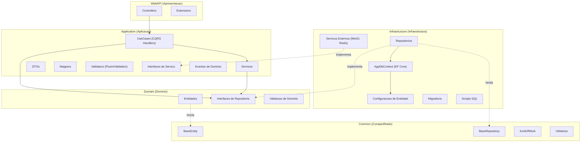
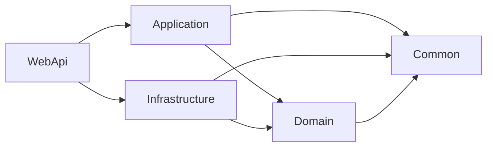
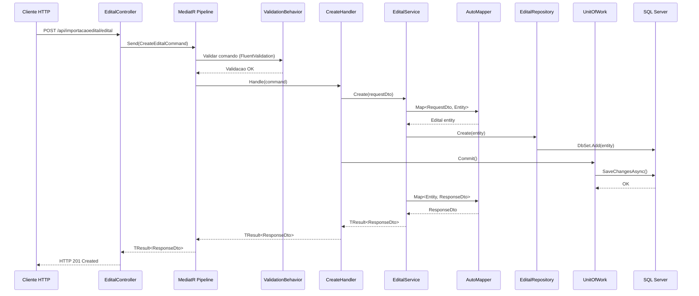
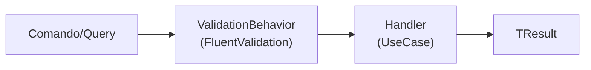
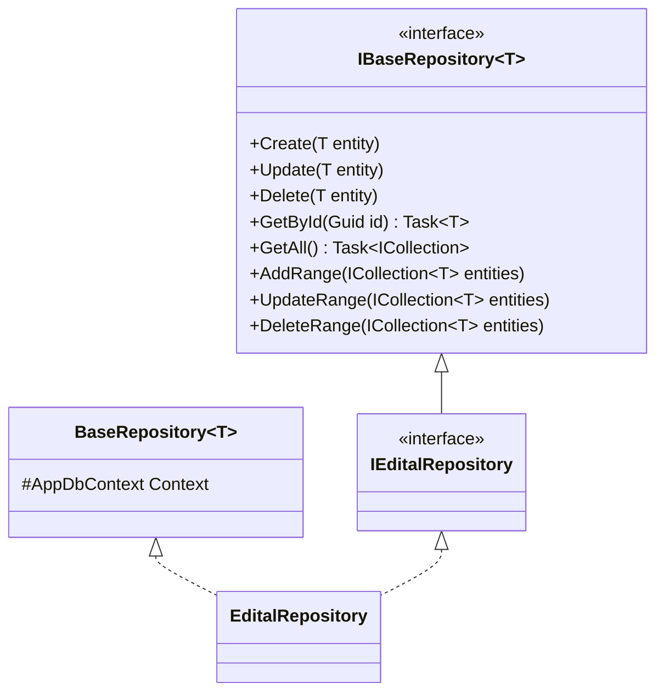
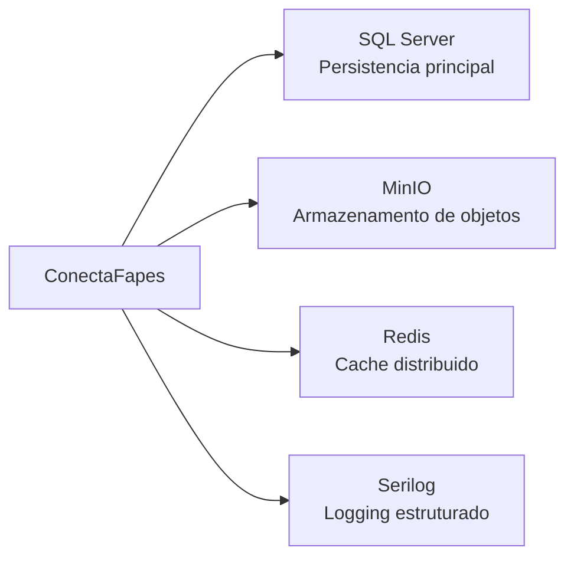

# Arquitetura — ConectaFapes Backend Admin

## Indice

- [1. Visao Geral](#1-visao-geral)
- [2. Estrutura de Projetos](#2-estrutura-de-projetos)
- [3. Camadas da Arquitetura](#3-camadas-da-arquitetura)
- [4. Fluxo de Dados](#4-fluxo-de-dados)
- [5. Padroes Arquiteturais](#5-padroes-arquiteturais)
- [6. Injecao de Dependencias](#6-injecao-de-dependencias)
- [7. Servicos Externos](#7-servicos-externos)
- [8. Preocupacoes Transversais](#8-preocupacoes-transversais)

---

## 1. Visao Geral

O backend do **ConectaFapes** segue uma arquitetura em camadas baseada em **Clean Architecture**, combinada com os padroes **CQRS (Command Query Responsibility Segregation)** e **MediatR** para orquestracao de comandos e consultas.

### Diagrama de Camadas



---

## 2. Estrutura de Projetos

A solucao e composta por **8 projetos**, cada um com uma responsabilidade especifica:

```
src/ConectaFapes/
├── ConectaFapes.WebApi/                   # Camada de apresentacao (API REST)
├── ConectaFapes.Application/              # Logica de aplicacao e orquestracao
├── ConectaFapes.Domain/                   # Entidades e contratos de dominio
├── ConectaFapes.Infrastructure/           # Acesso a dados e integracoes externas
├── ConectaFapes.Common/                   # Abstracoes compartilhadas (DLL externa)
├── ConectaFapes.Test/                     # Testes de integracao
├── ConectaFapes.Application.Test/         # Testes unitarios da aplicacao
├── ConectaFapes.Domain.Test/              # Testes unitarios do dominio
└── ConectaFapes.Infrastructure.Test/      # Testes unitarios da infraestrutura
```

| Projeto | Responsabilidade |
|---|---|
| **WebApi** | Controllers REST, configuracao de middleware, autenticacao JWT, OData, Swagger |
| **Application** | DTOs, Services, UseCases (CQRS), Mappers, Validators, Interfaces, Events |
| **Domain** | Entidades de dominio, interfaces de repositorio, validacoes de dominio |
| **Infrastructure** | Repositorios (EF Core), DbContext, migrations, scripts SQL, servicos externos |
| **Common** | BaseEntity, BaseRepository, IUnitOfWork, Result/TResult, utilitarios |
| **Test** | Testes de integracao |
| **Application.Test** | Testes unitarios da camada de aplicacao |
| **Domain.Test** | Testes unitarios da camada de dominio |
| **Infrastructure.Test** | Testes unitarios da camada de infraestrutura |

### Dependencias entre Projetos



> **Regra fundamental:** as camadas internas (Domain, Common) nunca referenciam camadas externas (Infrastructure, WebApi). O fluxo de dependencia aponta sempre para o centro.

---

## 3. Camadas da Arquitetura

### 3.1 WebAPI (Apresentacao)

Camada responsavel por receber requisicoes HTTP e delegar o processamento para a camada de aplicacao via MediatR.

**Estrutura:**

```
ConectaFapes.WebApi/
├── Controllers/
│   ├── BaseControllers/
│   │   ├── BaseController.cs             # BaseController generico com CRUD + OData
│   │   └── BaseRawController.cs          # Controller base sem genericos
│   ├── Aplicacoes/
│   │   └── AplicacaoController.cs
│   ├── CadastroModalidadesBolsas/
│   │   ├── ModalidadeBolsaController.cs
│   │   ├── MoedaController.cs
│   │   ├── NivelBolsaController.cs
│   │   ├── RequisitoBolsaController.cs
│   │   ├── ResolucaoController.cs
│   │   ├── VersaoModalidadeBolsaController.cs
│   │   └── VersaoNivelBolsaController.cs
│   ├── GestaoBolsa/
│   │   ├── DocumentoMetadadoController.cs
│   │   ├── VoluntariacaoController.cs
│   │   └── Views/
│   │       └── VisualizarPendenciasController.cs
│   ├── GestaoUsuarioBackoffice/
│   │   ├── RoleController.cs
│   │   └── UserController.cs
│   ├── ImportacaoEditais/
│   │   ├── AlocacaoBolsistaController.cs
│   │   ├── AlocacaoBolsistaSimplifcadoController.cs
│   │   ├── AreaTecnicaController.cs
│   │   ├── AtividadeController.cs
│   │   ├── BancoController.cs
│   │   ├── CoordenacaoController.cs
│   │   ├── DadosBancariosController.cs
│   │   ├── DocumentoController.cs
│   │   ├── EditalController.cs
│   │   ├── EnderecoController.cs
│   │   ├── NaturalidadeController.cs
│   │   ├── PessoaController.cs
│   │   ├── PessoaSimplificadoController.cs
│   │   ├── PlanejamentoAlocacaoController.cs
│   │   ├── PlanejamentoNivelController.cs
│   │   ├── ProjetoController.cs
│   │   └── TelefoneController.cs
│   └── Utils/
│       └── ApiRequestResult.cs
├── Extensions/
│   ├── CorsPolicyExtension.cs
│   ├── DataProtectionExtensions.cs
│   ├── EnvironmentExtension.cs
│   ├── JwtExtension.cs
│   ├── ODataExtension.cs
│   ├── ProxyForwardedHeadersExtensions.cs
│   └── SwaggerExtension.cs
├── Program.cs
└── appsettings.json / appsettings.Development.json
```

**BaseController** fornece endpoints CRUD genericos com suporte a OData:

| Metodo HTTP | Endpoint | Operacao |
|---|---|---|
| GET | `/api/{dominio}/{entidade}` | Listar todos (com OData: $filter, $select, $expand, $orderby, $skip, $top) |
| GET | `/api/{dominio}/{entidade}/{id}` | Buscar por ID |
| POST | `/api/{dominio}/{entidade}` | Criar |
| PUT | `/api/{dominio}/{entidade}` | Atualizar |
| DELETE | `/api/{dominio}/{entidade}/{id}` | Excluir |

### 3.2 Application (Aplicacao)

**Estrutura:**

```
ConectaFapes.Application/
├── Configuration/
│   └── ServiceExtensions.cs              # Registro de DI da camada
├── DTOs/
│   ├── Aplicacoes/
│   ├── CadastroModalidadesBolsas/
│   ├── GestaoBolsa/
│   └── ImportacaoEditais/
├── Events/
│   ├── AlocacaoBolsistaCase/
│   ├── DocumentoMetadadosCase/
│   └── ImportacaoEditais/
├── Interfaces/
│   ├── BaseServiceInterfaces/
│   ├── Aplicacacoes/
│   ├── CadastroModalidadesBolsas/
│   ├── ExternalServices/
│   ├── GestaoBolsa/
│   ├── ImportacaoEditais/
│   └── Pagination/
├── Mappers/
│   ├── Aplicacoes/
│   ├── CadastroModalidadesBolsas/
│   ├── GestaoBolsa/
│   └── ImportacaoEditais/
├── Services/
│   ├── BaseServices/
│   ├── Aplicacacoes/
│   ├── CadastroModalidadesBolsas/
│   ├── GestaoBolsa/
│   ├── GestaoUsuarioBackoffice/
│   └── ImportacaoEditais/
├── Shared/
│   └── Behavior/
│       └── ValidationBehavior.cs         # Pipeline do MediatR
├── UseCases/
│   ├── BaseCases/                        # Handlers genericos (CRUD)
│   ├── Aplicacacoes/
│   ├── CadastroModalidadesBolsas/
│   ├── GestaoBolsa/
│   └── ImportacaoEditais/
└── Validation/
```

**Handlers genericos (BaseCases):**

| Handler | Comando/Query | Descricao |
|---|---|---|
| `CreateHandler` | `CreateCommand` | Cria uma entidade |
| `UpdateHandler` | `UpdateCommand` | Atualiza uma entidade |
| `DeleteHandler` | `DeleteCommand` | Remove uma entidade |
| `GetAllHandler` | `GetAllQuery` | Lista todas as entidades |
| `GetByIdHandler` | `GetByIdQuery` | Busca entidade por ID |

### 3.3 Domain (Dominio)

```
ConectaFapes.Domain/
├── Entities/
│   ├── Aplicacacoes/
│   ├── CadastroModalidadesBolsas/
│   ├── GestaoBolsa/
│   ├── GestaoUsuarioBackoffice/
│   ├── ImportacaoEditais/
│   └── PagamentoBolsistas/
├── Interfaces/
│   ├── Aplicacacoes/
│   ├── CadastroModalidadesBolsas/
│   ├── GestaoBolsa/
│   ├── GestaoUsuarioBackoffice/
│   ├── ImportacaoEditais/
│   └── PagamentoBolsistas/
├── Shared/
│   └── ConectaFapesEnvironment.cs
└── Validation/
    └── DomainValidation.cs
```

> Para detalhes sobre as entidades, consulte [domain-entities.md](domain-entities.md).

### 3.4 Infrastructure (Infraestrutura)

```
ConectaFapes.Infrastructure/
├── Context/
│   └── AppDbContext.cs                    # DbContext com IDataProtectionKeyContext
├── EntitiesConfiguration/
│   ├── Aplicacoes/
│   ├── CadastroModalidadesBolsas/
│   ├── GestaoBolsa/
│   ├── GestaoUsuarioBackoffice/
│   ├── ImportacaoEditais/
│   └── PagamentoBolsistas/
├── Repositories/
│   ├── Aplicacoes/
│   ├── CadastroModalidadesBolsas/
│   ├── GestaoBolsa/
│   ├── GestaoUsuarioBackoffice/
│   ├── ImportacaoEditais/
│   ├── PagamentoBolsistas/
│   └── UnitOfWork.cs
├── ExternalServices/
│   ├── MinioService/
│   │   └── MinioService.cs               # Armazenamento de objetos (S3-compativel)
│   └── RedisService/
│       └── RedisService.cs               # Cache distribuido
├── Migrations/
├── Scripts/
└── ServiceExtensions.cs
```

### 3.5 Common (Compartilhado)

| Componente | Descricao |
|---|---|
| `BaseEntity` | Classe base com Id, DateCreated, DateUpdated, DateDeleted |
| `IBaseRepository<T>` | Contrato base com Create, Update, Delete, GetById, GetAll, AddRange, UpdateRange, DeleteRange |
| `BaseRepository<T>` | Implementacao base do repositorio sobre EF Core |
| `IUnitOfWork` | Contrato para commit transacional (`Task Commit()`) |
| `Result` / `TResult<T>` | Tipos de resultado padronizados para operacoes |
| `Error` / `ResultType` | Tipos de erro e enum de resultado |
| `PaginationResponse` | Resposta padronizada para paginacao |
| `ApiResponse` | Resposta padronizada da API |
| `LoggedUserService` | Servico utilitario para usuario autenticado |

---

## 4. Fluxo de Dados

### 4.1 Fluxo de uma Requisicao (Exemplo: Criar Edital)



### 4.2 Pipeline do MediatR



---

## 5. Padroes Arquiteturais

### 5.1 CQRS com MediatR

```
// Comando (escrita)
CreateEditalCommand : IRequest<TResult<EditalResponseDTO>>

// Handler
CreateEditalHandler : CreateHandler<CreateEditalCommand, ...>
```

### 5.2 Repository Pattern



### 5.3 Unit of Work

- `IUnitOfWork` define `Task Commit()`
- `UnitOfWork` encapsula `AppDbContext.SaveChangesAsync()`
- Handlers chamam `Commit()` apos todas as operacoes do repositorio

### 5.4 Classes Base Genericas

| Classe Base | Descricao |
|---|---|
| `BaseEntity` | Id, timestamps de auditoria (DateCreated, DateUpdated, DateDeleted) |
| `BaseRepository<T>` | Operacoes CRUD sobre DbContext |
| `BaseService<R, Resp, E, TR>` | Logica CRUD de servico |
| `BaseController<...>` | Endpoints REST CRUD com OData |
| `BaseRawController` | Controller base sem genericos |
| `CreateHandler<...>` | Handler generico de criacao |
| `UpdateHandler<...>` | Handler generico de atualizacao |
| `DeleteHandler<...>` | Handler generico de exclusao |
| `GetAllHandler<...>` | Handler generico de listagem |
| `GetByIdHandler<...>` | Handler generico de busca por ID |

---

## 6. Injecao de Dependencias

### Program.cs

```
builder.Services.ConfigurePersistenceApp(configuration)   // EF Core + Repositorios
builder.Services.ConfigureApplicationApp()                // Services + MediatR + Validators
builder.Services.ConfigureJwt()                           // Autenticacao JWT
builder.Services.ConfigureCorsPolicy()                    // Politica CORS
builder.Services.ODataConfiguration()                     // OData
builder.Services.ConfigureSwagger()                       // Swagger/OpenAPI
builder.ConfigurarDataProtection("ConectaFapes")          // Protecao de dados
```

### Application — ServiceExtensions.cs

- AutoMapper (escaneamento por assembly)
- MediatR com descoberta automatica de handlers
- FluentValidation com descoberta automatica de validators
- `ValidationBehavior<TRequest, TResponse>` como pipeline behavior
- Services de aplicacao (Scoped) — organizados por feature:
  - **CadastroModalidadesBolsas:** ResolucaoService, ModalidadeBolsaService, NivelBolsaService, VersaoModalidadeService, RequisitoBolsaService, VersaoNivelService, MoedaService, CotasPorNivelService
  - **ImportacaoEditais:** DocumentoService, PessoaService, NaturalidadeService, TelefoneService, EnderecoService, DadosBancariosService, BancoService, AreaTecnicaService, CoordenacaoService, EditalService, ProjetoService, PlanejamentoAlocacaoService, AlocacaoBolsistaService, PlanejamentoNivelService, AtividadeService, ImportarAlocacaoService
  - **GestaoBolsa:** VisualizarPendenciasService, AuthHelperService, AgenciaBanestesQueryService, EditalQueryService, PessoaQueryService, ProjetoQueryService, AlocacaoBolsistaQueryService, PlanoMensalQueryService, VisualizarProjetosService, DocumentoMetadadoService, VoluntariacaoService
  - **GestaoUsuarioBackoffice:** UserPaginationService, RolePaginationService
  - **Aplicacoes:** AplicacaoService
- Pagination Services: EditalPaginationService, ProjetoPaginationService, AlocacaoPaginationService
- BaseAuthenticationService com HttpClient

### Infrastructure — ServiceExtensions.cs

- `AppDbContext` (Scoped, SQL Server)
- Repositorios (todos Scoped) — organizados por feature
- `UnitOfWork` (Scoped)
- MinioService (Singleton) — armazenamento de objetos
- RedisService (condicional, baseado na variavel de ambiente `REDIS`)

---

## 7. Servicos Externos



| Servico | Tipo | Descricao |
|---|---|---|
| **SQL Server** | Banco de dados | Persistencia principal via EF Core 8.0 |
| **MinIO** | Armazenamento | Armazenamento de objetos S3-compativel (upload, download, exclusao de arquivos) |
| **Redis** | Cache | Cache distribuido (opcional, configuravel via variavel de ambiente `REDIS`) |
| **Serilog** | Logging | Logging estruturado com output para Console |

### Variaveis de Ambiente

```
CONECTAFAPES_ENVIRONMENT     = DEV | PROD
MINIO_URL                   = Endpoint do MinIO
MINIO_USER                  = Chave de acesso do MinIO
MINIO_PWD                   = Chave secreta do MinIO
REDIS                       = String de conexao do Redis (opcional)
```

---

## 8. Preocupacoes Transversais

| Preocupacao | Implementacao | Localizacao |
|---|---|---|
| **Validacao** | FluentValidation via MediatR `ValidationBehavior` | `Application/Shared/Behavior/` |
| **Autenticacao** | JWT Bearer tokens (HS256, via cookie `jwt-token` ou header Authorization) | `WebApi/Extensions/JwtExtension.cs` |
| **Autorizacao** | Atributo `[Authorize(AuthenticationSchemes = "JwtBearer")]` nos controllers | Controllers |
| **Logging** | Serilog estruturado com `ILogger<T>` injetado nos controllers | Controllers |
| **Health Check** | Endpoint `/health` com verificacao basica | `Program.cs` |
| **Soft Delete** | `DateDeleted` em `BaseEntity` | `Common/Domain/BaseEntities/` |
| **Cache** | Redis (conexao opcional e nao-bloqueante) | `Infrastructure/ExternalServices/RedisService/` |
| **OData** | Composicao de queries ($filter, $select, $expand, $orderby, $skip, $top, $count) | `WebApi/Extensions/ODataExtension.cs` |
| **CORS** | Politica configuravel de cross-origin | `WebApi/Extensions/CorsPolicyExtension.cs` |
| **Swagger** | Documentacao OpenAPI (apenas em ambiente de desenvolvimento) | `WebApi/Extensions/SwaggerExtension.cs` |
| **Data Protection** | ASP.NET Data Protection com chaves armazenadas no banco de dados | `WebApi/Extensions/DataProtectionExtensions.cs` |
| **Proxy Headers** | Suporte a headers de proxy reverso (ambiente de producao) | `WebApi/Extensions/ProxyForwardedHeadersExtensions.cs` |
| **Eventos** | Eventos de dominio para operacoes complexas | `Application/Events/` |

---

## Dominios Funcionais

| Dominio | Descricao |
|---|---|
| **CadastroModalidadesBolsas** | Cadastro e gerenciamento de modalidades de bolsas, niveis, requisitos, resolucoes, moedas e versoes |
| **ImportacaoEditais** | Importacao e gerenciamento de editais, projetos, alocacoes de bolsistas, pessoas, documentos e dados relacionados |
| **GestaoBolsa** | Gestao de bolsas ativas, planos mensais, orientacoes, documentos de metadados, voluntariacao e visualizacao de pendencias |
| **GestaoUsuarioBackoffice** | Gerenciamento de usuarios e papeis (roles) do sistema administrativo |
| **PagamentoBolsistas** | Rastreamento e gerenciamento de pagamentos de bolsistas |
| **Aplicacoes** | Gerenciamento de aplicacoes do sistema |
