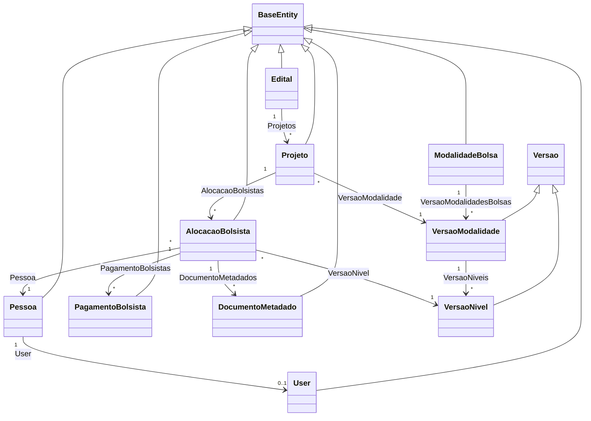
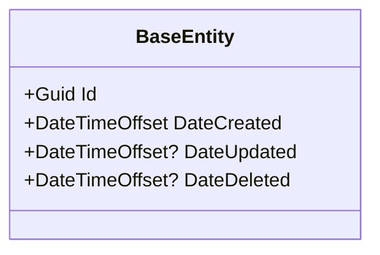
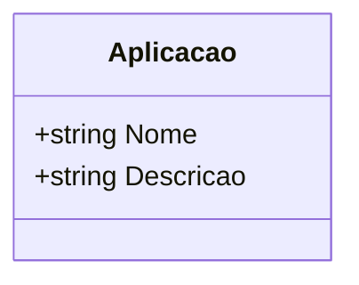
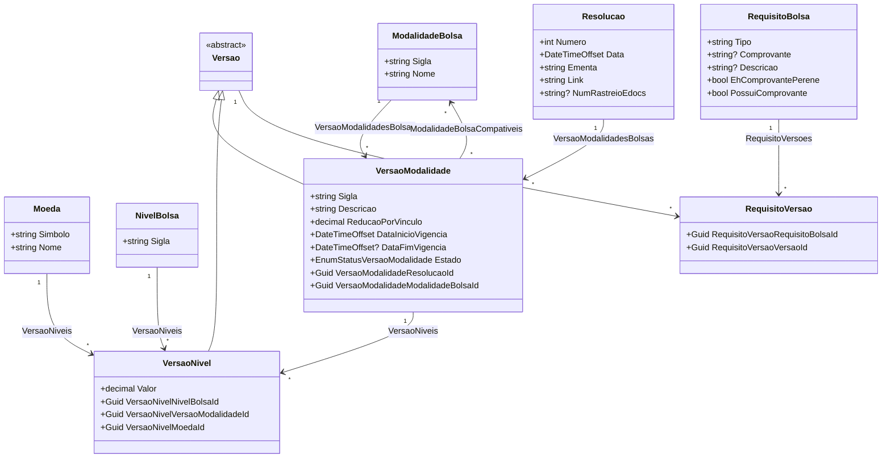
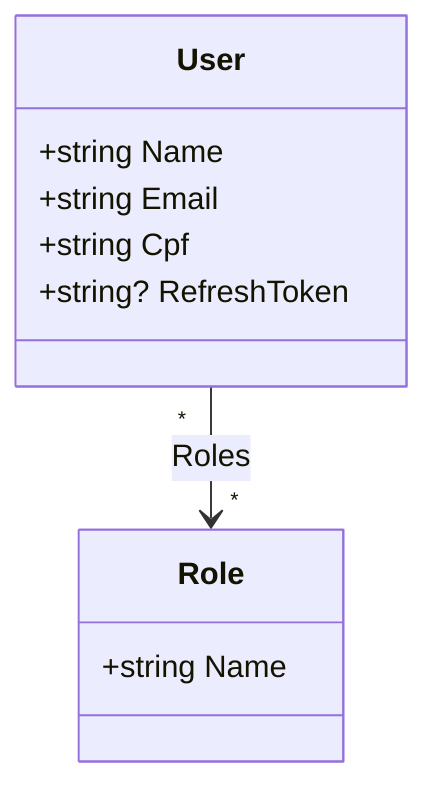
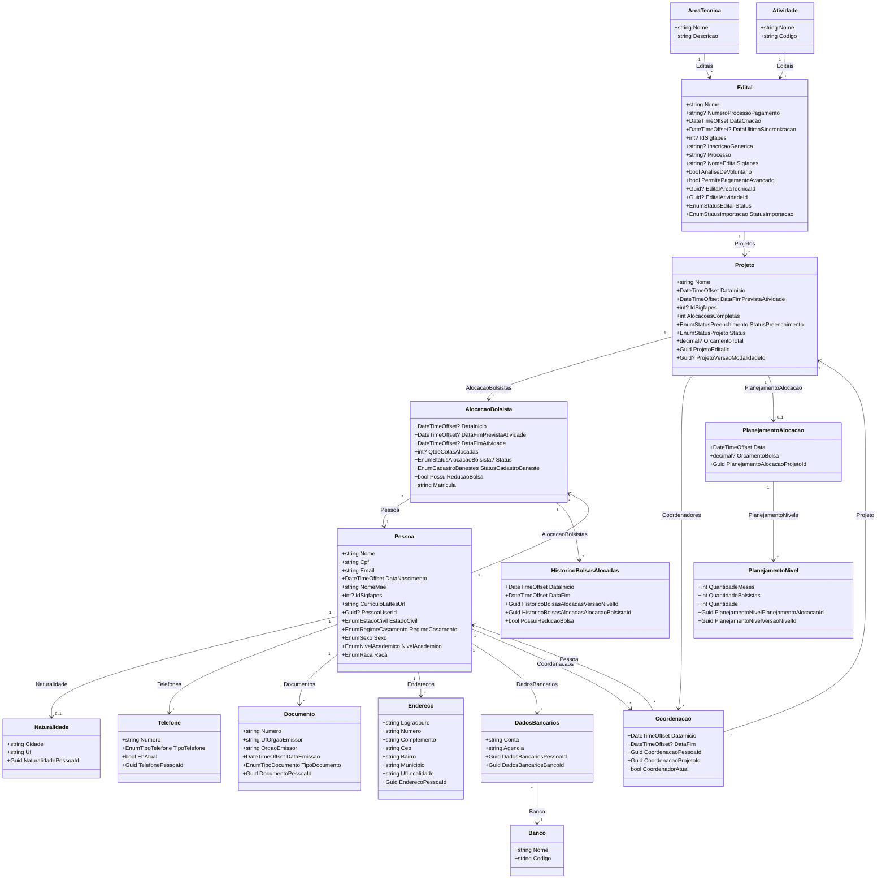
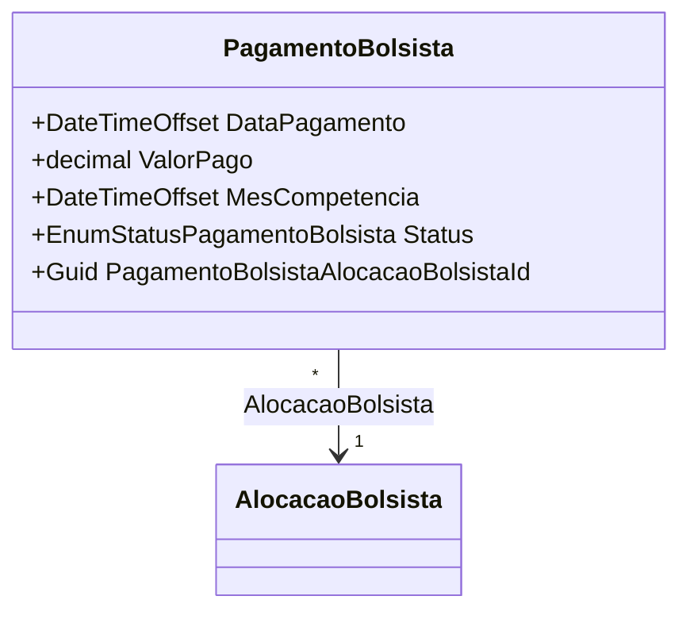

# Entidades de Dominio — ConectaFapes Backend Admin

## Indice

- [1. Visao Geral](#1-visao-geral)
- [2. Classe Base — BaseEntity](#2-classe-base--baseentity)
- [3. Aplicacacoes](#3-aplicacacoes)
- [4. CadastroModalidadesBolsas](#4-cadastromodalidadesbolsas)
- [5. GestaoBolsa](#5-gestaobolsa)
- [6. GestaoUsuarioBackoffice](#6-gestaousuariobackoffice)
- [7. ImportacaoEditais](#7-importacaoeditais)
- [8. PagamentoBolsistas](#8-pagamentobolsistas)
- [9. Enumeracoes Referenciadas](#9-enumeracoes-referenciadas)

---

## 1. Visao Geral

As entidades de dominio do sistema **ConectaFapes Backend Admin** estao organizadas em 6 modulos principais dentro de `ConectaFapes.Domain/Entities`:

- **Aplicacacoes** — Registro das aplicacoes integradas ao sistema.
- **CadastroModalidadesBolsas** — Cadastro de modalidades de bolsas, versoes, niveis, moedas e resolucoes associadas.
- **GestaoBolsa** — Gestao operacional de bolsas, incluindo orientacoes, documentos, atividades de bolsistas, planos mensais, voluntariacoes e termos de responsabilidade.
- **GestaoUsuarioBackoffice** — Gerenciamento de usuarios e papeis (roles) do sistema administrativo.
- **ImportacaoEditais** — Importacao e gestao de editais, projetos, pessoas, alocacoes de bolsistas e dados associados do SIGFAPES.
- **PagamentoBolsistas** — Controle de pagamentos de bolsistas por mes de competencia.

Todas as entidades herdam de `BaseEntity`, que fornece campos de identificacao e auditoria.

### Diagrama de Visao Geral

---

## 2. Classe Base — BaseEntity

Todas as entidades herdam de `BaseEntity` (`ConectaFapes.Common.Domain.BaseEntities`), que fornece os seguintes campos:

| Propriedade | Tipo | Nullable | Descricao |
|---|---|---|---|
| Id | Guid | Nao | Identificador unico da entidade |
| DateCreated | DateTimeOffset | Nao | Data de criacao do registro (default: agora) |
| DateUpdated | DateTimeOffset? | Sim | Data da ultima atualizacao |
| DateDeleted | DateTimeOffset? | Sim | Data de exclusao logica (soft delete) |

---

## 3. Aplicacacoes

### 3.1 Diagrama de Classes

### 3.2 Dicionario de Dados

> Todas as entidades herdam as propriedades de [BaseEntity](#2-classe-base--baseentity).

#### Aplicacao

| Propriedade | Tipo | Nullable | Descricao |
|---|---|---|---|
| Nome | string | Nao | Nome da aplicacao |
| Descricao | string | Nao | Descricao da aplicacao |

---

## 4. CadastroModalidadesBolsas

### 4.1 Diagrama de Classes

### 4.2 Dicionario de Dados

> Todas as entidades herdam as propriedades de [BaseEntity](#2-classe-base--baseentity).

#### ModalidadeBolsa

| Propriedade | Tipo | Nullable | Descricao |
|---|---|---|---|
| Sigla | string (max 10) | Nao | Sigla da modalidade de bolsa |
| Nome | string (max 100) | Nao | Nome da modalidade de bolsa |

#### Moeda

| Propriedade | Tipo | Nullable | Descricao |
|---|---|---|---|
| Simbolo | string (max 3) | Nao | Simbolo da moeda (ex: BRL, USD) |
| Nome | string (max 20) | Nao | Nome da moeda |

#### NivelBolsa

| Propriedade | Tipo | Nullable | Descricao |
|---|---|---|---|
| Sigla | string (max 15) | Nao | Sigla do nivel de bolsa |

#### RequisitoBolsa

| Propriedade | Tipo | Nullable | Descricao |
|---|---|---|---|
| Tipo | string | Nao | Tipo do requisito |
| Comprovante | string? | Sim | Nome ou descricao do comprovante |
| Descricao | string? | Sim | Descricao do requisito |
| EhComprovantePerene | bool | Nao | Indica se o comprovante e perene (default: false) |
| PossuiComprovante | bool | Nao | Indica se possui comprovante (default: false) |

#### RequisitoVersao

| Propriedade | Tipo | Nullable | Descricao |
|---|---|---|---|
| RequisitoVersaoRequisitoBolsaId | Guid | Nao | FK para RequisitoBolsa |
| RequisitoVersaoVersaoId | Guid | Nao | FK para Versao |

#### Resolucao

| Propriedade | Tipo | Nullable | Descricao |
|---|---|---|---|
| Numero | int | Nao | Numero da resolucao |
| Data | DateTimeOffset | Nao | Data da resolucao |
| Ementa | string (max 500) | Nao | Ementa da resolucao |
| Link | string | Nao | Link para o documento da resolucao |
| NumRastreioEdocs | string? | Sim | Numero de rastreio no E-Docs |

#### Versao (abstract)

Classe abstrata que serve como base para `VersaoModalidade` e `VersaoNivel`. Nao possui propriedades escalares proprias alem das herdadas de `BaseEntity`. Define a colecao de navegacao `RequisitoVersoes`.

#### VersaoModalidade (herda de Versao)

| Propriedade | Tipo | Nullable | Descricao |
|---|---|---|---|
| Sigla | string (max 20) | Nao | Sigla gerada da versao (ex: IC-2024) |
| Descricao | string (max 500) | Nao | Descricao da versao da modalidade |
| ReducaoPorVinculo | decimal (0.0001–1) | Nao | Fator de reducao por vinculo (default: 1) |
| DataInicioVigencia | DateTimeOffset | Nao | Data de inicio da vigencia |
| DataFimVigencia | DateTimeOffset? | Sim | Data de fim da vigencia |
| Estado | EnumStatusVersaoModalidade | Nao | Status da versao da modalidade |
| VersaoModalidadeResolucaoId | Guid | Nao | FK para Resolucao |
| VersaoModalidadeModalidadeBolsaId | Guid | Nao | FK para ModalidadeBolsa |

#### VersaoNivel (herda de Versao)

| Propriedade | Tipo | Nullable | Descricao |
|---|---|---|---|
| Valor | decimal | Nao | Valor monetario da bolsa neste nivel |
| VersaoNivelNivelBolsaId | Guid | Nao | FK para NivelBolsa |
| VersaoNivelVersaoModalidadeId | Guid | Nao | FK para VersaoModalidade |
| VersaoNivelMoedaId | Guid | Nao | FK para Moeda |

---

## 5. GestaoBolsa

### 5.1 Diagrama de Classes

```mermaid
classDiagram
    class AgenciaBanestes {
        +string Codigo
        +string Nome
        +EnumMunicipiosEs Municipio
    }

    class AreaConhecimento {
        +int NumeroNivel
        +int CodArea
        +string NomeArea
        +int CodGrandeArea
        +string NomeGrandeArea
        +int CodSubArea
        +string NomeSubArea
        +int CodEspecialidade
        +string NomeEspecialidade
    }

    class AtividadeBolsista {
        +int Numero
        +string Descricao
        +Guid AtividadeBolsistaAlocacaoBolsistaId
    }

    class CotasPorNivel {
        +int QuantidadeCotasPlanejadasSemReducao
        +int QuantidadeCotasPlanejadasComReducao
        +Guid CotasPorNivelPlanejamentoAlocacaoId
        +Guid CotasPorNivelVersaoNivelId
    }

    class DocumentoMetadado {
        +string NomeOriginal
        +string ObjectName
        +string ContentType
        +Guid? AlocacaoBolsistaId
        +Guid? RequisistoBolsaId
        +Guid? PessoaId
        +EnumStatusDocumento Status
        +string? JustificativaPedidoRevisao
        +string? JustificativaReprovacao
    }

    class Orientacao {
        +DateTimeOffset DataInicio
        +DateTimeOffset? DataFim
        +bool OrientacaoAtual
        +Guid OrientacaoPessoaId
        +Guid OrientacaoAlocacaoBolsistaId
    }

    class PlanoMensal {
        +DateTimeOffset Mes
        +DateTimeOffset MarcoSolicitacaoBolsa
        +DateTimeOffset MarcoGeracaoFolha
        +DateTimeOffset MarcoPagamento
        +bool EhAtual
    }

    class Voluntariacao {
        +DateTimeOffset DataInicio
        +DateTimeOffset? DataFim
        +DateTimeOffset? DataUltimaMudancaDeStatus
        +Guid VoluntariacaoPessoaId
        +Guid VoluntariacaoProjetoId
        +EnumStatusVoluntariacao Status
        +string? JustificativaCancelamento
        +string? JustificativaReprovacao
    }

    class TermoDeResponsabilidadeMetadado {
        +bool PossuiVinculoParentescoCosanguineo
        +bool Assinado
        +Guid DocumentoMetadadoId
        +Guid AlocacaoBolsistaId
    }

    class DeclaracaoAtividadeRemunerada {
        +string NomeDaInstituicao
        +string NomeCargo
        +string TipoDeAtividadeRemunerada
        +string CargaHorariaSemanal
        +string TipoDeVinculoComInstituicao
        +Guid TermoResponsabilidadeMetadadoId
    }

    class DeclaracaoOutraBolsa {
        +string NomeDaInstituicao
        +string ModalidadeDaBolsa
        +string VigenciaDaBolsa
        +Guid TermoDeResponsabilidadeMetadadoId
    }

    AtividadeBolsista "*" --> "1" AlocacaoBolsista : AlocacaoBolsista
    Orientacao "*" --> "1" Pessoa : Pessoa
    Orientacao "*" --> "1" AlocacaoBolsista : AlocacaoBolsista
    Voluntariacao "*" --> "1" Pessoa : Pessoa
    Voluntariacao "*" --> "1" Projeto : Projeto
    DocumentoMetadado "*" --> "0..1" AlocacaoBolsista : AlocacaoBolsista
    DocumentoMetadado "*" --> "0..1" RequisitoBolsa : RequisitoBolsa
    DocumentoMetadado "*" --> "0..1" Pessoa : Pessoa
    DocumentoMetadado "1" --> "0..1" TermoDeResponsabilidadeMetadado
    CotasPorNivel "*" --> "1" PlanejamentoAlocacao : PlanejamentoAlocacao
    CotasPorNivel "*" --> "1" VersaoNivel : VersaoNivel
    TermoDeResponsabilidadeMetadado "1" --> "0..1" DeclaracaoOutraBolsa
    TermoDeResponsabilidadeMetadado "1" --> "0..1" DeclaracaoAtividadeRemunerada
    TermoDeResponsabilidadeMetadado "*" --> "1" DocumentoMetadado
    TermoDeResponsabilidadeMetadado "*" --> "1" AlocacaoBolsista
```

### 5.2 Dicionario de Dados

> Todas as entidades herdam as propriedades de [BaseEntity](#2-classe-base--baseentity).

#### AgenciaBanestes

| Propriedade | Tipo | Nullable | Descricao |
|---|---|---|---|
| Codigo | string | Nao | Codigo da agencia |
| Nome | string | Nao | Nome da agencia |
| Municipio | EnumMunicipiosEs | Nao | Municipio da agencia no Espirito Santo |

#### AreaConhecimento

| Propriedade | Tipo | Nullable | Descricao |
|---|---|---|---|
| NumeroNivel | int | Nao | Nivel hierarquico da area |
| CodArea | int | Nao | Codigo da area de conhecimento |
| NomeArea | string | Nao | Nome da area de conhecimento |
| CodGrandeArea | int | Nao | Codigo da grande area |
| NomeGrandeArea | string | Nao | Nome da grande area |
| CodSubArea | int | Nao | Codigo da sub-area |
| NomeSubArea | string | Nao | Nome da sub-area |
| CodEspecialidade | int | Nao | Codigo da especialidade |
| NomeEspecialidade | string | Nao | Nome da especialidade |

#### AtividadeBolsista

| Propriedade | Tipo | Nullable | Descricao |
|---|---|---|---|
| Numero | int | Nao | Numero sequencial da atividade |
| Descricao | string | Nao | Descricao da atividade |
| AtividadeBolsistaAlocacaoBolsistaId | Guid | Nao | FK para AlocacaoBolsista |

#### CotasPorNivel

| Propriedade | Tipo | Nullable | Descricao |
|---|---|---|---|
| QuantidadeCotasPlanejadasSemReducao | int | Nao | Quantidade de cotas planejadas sem reducao |
| QuantidadeCotasPlanejadasComReducao | int | Nao | Quantidade de cotas planejadas com reducao |
| CotasPorNivelPlanejamentoAlocacaoId | Guid | Nao | FK para PlanejamentoAlocacao |
| CotasPorNivelVersaoNivelId | Guid | Nao | FK para VersaoNivel |

#### DocumentoMetadado

| Propriedade | Tipo | Nullable | Descricao |
|---|---|---|---|
| NomeOriginal | string | Nao | Nome original do arquivo enviado |
| ObjectName | string | Nao | Nome do objeto no armazenamento |
| ContentType | string | Nao | Tipo MIME do conteudo |
| AlocacaoBolsistaId | Guid? | Sim | FK para AlocacaoBolsista |
| RequisistoBolsaId | Guid? | Sim | FK para RequisitoBolsa |
| PessoaId | Guid? | Sim | FK para Pessoa |
| Status | EnumStatusDocumento | Nao | Status do documento |
| JustificativaPedidoRevisao | string? | Sim | Justificativa do pedido de revisao |
| JustificativaReprovacao | string? | Sim | Justificativa da reprovacao |

#### Orientacao

| Propriedade | Tipo | Nullable | Descricao |
|---|---|---|---|
| DataInicio | DateTimeOffset | Nao | Data de inicio da orientacao |
| DataFim | DateTimeOffset? | Sim | Data de fim da orientacao |
| OrientacaoAtual | bool | Nao | Indica se e a orientacao atual (default: true) |
| OrientacaoPessoaId | Guid | Nao | FK para Pessoa (orientador) |
| OrientacaoAlocacaoBolsistaId | Guid | Nao | FK para AlocacaoBolsista |

#### PlanoMensal

| Propriedade | Tipo | Nullable | Descricao |
|---|---|---|---|
| Mes | DateTimeOffset | Nao | Mes de referencia do plano |
| MarcoSolicitacaoBolsa | DateTimeOffset | Nao | Data limite para solicitacao de bolsa |
| MarcoGeracaoFolha | DateTimeOffset | Nao | Data limite para geracao da folha |
| MarcoPagamento | DateTimeOffset | Nao | Data prevista de pagamento |
| EhAtual | bool | Nao | Indica se e o plano mensal vigente |

#### Voluntariacao

| Propriedade | Tipo | Nullable | Descricao |
|---|---|---|---|
| DataInicio | DateTimeOffset | Nao | Data de inicio da voluntariacao |
| DataFim | DateTimeOffset? | Sim | Data de fim da voluntariacao |
| DataUltimaMudancaDeStatus | DateTimeOffset? | Sim | Data da ultima mudanca de status |
| VoluntariacaoPessoaId | Guid | Nao | FK para Pessoa (voluntario) |
| VoluntariacaoProjetoId | Guid | Nao | FK para Projeto |
| Status | EnumStatusVoluntariacao | Nao | Status da voluntariacao |
| JustificativaCancelamento | string? | Sim | Justificativa do cancelamento |
| JustificativaReprovacao | string? | Sim | Justificativa da reprovacao |

### 5.3 Sub-modulo: TermoDeResponsabilidade

#### TermoDeResponsabilidadeMetadado

| Propriedade | Tipo | Nullable | Descricao |
|---|---|---|---|
| PossuiVinculoParentescoCosanguineo | bool | Nao | Indica se possui vinculo de parentesco consanguineo |
| Assinado | bool | Nao | Indica se o termo foi assinado |
| DocumentoMetadadoId | Guid | Nao | FK para DocumentoMetadado |
| AlocacaoBolsistaId | Guid | Nao | FK para AlocacaoBolsista |

#### DeclaracaoAtividadeRemunerada

| Propriedade | Tipo | Nullable | Descricao |
|---|---|---|---|
| NomeDaInstituicao | string | Nao | Nome da instituicao empregadora |
| NomeCargo | string | Nao | Nome do cargo exercido |
| TipoDeAtividadeRemunerada | string | Nao | Tipo da atividade remunerada |
| CargaHorariaSemanal | string | Nao | Carga horaria semanal |
| TipoDeVinculoComInstituicao | string | Nao | Tipo de vinculo com a instituicao |
| TermoResponsabilidadeMetadadoId | Guid | Nao | FK para TermoDeResponsabilidadeMetadado |

#### DeclaracaoOutraBolsa

| Propriedade | Tipo | Nullable | Descricao |
|---|---|---|---|
| NomeDaInstituicao | string | Nao | Nome da instituicao concedente |
| ModalidadeDaBolsa | string | Nao | Modalidade da outra bolsa |
| VigenciaDaBolsa | string | Nao | Periodo de vigencia da outra bolsa |
| TermoDeResponsabilidadeMetadadoId | Guid | Nao | FK para TermoDeResponsabilidadeMetadado |

---

## 6. GestaoUsuarioBackoffice

### 6.1 Diagrama de Classes

### 6.2 Dicionario de Dados

> Todas as entidades herdam as propriedades de [BaseEntity](#2-classe-base--baseentity).

#### User

| Propriedade | Tipo | Nullable | Descricao |
|---|---|---|---|
| Name | string | Nao | Nome do usuario |
| Email | string | Nao | Email do usuario |
| Cpf | string | Nao | CPF do usuario |
| RefreshToken | string? | Sim | Token de atualizacao para autenticacao |

#### Role

| Propriedade | Tipo | Nullable | Descricao |
|---|---|---|---|
| Name | string | Nao | Nome do papel (role) |

---

## 7. ImportacaoEditais

### 7.1 Diagrama de Classes

### 7.2 Dicionario de Dados

> Todas as entidades herdam as propriedades de [BaseEntity](#2-classe-base--baseentity).

#### Edital

| Propriedade | Tipo | Nullable | Descricao |
|---|---|---|---|
| Nome | string | Nao | Nome do edital |
| NumeroProcessoPagamento | string? | Sim | Numero do processo de pagamento |
| DataCriacao | DateTimeOffset | Nao | Data de criacao do edital |
| DataUltimaSincronizacao | DateTimeOffset? | Sim | Data da ultima sincronizacao com SIGFAPES |
| IdSigfapes | int? | Sim | Identificador no sistema SIGFAPES |
| InscricaoGenerica | string? | Sim | Inscricao generica |
| Processo | string? | Sim | Numero do processo |
| NomeEditalSigfapes | string? | Sim | Nome do edital no SIGFAPES |
| AnaliseDeVoluntario | bool | Nao | Indica se aceita analise de voluntario (default: false) |
| PermitePagamentoAvancado | bool | Nao | Indica se permite pagamento avancado (default: false) |
| EditalAreaTecnicaId | Guid? | Sim | FK para AreaTecnica |
| EditalAtividadeId | Guid? | Sim | FK para Atividade |
| Status | EnumStatusEdital | Nao | Status do edital (default: ATIVO) |
| StatusImportacao | EnumStatusImportacao | Nao | Status de importacao do edital (default: NAOIMPORTAR) |

#### Projeto

| Propriedade | Tipo | Nullable | Descricao |
|---|---|---|---|
| Nome | string | Nao | Nome do projeto |
| DataInicio | DateTimeOffset | Nao | Data de inicio do projeto |
| DataFimPrevistaAtividade | DateTimeOffset | Nao | Data prevista para fim da atividade |
| IdSigfapes | int? | Sim | Identificador no sistema SIGFAPES |
| AlocacoesCompletas | int | Nao | Quantidade de alocacoes completas (default: 0) |
| StatusPreenchimento | EnumStatusPreenchimento | Nao | Status de preenchimento (default: INCOMPLETO) |
| Status | EnumStatusProjeto | Nao | Status do projeto |
| OrcamentoTotal | decimal? | Sim | Orcamento total do projeto |
| ProjetoEditalId | Guid | Nao | FK para Edital |
| ProjetoVersaoModalidadeId | Guid? | Sim | FK para VersaoModalidade |

#### Pessoa

| Propriedade | Tipo | Nullable | Descricao |
|---|---|---|---|
| Nome | string | Nao | Nome completo da pessoa |
| Cpf | string | Nao | CPF da pessoa |
| Email | string | Nao | Email da pessoa |
| DataNascimento | DateTimeOffset | Nao | Data de nascimento |
| NomeMae | string | Nao | Nome da mae |
| IdSigfapes | int? | Sim | Identificador no sistema SIGFAPES |
| CurriculoLattesUrl | string | Nao | URL do curriculo Lattes |
| PessoaUserId | Guid? | Sim | FK para User (backoffice) |
| EstadoCivil | EnumEstadoCivil | Nao | Estado civil |
| RegimeCasamento | EnumRegimeCasamento | Nao | Regime de casamento |
| Sexo | EnumSexo | Nao | Sexo |
| NivelAcademico | EnumNivelAcademico | Nao | Nivel academico |
| Raca | EnumRaca | Nao | Raca/cor |

#### AlocacaoBolsista

| Propriedade | Tipo | Nullable | Descricao |
|---|---|---|---|
| DataInicio | DateTimeOffset? | Sim | Data de inicio da alocacao |
| DataFimPrevistaAtividade | DateTimeOffset? | Sim | Data prevista para fim da atividade |
| DataFimAtividade | DateTimeOffset? | Sim | Data efetiva de fim da atividade |
| DataSolicitacaoCancelamento | DateTimeOffset? | Sim | Data da solicitacao de cancelamento |
| JustificativaCancelamento | string? | Sim | Justificativa do cancelamento |
| JustificativaReprovacao | string? | Sim | Justificativa da reprovacao |
| QtdeCotasAlocadas | int? | Sim | Quantidade de cotas alocadas |
| QtdeCotasPagasPreImportacao | int? | Sim | Quantidade de cotas pagas antes da importacao |
| ObjetivosMetas | string? | Sim | Objetivos e metas do bolsista |
| Atividade | string? | Sim | Descricao da atividade |
| Status | EnumStatusAlocacaoBolsista? | Sim | Status da alocacao |
| StatusCadastroBaneste | EnumCadastroBanestes | Nao | Status do cadastro Banestes (default: PENDENTE) |
| DataUltimaMudancaDeStatusAlocacao | DateTimeOffset? | Sim | Data da ultima mudanca de status |
| MesAprovacao | DateTimeOffset? | Sim | Mes de aprovacao da bolsa |
| MesReprovacao | DateTimeOffset? | Sim | Mes de reprovacao da bolsa |
| IdSigfapes | int? | Sim | Identificador no sistema SIGFAPES |
| PossuiReducaoBolsa | bool | Nao | Indica se possui reducao de bolsa |
| Matricula | string | Nao | Matricula gerada do bolsista |
| AlocacaoBolsistaPessoaId | Guid? | Sim | FK para Pessoa |
| AlocacaoBolsistaProjetoId | Guid? | Sim | FK para Projeto |
| AlocacaoBolsistaVersaoNivelId | Guid? | Sim | FK para VersaoNivel |
| AlocacaoBolsistaAreaConhecimentoId | Guid? | Sim | FK para AreaConhecimento |

#### AreaTecnica

| Propriedade | Tipo | Nullable | Descricao |
|---|---|---|---|
| Nome | string | Nao | Nome da area tecnica |
| Descricao | string | Nao | Descricao da area tecnica |

#### Atividade

| Propriedade | Tipo | Nullable | Descricao |
|---|---|---|---|
| Nome | string | Nao | Nome da atividade |
| Codigo | string | Nao | Codigo da atividade |

#### Banco

| Propriedade | Tipo | Nullable | Descricao |
|---|---|---|---|
| Nome | string | Nao | Nome do banco |
| Codigo | string | Nao | Codigo do banco |

#### Coordenacao

| Propriedade | Tipo | Nullable | Descricao |
|---|---|---|---|
| DataInicio | DateTimeOffset | Nao | Data de inicio da coordenacao |
| DataFim | DateTimeOffset? | Sim | Data de fim da coordenacao |
| CoordenacaoPessoaId | Guid | Nao | FK para Pessoa (coordenador) |
| CoordenacaoProjetoId | Guid | Nao | FK para Projeto |
| CoordenadorAtual | bool | Nao | Indica se e o coordenador atual (default: true) |

#### DadosBancarios

| Propriedade | Tipo | Nullable | Descricao |
|---|---|---|---|
| Conta | string | Nao | Numero da conta bancaria |
| Agencia | string | Nao | Numero da agencia bancaria |
| DadosBancariosPessoaId | Guid | Nao | FK para Pessoa |
| DadosBancariosBancoId | Guid | Nao | FK para Banco |

#### Documento

| Propriedade | Tipo | Nullable | Descricao |
|---|---|---|---|
| Numero | string | Nao | Numero do documento |
| UfOrgaoEmissor | string | Nao | UF do orgao emissor |
| OrgaoEmissor | string | Nao | Nome do orgao emissor |
| DataEmissao | DateTimeOffset | Nao | Data de emissao |
| TipoDocumento | EnumTipoDocumento | Nao | Tipo do documento |
| DocumentoPessoaId | Guid | Nao | FK para Pessoa |

#### Endereco

| Propriedade | Tipo | Nullable | Descricao |
|---|---|---|---|
| Logradouro | string | Nao | Logradouro (rua, avenida, etc.) |
| Numero | string | Nao | Numero do endereco |
| Complemento | string | Nao | Complemento do endereco |
| Cep | string | Nao | CEP do endereco |
| Bairro | string | Nao | Bairro |
| Municipio | string | Nao | Municipio |
| UfLocalidade | string | Nao | UF da localidade (2 caracteres) |
| EnderecoPessoaId | Guid | Nao | FK para Pessoa |

#### HistoricoBolsasAlocadas

| Propriedade | Tipo | Nullable | Descricao |
|---|---|---|---|
| DataInicio | DateTimeOffset | Nao | Data de inicio do periodo |
| DataFim | DateTimeOffset | Nao | Data de fim do periodo |
| HistoricoBolsasAlocadasVersaoNivelId | Guid | Nao | FK para VersaoNivel |
| HistoricoBolsasAlocadasAlocacaoBolsistaId | Guid | Nao | FK para AlocacaoBolsista |
| PossuiReducaoBolsa | bool | Nao | Indica se possuia reducao de bolsa no periodo |

#### Naturalidade

| Propriedade | Tipo | Nullable | Descricao |
|---|---|---|---|
| Cidade | string | Nao | Cidade de nascimento |
| Uf | string | Nao | UF de nascimento (2 caracteres) |
| NaturalidadePessoaId | Guid | Nao | FK para Pessoa |

#### PlanejamentoAlocacao

| Propriedade | Tipo | Nullable | Descricao |
|---|---|---|---|
| Data | DateTimeOffset | Nao | Data do planejamento |
| OrcamentoBolsa | decimal? | Sim | Orcamento disponivel para bolsas |
| PlanejamentoAlocacaoProjetoId | Guid | Nao | FK para Projeto |

#### PlanejamentoNivel

| Propriedade | Tipo | Nullable | Descricao |
|---|---|---|---|
| QuantidadeMeses | int | Nao | Quantidade de meses planejados |
| QuantidadeBolsistas | int | Nao | Quantidade de bolsistas planejados |
| Quantidade | int | Nao | Total calculado (meses x bolsistas) |
| PlanejamentoNivelPlanejamentoAlocacaoId | Guid | Nao | FK para PlanejamentoAlocacao |
| PlanejamentoNivelVersaoNivelId | Guid | Nao | FK para VersaoNivel |

#### Telefone

| Propriedade | Tipo | Nullable | Descricao |
|---|---|---|---|
| Numero | string | Nao | Numero de telefone |
| TipoTelefone | EnumTipoTelefone | Nao | Tipo do telefone |
| EhAtual | bool | Nao | Indica se e o telefone atual |
| TelefonePessoaId | Guid | Nao | FK para Pessoa |

---

## 8. PagamentoBolsistas

### 8.1 Diagrama de Classes

### 8.2 Dicionario de Dados

> Todas as entidades herdam as propriedades de [BaseEntity](#2-classe-base--baseentity).

#### PagamentoBolsista

| Propriedade | Tipo | Nullable | Descricao |
|---|---|---|---|
| DataPagamento | DateTimeOffset | Nao | Data do pagamento |
| ValorPago | decimal | Nao | Valor pago ao bolsista |
| MesCompetencia | DateTimeOffset | Nao | Mes de competencia do pagamento |
| Status | EnumStatusPagamentoBolsista | Nao | Status do pagamento |
| PagamentoBolsistaAlocacaoBolsistaId | Guid | Nao | FK para AlocacaoBolsista |

---

## 9. Enumeracoes Referenciadas

Enumeracoes definidas em `ConectaFapes.Common.Domain.Enums` e `ConectaFapes.Domain.Entities.PagamentoBolsistas`.

| Enum | Entidade(s) | Valores Conhecidos |
|---|---|---|
| EnumStatusVersaoModalidade | VersaoModalidade | ATIVA, EM_EDICAO, INATIVA |
| EnumStatusAlocacaoBolsista | AlocacaoBolsista | EM_EDICAO, DOCUMENTACAO_PENDENTE, AGUARDANDO_ACEITES, PENDENTE_DE_AVALIACAO, EM_AVALIACAO, ATIVA, SUSPENSA, CANCELADA, REPROVADA, FINALIZADA |
| EnumCadastroBanestes | AlocacaoBolsista | PENDENTE, *(definido em Common.dll)* |
| EnumStatusDocumento | DocumentoMetadado | ENVIADO, NAO_ENVIADO, EM_PROCESSAMENTO, PEDIDO_REVISAO, APROVADO_IA, REPROVADO_IA, PENDENTE_AVALIACAO, APROVADO_MANUAL, REPROVADO_MANUAL |
| EnumStatusVoluntariacao | Voluntariacao | ATIVA, EM_AVALIACAO, REPROVADA_AREA_TECNICA, *(definido em Common.dll)* |
| EnumStatusEdital | Edital | ATIVO, *(definido em Common.dll)* |
| EnumStatusImportacao | Edital | NAOIMPORTAR, AIMPORTAR, IMPORTADO |
| EnumStatusProjeto | Projeto | *(definido em Common.dll)* |
| EnumStatusPreenchimento | Projeto | INCOMPLETO, COMPLETO |
| EnumStatusPagamentoBolsista | PagamentoBolsista | ALOCADO, EM_FOLHA, ENVIADO, FALHA_AGENDAMENTO, AGENDADO, PAGO |
| EnumTipoDocumento | Documento | *(definido em Common.dll)* |
| EnumTipoTelefone | Telefone | *(definido em Common.dll)* |
| EnumMunicipiosEs | AgenciaBanestes | *(definido em Common.dll)* |
| EnumEstadoCivil | Pessoa | *(definido em Common.dll)* |
| EnumRegimeCasamento | Pessoa | *(definido em Common.dll)* |
| EnumSexo | Pessoa | *(definido em Common.dll)* |
| EnumNivelAcademico | Pessoa | *(definido em Common.dll)* |
| EnumRaca | Pessoa | *(definido em Common.dll)* |
