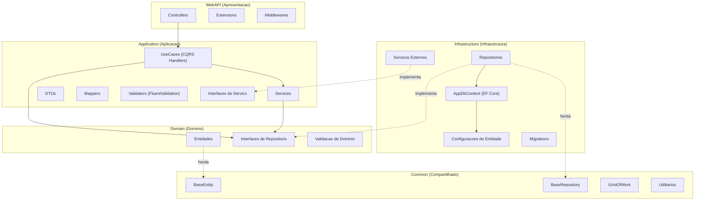
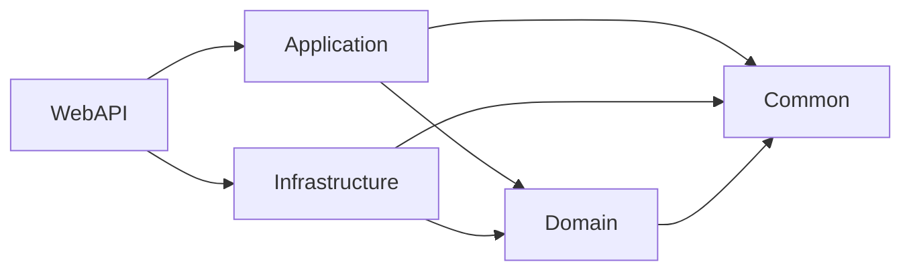
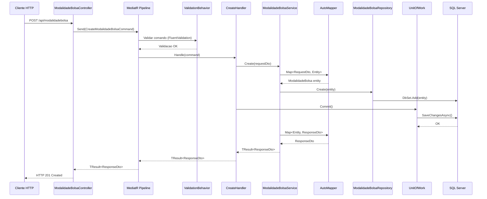
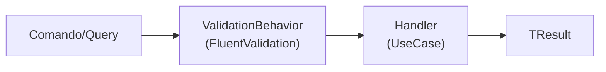
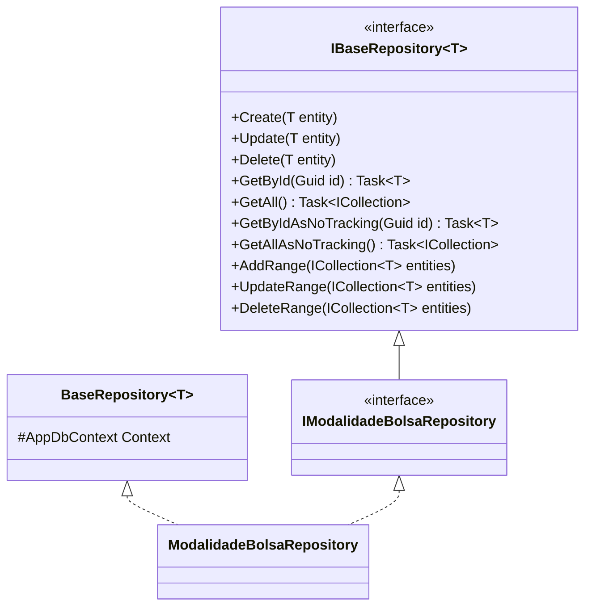
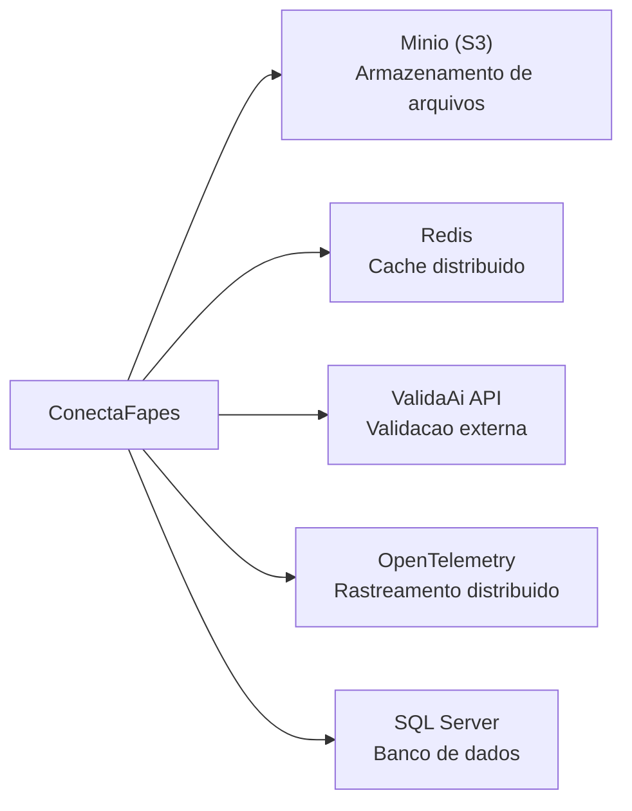

# Arquitetura — ConectaFapes Backend

> **Documento depreciado.** A arquitetura do backend e transversal a todos os produtos e esta documentada em [architecture/01-visao-geral.md](../../architecture/01-visao-geral.md) e [ADR-001](../../architecture/adr/ADR-001-backend-csharp-clean-architecture-cqrs.md). Detalhes de infraestrutura (MinIO, Redis, Hangfire) estao em [architecture/04-dados-e-operacao.md](../../architecture/04-dados-e-operacao.md).

## Indice

- [1. Visao Geral](#1-visao-geral)
- [2. Estrutura de Projetos](#2-estrutura-de-projetos)
- [3. Camadas da Arquitetura](#3-camadas-da-arquitetura)
- [4. Fluxo de Dados](#4-fluxo-de-dados)
- [5. Padroes Arquiteturais](#5-padroes-arquiteturais)
- [6. Injecao de Dependencias](#6-injecao-de-dependencias)
- [7. Servicos Externos](#7-servicos-externos)
- [8. Preocupacoes Transversais](#8-preocupacoes-transversais)

---

## 1. Visao Geral

O backend do **ConectaFapes — Pagamento Bolsistas** segue uma arquitetura em camadas baseada em **Clean Architecture**, combinada com os padroes **CQRS** (Command Query Responsibility Segregation) e **MediatR** para orquestracao de comandos e consultas.

### Diagrama de Camadas



---

## 2. Estrutura de Projetos

A solucao e composta por **6 projetos**, cada um com uma responsabilidade especifica:

```
src/ConectaFapes/
├── ConectaFapes.WebAPI/              # Camada de apresentacao (API REST)
├── ConectaFapes.Application/         # Logica de aplicacao e orquestracao
├── ConectaFapes.Domain/              # Entidades e contratos de dominio
├── ConectaFapes.Infrastructure/      # Acesso a dados e integracoes externas
├── ConectaFapes.Common/              # Abstracoes compartilhadas (DLL pre-compilada)
├── ConectaFapes.Test/                # Testes unitarios
└── connectafapes-packages/           # Pacote compilado do Common
```

| Projeto | Responsabilidade |
|---|---|
| **WebAPI** | Controllers REST, configuracao de middleware, autenticacao JWT, OData |
| **Application** | DTOs, Services, UseCases (CQRS), Mappers, Validators, Interfaces |
| **Domain** | Entidades de dominio, interfaces de repositorio, validacoes de dominio |
| **Infrastructure** | Repositorios (EF Core), DbContext, migrations, servicos externos |
| **Common** | BaseEntity, BaseRepository, IUnitOfWork, Result/TResult, utilitarios |
| **Test** | Testes unitarios da aplicacao |

### Dependencias entre Projetos



> **Regra fundamental:** as camadas internas (Domain, Common) nunca referenciam camadas externas (Infrastructure, WebAPI). O fluxo de dependencia aponta sempre para o centro.

---

## 3. Camadas da Arquitetura

### 3.1 WebAPI (Apresentacao)

Camada responsavel por receber requisicoes HTTP e delegar o processamento para a camada de aplicacao via MediatR.

**Estrutura:**

```
ConectaFapes.WebAPI/
├── Controllers/
│   ├── BaseControllers/              # BaseController generico com CRUD
│   ├── CadastroModalidadesBolsas/    # Controllers de modalidades e bolsas
│   ├── ImportacaoEditais/            # Controllers de editais e projetos
│   └── PortalFapes/                  # Controllers do portal
├── Extensions/
│   ├── JwtExtension.cs              # Configuracao de autenticacao JWT
│   ├── CorsPolicyExtension.cs       # Configuracao de CORS
│   ├── ODataExtension.cs            # Suporte a OData
│   ├── OpenTelemetryExtension.cs    # Observabilidade
│   ├── DataProtectionExtensions.cs  # Protecao de dados
│   └── EnvironmentExtensions.cs     # Variaveis de ambiente
├── Program.cs                        # Ponto de entrada e configuracao
└── Resources/                        # Documentos, fontes, imagens
```

**BaseController** fornece endpoints CRUD genericos:

| Metodo HTTP | Endpoint | Operacao |
|---|---|---|
| GET | `/api/{entidade}` | Listar todos |
| GET | `/api/{entidade}/{id}` | Buscar por ID |
| POST | `/api/{entidade}` | Criar |
| PUT | `/api/{entidade}` | Atualizar |
| DELETE | `/api/{entidade}/{id}` | Excluir |

### 3.2 Application (Aplicacao)

Camada que contem a logica de orquestracao, incluindo handlers CQRS, servicos de aplicacao, DTOs e validacoes.

**Estrutura:**

```
ConectaFapes.Application/
├── Configuration/
│   └── ServiceExtensions.cs          # Registro de DI da camada
├── DTOs/
│   ├── CadastroModalidadesBolsas/    # Request/Response DTOs
│   ├── ImportacaoEditais/            # Pagination/Request/Response DTOs
│   └── PortalFapes/                  # Projections/Views/Update DTOs
├── Events/                           # Eventos de dominio
├── Interfaces/
│   ├── BaseServiceInterfaces/        # Interfaces base de servico
│   ├── CadastroModalidadesBolsas/
│   ├── ImportacaoEditais/
│   ├── PortalFapes/
│   └── ExternalServices/             # Contratos de servicos externos
├── Mappers/                          # Perfis AutoMapper por feature
├── Services/
│   ├── BaseServices/                 # BaseService generico e queries
│   ├── CadastroModalidadesBolsas/
│   ├── ImportacaoEditais/
│   └── PortalFapes/
├── Shared/
│   ├── Behavior/                     # Pipeline behaviors do MediatR
│   └── Tracing/                      # Integracao OpenTelemetry
├── UseCases/
│   ├── BaseCases/                    # Handlers genericos (Create, Delete, GetAll, GetById, Update)
│   └── ...                           # Handlers especificos por entidade
└── Validation/                       # Regras de validacao FluentValidation
```

**Handlers genericos (BaseCases):**

| Handler | Comando/Query | Descricao |
|---|---|---|
| `CreateHandler` | `CreateCommand` | Cria uma entidade |
| `UpdateHandler` | `UpdateCommand` | Atualiza uma entidade |
| `DeleteHandler` | `DeleteCommand` | Remove uma entidade |
| `GetAllHandler` | `GetAllQuery` | Lista todas as entidades |
| `GetByIdHandler` | `GetByIdQuery` | Busca entidade por ID |

### 3.3 Domain (Dominio)

Camada central que define as entidades de negocio e os contratos de repositorio. Nao possui dependencias de infraestrutura.

**Estrutura:**

```
ConectaFapes.Domain/
├── Entities/
│   ├── CadastroModalidadesBolsas/    # ModalidadeBolsa, Versao, NivelBolsa, etc.
│   ├── ImportacaoEditais/            # Edital, Projeto, AlocacaoBolsista, etc.
│   └── PortalFapes/                  # Pessoa, User, Documentos, Pagamentos, etc.
├── Interfaces/
│   ├── CadastroModalidadesBolsas/    # Interfaces de repositorio
│   ├── ImportacaoEditais/
│   ├── PortalFapes/
│   └── PagamentoBolsistas/
├── Shared/                           # ConectaFapesEnvironment (constantes)
└── Validation/                       # Validacoes de dominio
```

> Para detalhes sobre as entidades, consulte [domain-entities.md](domain-entities.md).

### 3.4 Infrastructure (Infraestrutura)

Camada que implementa o acesso a dados e integracoes com servicos externos.

**Estrutura:**

```
ConectaFapes.Infrastructure/
├── Context/
│   └── AppDbContext.cs                # DbContext do Entity Framework Core
├── EntitiesConfiguration/             # Configuracoes Fluent API por entidade
│   ├── CadastroModalidadesBolsas/
│   ├── ImportacaoEditais/
│   └── PortalFapes/
├── Repositories/                      # Implementacoes de repositorio
│   ├── CadastroModalidadesBolsas/
│   ├── ImportacaoEditais/
│   └── PortalFapes/
├── ExternalServices/
│   ├── MinioService/                  # Armazenamento de objetos (S3)
│   ├── RedisService/                  # Cache distribuido
│   └── ValidaAiService/              # API externa de validacao
├── Integrations/
│   ├── HealthCheck/                   # Verificacao de saude do banco
│   └── ImageLoaderImplementation/
├── Migrations/                        # Migrations do EF Core
├── Scripts/                           # Scripts de banco de dados
└── ServiceExtensions.cs               # Registro de DI da camada
```

### 3.5 Common (Compartilhado)

Biblioteca pre-compilada (DLL) que fornece abstracoes base reutilizaveis:

| Componente | Descricao |
|---|---|
| `BaseEntity` | Classe base com Id, DateCreated, DateUpdated, DateDeleted |
| `IBaseRepository<T>` | Contrato base com Create, Update, Delete, GetById, GetAll, AddRange, etc. |
| `BaseRepository<T>` | Implementacao base do repositorio sobre EF Core |
| `IUnitOfWork` | Contrato para commit transacional (`Task Commit()`) |
| `Result` / `TResult<T>` | Tipos de resultado padronizados para operacoes |
| `Error` / `ResultType` | Tipos de erro e enum de resultado |
| `PaginationResponse` | Resposta padronizada para paginacao |
| `ApiResponse` | Resposta padronizada da API |
| `LoggedUserService` | Servico para obter dados do usuario autenticado |

---

## 4. Fluxo de Dados

### 4.1 Fluxo de uma Requisicao (Exemplo: Criar Modalidade de Bolsa)



### 4.2 Pipeline do MediatR

Toda requisicao passa pelo pipeline do MediatR antes de chegar ao handler:



O `ValidationBehavior` intercepta a requisicao e executa os validators registrados. Se a validacao falhar, o pipeline retorna um `TResult` com erro antes de atingir o handler.

---

## 5. Padroes Arquiteturais

### 5.1 CQRS com MediatR

Comandos e queries sao modelados como records que implementam `IRequest<TResult<DTO>>`:

```
// Comando (escrita)
CreateModalidadeBolsaCommand : IRequest<TResult<ModalidadeBolsaResponseDto>>

// Handler
CreateModalidadeBolsaHandler : CreateHandler<CreateModalidadeBolsaCommand, ...>
```

Os handlers genericos em `BaseCases/` fornecem implementacoes CRUD padronizadas. Handlers especificos herdam dos genericos e podem sobrescrever comportamentos.

### 5.2 Repository Pattern

O padrao Repository abstrai o acesso a dados:



- **Domain** define `IXxxRepository : IBaseRepository<Entity>`
- **Infrastructure** implementa `XxxRepository : BaseRepository<Entity>, IXxxRepository`

### 5.3 Unit of Work

O padrao Unit of Work garante consistencia transacional:

- `IUnitOfWork` define `Task Commit()`
- `UnitOfWork` encapsula `AppDbContext.SaveChangesAsync()`
- Handlers chamam `Commit()` apos todas as operacoes do repositorio

### 5.4 Classes Base Genericas

O sistema utiliza genericos extensivamente para evitar codigo repetitivo:

| Classe Base | Tipo Generico | Descricao |
|---|---|---|
| `BaseEntity` | — | Id, timestamps de auditoria |
| `BaseRepository<T>` | Entidade | Operacoes CRUD sobre DbContext |
| `BaseService<R, Resp, E, TR>` | Request, Response, Entity, Repository | Logica CRUD de servico |
| `BaseController<...>` | Multiplos | Endpoints REST CRUD |
| `CreateHandler<...>` | Multiplos | Handler generico de criacao |
| `UpdateHandler<...>` | Multiplos | Handler generico de atualizacao |
| `DeleteHandler<...>` | Multiplos | Handler generico de exclusao |
| `GetAllHandler<...>` | Multiplos | Handler generico de listagem |
| `GetByIdHandler<...>` | Multiplos | Handler generico de busca por ID |

---

## 6. Injecao de Dependencias

O registro de dependencias e dividido entre as camadas, centralizado em metodos de extensao:

### Program.cs

```
builder.Services.ConfigurePersistenceApp(configuration)   // EF Core + Repositorios
builder.Services.ConfigureApplicationApp()                // Services + MediatR + Validators
builder.Services.ConfigureJwt()                           // Autenticacao JWT
builder.Services.ConfigureCorsPolicy()                    // Politica CORS
builder.Services.ODataConfiguration()                     // OData
builder.ConfigureOpenTelemetry(env, endpoint)             // Rastreamento
```

### Application — ServiceExtensions.cs

- AutoMapper (escaneamento por assembly)
- MediatR com descoberta automatica de handlers
- FluentValidation com descoberta automatica de validators
- Services de aplicacao (Scoped) — organizados por feature
- Services de paginacao, queries, dashboards
- Integracoes com servicos externos

### Infrastructure — ServiceExtensions.cs

- `AppDbContext` (Scoped, SQL Server)
- Repositorios (todos Scoped)
- `UnitOfWork` (Scoped)
- Redis (Singleton, opcional via variavel de ambiente `REDIS`)
- Minio, ValidaAi, ImageLoader

---

## 7. Servicos Externos



| Servico | Tipo | Descricao |
|---|---|---|
| **SQL Server** | Banco de dados | Persistencia principal via EF Core |
| **Minio** | Armazenamento | Armazenamento de arquivos compativel com S3 |
| **Redis** | Cache | Cache distribuido (opcional, configuravel) |
| **ValidaAi** | API externa | Servico de validacao de dados |
| **OpenTelemetry** | Observabilidade | Rastreamento distribuido (configuravel via `OTEL_EXPORTER_OTLP_ENDPOINT`) |

---

## 8. Preocupacoes Transversais

| Preocupacao | Implementacao | Localizacao |
|---|---|---|
| **Validacao** | FluentValidation via MediatR `ValidationBehavior` | `Application/Shared/Behavior/` |
| **Autenticacao** | JWT Bearer tokens (cookie ou header Authorization) | `WebAPI/Extensions/JwtExtension.cs` |
| **Autorizacao** | Atributo `[Authorize]` nos controllers | Controllers |
| **Logging** | `ILogger<T>` injetado nos controllers | Controllers |
| **Rastreamento** | OpenTelemetry com configuracao por ambiente | `WebAPI/Extensions/OpenTelemetryExtension.cs` |
| **Health Check** | Endpoint `/health` com verificacao de banco | `Infrastructure/Integrations/HealthCheck/` |
| **Protecao de Dados** | ASP.NET DataProtection | `WebAPI/Extensions/DataProtectionExtensions.cs` |
| **Cache** | Redis (conexao opcional e nao-bloqueante) | `Infrastructure/ExternalServices/RedisService/` |
| **OData** | Composicao de queries via OData | `WebAPI/Extensions/ODataExtension.cs` |
| **Soft Delete** | `DateDeleted` em `BaseEntity` | `Common/Domain/BaseEntities/` |
| **Geracao de PDF** | QuestPDF | Servicos de aplicacao |

---

## Dominios Funcionais

O sistema e organizado em quatro dominios funcionais que permeiam todas as camadas:

| Dominio | Descricao |
|---|---|
| **CadastroModalidadesBolsas** | Modalidades de bolsa, versoes, niveis e resolucoes |
| **ImportacaoEditais** | Editais, projetos, alocacoes de bolsistas, coordenacoes e planejamentos |
| **PortalFapes** | Portal publico, dashboards, usuarios, documentos, pagamentos |
| **PagamentoBolsistas** | Processamento de pagamentos de bolsas |
