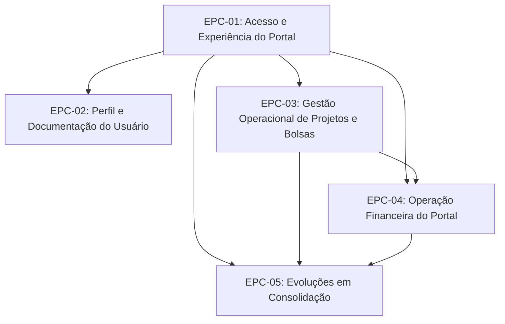

# Backlog de Épicos - Portal FAPES

> **Documento depreciado.** Migrado para [products/portal-coordenador/backlog.md](../../products/portal-coordenador/backlog.md). As features em `features/` tambem migraram para [products/portal-coordenador/features/](../../products/portal-coordenador/features/).

> Versão: 2026-04-14

| ID | Título | Detalhes | Bounded Context | Status |
| --- | --- | --- | --- | --- |
| EPC-01 | Acesso e Experiência do Portal | [EP-01-autenticacao-acesso-cidadao.md](./features/EP-01-autenticacao-acesso-cidadao.md) [EP-02-shell-portal-contexto-projeto.md](./features/EP-02-shell-portal-contexto-projeto.md) [EP-03-pagina-inicial-portal.md](./features/EP-03-pagina-inicial-portal.md) | Identidade e Acesso / Portal FAPES | Partial |
| EPC-02 | Perfil e Documentação do Usuário | [EP-04-gestao-perfil-usuario.md](./features/EP-04-gestao-perfil-usuario.md) [EP-05-gestao-documentos-usuario.md](./features/EP-05-gestao-documentos-usuario.md) | Portal FAPES (Perfil e Documentos) | Done |
| EPC-03 | Gestão Operacional de Projetos e Bolsas | [EP-06-meu-projeto.md](./features/EP-06-meu-projeto.md) [EP-07-minha-equipe-acompanhamento-bolsas.md](./features/EP-07-minha-equipe-acompanhamento-bolsas.md) [EP-08-cadastro-edicao-bolsista.md](./features/EP-08-cadastro-edicao-bolsista.md) | Portal FAPES (Projetos, Equipe e Alocação) | Done |
| EPC-04 | Operação Financeira do Portal | [EP-09-pagamentos-bolsa.md](./features/EP-09-pagamentos-bolsa.md) [EP-10-remanejamento-bolsas.md](./features/EP-10-remanejamento-bolsas.md) [EP-11-prestacao-financeira.md](./features/EP-11-prestacao-financeira.md) | Pagamentos e Gestão Financeira | Partial |
| EPC-05 | Evoluções em Consolidação | [EP-12-aditivo-bolsa.md](./features/EP-12-aditivo-bolsa.md) | Portal FAPES (Aditivos) | Prototype |

## Grafo de Dependências

Dependências inferidas a partir do fluxo funcional atual do frontend e do relacionamento entre as features vinculadas a cada épico.

## Regra de agrupamento

- Cada linha representa um épico de produto.
- O campo `Detalhes` relaciona diretamente os arquivos de feature que pertencem ao épico.
- Os arquivos em `docs/features/` permanecem como o nível funcional detalhado do backlog.
