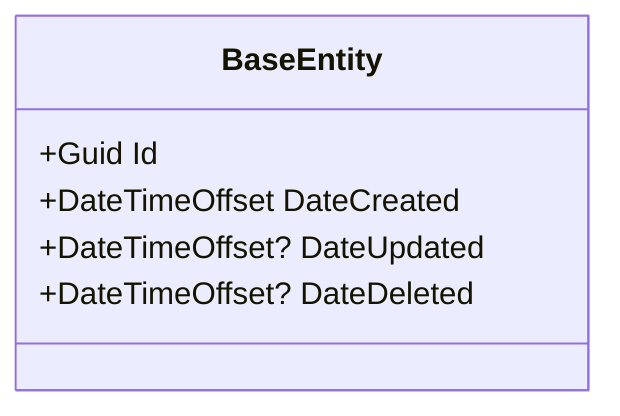
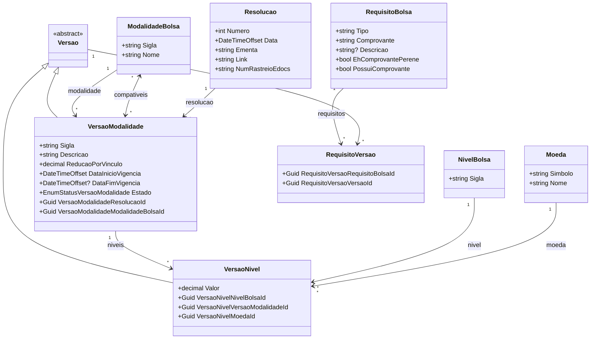
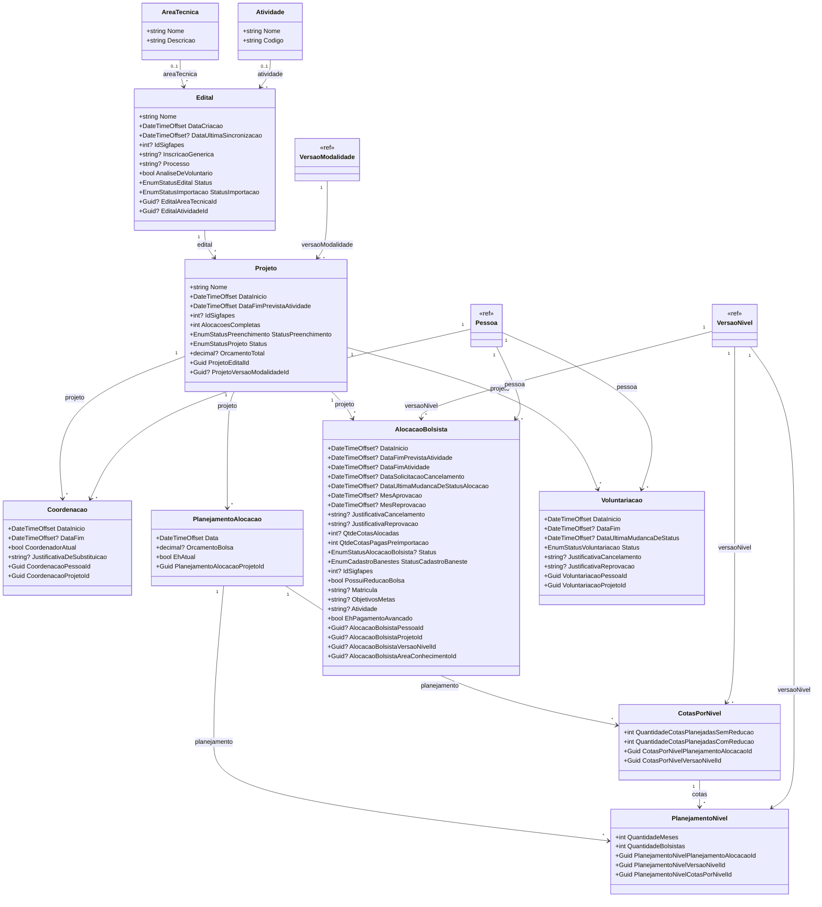
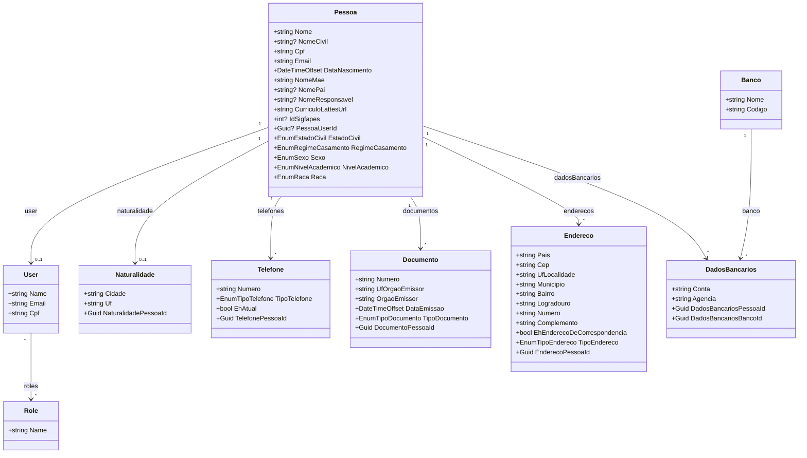
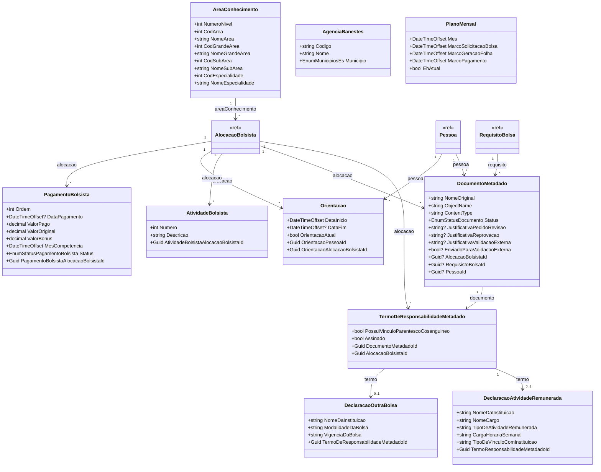

# Entidades de Dominio — ConectaFapes

> **Documento depreciado.** As entidades de dominio pertencem aos modulos backend, nao ao produto frontend. Consulte o `modelo-estrutural.md` de cada modulo:
> - [M001 — Modalidades de Bolsa](../../implementation/modules/M001-modalidade-bolsa/modelo-estrutural.md)
> - [M003 — Gerenciar Editais](../../implementation/modules/M003-gestao-projetos-captados/modelo-estrutural.md)
> - [M004 — Pagamento Bolsistas](../../implementation/modules/M004-pagamento-bolsista/modelo-estrutural.md)
> - [M008 — Cadastros Corporativos](../../implementation/modules/M008-cadastros-corporativos/modelo-estrutural.md)
> - [M009 — Gestao Bolsista](../../implementation/modules/M009-gestao-bolsista/modelo-estrutural.md)

## Indice

- [1. Visao Geral](#1-visao-geral)
- [2. Classe Base — BaseEntity](#2-classe-base--baseentity)
- [3. Cadastro de Modalidades e Bolsas](#3-cadastro-de-modalidades-e-bolsas)
- [4. Editais e Projetos](#4-editais-e-projetos)
- [5. Pessoas e Dados Pessoais](#5-pessoas-e-dados-pessoais)
- [6. Portal e Operacoes](#6-portal-e-operacoes)
- [7. Enumeracoes Referenciadas](#7-enumeracoes-referenciadas)

---

## 1. Visao Geral

As entidades de dominio do sistema **ConectaFapes — Pagamento Bolsistas** estao organizadas em tres modulos principais dentro de `ConectaFapes.Domain/Entities`:

- **CadastroModalidadesBolsas** — Modalidades de bolsa, versoes, niveis e resolucoes.
- **ImportacaoEditais** — Editais, projetos, alocacoes de bolsistas, coordenacoes e planejamentos.
- **PortalFapes** — Pessoas, dados pessoais, pagamentos, documentos e operacoes do portal.

Todas as entidades herdam de `BaseEntity`, que fornece campos de identificacao e auditoria.

### Diagrama de Visao Geral

```mermaid
classDiagram
    direction TB

    BaseEntity <|-- ModalidadeBolsa
    BaseEntity <|-- Moeda
    BaseEntity <|-- NivelBolsa
    BaseEntity <|-- RequisitoBolsa
    BaseEntity <|-- RequisitoVersao
    BaseEntity <|-- Resolucao
    BaseEntity <|-- Versao
    Versao <|-- VersaoModalidade
    Versao <|-- VersaoNivel

    BaseEntity <|-- Edital
    BaseEntity <|-- AreaTecnica
    BaseEntity <|-- Atividade
    BaseEntity <|-- Projeto
    BaseEntity <|-- Coordenacao
    BaseEntity <|-- PlanejamentoAlocacao
    BaseEntity <|-- PlanejamentoNivel
    BaseEntity <|-- CotasPorNivel
    BaseEntity <|-- AlocacaoBolsista
    BaseEntity <|-- Voluntariacao

    BaseEntity <|-- Pessoa
    BaseEntity <|-- User
    BaseEntity <|-- Role
    BaseEntity <|-- Naturalidade
    BaseEntity <|-- Telefone
    BaseEntity <|-- Documento
    BaseEntity <|-- Endereco
    BaseEntity <|-- DadosBancarios
    BaseEntity <|-- Banco

    BaseEntity <|-- PagamentoBolsista
    BaseEntity <|-- Orientacao
    BaseEntity <|-- AtividadeBolsista
    BaseEntity <|-- DocumentoMetadado
    BaseEntity <|-- TermoDeResponsabilidadeMetadado
    BaseEntity <|-- DeclaracaoAtividadeRemunerada
    BaseEntity <|-- DeclaracaoOutraBolsa
    BaseEntity <|-- AreaConhecimento
    BaseEntity <|-- AgenciaBanestes
    BaseEntity <|-- PlanoMensal

    ModalidadeBolsa "1" --> "*" VersaoModalidade
    Resolucao "1" --> "*" VersaoModalidade
    VersaoModalidade "1" --> "*" VersaoNivel
    NivelBolsa "1" --> "*" VersaoNivel
    Moeda "1" --> "*" VersaoNivel
    RequisitoBolsa "1" --> "*" RequisitoVersao
    Versao "1" --> "*" RequisitoVersao

    AreaTecnica "1" --> "*" Edital
    Atividade "1" --> "*" Edital
    Edital "1" --> "*" Projeto
    VersaoModalidade "1" --> "*" Projeto
    Projeto "1" --> "*" Coordenacao
    Projeto "1" --> "*" PlanejamentoAlocacao
    Projeto "1" --> "*" AlocacaoBolsista
    Projeto "1" --> "*" Voluntariacao
    PlanejamentoAlocacao "1" --> "*" PlanejamentoNivel
    PlanejamentoAlocacao "1" --> "*" CotasPorNivel
    CotasPorNivel "1" --> "*" PlanejamentoNivel
    VersaoNivel "1" --> "*" AlocacaoBolsista

    Pessoa "1" --> "0..1" User
    Pessoa "1" --> "0..1" Naturalidade
    Pessoa "1" --> "*" Telefone
    Pessoa "1" --> "*" Documento
    Pessoa "1" --> "*" Endereco
    Pessoa "1" --> "*" DadosBancarios
    Banco "1" --> "*" DadosBancarios
    User "*" --> "*" Role

    Pessoa "1" --> "*" AlocacaoBolsista
    Pessoa "1" --> "*" Coordenacao
    Pessoa "1" --> "*" Orientacao
    Pessoa "1" --> "*" Voluntariacao
    AlocacaoBolsista "1" --> "*" PagamentoBolsista
    AlocacaoBolsista "1" --> "*" Orientacao
    AlocacaoBolsista "1" --> "*" AtividadeBolsista
    AlocacaoBolsista "1" --> "*" DocumentoMetadado
    AreaConhecimento "1" --> "*" AlocacaoBolsista
    DocumentoMetadado "1" --> "0..1" TermoDeResponsabilidadeMetadado
    TermoDeResponsabilidadeMetadado "1" --> "0..1" DeclaracaoOutraBolsa
    TermoDeResponsabilidadeMetadado "1" --> "0..1" DeclaracaoAtividadeRemunerada
```

---

## 2. Classe Base — BaseEntity

Todas as entidades herdam de `BaseEntity` (`ConectaFapes.Common.Domain.BaseEntities`), que fornece os seguintes campos:

| Propriedade | Tipo | Nullable | Descricao |
|---|---|---|---|
| Id | Guid | Nao | Identificador unico da entidade |
| DateCreated | DateTimeOffset | Nao | Data de criacao do registro |
| DateUpdated | DateTimeOffset? | Sim | Data da ultima atualizacao |
| DateDeleted | DateTimeOffset? | Sim | Data de exclusao logica (soft delete) |

---

## 3. Cadastro de Modalidades e Bolsas

### 3.1 Diagrama de Classes

### 3.2 Dicionario de Dados

> Todas as entidades herdam as propriedades de [BaseEntity](#2-classe-base--baseentity).

#### ModalidadeBolsa

| Propriedade | Tipo | Nullable | Descricao |
|---|---|---|---|
| Sigla | string | Nao | Sigla da modalidade (max 10 caracteres) |
| Nome | string | Nao | Nome da modalidade (max 100 caracteres) |

#### Moeda

| Propriedade | Tipo | Nullable | Descricao |
|---|---|---|---|
| Simbolo | string | Nao | Simbolo da moeda (max 3 caracteres) |
| Nome | string | Nao | Nome da moeda (max 20 caracteres) |

#### NivelBolsa

| Propriedade | Tipo | Nullable | Descricao |
|---|---|---|---|
| Sigla | string | Nao | Sigla do nivel da bolsa (max 15 caracteres) |

#### RequisitoBolsa

| Propriedade | Tipo | Nullable | Descricao |
|---|---|---|---|
| Tipo | string | Nao | Tipo do requisito |
| Comprovante | string | Nao | Nome do comprovante exigido |
| Descricao | string? | Sim | Descricao detalhada do requisito |
| EhComprovantePerene | bool | Nao | Indica se o comprovante e perene (default: false) |
| PossuiComprovante | bool | Nao | Indica se possui comprovante associado (default: false) |

#### RequisitoVersao

| Propriedade | Tipo | Nullable | Descricao |
|---|---|---|---|
| RequisitoVersaoRequisitoBolsaId | Guid | Nao | FK para RequisitoBolsa |
| RequisitoVersaoVersaoId | Guid | Nao | FK para Versao |

#### Resolucao

| Propriedade | Tipo | Nullable | Descricao |
|---|---|---|---|
| Numero | int | Nao | Numero da resolucao |
| Data | DateTimeOffset | Nao | Data da resolucao |
| Ementa | string | Nao | Ementa da resolucao (max 500 caracteres) |
| Link | string | Nao | Link para o documento da resolucao |
| NumRastreioEdocs | string | Nao | Numero de rastreio no E-Docs |

#### Versao (abstract)

Classe abstrata base para VersaoModalidade e VersaoNivel. Alem dos campos herdados de BaseEntity, concentra a colecao `RequisitoVersoes`, utilizada para associar requisitos a qualquer tipo de versao.

#### VersaoModalidade

| Propriedade | Tipo | Nullable | Descricao |
|---|---|---|---|
| Sigla | string | Nao | Sigla da versao (max 20 caracteres) |
| Descricao | string | Nao | Descricao da versao (max 500 caracteres) |
| ReducaoPorVinculo | decimal | Nao | Percentual de reducao por vinculo (0.0001 a 1) |
| DataInicioVigencia | DateTimeOffset | Nao | Data de inicio da vigencia |
| DataFimVigencia | DateTimeOffset? | Sim | Data de fim da vigencia |
| Estado | EnumStatusVersaoModalidade | Nao | Status da versao da modalidade |
| VersaoModalidadeResolucaoId | Guid | Nao | FK para Resolucao |
| VersaoModalidadeModalidadeBolsaId | Guid | Nao | FK para ModalidadeBolsa |

#### VersaoNivel

| Propriedade | Tipo | Nullable | Descricao |
|---|---|---|---|
| Valor | decimal | Nao | Valor monetario do nivel da bolsa |
| VersaoNivelNivelBolsaId | Guid | Nao | FK para NivelBolsa |
| VersaoNivelVersaoModalidadeId | Guid | Nao | FK para VersaoModalidade |
| VersaoNivelMoedaId | Guid | Nao | FK para Moeda |

---

## 4. Editais e Projetos

### 4.1 Diagrama de Classes

### 4.2 Dicionario de Dados

> Todas as entidades herdam as propriedades de [BaseEntity](#2-classe-base--baseentity).

#### AreaTecnica

| Propriedade | Tipo | Nullable | Descricao |
|---|---|---|---|
| Nome | string | Nao | Nome da area tecnica |
| Descricao | string | Nao | Descricao da area tecnica |

#### Atividade

| Propriedade | Tipo | Nullable | Descricao |
|---|---|---|---|
| Nome | string | Nao | Nome da atividade |
| Codigo | string | Nao | Codigo identificador da atividade |

#### Edital

| Propriedade | Tipo | Nullable | Descricao |
|---|---|---|---|
| Nome | string | Nao | Nome do edital |
| DataCriacao | DateTimeOffset | Nao | Data de criacao do edital |
| DataUltimaSincronizacao | DateTimeOffset? | Sim | Data da ultima sincronizacao com Sigfapes |
| IdSigfapes | int? | Sim | Identificador no sistema Sigfapes |
| InscricaoGenerica | string? | Sim | Inscricao generica do edital |
| Processo | string? | Sim | Numero do processo |
| AnaliseDeVoluntario | bool | Nao | Indica se o edital aceita analise de voluntario (default: false) |
| Status | EnumStatusEdital | Nao | Status do edital (default: ATIVO) |
| StatusImportacao | EnumStatusImportacao | Nao | Status de importacao (default: NAOIMPORTAR) |
| EditalAreaTecnicaId | Guid? | Sim | FK para AreaTecnica |
| EditalAtividadeId | Guid? | Sim | FK para Atividade |

#### Projeto

| Propriedade | Tipo | Nullable | Descricao |
|---|---|---|---|
| Nome | string | Nao | Nome do projeto |
| DataInicio | DateTimeOffset | Nao | Data de inicio do projeto |
| DataFimPrevistaAtividade | DateTimeOffset | Nao | Data prevista para fim das atividades |
| IdSigfapes | int? | Sim | Identificador no sistema Sigfapes |
| AlocacoesCompletas | int | Nao | Quantidade de alocacoes completas (default: 0) |
| StatusPreenchimento | EnumStatusPreenchimento | Nao | Status de preenchimento (default: INCOMPLETO) |
| Status | EnumStatusProjeto | Nao | Status do projeto |
| OrcamentoTotal | decimal? | Sim | Orcamento total do projeto |
| ProjetoEditalId | Guid | Nao | FK para Edital |
| ProjetoVersaoModalidadeId | Guid? | Sim | FK para VersaoModalidade |

#### Coordenacao

| Propriedade | Tipo | Nullable | Descricao |
|---|---|---|---|
| DataInicio | DateTimeOffset | Nao | Data de inicio da coordenacao |
| DataFim | DateTimeOffset? | Sim | Data de fim da coordenacao |
| CoordenadorAtual | bool | Nao | Indica se e o coordenador atual (default: true) |
| JustificativaDeSubstituicao | string? | Sim | Justificativa para substituicao do coordenador |
| CoordenacaoPessoaId | Guid | Nao | FK para Pessoa |
| CoordenacaoProjetoId | Guid | Nao | FK para Projeto |

#### PlanejamentoAlocacao

| Propriedade | Tipo | Nullable | Descricao |
|---|---|---|---|
| Data | DateTimeOffset | Nao | Data do planejamento |
| OrcamentoBolsa | decimal? | Sim | Orcamento destinado a bolsas |
| EhAtual | bool | Nao | Indica se e o planejamento atual |
| PlanejamentoAlocacaoProjetoId | Guid | Nao | FK para Projeto |

#### PlanejamentoNivel

| Propriedade | Tipo | Nullable | Descricao |
|---|---|---|---|
| QuantidadeMeses | int | Nao | Quantidade de meses planejados |
| QuantidadeBolsistas | int | Nao | Quantidade de bolsistas planejados |
| PlanejamentoNivelPlanejamentoAlocacaoId | Guid | Nao | FK para PlanejamentoAlocacao |
| PlanejamentoNivelVersaoNivelId | Guid | Nao | FK para VersaoNivel |
| PlanejamentoNivelCotasPorNivelId | Guid | Nao | FK para CotasPorNivel |

#### CotasPorNivel

| Propriedade | Tipo | Nullable | Descricao |
|---|---|---|---|
| QuantidadeCotasPlanejadasSemReducao | int | Nao | Quantidade de cotas planejadas sem reducao |
| QuantidadeCotasPlanejadasComReducao | int | Nao | Quantidade de cotas planejadas com reducao |
| CotasPorNivelPlanejamentoAlocacaoId | Guid | Nao | FK para PlanejamentoAlocacao |
| CotasPorNivelVersaoNivelId | Guid | Nao | FK para VersaoNivel |

#### AlocacaoBolsista

| Propriedade | Tipo | Nullable | Descricao |
|---|---|---|---|
| DataInicio | DateTimeOffset? | Sim | Data de inicio da alocacao |
| DataFimPrevistaAtividade | DateTimeOffset? | Sim | Data prevista para fim da atividade |
| DataFimAtividade | DateTimeOffset? | Sim | Data efetiva de fim da atividade |
| DataSolicitacaoCancelamento | DateTimeOffset? | Sim | Data da solicitacao de cancelamento |
| DataUltimaMudancaDeStatusAlocacao | DateTimeOffset? | Sim | Data da ultima mudanca de status |
| MesAprovacao | DateTimeOffset? | Sim | Mes de aprovacao da alocacao |
| MesReprovacao | DateTimeOffset? | Sim | Mes de reprovacao da alocacao |
| JustificativaCancelamento | string? | Sim | Justificativa para cancelamento |
| JustificativaReprovacao | string? | Sim | Justificativa para reprovacao |
| QtdeCotasAlocadas | int? | Sim | Quantidade de cotas alocadas |
| QtdeCotasPagasPreImportacao | int | Nao | Quantidade de cotas pagas antes da importacao (default: 0) |
| Status | EnumStatusAlocacaoBolsista? | Sim | Status da alocacao do bolsista |
| StatusCadastroBaneste | EnumCadastroBanestes | Nao | Status do cadastro no Banestes (default: PENDENTE) |
| IdSigfapes | int? | Sim | Identificador no sistema Sigfapes |
| PossuiReducaoBolsa | bool | Nao | Indica se possui reducao na bolsa (default: false) |
| Matricula | string? | Sim | Matricula do bolsista (indice unico na configuracao de persistencia) |
| ObjetivosMetas | string? | Sim | Objetivos e metas do bolsista |
| Atividade | string? | Sim | Descricao da atividade do bolsista |
| EhPagamentoAvancado | bool | Nao | Indica se e pagamento avancado (default: false) |
| AlocacaoBolsistaPessoaId | Guid? | Sim | FK opcional para Pessoa |
| AlocacaoBolsistaProjetoId | Guid? | Sim | FK opcional para Projeto |
| AlocacaoBolsistaVersaoNivelId | Guid? | Sim | FK opcional para VersaoNivel |
| AlocacaoBolsistaAreaConhecimentoId | Guid? | Sim | FK opcional para AreaConhecimento |

#### Voluntariacao

| Propriedade | Tipo | Nullable | Descricao |
|---|---|---|---|
| DataInicio | DateTimeOffset | Nao | Data de inicio da voluntariacao |
| DataFim | DateTimeOffset? | Sim | Data de fim da voluntariacao |
| DataUltimaMudancaDeStatus | DateTimeOffset? | Sim | Data da ultima mudanca de status |
| Status | EnumStatusVoluntariacao | Nao | Status da voluntariacao |
| JustificativaCancelamento | string? | Sim | Justificativa para cancelamento |
| JustificativaReprovacao | string? | Sim | Justificativa para reprovacao |
| VoluntariacaoPessoaId | Guid | Nao | FK para Pessoa |
| VoluntariacaoProjetoId | Guid | Nao | FK para Projeto |

---

## 5. Pessoas e Dados Pessoais

### 5.1 Diagrama de Classes

### 5.2 Dicionario de Dados

> Todas as entidades herdam as propriedades de [BaseEntity](#2-classe-base--baseentity).

#### Pessoa

| Propriedade | Tipo | Nullable | Descricao |
|---|---|---|---|
| Nome | string | Nao | Nome social da pessoa |
| NomeCivil | string? | Sim | Nome civil da pessoa |
| Cpf | string | Nao | CPF da pessoa |
| Email | string | Nao | Email da pessoa |
| DataNascimento | DateTimeOffset | Nao | Data de nascimento |
| NomeMae | string | Nao | Nome da mae |
| NomePai | string? | Sim | Nome do pai |
| NomeResponsavel | string? | Sim | Nome do responsavel (caso menor de idade) |
| CurriculoLattesUrl | string | Nao | URL do curriculo Lattes |
| IdSigfapes | int? | Sim | Identificador no sistema Sigfapes |
| PessoaUserId | Guid? | Sim | FK para User (default: Guid.Empty) |
| EstadoCivil | EnumEstadoCivil | Nao | Estado civil |
| RegimeCasamento | EnumRegimeCasamento | Nao | Regime de casamento |
| Sexo | EnumSexo | Nao | Sexo |
| NivelAcademico | EnumNivelAcademico | Nao | Nivel academico |
| Raca | EnumRaca | Nao | Raca/cor |

#### User

| Propriedade | Tipo | Nullable | Descricao |
|---|---|---|---|
| Name | string | Nao | Nome do usuario |
| Email | string | Nao | Email do usuario |
| Cpf | string | Nao | CPF do usuario |

#### Role

| Propriedade | Tipo | Nullable | Descricao |
|---|---|---|---|
| Name | string | Nao | Nome do perfil de acesso |

#### Naturalidade

| Propriedade | Tipo | Nullable | Descricao |
|---|---|---|---|
| Cidade | string | Nao | Cidade de nascimento |
| Uf | string | Nao | UF de nascimento |
| NaturalidadePessoaId | Guid | Nao | FK para Pessoa (relacao 1:1) |

#### Telefone

| Propriedade | Tipo | Nullable | Descricao |
|---|---|---|---|
| Numero | string | Nao | Numero do telefone |
| TipoTelefone | EnumTipoTelefone | Nao | Tipo do telefone |
| EhAtual | bool | Nao | Indica se e o telefone atual |
| TelefonePessoaId | Guid | Nao | FK para Pessoa |

#### Documento

| Propriedade | Tipo | Nullable | Descricao |
|---|---|---|---|
| Numero | string | Nao | Numero do documento |
| UfOrgaoEmissor | string | Nao | UF do orgao emissor |
| OrgaoEmissor | string | Nao | Nome do orgao emissor |
| DataEmissao | DateTimeOffset | Nao | Data de emissao do documento |
| TipoDocumento | EnumTipoDocumento | Nao | Tipo do documento |
| DocumentoPessoaId | Guid | Nao | FK para Pessoa |

#### Endereco

| Propriedade | Tipo | Nullable | Descricao |
|---|---|---|---|
| Pais | string | Nao | Pais |
| Cep | string | Nao | CEP |
| UfLocalidade | string | Nao | UF da localidade |
| Municipio | string | Nao | Municipio |
| Bairro | string | Nao | Bairro |
| Logradouro | string | Nao | Logradouro |
| Numero | string | Nao | Numero do endereco |
| Complemento | string | Nao | Complemento |
| EhEnderecoDeCorrespondencia | bool | Nao | Indica se e endereco de correspondencia |
| TipoEndereco | EnumTipoEndereco | Nao | Tipo do endereco |
| EnderecoPessoaId | Guid | Nao | FK para Pessoa |

#### DadosBancarios

| Propriedade | Tipo | Nullable | Descricao |
|---|---|---|---|
| Conta | string | Nao | Numero da conta bancaria |
| Agencia | string | Nao | Numero da agencia |
| DadosBancariosPessoaId | Guid | Nao | FK para Pessoa |
| DadosBancariosBancoId | Guid | Nao | FK para Banco |

#### Banco

| Propriedade | Tipo | Nullable | Descricao |
|---|---|---|---|
| Nome | string | Nao | Nome do banco |
| Codigo | string | Nao | Codigo do banco |

---

## 6. Portal e Operacoes

### 6.1 Diagrama de Classes

### 6.2 Dicionario de Dados

> Todas as entidades herdam as propriedades de [BaseEntity](#2-classe-base--baseentity).

#### PagamentoBolsista

| Propriedade | Tipo | Nullable | Descricao |
|---|---|---|---|
| Ordem | int | Nao | Numero de ordem do pagamento |
| DataPagamento | DateTimeOffset? | Sim | Data em que o pagamento foi efetuado |
| ValorPago | decimal | Nao | Valor efetivamente pago (precision 19,2) |
| ValorOriginal | decimal | Nao | Valor original da bolsa (precision 19,2; default: 0) |
| ValorBonus | decimal | Nao | Valor de bonus (precision 19,2; default: 0) |
| MesCompetencia | DateTimeOffset | Nao | Mes de competencia do pagamento |
| Status | EnumStatusPagamentoBolsista | Nao | Status do pagamento |
| PagamentoBolsistaAlocacaoBolsistaId | Guid | Nao | FK para AlocacaoBolsista |

#### Orientacao

| Propriedade | Tipo | Nullable | Descricao |
|---|---|---|---|
| DataInicio | DateTimeOffset | Nao | Data de inicio da orientacao |
| DataFim | DateTimeOffset? | Sim | Data de fim da orientacao |
| OrientacaoAtual | bool | Nao | Indica se e a orientacao atual (default: true) |
| OrientacaoPessoaId | Guid | Nao | FK para Pessoa (orientador) |
| OrientacaoAlocacaoBolsistaId | Guid | Nao | FK para AlocacaoBolsista |

#### AtividadeBolsista

| Propriedade | Tipo | Nullable | Descricao |
|---|---|---|---|
| Numero | int | Nao | Numero sequencial da atividade |
| Descricao | string | Nao | Descricao da atividade |
| AtividadeBolsistaAlocacaoBolsistaId | Guid | Nao | FK para AlocacaoBolsista |

> Observacao: a entidade e declarada como `AtividadeBolsista`, embora o arquivo fisico no projeto esteja nomeado como `PlanoDeAtividade.cs`.

#### DocumentoMetadado

| Propriedade | Tipo | Nullable | Descricao |
|---|---|---|---|
| NomeOriginal | string | Nao | Nome original do arquivo enviado (max 255 caracteres) |
| ObjectName | string | Nao | Nome do objeto no armazenamento (max 255 caracteres) |
| ContentType | string | Nao | Tipo MIME do arquivo |
| Status | EnumStatusDocumento | Nao | Status do documento |
| JustificativaPedidoRevisao | string? | Sim | Justificativa para pedido de revisao (max 1000 caracteres) |
| JustificativaReprovacao | string? | Sim | Justificativa para reprovacao (max 1000 caracteres) |
| JustificativaValidacaoExterna | string? | Sim | Justificativa da validacao externa |
| EnviadoParaValidacaoExterna | bool? | Sim | Indica se foi enviado para validacao externa (default: false) |
| AlocacaoBolsistaId | Guid? | Sim | FK para AlocacaoBolsista |
| RequisistoBolsaId | Guid? | Sim | FK para RequisitoBolsa |
| PessoaId | Guid? | Sim | FK para Pessoa |

#### TermoDeResponsabilidadeMetadado

| Propriedade | Tipo | Nullable | Descricao |
|---|---|---|---|
| PossuiVinculoParentescoCosanguineo | bool | Nao | Indica vinculo de parentesco consanguineo |
| Assinado | bool | Nao | Indica se o termo foi assinado |
| DocumentoMetadadoId | Guid | Nao | FK para DocumentoMetadado (relacao 1:1) |
| AlocacaoBolsistaId | Guid | Nao | FK para AlocacaoBolsista |

#### DeclaracaoAtividadeRemunerada

| Propriedade | Tipo | Nullable | Descricao |
|---|---|---|---|
| NomeDaInstituicao | string | Nao | Nome da instituicao onde exerce atividade |
| NomeCargo | string | Nao | Nome do cargo ocupado |
| TipoDeAtividadeRemunerada | string | Nao | Tipo da atividade remunerada |
| CargaHorariaSemanal | string | Nao | Carga horaria semanal |
| TipoDeVinculoComInstituicao | string | Nao | Tipo de vinculo com a instituicao |
| TermoResponsabilidadeMetadadoId | Guid | Nao | FK para TermoDeResponsabilidadeMetadado |

#### DeclaracaoOutraBolsa

| Propriedade | Tipo | Nullable | Descricao |
|---|---|---|---|
| NomeDaInstituicao | string | Nao | Nome da instituicao concedente |
| ModalidadeDaBolsa | string | Nao | Modalidade da outra bolsa |
| VigenciaDaBolsa | string | Nao | Vigencia da outra bolsa |
| TermoDeResponsabilidadeMetadadoId | Guid | Nao | FK para TermoDeResponsabilidadeMetadado |

#### AreaConhecimento

| Propriedade | Tipo | Nullable | Descricao |
|---|---|---|---|
| NumeroNivel | int | Nao | Numero do nivel hierarquico |
| CodArea | int | Nao | Codigo da area de conhecimento |
| NomeArea | string | Nao | Nome da area de conhecimento |
| CodGrandeArea | int | Nao | Codigo da grande area |
| NomeGrandeArea | string | Nao | Nome da grande area |
| CodSubArea | int | Nao | Codigo da subarea |
| NomeSubArea | string | Nao | Nome da subarea |
| CodEspecialidade | int | Nao | Codigo da especialidade |
| NomeEspecialidade | string | Nao | Nome da especialidade |

#### AgenciaBanestes

| Propriedade | Tipo | Nullable | Descricao |
|---|---|---|---|
| Codigo | string | Nao | Codigo da agencia |
| Nome | string | Nao | Nome da agencia |
| Municipio | EnumMunicipiosEs | Nao | Municipio do Espirito Santo |

#### PlanoMensal

| Propriedade | Tipo | Nullable | Descricao |
|---|---|---|---|
| Mes | DateTimeOffset | Nao | Mes de referencia |
| MarcoSolicitacaoBolsa | DateTimeOffset | Nao | Data limite para solicitacao de bolsa |
| MarcoGeracaoFolha | DateTimeOffset | Nao | Data limite para geracao de folha |
| MarcoPagamento | DateTimeOffset | Nao | Data limite para pagamento |
| EhAtual | bool | Nao | Indica se e o plano mensal vigente |

---

## 7. Enumeracoes Referenciadas

Enumeracoes definidas em `ConectaFapes.Common.Domain.Enums`, com valores confirmados a partir da `ConectaFapes.Common.dll` referenciada pelo projeto.

| Enum | Entidade(s) | Valores Conhecidos |
|---|---|---|
| EnumStatusVersaoModalidade | VersaoModalidade | EM_EDICAO, ATIVA, INATIVA |
| EnumStatusAlocacaoBolsista | AlocacaoBolsista | EM_EDICAO, DOCUMENTACAO_PENDENTE, AGUARDANDO_ACEITES, PENDENTE_DE_AVALIACAO, EM_AVALIACAO, ATIVA, SUSPENSA, CANCELADA, FINALIZADA, INDEFINIDO, REPROVADA |
| EnumCadastroBanestes | AlocacaoBolsista | PENDENTE, ENVIADO, CADASTRADO, CANCELADO |
| EnumStatusEdital | Edital | ATIVO, INATIVO |
| EnumStatusImportacao | Edital | NAOIMPORTAR, AIMPORTAR, IMPORTADO |
| EnumStatusPreenchimento | Projeto | INCOMPLETO, COMPLETO |
| EnumStatusProjeto | Projeto | EM_ANDAMENTO, CANCELADO, SUBSTITUIDO, INDEFINIDO, FINALIZADO |
| EnumStatusPagamentoBolsista | PagamentoBolsista | ALOCADO, EM_FOLHA, ENVIADO, FALHA_AGENDAMENTO, AGENDADO, PAGO, PROGRAMADO, CANCELADO, PAGAMENTO_EXTERNO, SUSPENSAO_POR_SOLICITACAO |
| EnumStatusDocumento | DocumentoMetadado | NAO_ENVIADO, ENVIADO, EM_PROCESSAMENTO, PEDIDO_REVISAO, REPROVADO_IA, APROVADO_IA, PENDENTE_AVALIACAO, REPROVADO_MANUAL, APROVADO_MANUAL |
| EnumStatusVoluntariacao | Voluntariacao | AGUARDANDO_ACEITES, EM_AVALIACAO, ATIVA, CANCELADA, FINALIZADA, REJEITADA_VOLUNTARIO, REPROVADA_AREA_TECNICA |
| EnumTipoDocumento | Documento | CARTEIRAIDENTIDADE, CARTEIRATRABALHOPREVIDENCIASOCIAL, CARTEIRAHABILITACAO |
| EnumTipoEndereco | Endereco | RESIDENCIAL, PROFISSIONAL |
| EnumTipoTelefone | Telefone | RESIDENCIAL, PROFISSIONAL, PESSOAL |
| EnumEstadoCivil | Pessoa | SOLTEIRO, CASADO, SEPARADO, VIUVO, DIVORCIADO, OUTROS |
| EnumRegimeCasamento | Pessoa | NENHUM, COMUNHAOPARCIAL, COMUNHAOTOTAL, SEPARACAODEBENS |
| EnumSexo | Pessoa | NAO_INFORMADO, MASCULINO, FEMININO |
| EnumNivelAcademico | Pessoa | NAO_INFORMADO, ENSINO_FUNDAMENTAL, ENSINO_MEDIO, ENSINO_SUPERIOR, ESPECIALIZACAO, MESTRADO, DOUTORADO, POS_DOUTORADO |
| EnumRaca | Pessoa | NAO_DECLARADA, AMARELA, BRANCA, INDIGENA, PARDA, PRETA |
| EnumMunicipiosEs | AgenciaBanestes | AFONSO_CLAUDIO, AGUA_DOCE_DO_NORTE, AGUIA_BRANCA, ALEGRE, ALFREDO_CHAVES, ALTO_RIO_NOVO, ANCHIETA, APIACA, ARACRUZ, ATILIO_VIVACQUA, BAIXO_GUANDU, BARRA_DE_SAO_FRANCISCO, BOA_ESPERANCA, BOM_JESUS_DO_NORTE, BREJETUBA, CACHOEIRO_DE_ITAPEMIRIM, CARIACICA, CASTELO, COLATINA, CONCEICAO_DA_BARRA, CONCEICAO_DO_CASTELO, DIVINO_DE_SAO_LOURENCO, DOMINGOS_MARTINS, DORES_DO_RIO_PRETO, ECOPORANGA, FUNDAO, GOVERNADOR_LINDENBERG, GUACUI, GUARAPARI, IBATIBA, IBIRACU, IBITIRAMA, ICONHA, IRUPI, ITAGUACU, ITAPEMIRIM, ITARANA, IUNA, JAGUARE, JERONIMO_MONTEIRO, JOAO_NEIVA, LARANJA_DA_TERRA, LINHARES, MANTENOPOLIS, MARATAIZES, MARECHAL_FLORIANO, MARILANDIA, MIMOSO_DO_SUL, MONTANHA, MUCURICI, MUNIZ_FREIRE, MUQUI, NOVA_VENECIA, PANCAS, PEDRO_CANARIO, PINHEIROS, PIUMA, PONTO_BELO, PRESIDENTE_KENNEDY, RIO_BANANAL, RIO_NOVO_DO_SUL, SANTA_LEOPOLDINA, SANTA_MARIA_DE_JETIBA, SANTA_TERESA, SAO_DOMINGOS_DO_NORTE, SAO_GABRIEL_DA_PALHA, SAO_JOSE_DO_CALCADO, SAO_MATEUS, SAO_ROQUE_DO_CANAA, SERRA, SOORETAMA, VARGEM_ALTA, VENDA_NOVA_DO_IMIGRANTE, VIANA, VILA_PAVAO, VILA_VALERIO, VILA_VELHA, VITORIA |
