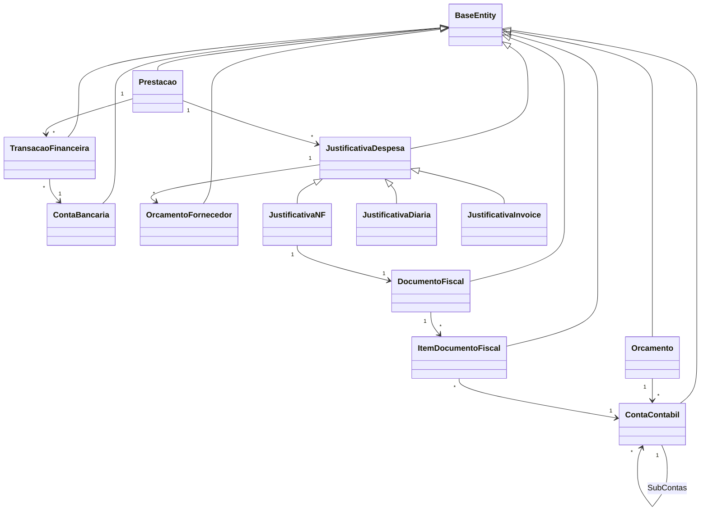
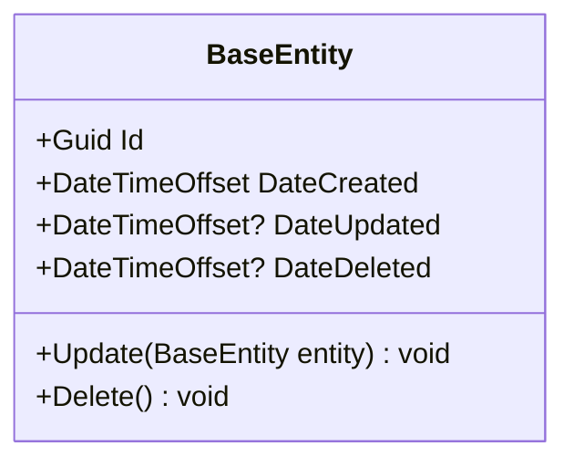
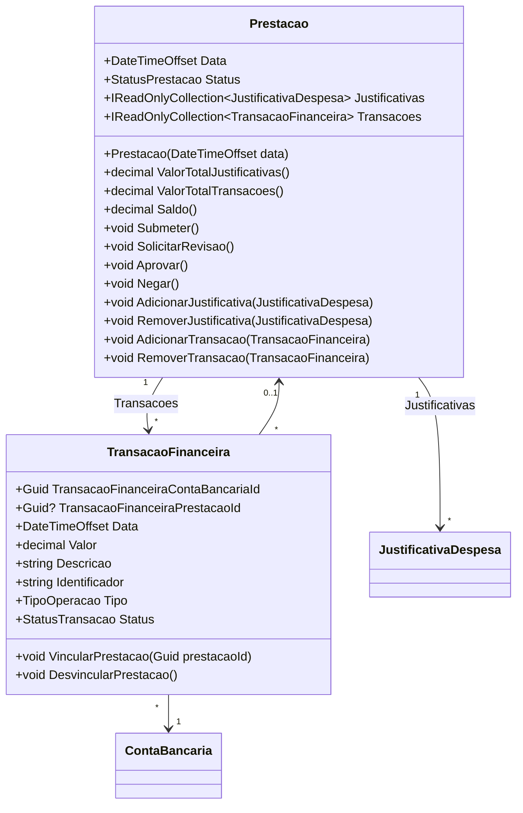
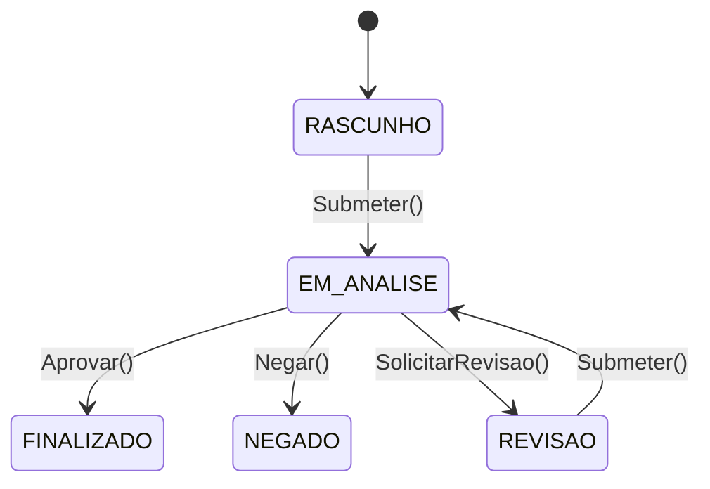
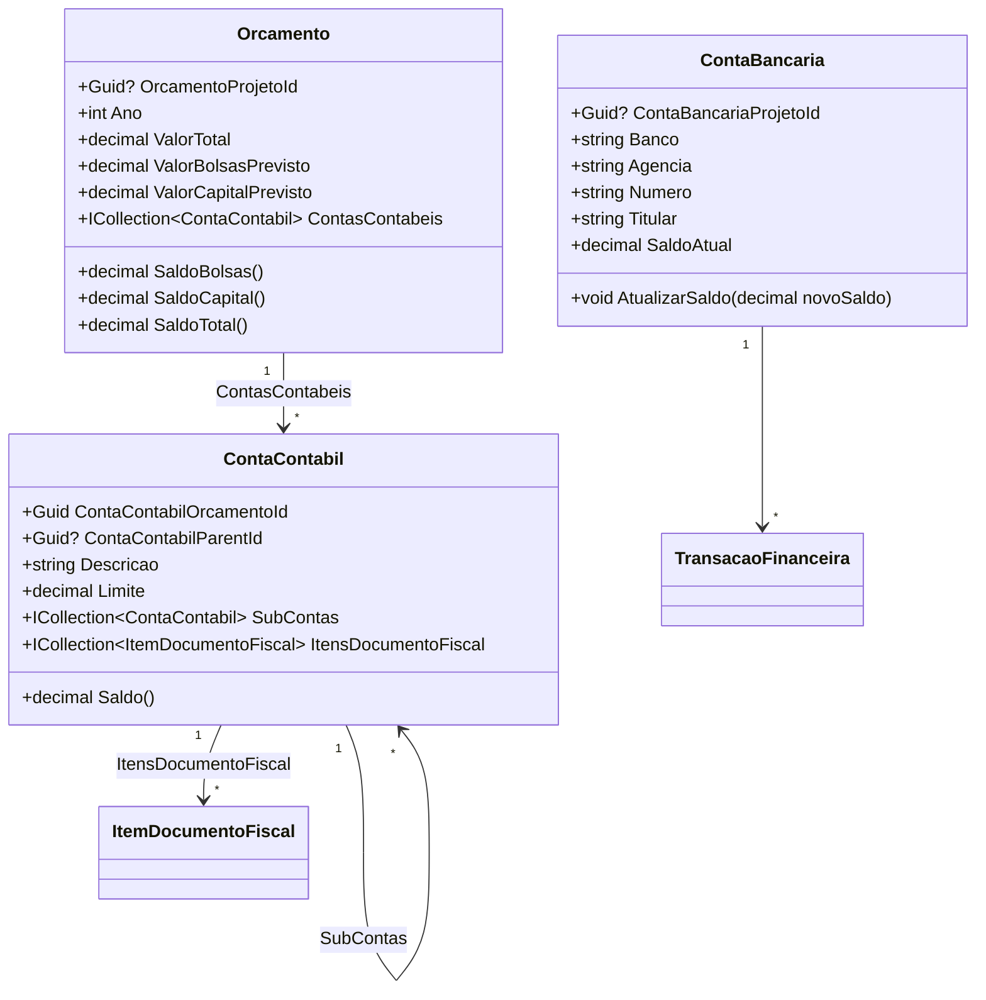
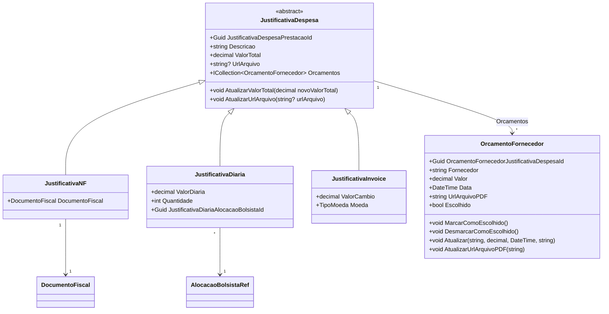
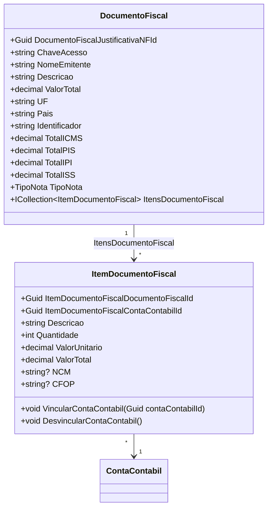

# Entidades de Dominio — ConectaFapes Prestacao de Contas

> **Documento depreciado.** A documentacao canonica das entidades de dominio migrou para [implementation/modules/M014-prestacao-contas/modelo-estrutural.md](../../implementation/modules/M014-prestacao-contas/modelo-estrutural.md). Entidades financeiras (ContaBancaria, Orcamento, ContaContabil, TransacaoFinanceira) pertencem conceitualmente a M016/M013.

## Indice

- [1. Visao Geral](#1-visao-geral)
- [2. Classe Base — BaseEntity](#2-classe-base--baseentity)
- [3. Prestacao e Transacoes](#3-prestacao-e-transacoes)
- [4. Financeiro](#4-financeiro)
- [5. Justificativas e Orcamentos de Fornecedor](#5-justificativas-e-orcamentos-de-fornecedor)
- [6. Documentos Fiscais](#6-documentos-fiscais)
- [7. Entidades de Referencia](#7-entidades-de-referencia)
- [8. Enumeracoes Referenciadas](#8-enumeracoes-referenciadas)

---

## 1. Visao Geral

As entidades de dominio do sistema **ConectaFapes** estao organizadas em 5 modulos principais dentro de `ConectaFapes.PrestacaoContas.Domain/Entities`:

- **PrestacaoContas** — Entidades do ciclo de prestacao de contas, transacoes financeiras, justificativas de despesa, documentos fiscais e orcamentos.
- **ImportacaoEditais** — Entidades de referencia mapeadas a views de banco de dados externo (ProjetoRef, AlocacaoBolsistaRef).

Todas as entidades herdam de `BaseEntity`, que fornece campos de identificacao e auditoria.

### Diagrama de Visao Geral

---

## 2. Classe Base — BaseEntity

Todas as entidades herdam de `BaseEntity` (`ConectaFapes.Common.Domain.BaseEntities`), que fornece os seguintes campos:

| Propriedade | Tipo | Nullable | Descricao |
|---|---|---|---|
| Id | Guid | Nao | Identificador unico da entidade |
| DateCreated | DateTimeOffset | Nao | Data de criacao do registro (default: DateTimeOffset.Now) |
| DateUpdated | DateTimeOffset? | Sim | Data da ultima atualizacao |
| DateDeleted | DateTimeOffset? | Sim | Data de exclusao logica (soft delete) |

O metodo `Update()` utiliza reflexao para copiar propriedades, excluindo Id e DateCreated. O metodo `Delete()` define DateDeleted para a data atual (soft delete).

---

## 3. Prestacao e Transacoes

### 3.1 Diagrama de Classes

### Maquina de Estados — Prestacao

### 3.2 Dicionario de Dados

> Todas as entidades herdam as propriedades de [BaseEntity](#2-classe-base--baseentity).

#### Prestacao

| Propriedade | Tipo | Nullable | Descricao |
|---|---|---|---|
| Data | DateTimeOffset | Nao | Data da prestacao de contas |
| Status | StatusPrestacao | Nao | Status atual (RASCUNHO, EM_ANALISE, REVISAO, FINALIZADO, NEGADO) |
| Justificativas | IReadOnlyCollection&lt;JustificativaDespesa&gt; | Nao | Colecao de justificativas de despesa vinculadas |
| Transacoes | IReadOnlyCollection&lt;TransacaoFinanceira&gt; | Nao | Colecao de transacoes financeiras vinculadas |

#### TransacaoFinanceira

| Propriedade | Tipo | Nullable | Descricao |
|---|---|---|---|
| TransacaoFinanceiraContaBancariaId | Guid | Nao | FK para ContaBancaria |
| TransacaoFinanceiraPrestacaoId | Guid? | Sim | FK para Prestacao (opcional — transacao pode estar desvinculada) |
| Data | DateTimeOffset | Nao | Data da transacao |
| Valor | decimal | Nao | Valor monetario da transacao |
| Descricao | string | Nao | Descricao da transacao |
| Identificador | string | Nao | Identificador unico da transacao |
| Tipo | TipoOperacao | Nao | Tipo da operacao (DEBITO ou CREDITO) |
| Status | StatusTransacao | Nao | Status derivado do status da Prestacao vinculada (propriedade calculada) |

---

## 4. Financeiro

### 4.1 Diagrama de Classes

### 4.2 Dicionario de Dados

> Todas as entidades herdam as propriedades de [BaseEntity](#2-classe-base--baseentity).

#### ContaBancaria

| Propriedade | Tipo | Nullable | Descricao |
|---|---|---|---|
| ContaBancariaProjetoId | Guid? | Sim | FK para ProjetoRef (referencia ao projeto via view externa) |
| Banco | string | Nao | Nome do banco |
| Agencia | string | Nao | Numero da agencia |
| Numero | string | Nao | Numero da conta |
| Titular | string | Nao | Nome do titular da conta |
| SaldoAtual | decimal | Nao | Saldo atual da conta |

#### Orcamento

| Propriedade | Tipo | Nullable | Descricao |
|---|---|---|---|
| OrcamentoProjetoId | Guid? | Sim | FK para ProjetoRef (referencia ao projeto via view externa) |
| Ano | int | Nao | Ano do orcamento |
| ValorTotal | decimal | Nao | Valor total do orcamento |
| ValorBolsasPrevisto | decimal | Nao | Valor previsto para bolsas |
| ValorCapitalPrevisto | decimal | Nao | Valor previsto para capital |
| ContasContabeis | ICollection&lt;ContaContabil&gt; | Nao | Contas contabeis vinculadas ao orcamento |

#### ContaContabil

| Propriedade | Tipo | Nullable | Descricao |
|---|---|---|---|
| ContaContabilOrcamentoId | Guid | Nao | FK para Orcamento |
| ContaContabilParentId | Guid? | Sim | FK para ContaContabil pai (auto-referencia hierarquica) |
| Descricao | string | Nao | Descricao da conta contabil |
| Limite | decimal | Nao | Limite de gasto da conta |
| SubContas | ICollection&lt;ContaContabil&gt; | Nao | Sub-contas filhas (hierarquia) |
| ItensDocumentoFiscal | ICollection&lt;ItemDocumentoFiscal&gt; | Nao | Itens de documento fiscal vinculados |

---

## 5. Justificativas e Orcamentos de Fornecedor

### 5.1 Diagrama de Classes

### 5.2 Dicionario de Dados

> Todas as entidades herdam as propriedades de [BaseEntity](#2-classe-base--baseentity).

#### JustificativaDespesa (classe abstrata)

| Propriedade | Tipo | Nullable | Descricao |
|---|---|---|---|
| JustificativaDespesaPrestacaoId | Guid | Nao | FK para Prestacao |
| Descricao | string | Nao | Descricao da justificativa de despesa |
| ValorTotal | decimal | Nao | Valor total da despesa justificada |
| UrlArquivo | string? | Sim | URL do arquivo comprovante (armazenado no MinIO) |
| Orcamentos | ICollection&lt;OrcamentoFornecedor&gt; | Nao | Orcamentos de fornecedor vinculados |

#### JustificativaNF

| Propriedade | Tipo | Nullable | Descricao |
|---|---|---|---|
| DocumentoFiscal | DocumentoFiscal | Nao | Documento fiscal vinculado (navegacao) |

> Herda todas as propriedades de JustificativaDespesa. Valor total inicializado como 0 (derivado do documento fiscal).

#### JustificativaDiaria

| Propriedade | Tipo | Nullable | Descricao |
|---|---|---|---|
| ValorDiaria | decimal | Nao | Valor de cada diaria (deve ser >= 0) |
| Quantidade | int | Nao | Quantidade de diarias (deve ser > 0) |
| JustificativaDiariaAlocacaoBolsistaId | Guid | Nao | FK para AlocacaoBolsistaRef (bolsista vinculado) |

> Herda todas as propriedades de JustificativaDespesa.

#### JustificativaInvoice

| Propriedade | Tipo | Nullable | Descricao |
|---|---|---|---|
| ValorCambio | decimal | Nao | Valor do cambio aplicado |
| Moeda | TipoMoeda | Nao | Tipo de moeda estrangeira (BRL, USD, EUR, GBP) |

> Herda todas as propriedades de JustificativaDespesa.

#### OrcamentoFornecedor

| Propriedade | Tipo | Nullable | Descricao |
|---|---|---|---|
| OrcamentoFornecedorJustificativaDespesaId | Guid | Nao | FK para JustificativaDespesa |
| Fornecedor | string | Nao | Nome do fornecedor |
| Valor | decimal | Nao | Valor do orcamento (deve ser >= 0) |
| Data | DateTime | Nao | Data do orcamento |
| UrlArquivoPDF | string | Nao | URL do PDF do orcamento (armazenado no MinIO) |
| Escolhido | bool | Nao | Indica se este orcamento foi selecionado como vencedor |

---

## 6. Documentos Fiscais

### 6.1 Diagrama de Classes

### 6.2 Dicionario de Dados

> Todas as entidades herdam as propriedades de [BaseEntity](#2-classe-base--baseentity).

#### DocumentoFiscal

| Propriedade | Tipo | Nullable | Descricao |
|---|---|---|---|
| DocumentoFiscalJustificativaNFId | Guid | Nao | FK para JustificativaNF |
| ChaveAcesso | string | Nao | Chave de acesso da NF-e (44 digitos) |
| NomeEmitente | string | Nao | Nome do emitente da nota fiscal |
| Descricao | string | Nao | Descricao da nota fiscal |
| ValorTotal | decimal | Nao | Valor total da nota (deve ser >= 0) |
| UF | string | Nao | Unidade federativa do emitente |
| Pais | string | Nao | Pais do emitente |
| Identificador | string | Nao | Identificador unico do documento |
| TotalICMS | decimal | Nao | Total de ICMS (deve ser >= 0) |
| TotalPIS | decimal | Nao | Total de PIS (deve ser >= 0) |
| TotalIPI | decimal | Nao | Total de IPI (deve ser >= 0) |
| TotalISS | decimal | Nao | Total de ISS (deve ser >= 0) |
| TipoNota | TipoNota | Nao | Tipo da nota fiscal (PRODUTO ou SERVICO) |
| ItensDocumentoFiscal | ICollection&lt;ItemDocumentoFiscal&gt; | Nao | Itens da nota fiscal |

#### ItemDocumentoFiscal

| Propriedade | Tipo | Nullable | Descricao |
|---|---|---|---|
| ItemDocumentoFiscalDocumentoFiscalId | Guid | Nao | FK para DocumentoFiscal |
| ItemDocumentoFiscalContaContabilId | Guid | Nao | FK para ContaContabil (conta contabil vinculada) |
| Descricao | string | Nao | Descricao do item |
| Quantidade | int | Nao | Quantidade do item |
| ValorUnitario | decimal | Nao | Valor unitario do item |
| ValorTotal | decimal | Nao | Valor total do item |
| NCM | string? | Sim | Codigo NCM (Nomenclatura Comum do Mercosul) |
| CFOP | string? | Sim | Codigo CFOP (Codigo Fiscal de Operacoes e Prestacoes) |

---

## 7. Entidades de Referencia

Entidades mapeadas a views de banco de dados externo (sistema de Importacao de Editais). Nao possuem heranca de `BaseEntity`.

**Namespace:** `ConectaFapes.PrestacaoContas.Domain.Entities.ImportacaoEditais`

#### ProjetoRef

| Propriedade | Tipo | Nullable | Descricao |
|---|---|---|---|
| Id | Guid | Nao | Identificador do projeto (mapeado a view externa) |

#### AlocacaoBolsistaRef

| Propriedade | Tipo | Nullable | Descricao |
|---|---|---|---|
| Id | Guid | Nao | Identificador da alocacao de bolsista (mapeado a view externa) |

---

## 8. Enumeracoes Referenciadas

Enumeracoes definidas em `ConectaFapes.PrestacaoContas.Domain.Enums`.

| Enum | Entidade(s) | Valores |
|---|---|---|
| StatusPrestacao | Prestacao | RASCUNHO (1), EM_ANALISE (2), REVISAO (3), FINALIZADO (4), NEGADO (5) |
| StatusTransacao | TransacaoFinanceira | PENDENTE (1), EM_RASCUNHO (2), EM_ANALISE (3), EM_REVISAO (4), APROVADA (5), REJEITADA (6) |
| TipoOperacao | TransacaoFinanceira | DEBITO (1), CREDITO (2) |
| TipoNota | DocumentoFiscal | PRODUTO (1), SERVICO (2) |
| TipoDocumentoFiscal | DocumentoFiscal | NFE_PRODUTO (1), NFSE_SERVICO (2) |
| TipoMoeda | JustificativaInvoice | BRL, USD, EUR, GBP |
| TipoJustificativa | JustificativaDespesa | NF, INVOICE, DIARIA |
| TipoArquivoNfe | Processo de extracao | XML (1), PDF (2), Imagem (3) |
