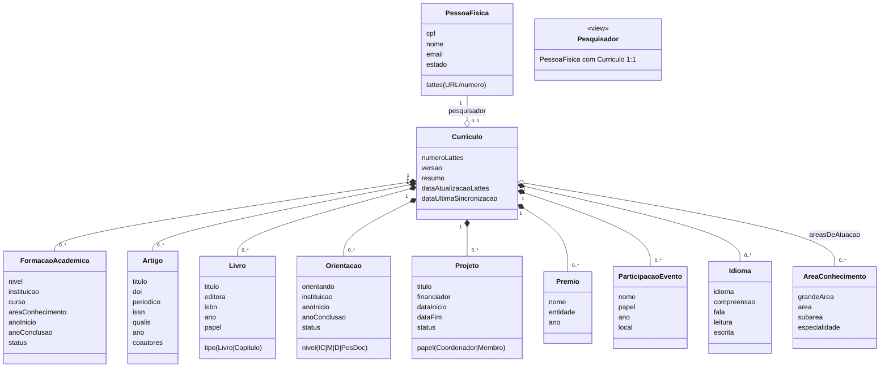

# Curriculo do Pesquisador — Modelo Conceitual

[← Voltar para Domain 01](01-corporativo.md) | [Personas](../personas.md) | [Glossario](../glossario.md) | [Integracao Lattes (Discovery)](../integracoes/lattes.md) | [Adapter Lattes (M023)](../../implementation/modules/M023-integracoes/lattes/README.md) | [M024 — dominio do curriculo](../../implementation/modules/M024-curriculo-pesquisador/README.md)

> **Responsabilidade dividida:** **M024** e dono do modelo de dominio (entidades do CV abaixo) e das regras de elegibilidade/perfil. **M023/lattes** e o adapter externo que importa do CNPq e alimenta as entidades de M024 — ver [adapter](../../implementation/modules/M023-integracoes/lattes/README.md).

Modelo conceitual das entidades que compoem o curriculo academico de um pesquisador no Conecta. Detalha o que cobre [§1.5 do Domain 01](01-corporativo.md#15-curriculo-do-pesquisador). A fonte canonica dos dados academicos e a Plataforma Lattes (CNPq); o Conecta mantem replica local versionada.

---

## Principios

- **Pesquisador = PessoaFisica + Curriculo vinculado**. Toda regra de elegibilidade, selecao de Ad Hoc, indicador de producao e perfil academico opera sobre `Pesquisador`.
- **Lattes e fonte canonica**. O Conecta nao edita dados academicos; reimportacao apaga e recria entidades filhas. Sincronizacao e **sincrona** -- chamada ao adapter retorna o snapshot persistido ou falha; sucesso fica em `Curriculo.dataUltimaSincronizacao` + `versao`, falhas em log estruturado (sem agregado de auditoria persistido).
- **Curriculo valido = sincronizacao bem-sucedida nos ultimos 12 meses**. Curriculo desatualizado bloqueia uso em selecao de Ad Hoc (§1.5.5) e validacao automatica de elegibilidade (§1.5.6).
- **Baixa de Pesquisador suspende, nao apaga, o curriculo** — historico preservado para auditoria.

## Diagrama de classes

## Dicionario de entidades

| Entidade | Descricao | Cardinalidade vs Curriculo |
|----------|-----------|----------------------------------|
| **Pesquisador** | Visao sobre `PessoaFisica` que tem `Curriculo` vinculado. Nao e entidade separada — flag derivado da existencia do curriculo | 1:1 com PessoaFisica |
| **Curriculo** | Raiz do curriculo importado. Pertence a uma PessoaFisica via `numeroLattes`. Versionado por sincronizacao. Carrega `dataAtualizacaoLattes` (data informada pelo CNPq) e `dataUltimaSincronizacao` (quando o Conecta sincronizou) | 1:1 com Pesquisador |
| **FormacaoAcademica** | Titulacao do pesquisador. Niveis: `Graduacao`, `Especializacao`, `Mestrado`, `Doutorado`, `PosDoutorado`. Status: `Concluida` ou `EmAndamento` | 0..* |
| **Artigo** | Producao bibliografica em periodico ou anais de conferencia. Inclui DOI, ISSN, Qualis (quando conhecido), ano e coautores | 0..* |
| **Livro** | Livro completo ou capitulo de livro. Tipo discriminador: `Livro` ou `Capitulo`. Inclui ISBN, editora, ano e papel do pesquisador | 0..* |
| **Orientacao** | Orientacao academica concluida ou em andamento. Niveis: `IC`, `Mestrado`, `Doutorado`, `PosDoutorado`. Status: `Concluida` ou `EmAndamento` | 0..* |
| **Projeto** | Projeto de pesquisa do qual o pesquisador participou. Papel: `Coordenador` ou `Membro`. Inclui financiador e periodo | 0..* |
| **Premio** | Premio, titulo honorifico ou homenagem recebida | 0..* |
| **ParticipacaoEvento** | Participacao em evento cientifico (congresso, simposio, workshop). Papel: `Apresentador`, `Ouvinte`, `Organizador`, `Convidado` | 0..* |
| **Idioma** | Idioma falado e nivel de proficiencia em `compreensao`, `fala`, `leitura`, `escrita`. Niveis: `Pouco`, `Razoavel`, `Bom`, `Fluente` | 0..* |
| **AreaConhecimento** | Areas de atuacao classificadas conforme CNPq (grande area, area, subarea, especialidade). Referencia [AreaConhecimento de M008 §1.3.6](../../implementation/modules/M008-cadastros-corporativos/classificacoes/area-conhecimento/README.md) | N:N |

## Enumeracoes

| Enum | Entidade | Valores |
|------|----------|---------|
| `NivelFormacao` | FormacaoAcademica | `Graduacao`, `Especializacao`, `Mestrado`, `Doutorado`, `PosDoutorado` |
| `StatusFormacao` | FormacaoAcademica | `Concluida`, `EmAndamento` |
| `TipoProducaoLivro` | Livro | `Livro`, `Capitulo` |
| `NivelOrientacao` | Orientacao | `IC`, `Mestrado`, `Doutorado`, `PosDoutorado` |
| `StatusOrientacao` | Orientacao | `Concluida`, `EmAndamento` |
| `PapelProjeto` | Projeto | `Coordenador`, `Membro` |
| `StatusProjeto` | Projeto | `EmAndamento`, `Concluido`, `Suspenso` |
| `PapelEvento` | ParticipacaoEvento | `Apresentador`, `Ouvinte`, `Organizador`, `Convidado` |
| `NivelProficienciaIdioma` | Idioma | `Pouco`, `Razoavel`, `Bom`, `Fluente` |

## Regras de negocio (modelo conceitual)

- **RN-M024-01**: Toda Pessoa identificada como `Pesquisador` deve possuir exatamente um `Curriculo` vinculado.
- **RN-M024-02**: `numeroLattes` e unico no sistema — nao pode haver duas `PessoaFisica` com o mesmo numero Lattes.
- **RN-M024-03**: Reimportacao do curriculo apaga todas as entidades filhas anteriores (FormacaoAcademica, Artigo, Livro, Orientacao, Projeto, Premio, ParticipacaoEvento, Idioma) e recria a partir do snapshot atual do Lattes.
- **RN-M024-04**: Curriculo valido para uso em fluxos = `dataUltimaSincronizacao` nos ultimos 12 meses.
- **RN-M024-07**: Sincronizacao automatica acontece **semanalmente** para todos os pesquisadores com `Curriculo` vinculado, alem da primeira sincronizacao disparada no momento do cadastro/vinculacao do Lattes. Pesquisador e Analista podem disparar sincronizacao sob demanda a qualquer momento.
- **RN-M024-05**: `Pesquisador` suspenso (PessoaFisica.estado = `SUSPENSA`) bloqueia uso do curriculo em selecao de Ad Hoc e elegibilidade, mas o curriculo permanece consultavel para auditoria.
- **RN-M024-06**: AreaConhecimento referenciada pelo curriculo deve existir no cadastro canonico CNPq de M008 (§1.3.6) — areas nao mapeadas sao registradas em log de discrepancia.

## Cross-references

- **Domain 01 §1.2.1** — Cadastro de Pessoa: onde o `numeroLattes` e capturado em PessoaFisica
- **Domain 01 §1.5** — funcionalidades operacionais do curriculo
- **Domain 03** — Fomento Pre-Award: usa curriculo para selecao de Ad Hoc e validacao de elegibilidade
- **M024** — modulo de implementacao
- **M011** — Configuracao de Captacao: consumidor para selecao de Ad Hoc
- **integracoes/lattes.md** — detalhes da integracao externa
- **M008 §1.3.6 AreaConhecimento** — cadastro canonico CNPq referenciado pelo curriculo
