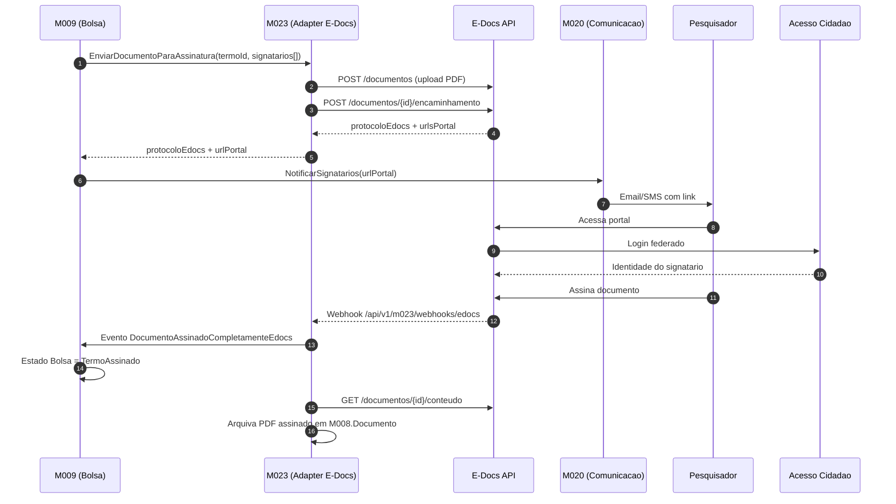

# E-Docs ES — Assinatura digital de documentos

[← Voltar para Integracoes](README.md) | [Glossario](../glossario.md) | [Personas](../personas.md)

## O que e

`E-Docs` (`api.e-docs.es.gov.br`) e o sistema oficial de gestao de documentos eletronicos do Estado do Espirito Santo. Oferece criacao, despacho, encaminhamento e **assinatura eletronica qualificada** de documentos com valor juridico equivalente ao papel assinado a tinta. Identidade dos signatarios e fornecida pelo `Acesso Cidadao` (mesmo provedor SSO que o Conecta utilizara via M005).

## Por que o Conecta precisa

Documentos formais que **pesquisadores assinam** hoje sao modelados no Conecta como ato administrativo local — apenas registra-se `dataAssinatura`, sem evidencia juridica. Isso bloqueia formalizacao de bolsa (M009 EPIC-003) e publicacao em Diario Oficial.

| Documento | Modulo | Quem assina |
|-----------|--------|-------------|
| Termo de Compromisso de Bolsa | M009 | Coordenador, Orientador, Bolsista, DIRAF, DIPRE |
| Termo de Outorga | M022 | Outorgado, Diretor da FAPES |
| Termo de Aceite | M003 | Bolsista (aceita conta bancaria + plano de trabalho) |
| Plano de Trabalho | M003 | Coordenador, Orientador |
| Termo de Cooperacao / Aditivo (Parceria) | M010 | Diretor da FAPES, Representante da Entidade Parceira |

## Capacidades aproveitadas

| Capacidade | Como Conecta usa |
|-----------|------------------|
| Criar documento eletronico | Conecta envia PDF + metadados; E-Docs devolve protocolo unico e hash |
| Despacho/encaminhamento para signatarios | Conecta lista signatarios por CPF e ordem; E-Docs gera link de portal por signatario |
| Assinatura externa por cidadao | Pesquisador autentica no portal E-Docs com Acesso Cidadao (mesmo login do Conecta) e assina |
| Notificacao de eventos | E-Docs notifica Conecta via webhook quando documento e parcial/totalmente assinado ou recusado |
| Consulta de status | Conecta consulta status (polling) como fallback se webhook falhar |
| Download de documento assinado | Conecta arquiva PDF final + manifesto de assinaturas |
| Hash + protocolo | Permite verificacao independente da integridade do documento |

## Decisoes de uso

| Decisao | Escolha |
|---------|---------|
| Modo de assinatura | **Redirect SSO via Acesso Cidadao** — pesquisador e levado ao portal E-Docs, assina la, retorna ao Conecta com confirmacao |
| Sincronizacao | **Polling de eventos** (Guideline confirma que toda mutacao retorna `eventoId` enfileirado — Conecta consulta status do evento). Webhook por confirmar com PRODEST. |
| Identidade compartilhada | Acesso Cidadao do servidor/cidadao e a **mesma** entre Conecta e E-Docs — sem nova credencial |

## Fluxo end-to-end (caso M009 — Termo de Compromisso)



## Mapa de papeis

| Persona Conecta | Papel no E-Docs | Modulo |
|-----------------|-----------------|--------|
| Coordenador | Signatario externo (via Acesso Cidadao) | M009, M003 |
| Orientador | Signatario externo | M009 |
| Bolsista | Signatario externo | M009, M003 |
| Outorgado | Signatario externo | M022 |
| Servidor FAPES (DIRAF, DIPRE) | Signatario interno | M009 |
| Diretor FAPES | Signatario interno | M010, M022 |

## Regras de negocio dependentes

- Termos formais (Compromisso, Outorga, Aceite, Cooperacao) **devem** ter assinatura eletronica qualificada coletada via E-Docs antes de transitar para estado `Assinado` ou `Vigente`.
- Documento assinado retorna ao Conecta com `protocoloEdocs`, `hashAssinatura` e `urlConteudoAssinado` arquivados na entidade `Documento` (M008) para auditoria.
- Recusa de qualquer signatario invalida a coleta — fluxo retorna ao estado anterior e exige nova rodada.
- Reativacao de documento ja assinado nao e permitida; aditivo/correcao gera novo documento + novo protocolo.

## Documentacao oficial (V2 — atualizada)

Fonte canonica: [`docs.e-docs.es.gov.br/api`](https://docs.e-docs.es.gov.br/api/). **Use exclusivamente a V2** para novas implementacoes — V1 esta descontinuada. Documentacao publica organizada em paginas por dominio:

| Pagina | Dominio coberto |
|--------|------------------|
| [Solicitacao de Acesso](https://docs.e-docs.es.gov.br/api/SolicitarAcesso) | Procedimento para registrar a aplicacao Conecta junto ao PRODEST |
| [Autenticacao](https://docs.e-docs.es.gov.br/api/Autenticacao) | OAuth 2.0 via Acesso Cidadao, scopes, fluxos |
| [Documentos](https://docs.e-docs.es.gov.br/api/Documentos) | Upload, fase de assinatura, captura, validacao |
| [Captura](https://docs.e-docs.es.gov.br/api/Captura) | Fluxo final de registro institucional |
| [Restricao de Acesso](https://docs.e-docs.es.gov.br/api/RestricaoAcesso) | Niveis: Publico, Organizacional, Sigiloso, Classificado |
| [Encaminhamentos](https://docs.e-docs.es.gov.br/api/Encaminhamentos) | Roteamento entre setores/agentes |
| [Processos](https://docs.e-docs.es.gov.br/api/Processos) | Autuacao, despacho, avocamento, entranhamento |
| [Classificacao Documental](https://docs.e-docs.es.gov.br/api/ClassificacaoDocumental) | Tabela TTDD + retencao |
| [Agente](https://docs.e-docs.es.gov.br/api/Agente) | Quem assina/encaminha (servidor, cidadao, papel) |
| [Consultas](https://docs.e-docs.es.gov.br/api/Consultas) | Endpoints auxiliares |
| [Documento Digitalizado Original](https://docs.e-docs.es.gov.br/api/DocumentoDigitalizadoOriginal) | Tratamento de digitalizacao com valor legal |
| [Migracao V1 → V2](https://docs.e-docs.es.gov.br/api/MigracaoV1V2) | Guia para quem ja usava V1 |

### Ambientes

| Ambiente | Web | API base |
|----------|-----|-----------|
| Treinamento (homologacao) | `https://treinamento.e-docs.es.gov.br` | `https://api.treinamento.e-docs.es.gov.br` |
| Producao | `https://e-docs.es.gov.br` | `https://api.e-docs.es.gov.br` |
| Swagger publico V2 | — | `https://api.e-docs.es.gov.br/swagger/index.html?urls.primaryName=V2.0` |

> Toda nova rota usa prefixo `/v2/...`. Modelo assincrono: enderecos de mutacao retornam `idEvento` com HTTP `202 Accepted`; cliente faz polling em `GET /v2/eventos/{idEvento}`.

### Sistemas integrados

E-Docs depende de:
- [Acesso Cidadao](https://acessocidadao.es.gov.br) — autenticacao + autorizacao de usuarios. API publicada em `sistemas.es.gov.br/prodest/acessocidadao.webapi/swagger`.
- [Organograma](https://api.organograma.es.gov.br) — orgaos e setores; sincroniza com RH do Estado. Mesma cadeia ja documentada em [organograma.md](organograma.md).

### Pre-requisitos

> **Solicitar acesso** para a aplicacao Conecta antes de qualquer integracao. Procedimento em [SolicitarAcesso](https://docs.e-docs.es.gov.br/api/SolicitarAcesso).

Cadastrar dois Apps no Acesso Cidadao:

| App | Fluxo OAuth | Quando usar |
|-----|-------------|-------------|
| App **Hybrid / Authorization Code** | Hybrid | Operacoes que exigem autoria (capturar, assinar, encaminhar, atos processuais) — token carrega identidade do usuario |
| App **Client Credentials** | Client Credentials | Automacoes e consultas sem contexto de usuario — leitura de dados publicos e metadados, consultas ao Organograma |

### Endpoints OAuth (Acesso Cidadao)

| Operacao | URL |
|----------|-----|
| Authorize | `https://acessocidadao.es.gov.br/is/connect/authorize` |
| Token | `https://acessocidadao.es.gov.br/is/connect/token` |

Token enviado em header `Authorization: Bearer {token}` (RFC 6750). Resposta inclui `access_token`, `expires_in`, `token_type=Bearer`, `scope`. Refresh via `refresh_token` (Hybrid) ou nova requisicao (Client Credentials). Reutilizar token ate expiracao.

### Scopes V2

| Scope | Uso |
|-------|-----|
| `api-sigades-consultar` | Leituras (`GET /v2/agente/...`, `GET /v2/eventos/{id}`) |
| `api-sigades-documento` | Upload, fase de assinatura, captura |
| `api-sigades-encaminhamento` | Criar, responder, reencaminhar, complementar |
| `api-sigades-processo` | Autuar, despachar, avocar, entranhar |
| `api-organograma` | Consultas diretas ao Organograma |

### Acoes principais por dominio

#### Documentos + Captura

Scopes: `api-sigades-documento` + `api-sigades-consultar`.

**Tipos de assinatura (Lei 14.063/20):**
1. **Eletronica (avancada)** — assinada dentro do E-Docs.
2. **Digital qualificada (ICP-Brasil)** — aplicada ao arquivo antes do upload.
3. **Sem assinatura** — captura direta (copia, digitalizado).

**Restricoes de arquivo:**
- Formato: **PDF apenas** (audio/video so via interface web).
- Tamanho maximo: **250 MB**.
- URL de upload temporaria expira em segundos; arquivo nao registrado e descartado automaticamente.

**Fluxo em 5 etapas (assincrono):**

```
1. Bearer token (Acesso Cidadao, scope api-sigades-documento)
   ↓
2a. GET /v2/documentos/upload-arquivo/gerar-url-upload/{tamanhoArquivo}
   → resposta inclui { url, body{...}, idArquivo }
2b. POST multipart/form-data na url devolvida com todos campos de body + arquivo binario em "file"
   → 204 No Content
   ↓
3. Registrar documento (cenario depende do tipo de assinatura):
   A) Nato-digital, varios assinantes E-Docs:
      POST /v2/documentos/capturar/nato-digital/auto-assinado/{servidor|cidadao}
      → entra em fase de assinatura; ultima manifestacao dispara captura
   B) Nato-digital, so capturador assina:
      POST /v2/documentos/fase-assinatura/enviar/{servidor|cidadao}
      → E-Docs adiciona capturador como assinante e captura
   C) Demais (ICP-Brasil, copia, digitalizado):
      POST /v2/documentos/capturar/nato-digital/{icp-brasil|copia}/{servidor|cidadao}
      ou POST /v2/documentos/capturar/digitalizado/{servidor|cidadao}
   → resposta 202 Accepted com { idEvento, capturado, idCapturaEvento }
   ↓
4. Polling: GET /v2/eventos/{idEvento}
   → quando status=Executado, payload inclui idDocumento
   ↓
5. Documento disponivel para encaminhamento, processo, consulta, download
```

**Exemplo — capturar com so capturador assinante (servidor):**

```json
POST /v2/documentos/fase-assinatura/enviar/servidor
Authorization: Bearer {token}
Content-Type: application/json

{
  "idArquivo": "8f9a1b2c-3d4e-5f6a-7b8c-9d0e1f2a3b4c",
  "idPapel": "11111111-2222-3333-4444-555555555555",
  "idClasseDocumental": "aaaaaaaa-bbbb-cccc-dddd-eeeeeeeeeeee",
  "resumo": "Memorando de solicitacao",
  "valorLegal": "Original",
  "natureza": "NatoDigital",
  "genero": "Textual",
  "restricaoAcesso": { "transparenciaAtiva": true }
}
```

Resposta `202 Accepted`:
```json
{ "idEvento": "f1e2d3c4-...", "capturado": true, "idCapturaEvento": "c1d2e3..." }
```

**Exemplo — multiplos assinantes (Termo de Cooperacao):**

```json
POST /v2/documentos/capturar/nato-digital/auto-assinado/servidor
{
  "idArquivo": "...",
  "idPapel": "...",
  "idClasseDocumental": "...",
  "resumo": "Termo de Cooperacao",
  "valorLegal": "Original",
  "natureza": "NatoDigital",
  "assinantes": [
    { "tipo": "Servidor", "idPapel": "..." },
    { "tipo": "Servidor", "idPapel": "..." }
  ],
  "restricaoAcesso": { "transparenciaAtiva": false }
}
```

Cada assinante manifesta-se via endpoint dedicado de assinatura. Ultima manifestacao dispara captura automaticamente.

**Categorizacao de documento:**
- `natureza`: `NatoDigital` ou `Digitalizado`
- `valorLegal`: `Original`, `CopiaAutenticadaAdministrativamente`, `CopiaSimples`
- `genero`: `Textual` (PDF) — audio/video so via web

**Operacoes pos-captura:**
- `PodeUsar` — verifica permissao do agente
- `ValidarAssinaturaDigital` — valida parametros da assinatura

#### Encaminhamentos

Scopes: `api-sigades-encaminhamento` + `api-sigades-consultar`.

**Endpoints V2:**

| Acao | Endpoint |
|------|----------|
| Novo | `POST /v2/encaminhamento/novo` |
| Reencaminhar | `POST /v2/encaminhamento/reencaminhar` |
| Responder | `POST /v2/encaminhamento/responder` |
| Complementar | `POST /v2/encaminhamento/complementar` |
| Consultar | `GET /v2/encaminhamento?...` (filtros por destino, remetente, status, periodo) |

**Exemplo — novo encaminhamento:**

```json
POST /v2/encaminhamento/novo
{
  "assunto": "Solicitacao de analise de processo",
  "idsDestinos": ["<uuid>"],
  "mensagem": "...",
  "idResponsavel": "<uuid-do-papel-remetente>",
  "idsDocumentos": ["<uuid-doc-capturado>"],
  "enviarEmailNotificacoes": true,
  "restricaoAcesso": { "transparenciaAtiva": true, "idsFundamentosLegais": [], "classificacaoInformacao": null }
}
```

Resposta 202: `{ "idEvento": "..." }`. Polling em `GET /v2/eventos/{idEvento}` ate retornar `idEncaminhamento`.

**Identidade do remetente (`idResponsavel`):** cidadao = identificacao pessoal; servidor = papel/lotacao.

**Pre-requisitos:**
- Documentos anexados precisam estar **previamente capturados** (passar pelo fluxo de Captura).
- Documentos com fase de assinatura precisam estar **totalmente assinados** antes de serem encaminhados.

#### Processos

Scope: `api-sigades-processo` + `api-sigades-consultar`. Operacoes: autuar, despachar, avocar, entranhar/desentranhar documentos e encaminhamentos, editar, encerrar, reabrir, pesquisar. Mesmo modelo `idEvento` + polling.

#### Consultas

Endpoints auxiliares (scope `api-sigades-consultar`): patriarcas, orgaos, planos de classificacao, fundamentacoes legais, informacoes do usuario logado, agentes.

### Padrao assincrono — modelo de eventos

Toda mutacao retorna **`idEvento`** com HTTP `202 Accepted`. Cliente consulta `GET /v2/eventos/{idEvento}` ate `status=Executado`. Resposta enriquece com identificador do recurso criado (`idDocumento`, `idEncaminhamento`, `idProcesso`).

```json
GET /v2/eventos/{idEvento}
→ {
  "idEvento": "f1e2d3c4-...",
  "tipo": "CapturaDocumento",
  "status": "Executado",
  "idDocumento": "9b8a7c6d-..."
}
```

Conecta deve implementar polling com backoff e idempotencia por `idEvento`.

## Pendencias de discovery (atualizadas com docs V2)

Itens **resolvidos** pela documentacao V2:
- ✅ **Webhook**: nao existe; modelo e polling de eventos (`GET /v2/eventos/{idEvento}`).
- ✅ **Tamanho do PDF**: 250 MB.
- ✅ **Formato**: PDF apenas (audio/video so via web).
- ✅ **Tipos de assinatura**: 3 niveis (eletronica E-Docs, digital ICP-Brasil, sem assinatura) conforme Lei 14.063/20.
- ✅ **Endpoints**: paths `/v2/documentos/*`, `/v2/encaminhamento/*`, `/v2/eventos/{id}` confirmados.

Itens ainda **pendentes**:
1. **Fluxo Hybrid no Conecta backoffice**: como conectar o redirect do Acesso Cidadao com sessao do Conecta? Precisa explorar pagina [Autenticacao](https://docs.e-docs.es.gov.br/api/Autenticacao) com mais cuidado.
2. **Recusa de signatario** — formato exato do evento e como Conecta detecta.
3. **Lei 14.063/20 nivel exigido**: para Termos de Compromisso (M009), Outorga (M022) e Aceite (M003), confirmar com Diretoria Juridica FAPES qual nivel (eletronica avancada basta ou exige ICP-Brasil).
4. **Signatario cidadao sem conta Acesso Cidadao**: existe enrollment automatico ou exige cadastro previo manual?
5. **PDF/A obrigatorio** ou PDF padrao serve para captura.
6. **Rate limit + SLA** no ambiente de Treinamento e Producao.
7. **`idClasseDocumental`**: como Conecta descobre/escolhe a classe documental adequada para cada tipo (Termo, Plano, Aceite)? Endpoint de Classificacao Documental retorna catalogo.
8. **`idPapel`**: papel do servidor capturador — vem do Acesso Cidadao ou do Organograma? Confirmar mapeamento com pagina [Agente](https://docs.e-docs.es.gov.br/api/Agente).
