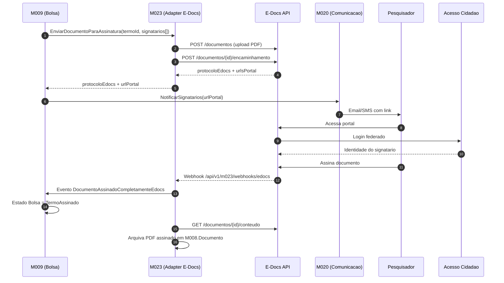

# E-Docs ES — Assinatura digital de documentos

[← Voltar para Integracoes](README.md) | [Glossario](../glossario.md) | [Personas](../personas.md)

## O que e

`E-Docs` (`api.e-docs.es.gov.br`) e o sistema oficial de gestao de documentos eletronicos do Estado do Espirito Santo. Oferece criacao, despacho, encaminhamento e **assinatura eletronica qualificada** de documentos com valor juridico equivalente ao papel assinado a tinta. Identidade dos signatarios e fornecida pelo `Acesso Cidadao` (mesmo provedor SSO que o Conecta utilizara via M005).

## Por que o Conecta precisa

Documentos formais que **pesquisadores assinam** hoje sao modelados no Conecta como ato administrativo local — apenas registra-se `dataAssinatura`, sem evidencia juridica. Isso bloqueia formalizacao de bolsa (M009 EPIC-003) e publicacao em Diario Oficial.

| Documento | Modulo | Quem assina |
|-----------|--------|-------------|
| Termo de Compromisso de Bolsa | M009 | Coordenador, Orientador, Bolsista, DIRAF, DIPRE |
| Termo de Outorga | M022 | Outorgado, Diretor da FAPES |
| Termo de Aceite | M003 | Bolsista (aceita conta bancaria + plano de trabalho) |
| Plano de Trabalho | M003 | Coordenador, Orientador |
| Termo de Cooperacao / Aditivo (Parceria) | M010 | Diretor da FAPES, Representante da Entidade Parceira |

## Capacidades aproveitadas

| Capacidade | Como Conecta usa |
|-----------|------------------|
| Criar documento eletronico | Conecta envia PDF + metadados; E-Docs devolve protocolo unico e hash |
| Despacho/encaminhamento para signatarios | Conecta lista signatarios por CPF e ordem; E-Docs gera link de portal por signatario |
| Assinatura externa por cidadao | Pesquisador autentica no portal E-Docs com Acesso Cidadao (mesmo login do Conecta) e assina |
| Notificacao de eventos | E-Docs notifica Conecta via webhook quando documento e parcial/totalmente assinado ou recusado |
| Consulta de status | Conecta consulta status (polling) como fallback se webhook falhar |
| Download de documento assinado | Conecta arquiva PDF final + manifesto de assinaturas |
| Hash + protocolo | Permite verificacao independente da integridade do documento |

## Decisoes de uso

| Decisao | Escolha |
|---------|---------|
| Modo de assinatura | **Redirect SSO via Acesso Cidadao** — pesquisador e levado ao portal E-Docs, assina la, retorna ao Conecta com confirmacao |
| Sincronizacao | **Webhook como caminho principal**; **polling agendado a cada 30 min** como fallback para reconciliar pendencias |
| Identidade compartilhada | Acesso Cidadao do servidor/cidadao e a **mesma** entre Conecta e E-Docs — sem nova credencial |

## Fluxo end-to-end (caso M009 — Termo de Compromisso)

## Mapa de papeis

| Persona Conecta | Papel no E-Docs | Modulo |
|-----------------|-----------------|--------|
| Coordenador | Signatario externo (via Acesso Cidadao) | M009, M003 |
| Orientador | Signatario externo | M009 |
| Bolsista | Signatario externo | M009, M003 |
| Outorgado | Signatario externo | M022 |
| Servidor FAPES (DIRAF, DIPRE) | Signatario interno | M009 |
| Diretor FAPES | Signatario interno | M010, M022 |

## Regras de negocio dependentes

- Termos formais (Compromisso, Outorga, Aceite, Cooperacao) **devem** ter assinatura eletronica qualificada coletada via E-Docs antes de transitar para estado `Assinado` ou `Vigente`.
- Documento assinado retorna ao Conecta com `protocoloEdocs`, `hashAssinatura` e `urlConteudoAssinado` arquivados na entidade `Documento` (M008) para auditoria.
- Recusa de qualquer signatario invalida a coleta — fluxo retorna ao estado anterior e exige nova rodada.
- Reativacao de documento ja assinado nao e permitida; aditivo/correcao gera novo documento + novo protocolo.

## Capacidades que precisam ser confirmadas no swagger

> Fonte canonica: `https://api.e-docs.es.gov.br/swagger/index.html`. Time deve mapear paths/payloads exatos antes da implementacao.

| Capacidade esperada | Operacao tipica |
|---------------------|-----------------|
| Autenticacao OAuth2 client credentials | `POST /oauth/token` |
| Criar documento | `POST /documentos` (multipart/form-data com PDF) |
| Encaminhar para signatarios | `POST /documentos/{id}/encaminhamento` (lista de CPFs + ordem) |
| Consultar status | `GET /documentos/{id}` |
| Baixar conteudo assinado | `GET /documentos/{id}/conteudo` |
| Cancelar solicitacao | `DELETE /documentos/{id}/encaminhamento` |
| Configurar webhook | configuracao por console ou API administrativa |

## Pendencias de discovery

1. OAuth2 client credentials confirmado como modo servidor↔servidor? Existe SDK oficial .NET ou apenas REST?
2. Existe `homolog.api.e-docs.es.gov.br` para testes pre-producao?
3. SLA do E-Docs e janela de manutencao impactam job de reconciliacao?
4. Recusa de signatario gera evento dedicado ou apenas mudanca de status?
5. E-Docs aceita signatario externo cadastrado apenas por CPF (sem cadastro previo no Acesso Cidadao)?
6. Limite de tamanho do PDF + formatos aceitos (PDF/A obrigatorio?)?
