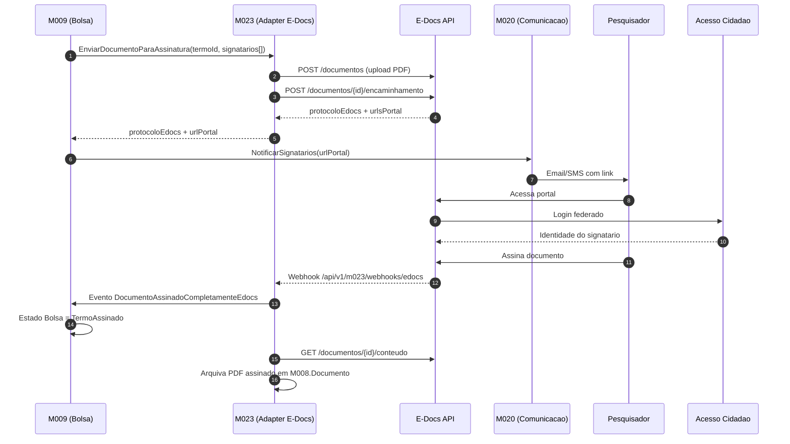

# E-Docs ES — Assinatura digital de documentos

[← Voltar para Integracoes](README.md) | [Glossario](../glossario.md) | [Personas](../personas.md)

## O que e

`E-Docs` (`api.e-docs.es.gov.br`) e o sistema oficial de gestao de documentos eletronicos do Estado do Espirito Santo. Oferece criacao, despacho, encaminhamento e **assinatura eletronica qualificada** de documentos com valor juridico equivalente ao papel assinado a tinta. Identidade dos signatarios e fornecida pelo `Acesso Cidadao` (mesmo provedor SSO que o Conecta utilizara via M005).

## Por que o Conecta precisa

Documentos formais que **pesquisadores assinam** hoje sao modelados no Conecta como ato administrativo local — apenas registra-se `dataAssinatura`, sem evidencia juridica. Isso bloqueia formalizacao de bolsa (M009 EPIC-003) e publicacao em Diario Oficial.

| Documento | Modulo | Quem assina |
|-----------|--------|-------------|
| Termo de Compromisso de Bolsa | M009 | Coordenador, Orientador, Bolsista, DIRAF, DIPRE |
| Termo de Outorga | M022 | Outorgado, Diretor da FAPES |
| Termo de Aceite | M003 | Bolsista (aceita conta bancaria + plano de trabalho) |
| Plano de Trabalho | M003 | Coordenador, Orientador |
| Termo de Cooperacao / Aditivo (Parceria) | M010 | Diretor da FAPES, Representante da Entidade Parceira |

## Capacidades aproveitadas

| Capacidade | Como Conecta usa |
|-----------|------------------|
| Criar documento eletronico | Conecta envia PDF + metadados; E-Docs devolve protocolo unico e hash |
| Despacho/encaminhamento para signatarios | Conecta lista signatarios por CPF e ordem; E-Docs gera link de portal por signatario |
| Assinatura externa por cidadao | Pesquisador autentica no portal E-Docs com Acesso Cidadao (mesmo login do Conecta) e assina |
| Notificacao de eventos | E-Docs notifica Conecta via webhook quando documento e parcial/totalmente assinado ou recusado |
| Consulta de status | Conecta consulta status (polling) como fallback se webhook falhar |
| Download de documento assinado | Conecta arquiva PDF final + manifesto de assinaturas |
| Hash + protocolo | Permite verificacao independente da integridade do documento |

## Decisoes de uso

| Decisao | Escolha |
|---------|---------|
| Modo de assinatura | **Redirect SSO via Acesso Cidadao** — pesquisador e levado ao portal E-Docs, assina la, retorna ao Conecta com confirmacao |
| Sincronizacao | **Polling de eventos** (Guideline confirma que toda mutacao retorna `eventoId` enfileirado — Conecta consulta status do evento). Webhook por confirmar com PRODEST. |
| Identidade compartilhada | Acesso Cidadao do servidor/cidadao e a **mesma** entre Conecta e E-Docs — sem nova credencial |

## Fluxo end-to-end (caso M009 — Termo de Compromisso)

## Mapa de papeis

| Persona Conecta | Papel no E-Docs | Modulo |
|-----------------|-----------------|--------|
| Coordenador | Signatario externo (via Acesso Cidadao) | M009, M003 |
| Orientador | Signatario externo | M009 |
| Bolsista | Signatario externo | M009, M003 |
| Outorgado | Signatario externo | M022 |
| Servidor FAPES (DIRAF, DIPRE) | Signatario interno | M009 |
| Diretor FAPES | Signatario interno | M010, M022 |

## Regras de negocio dependentes

- Termos formais (Compromisso, Outorga, Aceite, Cooperacao) **devem** ter assinatura eletronica qualificada coletada via E-Docs antes de transitar para estado `Assinado` ou `Vigente`.
- Documento assinado retorna ao Conecta com `protocoloEdocs`, `hashAssinatura` e `urlConteudoAssinado` arquivados na entidade `Documento` (M008) para auditoria.
- Recusa de qualquer signatario invalida a coleta — fluxo retorna ao estado anterior e exige nova rodada.
- Reativacao de documento ja assinado nao e permitida; aditivo/correcao gera novo documento + novo protocolo.

## Guideline oficial PRODEST

Fonte: [`prodest/e-docs-documentacao` — API/Guideline.md](https://github.com/prodest/e-docs-documentacao/blob/master/API/Guideline.md). Documentacao detalhada em arquivos por dominio: `Documentos.md`, `Encaminhamentos.md`, `Processos.md`, `Consultas.md`, `SolicitarAcesso.md`.

### Ambientes

| Ambiente | Web | API |
|----------|-----|-----|
| Treinamento (homologacao) | `treinamento.e-docs.es.gov.br` | `api.treinamento.e-docs.es.gov.br` |
| Producao | `e-docs.es.gov.br` | `api.e-docs.es.gov.br` |
| Swagger publico | — | `api.e-docs.es.gov.br/swagger/index.html?urls.primaryName=V2.0` |

### Sistemas integrados

E-Docs depende de:
- [Acesso Cidadao](https://acessocidadao.es.gov.br) — autenticacao + autorizacao de usuarios. API publicada em `sistemas.es.gov.br/prodest/acessocidadao.webapi/swagger`.
- [Organograma](https://api.organograma.es.gov.br) — orgaos e setores; sincroniza com RH do Estado. Mesma cadeia ja documentada em [organograma.md](organograma.md).

### Pre-requisitos

> **Solicitar acesso** para a aplicacao Conecta antes de qualquer integracao. Procedimento descrito em `SolicitarAcesso.md` do PRODEST.

Cadastrar dois Apps no Acesso Cidadao:

| App | Fluxo OAuth | Quando usar |
|-----|-------------|-------------|
| App **Hybrid** | Authorization Code + Hybrid | Autenticar usuario final (servidor FAPES, pesquisador) que executara operacoes no E-Docs (assinar, capturar, encaminhar) |
| App **ClientCredentials** | Client Credentials | Servidor↔servidor — Conecta backend consultar Organograma, etc. Adicionar scope `api-organograma` se for consumir Organograma |

### Acoes principais por dominio

#### Documentos (`Documentos.md`)

Scopes OAuth: `api-sigades-documento` (assinar/capturar) + `api-sigades-consultar` (consultar).

Fluxo de captura/registro em **5 etapas**:

| Etapa | Operacao |
|-------|----------|
| 1 | Bearer Token via Acesso Cidadao com scope adequado |
| 2 | `POST` "Gerar URL para upload" passando `tamanho do arquivo`. Retorna URL + JSON com parametros de upload |
| 3 | `POST` direto na URL retornada (cloud storage) com parametros + arquivo PDF. Esperado HTTP `204` |
| 4 | Registrar documento via endpoint apropriado (varia por tipo — ver tabela abaixo) |
| 5 | Consultar fila de captura: documento e enfileirado como evento; consulta retorna `id` do documento capturado |

**Endpoints de registro por tipo de documento** (Lei 14.063/20):

| Tipo | Modelo de assinatura | Padrao de endpoint |
|------|----------------------|---------------------|
| Nato-digital + multiplas assinaturas E-Docs | Fase de assinatura multi-signatario | `capturar_nato_digital_auto_assinado_{servidor\|cidadao}` |
| Nato-digital + assinatura unica do capturador | Auto-assinado pelo capturador | `fase_assinatura_enviar_{servidor\|cidadao}` |
| Nato-digital ICP-Brasil (assinado externamente) | Direto | `capturar_nato_digital_icp_brasil_{servidor\|cidadao}` |
| Copia digital | Direto | `capturar_nato_digital_copia_{servidor\|cidadao}` |
| Digitalizado (escaneado) | Direto | `capturar_digitalizado_{servidor\|cidadao}` |

**Restricoes:**
- Formato: **somente PDF com texto pesquisavel**.
- URL de upload **expira em segundos** — POST do arquivo deve ser imediato.
- Assinatura aceita: **eletronica simples** (E-Docs), **digital ICP-Brasil**, ou **sem assinatura** (cópia/digitalizado).

**Outras operacoes:** capturar, assinar (acao isolada), validar arquivo previamente capturado, pesquisar.

#### Encaminhamentos (`Encaminhamentos.md`)

Scopes: `api-sigades-encaminhamento` + `api-sigades-consultar`.

Cinco operacoes:

| Acao | Quando usar |
|------|-------------|
| Adicionar (Novo) | Encaminhamento original sem vinculo anterior |
| Reencaminhar | Repassar encaminhamento ja recebido |
| Responder | Responder ao remetente original |
| Complementar | Adicionar informacoes a encaminhamento ainda nao respondido |
| Pesquisar | Consultar status do evento enfileirado |

Cada acao retorna **identificador do evento enfileirado**. Documentos so podem ser anexados ao encaminhamento apos passarem pelo fluxo de captura.

#### Processos (`Processos.md`)

Operacoes: autuar, despachar, avocar, entranhar/desentranhar documentos e encaminhamentos, editar, encerrar, reabrir, pesquisar.

#### Consultas (`Consultas.md`)

Endpoints auxiliares para preenchimento de cadastros: patriarcas, orgaos, planos de classificacao, fundamentacoes legais, informacoes do usuario logado, agentes.

### Padrao de eventos enfileirados

Toda operacao de mutacao (capturar, assinar, encaminhar, autuar) **retorna `eventoId`** apos colocar o trabalho na fila. Conecta deve fazer **polling** consultando o evento ate ele concluir e devolver o id do documento/encaminhamento/processo gerado. Nao ha confirmacao sincrona.

## Pendencias de discovery (atualizadas)

1. **Webhooks de notificacao**: Guideline nao menciona webhook — polling via consulta de evento parece ser o unico mecanismo. Confirmar com PRODEST se webhook existe ou se Conecta deve fazer reconciliacao via polling sempre.
2. **Fluxo Hybrid no Conecta**: aplicacao backoffice pode usar Hybrid em nome do usuario? Ou exige redirect explicito do navegador?
3. **Limite de tamanho do PDF** — Guideline nao especifica.
4. **Recusa de signatario** — formato de evento + payload retornado.
5. **Lei 14.063/20**: para Termos de Compromisso (M009) e Outorga (M022), qual nivel de assinatura juridicamente exigido (eletronica simples vs ICP-Brasil)?
6. **Cadastro previo do signatario externo no Acesso Cidadao**: pesquisador sem conta Acesso Cidadao consegue assinar?
7. **PDF/A** obrigatorio ou PDF padrao serve?
8. **Quotas/rate limit** no ambiente de Treinamento.
