# Plataforma Lattes (CNPq) — Importacao e sincronizacao de curriculos

[← Voltar para Integracoes](README.md) | [Glossario](../glossario.md) | [Personas](../personas.md) | [Modelo conceitual do Pesquisador](../domains/01-corporativo-pesquisador.md) | [Adapter Lattes (M023)](../../implementation/modules/M023-integracoes/lattes/README.md) | [M024 (dominio)](../../implementation/modules/M024-curriculo-pesquisador/README.md)

> **Responsabilidade dividida:** o **adapter Lattes** vive em [M023](../../implementation/modules/M023-integracoes/lattes/README.md) (familia "importacao de curriculo academico" do modulo de integracoes externas); o **modelo de dominio do curriculo** (`Curriculo`, `FormacaoAcademica`, `Artigo`, `Livro`, `Orientacao`, `Projeto`, `Premio`, `ParticipacaoEvento`, `Idioma`) vive em [M024](../../implementation/modules/M024-curriculo-pesquisador/README.md). M023/lattes importa do CNPq, M024 e dono dos dados.

## O que e

A **Plataforma Lattes** ([`lattes.cnpq.br`](https://lattes.cnpq.br)) e o repositorio nacional de curriculos academicos mantido pelo CNPq. Concentra historico de formacao, producao bibliografica, orientacoes, projetos de pesquisa, premios, eventos e idiomas de pesquisadores brasileiros. Cada curriculo e identificado por um **numero Lattes de 16 digitos** (ex.: `1234567890123456`) e acessivel via URL `http://lattes.cnpq.br/{numeroLattes}`.

E a fonte canonica de dados academicos no Brasil — usada por CNPq, CAPES, FAPs estaduais (incluindo a FAPES) e instituicoes de ensino para avaliacao de merito, selecao de bolsistas, indicacao de consultores e prestacao de contas cientifica.

## Por que o Conecta precisa

Hoje a `PessoaFisica` (M008) guarda apenas a URL do Lattes como string livre. Sem importacao dos dados, quatro fluxos importantes ficam manuais ou impossiveis:

| Caso de uso | Modulo consumidor | O que destrava |
|-------------|-------------------|----------------|
| Selecao de Consultor Ad Hoc por expertise | [M011 — Configuracao de Captacao](../../implementation/modules/M011-configuracao-captacao/README.md) | Filtrar consultores por area de conhecimento, titulacao e producao recente em vez de busca manual em CV externo |
| Elegibilidade automatica em editais | [M011](../../implementation/modules/M011-configuracao-captacao/README.md), [M024](../../implementation/modules/M024-curriculo-pesquisador/README.md) | Validar requisitos (titulacao minima, producao minima) automaticamente contra curriculo importado |
| Indicadores de producao cientifica FAPES | [M018 — Business Intelligence](../../implementation/modules/M018-business-intelligence/README.md), [M019 — Transparencia](../../implementation/modules/M019-transparencia-auditoria/README.md) | Agregar producao bibliografica de pesquisadores beneficiarios para prestacao de contas e relatorios institucionais |
| Perfil/vitrine do pesquisador no Conecta | [M024](../../implementation/modules/M024-curriculo-pesquisador/README.md) | Exibir formacao, producao, orientacoes, projetos, premios, eventos e idiomas dentro da plataforma |

## Capacidades aproveitadas

| Capacidade Lattes | Como Conecta usa |
|-------------------|------------------|
| Identidade canonica do pesquisador (numero Lattes 16 digitos) | Chave de federacao entre PessoaFisica (M008) e Curriculo (M024) |
| Formacao academica (graduacao, especializacao, mestrado, doutorado, pos-doc) | Validacao de titulacao minima em editais (RN de elegibilidade) |
| Producao bibliografica (artigos, livros, capitulos) | Ranqueamento de Ad Hoc por producao recente; indicadores agregados |
| Orientacoes (IC, mestrado, doutorado, pos-doc, concluidas e em andamento) | Indicador de capacidade de orientacao; validacao de papel Orientador |
| Projetos de pesquisa (coordenador, membro, financiador, periodo) | Historico de execucao de fomento; deteccao de conflito de interesse |
| Premios e titulos | Perfil publico; criterios de selecao em editais especificos |
| Participacao em eventos cientificos | Indicador de atividade; perfil publico |
| Idiomas e proficiencia | Filtragem de consultores para avaliacoes em idioma estrangeiro |
| Areas de atuacao (classificacao CNPq) | Cross-reference com [AreaConhecimento](../../implementation/modules/M008-cadastros-corporativos/classificacoes/area-conhecimento/README.md) (M008 §1.3.6); base para busca de especialistas |

## Decisoes de uso

| Decisao | Escolha |
|---------|---------|
| Fonte canonica de dados academicos | **Lattes e canonico** — Conecta mantem replica local versionada e nao edita dados academicos diretamente. Conflito local/Lattes resolve sempre pelo Lattes na proxima sincronizacao |
| Granularidade da replica | **Curriculo completo** — formacao, producao, orientacoes, projetos, premios, eventos, idiomas e areas. Nao filtra por relevancia no momento da importacao |
| Vinculacao curriculo ↔ pessoa | **CPF + numero Lattes** — ambos persistidos em PessoaFisica (M008); Curriculo pertence a um Pesquisador 1:1 |
| Estrategia de obtencao dos dados | **A definir** — ver Pendencia 1 abaixo. Plano provisorio: API/wrapper externo com fallback para upload manual de XML pelo pesquisador |
| Frequencia de sincronizacao | **Semanal** para todos os pesquisadores vinculados (job recorrente) + **primeira sincronizacao** disparada sincronamente no momento da vinculacao do Lattes + **sob demanda** a qualquer momento pelo proprio pesquisador ou pelo Analista |
| Curriculo "valido" para uso em fluxos | **Sincronizacao bem-sucedida nos ultimos 12 meses** — curriculo desatualizado bloqueia uso em selecao de Ad Hoc e elegibilidade automatica |

## Passo a passo: vincular e importar curriculo

> **Modelo de execucao: sincrono.** Conecta chama o adapter Lattes e bloqueia ate o snapshot estar persistido (sucesso) ou ate falha tipada (erro). Sem polling, sem eventos assincronos vindos do adapter, sem `SincronizacaoLattes` como agregado persistido.

### Etapas

| # | Etapa | Ator | Resultado |
|---|-------|------|-----------|
| 1 | Pesquisador acessa perfil no Conecta e informa numero Lattes | Pesquisador | Disparo de `VincularCurriculo` em M024 |
| 2 | M024 chama `ImportarCurriculo(numeroLattes)` no adapter M023/lattes | M024 | Chamada sincrona em curso |
| 3 | Adapter obtem o curriculo da fonte ativa (XML/wrapper) e parseia | Adapter | Snapshot em memoria |
| 4 | Adapter aplica RN-M024-03 (apaga entidades filhas anteriores, se houver) e persiste o novo snapshot atomicamente | Adapter | `Curriculo` + entidades filhas atualizados em DB |
| 5 | Adapter retorna `ImportacaoCurriculoResult` (versao, contagens, areasNaoMapeadas) | Adapter → M024 | DTO em maos do M024 |
| 6 | M024 atualiza `Curriculo.dataUltimaSincronizacao`, publica `PesquisadorVinculado` (ou `CurriculoAtualizado` em re-sync) e `AreaConhecimentoNaoMapeada` para cada item em `areasNaoMapeadas[]` | M024 | Eventos de dominio in-process disparados |
| 7 | Consumidores (M020 notifica pesquisador, M008 recalcula `nivelAcademico`, M011/M018/M019 reagem) | -- | Side effects sincronos |
| 8 | Em caso de falha (timeout, parse error, Lattes indisponivel): adapter lanca excecao tipada; M024 traduz para HTTP `502 ADAPTER_LATTES_FALHOU` e nao publica eventos. Snapshot anterior permanece intacto | Adapter → M024 → cliente | Cliente reexecuta quando achar adequado |

### Diagrama de sequencia

```mermaid
sequenceDiagram
    autonumber
    participant Pesq as Pesquisador
    participant M024 as M024 (Curriculo)
    participant Adapter as Adapter Lattes (M023)
    participant Lattes as Plataforma Lattes (CNPq)
    participant DB as DB local Conecta
    participant Cons as Consumidores (M008, M011, M018, M019, M020)

    Pesq->>M024: POST /curriculo/vincular { numeroLattes }
    M024->>Adapter: ImportarCurriculo(numeroLattes)
    Adapter->>Lattes: Obter curriculo (XML/JSON conforme fonte)
    alt sucesso
        Lattes-->>Adapter: payload do curriculo
        Adapter->>Adapter: Parse + mapeamento para entidades M024
        Adapter->>DB: DELETE entidades filhas anteriores (se reimport)
        Adapter->>DB: INSERT atomico FormacaoAcademica[], Artigo[], Livro[], Orientacao[], Projeto[], Premio[], ParticipacaoEvento[], Idioma[]
        Adapter->>DB: UPDATE Curriculo (versao, dataUltimaSincronizacao)
        Adapter-->>M024: ImportacaoCurriculoResult
        M024->>Cons: Publica PesquisadorVinculado / CurriculoAtualizado (+ AreaConhecimentoNaoMapeada se aplicavel)
        M024-->>Pesq: 201/200 com Curriculo populado
    else falha
        Lattes-->>Adapter: erro / timeout / captcha / parse error
        Adapter-->>M024: throw LattesXxxException
        M024-->>Pesq: 502 ADAPTER_LATTES_FALHOU (snapshot anterior preservado)
    end
```

### Sincronizacao recorrente

Job recorrente do Conecta (interno ao M024) dispara `SincronizarCurriculo` **semanalmente** para todos os pesquisadores com `Curriculo` vinculado e nao suspenso -- mesmo fluxo sincrono acima, por pesquisador. Falhas individuais nao bloqueiam o lote: cada chamada e independente. A primeira sincronizacao acontece no momento da vinculacao (ver passo a passo acima); o job semanal cobre as atualizacoes posteriores.

## Mapa de papeis

| Persona Conecta | Papel na integracao Lattes | Modulo |
|-----------------|----------------------------|--------|
| [Pesquisador](../personas.md) | Vincula proprio numero Lattes; autoriza sincronizacao; consulta perfil | M024 |
| [Consultor Ad Hoc](../personas.md) | Especializacao de Pesquisador; tem curriculo validado para selecao | M011, M024 |
| [Analista da Area Tecnica](../personas.md) | Busca pesquisadores por area/producao; valida elegibilidade em editais | M011, M024 |
| Sistema (job M024) | Sincroniza curriculos vencidos; reconcilia entidades filhas | M024 |
| [Agencia de Fomento](../personas.md) | Consome indicadores agregados de producao para prestacao de contas | M018, M019 |

## Regras de negocio dependentes

- **Curriculo valido = sincronizacao bem-sucedida nos ultimos 12 meses.** Curriculo desatualizado bloqueia uso em selecao de Ad Hoc (1.5.5) e em validacao automatica de elegibilidade (1.5.6).
- **Ranqueamento de Ad Hoc considera producao dos ultimos 5 anos** (janela movel) — implementado em M011 consumindo M024.
- **Sincronizacao automatica semanal** -- job recorrente do M024 dispara `SincronizarCurriculo` toda semana para todos os pesquisadores ativos com `Curriculo` vinculado. Primeira sincronizacao acontece sincronamente no momento da vinculacao do Lattes. Pesquisador e Analista podem disparar sob demanda a qualquer momento.
- **Vinculacao Lattes requer consentimento explicito** do pesquisador no portal (LGPD — ver Pendencia 6).
- **Reimportacao e destrutiva sobre entidades filhas**: o curriculo e replica fiel do Lattes; nao ha merge incremental. Auditoria de cada execucao bem-sucedida fica em `Curriculo.dataUltimaSincronizacao` + `versao`; falhas ficam em log estruturado (sem agregado persistido).
- **Baixa de pesquisador (estado SUSPENSA em M008) suspende mas nao apaga o `Curriculo`** — historico preservado para auditoria.
- **Conflito de interesse em projeto** (Domain 05) pode usar `Projeto.financiador` e coautoria em `Artigo`/`Livro` para deteccao automatica.

## Pendencias de discovery

1. **Modo real de obtencao dos dados (CRITICO)** — a Plataforma Lattes nao oferece API REST publica. Opcoes:
   - **(a) Upload manual de XML** pelo proprio pesquisador (XML exportado do CNPq via captcha). Mais robusto; depende de acao do usuario.
   - **(b) Wrapper externo** (ex.: ScriptLattes, BrCris, projetos comunitarios). Risco de bloqueio, captcha, fragilidade legal.
   - **(c) Fonte alternativa indexada** (ORCID + OpenAlex + DOI) com Lattes apenas como URL. Cobre producao bibliografica mas perde orientacoes/eventos/idiomas.
   - **(d) Hibrido**: XML upload como caminho oficial + ORCID/OpenAlex como complemento para producao recente.
   - **Acao**: validar com CNPq/PRODEST e juridica FAPES antes de qualquer ticket de implementacao em M024.

2. ~~Frequencia de sincronizacao~~ -- **Resolvida.** Semanal para todos + primeira sincronizacao na vinculacao + sob demanda. Ver §Decisoes de uso e §Sincronizacao recorrente.

3. **Conflito Lattes ↔ Conecta** — Lattes e fonte canonica (decidido). Mas: se um campo importado for considerado erradoLogo pelo pesquisador, fluxo? Provavelmente "corrigir no Lattes e ressincronizar".

4. **Qualis CAPES e bibliometria** — Artigo importado guarda nome do periodico/ISSN; classificacao Qualis exige cross-reference com base CAPES (atualizada quadrienalmente). DOI e cross-reference com OpenAlex/Crossref. Esta no escopo agora ou fica para fase posterior?

5. **Pesquisadores estrangeiros** — nao possuem Lattes. Alternativa: cadastro manual de FormacaoAcademica + Producao no Conecta, ou integracao com ORCID. Definir antes do MVP de Ad Hoc.

6. **LGPD** — dados academicos no Lattes sao publicos (publicacao pelo proprio titular). A **agregacao + uso para selecao automatica/exclusao** no Conecta pode caracterizar tratamento de dado pessoal sensivel. Validar com Encarregado de Dados da FAPES base legal (consentimento? legitimo interesse? politica publica?).

7. **Volume e desempenho** — quantos pesquisadores em ambito FAPES (ordem de grandeza)? Tamanho medio de curriculo? Define capacity planning do M024.

## Documentacao oficial e referencias

- [`lattes.cnpq.br`](https://lattes.cnpq.br) — Plataforma Lattes (portal publico)
- [`http://lattes.cnpq.br/buscatextual`](http://lattes.cnpq.br/buscatextual/buscatextual_busca.jsp) — busca textual de curriculos
- [`http://memoria.cnpq.br/lattes`](http://memoria.cnpq.br/lattes/conteudo/cnpq_extra_2017.htm) — documentacao do XML do curriculo
- [ORCID](https://orcid.org/) — identificador alternativo internacional (relevante para Pendencia 1c)
- [OpenAlex](https://openalex.org/) — base aberta de producao cientifica indexada (relevante para Pendencia 1c)
