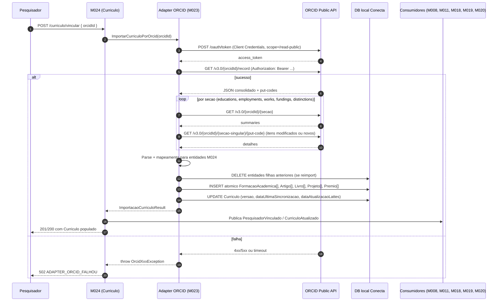
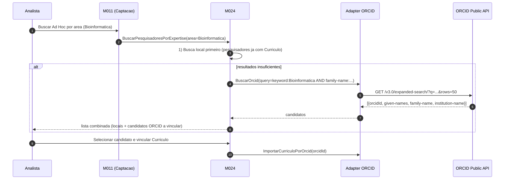

# ORCID (Public API) — Importacao complementar de curriculo

[← Voltar para Integracoes](README.md) | [Glossario](../glossario.md) | [Personas](../personas.md) | [Modelo conceitual do Pesquisador](../domains/01-corporativo-pesquisador.md) | [Adapter ORCID (M023)](../../implementation/modules/M023-integracoes/orcid/README.md) | [M024 (dominio)](../../implementation/modules/M024-curriculo-pesquisador/README.md)

> **Fonte complementar ao Lattes.** O Conecta usa ORCID para enriquecer producao bibliografica internacional indexada por DOI e cobrir pesquisador estrangeiro sem Lattes. Adapter vive em [M023/orcid](../../implementation/modules/M023-integracoes/orcid/README.md); modelo de dominio do curriculo continua em [M024](../../implementation/modules/M024-curriculo-pesquisador/README.md).

## O que e

**ORCID** ([`orcid.org`](https://orcid.org/)) -- *Open Researcher and Contributor ID* -- e o identificador internacional aberto de pesquisador, mantido por organizacao sem fins lucrativos. Cada pesquisador recebe um **ORCID iD** de 16 digitos com hifens (ex.: `0000-0001-2345-6789`) e administra seu proprio registro publico: identificacao, afiliacoes, formacao, producao bibliografica (com DOI), financiamentos e premios/distincoes.

A API REST oficial e estavel cobre dois canais:

| Canal | Quem usa | Escopo de leitura | Uso pelo Conecta |
|-------|----------|-------------------|------------------|
| **Public API** (`pub.orcid.org`) | Qualquer pessoa apos registrar app gratuita em [orcid.org/developer-tools](https://orcid.org/developer-tools) | `/read-public`, `/authenticate` | **Caminho ativo do Conecta** -- le dados publicos do registro |
| **Member API** (`api.orcid.org`) | Organizacoes-membro pagas (afiliacao institucional ORCID) | Inclui `/read-limited` e escopos de escrita | Futuro -- exigiria FAPES como ORCID member. Habilitaria leitura de dados marcados como "limited visibility" e escrita no registro do pesquisador |

Tutoriais oficiais: [info.orcid.org/documentation/api-tutorials](https://info.orcid.org/documentation/api-tutorials/) -- seis modulos (Getting an Authenticated ORCID iD, Reading Data, Adding/Updating Data, Searching, Webhook, Hands-on).

## Por que o Conecta precisa

Adapter Lattes cobre o pesquisador brasileiro, mas tres cenarios ficam descobertos sem ORCID:

| Cenario | Solucao com ORCID |
|---------|-------------------|
| Pesquisador estrangeiro convidado como Consultor Ad Hoc internacional | Vincula por ORCID iD em vez de numero Lattes |
| Producao bibliografica indexada por DOI ausente no Lattes (revistas internacionais nao referenciadas no CV Lattes) | Cross-reference por DOI enriquece `Artigo` do M024 |
| Pesquisador BR com ORCID atualizado mas Lattes estagnado | ORCID como fonte secundaria mais fresca para producao recente |

## Capacidades aproveitadas (Public API v3.0)

### 1. Leitura de registro de pesquisador conhecido

Dois niveis de endpoint por secao:

| Tipo | Padrao de URL | Retorno |
|------|---------------|---------|
| **Summary** | `GET /v3.0/{orcidId}/{secao}` | Lista resumida de itens com `put-code`, `visibility`, `display-index` |
| **Detail** | `GET /v3.0/{orcidId}/{secaoSingular}/{put-code}` | Item completo (todos os campos, relacoes, identificadores externos) |

Secoes relevantes para o Conecta:

| Secao | Summary endpoint | Mapeia para |
|-------|------------------|-------------|
| Registro consolidado | `/v3.0/{orcidId}/record` | `Curriculo.dataAtualizacaoLattes` (last-modified-date), `resumo` |
| Identificacao + biografia | `/v3.0/{orcidId}/person` | Nome, outros nomes, palavras-chave -- alimenta cross-reference com PessoaFisica |
| Formacao | `/v3.0/{orcidId}/educations` + `/education/{put-code}` | `FormacaoAcademica` (nivel inferido por heuristica de `role-title`) |
| Afiliacoes profissionais | `/v3.0/{orcidId}/employments` + `/employment/{put-code}` | Match-or-create `Instituicao` (M008) usando GRID/ROR/Ringgold quando disponivel |
| Obras | `/v3.0/{orcidId}/works` + `/work/{put-code}` | `Artigo` (`type = JOURNAL_ARTICLE`), `Livro` (`type IN (BOOK, BOOK_CHAPTER, EDITED_BOOK)`) -- via DOI/ISSN/ISBN |
| Financiamentos | `/v3.0/{orcidId}/fundings` + `/funding/{put-code}` | `Projeto` (financiador → `Instituicao` M008) |
| Premios/Distincoes | `/v3.0/{orcidId}/distinctions` | `Premio` (entidade → `Instituicao` M008) |
| Qualificacoes adicionais | `/v3.0/{orcidId}/qualifications`, `/memberships`, `/invited-positions` | Considerar para perfil enriquecido (futuro) |

### 2. Busca de pesquisador por atributo

Quando o Conecta nao tem o ORCID iD do pesquisador (ex.: convite a especialista estrangeiro por nome + area), usa o endpoint de busca:

| Endpoint | Funcao |
|----------|--------|
| `GET /v3.0/search/?q={query}` | Busca padrao -- retorna **apenas o ORCID iD** dos matches (depois e preciso consultar `/record` para detalhe) |
| `GET /v3.0/expanded-search/?q={query}` | Versao enriquecida -- retorna nomes, emails, instituicoes junto do ORCID iD |
| `GET /v3.0/csv-search/?q={query}` | Formato CSV com colunas customizaveis |

Sintaxe Solr. Campos uteis no Conecta:

| Campo | Uso |
|-------|-----|
| `given-names`, `family-name`, `credit-name`, `other-names` | Busca por nome |
| `email` | Busca por email (privacidade respeitada pela visibilidade do ORCID) |
| `affiliation-org-name`, `grid-org-id`, `ror-org-id`, `ringgold-org-id` | Filtra por instituicao (ex.: pesquisadores afiliados a UFES, MIT, ...) |
| `work-titles`, `digital-object-ids`, `doi-self` | Busca por titulo ou DOI de obra |
| `keyword` | Termos auto-declarados pelo pesquisador (proxy de area) |
| `profile-last-modified-date` | Faixa para identificar curriculos recentemente atualizados |

Exemplos uteis:

```
family-name:Silva AND affiliation-org-name:"Universidade Federal do Espirito Santo"
keyword:Bioinformatica AND profile-last-modified-date:[2024-01-01T00:00:00Z TO NOW]
grid-org-id:grid.412331.6
```

**Paginacao:** `start`, `rows` (max 1000/request). Total absoluto na Public API: 10.000 resultados.

## Decisoes de uso

| Decisao | Escolha |
|---------|---------|
| Papel do ORCID | **Complementar** ao Lattes. Lattes e fonte canonica para pesquisador brasileiro; ORCID complementa producao internacional e cobre pesquisador estrangeiro |
| Canal | **Public API** (`pub.orcid.org/v3.0`). Member API fica como pendencia futura se a FAPES se associar como ORCID member |
| Modo de obtencao | **API REST publica oficial**. Sem captcha, sem wrapper de terceiros |
| Autenticacao | **Client Credentials** (2-legged OAuth) com scope `/read-public`. Token longa duracao (~20 anos) renovado preventivamente |
| Estrategia de leitura | **Summary first** -- adapter faz `GET /{secao}` para resumo, depois `GET /{secao}/{put-code}` somente para itens novos ou modificados (`last-modified-date`) |
| Formato | **JSON** (`Accept: application/json`) -- XML disponivel mas JSON e mais ergonomico |
| Busca de pesquisador desconhecido | **`/expanded-search/`** com Solr query -- retorna nome+afiliacao+email+ORCID iD numa unica chamada |
| Granularidade da replica | Subset coerente: educations, employments, works, fundings, distinctions. **Orientacoes, eventos e idiomas** ficam vazios (ORCID nao expoe esses dados) |
| Frequencia de sincronizacao | **Semanal**, igual ao Lattes (RN-M024-07). Job recorrente do M024 percorre pesquisadores e dispara sync via adapter ativo |
| Curriculo "valido" para uso em fluxos | Mesmo criterio do Lattes: `Curriculo.dataUltimaSincronizacao` nos ultimos 12 meses |

## Passo a passo: vincular e importar curriculo via ORCID

> **Modelo sincrono**, mesmo do Lattes. Adapter retorna snapshot persistido ou excecao tipada.

### Etapas

| # | Etapa | Ator | Resultado |
|---|-------|------|-----------|
| 1 | Pesquisador (estrangeiro ou BR sem Lattes) informa ORCID iD no Conecta | Pesquisador | Disparo de `VincularCurriculo` em M024 com fonte ORCID |
| 2 | M024 chama `ImportarCurriculoPorOrcid(orcidId)` no adapter M023/orcid | M024 | Chamada sincrona em curso |
| 3 | Adapter garante token OAuth Client Credentials (`POST /oauth/token`, scope `/read-public`); reusa cache se valido | Adapter | `access_token` em maos |
| 4 | Adapter consulta `GET /v3.0/{orcidId}/record` para obter `last-modified-date` e summary geral | Adapter | Resumo + put-codes |
| 5 | Adapter percorre summaries de cada secao (`/educations`, `/employments`, `/works`, `/fundings`, `/distinctions`) | Adapter | Lista de put-codes por secao |
| 6 | Adapter consulta `GET /v3.0/{orcidId}/{secao-singular}/{put-code}` para itens com `last-modified-date` posterior a `Curriculo.dataAtualizacaoLattes` salvo (ou todos, na primeira importacao) | Adapter | Itens completos |
| 7 | Adapter parseia e mapeia para entidades M024 | Adapter | Snapshot em memoria |
| 8 | Adapter aplica RN-M024-03 (apaga entidades filhas anteriores oriundas de ORCID) e persiste atomicamente | Adapter | `Curriculo` + filhas atualizados |
| 9 | Adapter retorna `ImportacaoCurriculoResult` (versao, dataAtualizacaoFonte, contagens, areasNaoMapeadas[]) | Adapter → M024 | DTO |
| 10 | M024 atualiza `Curriculo.dataUltimaSincronizacao` e publica `PesquisadorVinculado`/`CurriculoAtualizado` | M024 | Eventos de dominio |
| 11 | Falha: adapter lanca `OrcidXxxException`; M024 retorna HTTP `502 ADAPTER_ORCID_FALHOU` (snapshot anterior preservado) | -- | Cliente reexecuta |

### Diagrama de sequencia



### Busca de pesquisador desconhecido

Caso de uso: Analista quer encontrar especialistas estrangeiros em "Bioinformatica" para Ad Hoc.



## Mapa de papeis

| Persona Conecta | Papel na integracao ORCID | Modulo |
|-----------------|----------------------------|--------|
| [Pesquisador](../personas.md) estrangeiro ou sem Lattes | Vincula proprio ORCID iD; consulta perfil | M024 |
| [Consultor Ad Hoc](../personas.md) internacional | Especializacao de Pesquisador identificada por ORCID | M011, M024 |
| [Analista da Area Tecnica](../personas.md) | Busca pesquisadores por area/afiliacao via `/expanded-search/` | M011, M024 |
| Sistema (job M024) | Sincronizacao semanal -- chama adapter ORCID para pesquisadores cadastrados via ORCID | M024 |

## Regras de negocio dependentes

- **Quando pesquisador tem Lattes e ORCID**, Lattes prevalece como fonte canonica. Por padrao, **so uma fonte ativa por pesquisador** (Pendencia 2).
- **Pesquisador estrangeiro sem Lattes** vincula por ORCID iD. Modelo de PessoaFisica (M008) precisa aceitar identificacao alternativa a CPF -- ver Pendencia 1.
- **Reimportacao e destrutiva** sobre entidades filhas oriundas da fonte ativa; nao mistura procedencias num mesmo Curriculo (Pendencia 2).
- **Areas de conhecimento**: ORCID nao usa classificacao CNPq -- `keyword` declarado pelo pesquisador vai para log de discrepancia (RN-M024-06). Match aproximado de termos pode evoluir.
- **Busca via `/expanded-search/`** retorna ate 10.000 resultados na Public API. Conecta sempre adiciona filtros (afiliacao + area + nome) para nao saturar.

## Pendencias de discovery

1. **Identificacao de pesquisador estrangeiro em PessoaFisica (M008)** -- M008 hoje exige CPF. Pesquisador estrangeiro precisa de identificador alternativo (passaporte, ORCID iD, RNE). Validar com FAPES como modelar.
2. **Procedencia das entidades filhas** -- quando ambos Lattes e ORCID estiverem ativos para o mesmo pesquisador, marcar cada `Artigo`/`Livro`/`Projeto` com a fonte de origem para suportar merge/dedup. Por ora, **apenas uma fonte por pesquisador**.
3. **Heuristica de mapeamento de nivel academico** -- `role-title` em ORCID `/educations` e texto livre. Heuristica inicial: Bachelor → Graduacao, Master → Mestrado, PhD → Doutorado, Postdoc → PosDoutorado. Discrepancias vao para log de discrepancia.
4. **Member API** -- FAPES se tornar ORCID member habilita escopo `/read-limited` (dados marcados como "limited visibility" pelo proprio pesquisador), escrita no registro do pesquisador (`/activities/update`) e remove o limite de 10.000 resultados na busca. Fora do escopo atual; reavaliar conforme volume.
5. **Notification Webhook** -- ORCID oferece webhook que notifica quando um registro e atualizado ([api-tutorial-registering-a-notification-webhook](https://info.orcid.org/documentation/api-tutorials/api-tutorial-registering-a-notification-webhook/)). Conecta hoje opta por **polling semanal** (mais simples, consistente com modelo sincrono). Webhook pode substituir o polling no futuro se latencia for relevante.
6. **LGPD / publicidade do dado ORCID** -- registro ORCID e publico por design do servico; tratamento secundario no Conecta segue mesma base legal do Lattes. Validar com Encarregado de Dados.

## Documentacao oficial e referencias

- [ORCID Public API (overview)](https://info.orcid.org/what-is-orcid/services/public-api/)
- [API Tutorials (indice)](https://info.orcid.org/documentation/api-tutorials/) -- seis modulos
  - [Getting an Authenticated ORCID iD](https://info.orcid.org/documentation/api-tutorials/api-tutorial-get-and-authenticated-orcid-id/)
  - [Reading Data on a Record](https://info.orcid.org/documentation/api-tutorials/api-tutorial-read-data-on-a-record/) -- usado pelo Conecta
  - [Adding and Updating Data](https://info.orcid.org/documentation/api-tutorials/api-tutorial-add-and-update-data-on-an-orcid-record/) -- requer Member API
  - [Searching the ORCID Registry](https://info.orcid.org/documentation/api-tutorials/api-tutorial-searching-the-orcid-registry/) -- usado pelo Conecta para descoberta de pesquisador
  - [Registering a Notification Webhook](https://info.orcid.org/documentation/api-tutorials/api-tutorial-registering-a-notification-webhook/) -- ver Pendencia 5
  - [Hands on with the ORCID API](https://info.orcid.org/hands-on-with-the-orcid-api/)
- [ORCID Schema (orcid-model)](https://github.com/ORCID/orcid-model) -- XSD e exemplos
- [ORCID Developer Tools](https://orcid.org/developer-tools) -- registro de aplicacoes
- [Discovery — Lattes](lattes.md) -- adapter irmao da mesma familia
