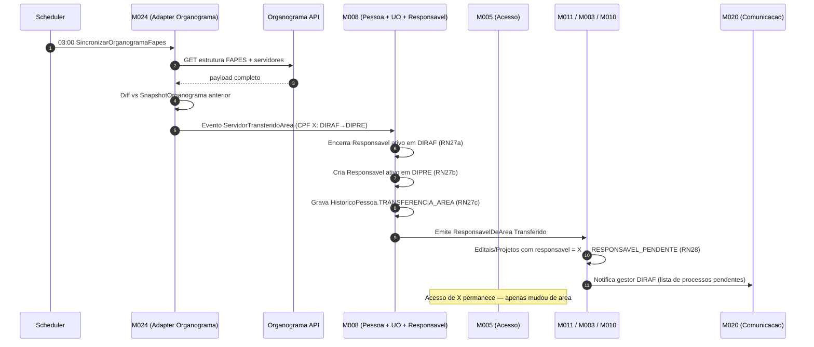

# Organograma ES — Cadastro automatico de servidores backoffice

[← Voltar para Integracoes](README.md) | [Glossario](../glossario.md) | [Regras de Passagem de Areas](../regras-passagem-areas-fapes.md)

## O que e

`Organograma ES` (`api.organograma.es.gov.br`) e o catalogo oficial da estrutura do Estado: orgaos, secretarias, autarquias, fundacoes (FAPES inclusa) com servidores, cargos e lotacoes. E mantido pelo Estado e atualizado conforme atos de pessoal (nomeacao, exoneracao, transferencia, aposentadoria).

## Por que o Conecta precisa

Hoje servidores da FAPES sao **cadastrados manualmente** no Conecta como `PessoaFisica` + vinculo a `UnidadeOrganizacional` (Area Tecnica). Resultado: dados desatualizados, sem reflexo de mudancas funcionais, esforco operacional repetido. Feature `1.1.6 Cadastro automatico Back-office (API Organograma)` em `domains/01-corporativo.md:20` ja prevê uso (Art. 30); falta operacionalizacao.

Ao integrar com Organograma:
- Servidor **so existe no Conecta backoffice se existir no Organograma** (fonte unica de verdade).
- Mudancas funcionais (transferencia entre areas, exoneracao, aposentadoria) sao **detectadas automaticamente** e disparam regras formalizadas em [regras-passagem-areas-fapes.md](../regras-passagem-areas-fapes.md).
- Estrutura organizacional interna FAPES (DIRAF, DIPRE, DAFIN, DIGEC etc) tambem sincroniza — `UnidadeOrganizacional` em M008 espelha o Organograma.

## Capacidades aproveitadas

| Capacidade | Como Conecta usa |
|-----------|------------------|
| Listar estrutura interna de orgao | Importa unidades organizacionais da FAPES recursivamente |
| Listar servidores por unidade | Identifica quem esta lotado em cada Area Tecnica |
| Consultar servidor por CPF | Validacao no primeiro login backoffice (M005) |
| Detalhes de servidor | Matricula, cargo, lotacao atual, situacao (ativo/aposentado/exonerado) |
| Diff entre snapshots | Conecta calcula localmente comparando snapshot anterior vs atual |

## Decisoes de uso

| Decisao | Escolha |
|---------|---------|
| Trigger de sincronizacao | **Job batch diario** (03:00) — sem on-demand no login |
| Escopo | **Apenas servidores FAPES + UnidadeOrganizacional internas FAPES** |
| Off-boarding | **Suspender acesso + manter historico** — exoneracao detectada bloqueia M005 imediatamente; mandatos `Responsavel` ativos sao encerrados; dados preservados para auditoria |
| Identidade compartilhada | Servidor loga no Conecta com Acesso Cidadao; M005 valida CPF contra espelho local do Organograma |

## Fluxo end-to-end (caso transferencia DIRAF → DIPRE)



```mermaid
sequenceDiagram
    autonumber
    participant Org as M024
    participant M008 as M008
    participant M005 as M005

    Org->>Org: Diff detecta servidor X exonerado
    Org->>M005: Evento ServidorExonerado(cpf=X)
    M005->>M005: Suspende sessoes ativas + bloqueia novos logins
    Org->>M008: Encerra Responsavel ativos de X
    M008->>M008: HistoricoPessoa.EXONERACAO + justificativa "Detectado via Organograma yyyy-mm-dd"
    Note over M005,M008: Dados preservados; reativacao apenas se Organograma reincluir CPF
```

## Mapa de mapeamento Organograma ↔ Conecta (M008)

| Organograma | Conecta | Observacao |
|-------------|---------|------------|
| Servidor (CPF + matricula + cargo) | `PessoaFisica` (CPF) + `Responsavel` (mandato em UO) | Match por CPF |
| Setor/Diretoria/Coordenacao FAPES | `UnidadeOrganizacional` (M008) | `codigoOrganograma` armazenado para conciliacao |
| Lotacao atual | `Responsavel` ativo (xor `unidade`) | RN11/RN26: 1 ativo por entidade |
| Mudanca de lotacao | Evento `ServidorTransferidoArea` | Encerra mandato anterior + cria novo (RN27) |
| Exoneracao/aposentadoria | Evento `ServidorExonerado` | Suspende M005 + encerra mandatos (RN30) |

## Regras de negocio dependentes

Integracao Organograma e **pre-requisito tecnico** para as regras formalizadas em [regras-passagem-areas-fapes.md](../regras-passagem-areas-fapes.md): RN27 (encerramento + nova designacao), RN28 (cascata em editais/projetos), RN29 (janela de 15 dias uteis), RN30 (off-boarding), RN31 (nao sobreposicao de mandato), RI6 (auditoria imutavel).

## Capacidades que precisam ser confirmadas no swagger

> Fonte canonica: `https://api.organograma.es.gov.br/index.html`. Time deve mapear paths/payloads exatos antes da implementacao.

| Capacidade esperada | Operacao tipica |
|---------------------|-----------------|
| Autenticacao | OAuth2 client credentials ou token publico |
| Listar orgaos do Estado | `GET /orgaos` |
| Estrutura interna de orgao | `GET /orgaos/{codigo}/estrutura` (recursivo) |
| Listar servidores por setor | `GET /setores/{codigo}/servidores` |
| Consultar servidor por CPF | `GET /servidores?cpf={cpf}` |
| Detalhes do servidor | `GET /servidores/{matricula}` (cargo, lotacao, situacao) |
| Historico de lotacao | `GET /servidores/{matricula}/historico` (se existir) |

## Pendencias de discovery

1. **Auth Organograma**: OAuth2 client credentials, API key ou token publico? Confirmar com PRODEST/SEGER.
2. Existe `homolog.api.organograma.es.gov.br`?
3. Rate limit + paginacao obrigatoria em listagens grandes?
4. API expoe historico de lotacao do servidor ou apenas estado atual?
5. Existe webhook futuro para mudancas, ou apenas polling?
6. Servidores comissionados/cedidos aparecem com lotacao FAPES ou no orgao de origem?
7. Como API representa afastamentos temporarios (licenca, ferias)? Sao exoneracao ou variante?
8. Em parcerias com outros orgaos (M010), Conecta consulta servidor de outra entidade? Se sim, escopo se expande.
