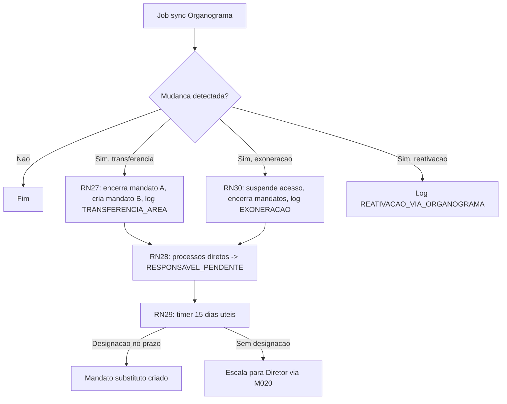

# Regras de Passagem de Areas Tecnicas — FAPES

[Glossario](glossario.md) | [Personas](personas.md) | [Integracao Organograma](integracoes/organograma.md) | [Domain 01 Corporativo](domains/01-corporativo.md)

## Contexto

Servidores da FAPES sao lotados em uma `UnidadeOrganizacional` (Area Tecnica: DIRAF, DIPRE, DAFIN, DIGEC etc) e conduzem processos administrativos vinculados a essa lotacao — editais (M011), projetos (M003), parcerias (M010), bolsas (M009). Quando o servidor **muda de area** ou **deixa a FAPES**, hoje o repositorio nao formaliza o que acontece com (a) o vinculo `Responsavel`, (b) processos em andamento sob sua responsabilidade, (c) historico para auditoria.

Este documento formaliza as regras dessa transicao. As mudancas sao **detectadas automaticamente** via integracao com o [Organograma ES](integracoes/organograma.md) (job batch diario) e disparam os fluxos descritos abaixo.

## Fundamentacao legal

| Referencia | O que cobre |
|------------|-------------|
| Art. 16 (Regimento FAPES) | Estrutura organizacional interna e Areas Tecnicas |
| Art. 30 (Regimento FAPES) | Alteracoes funcionais e movimentacoes internas de servidores |
| Lei 5361/96 (Estatuto do servidor publico ES) | Atos de pessoal: nomeacao, remocao, exoneracao, aposentadoria |

> Pendente: validar com Diretoria Juridica da FAPES se Art. 30 fundamenta o prazo de 15 dias uteis (RN29) e o fluxo de cascata em processos pendentes (RN28).

## Modelo afetado

- `PessoaFisica` (M008/pessoas) — servidor backoffice da FAPES.
- `UnidadeOrganizacional` (M008/instituicoes) — Area Tecnica em que servidor esta lotado.
- `Responsavel` (M008/instituicoes) — vinculo temporal `PessoaFisica`↔`UnidadeOrganizacional` com `dataInicioMandato` / `dataFimMandato` / `ativo`.
- `HistoricoPessoa` (M008/pessoas) — log imutavel de eventos da pessoa.
- Editais, Projetos, Parcerias, Solicitacoes — entidades que apontam para `UnidadeOrganizacional` ou `PessoaFisica` como responsavel.

## Regras formalizadas

### RN27 — Transferencia detectada gera reorganizacao automatica de mandatos

Quando integracao Organograma detecta que servidor mudou de UO `A` para UO `B`, o sistema deve, em ordem:

a) Encerrar `Responsavel` ativo do servidor em `A` definindo `dataFimMandato = dataDeteccao`.
b) Criar nova entrada `Responsavel` ativa do servidor em `B` com `dataInicioMandato = dataDeteccao`.
c) Registrar `HistoricoPessoa` tipo `TRANSFERENCIA_AREA` com `lotacaoAnterior=A`, `lotacaoNova=B`, `justificativa="Detectado via Organograma yyyy-mm-dd"`.

### RN28 — Cascata em processos sob responsabilidade direta do servidor

Editais, Projetos, Parcerias e Solicitacoes que apontavam para o servidor transferido como **responsavel direto** transitam automaticamente para estado `RESPONSAVEL_PENDENTE` aguardando reatribuicao manual pelo gestor da UO `A` (origem). A vinculacao da entidade a `UnidadeOrganizacional` `A` permanece — apenas a designacao individual fica pendente.

### RN29 — Janela de transicao de 15 dias uteis

A partir do estado `RESPONSAVEL_PENDENTE`, o gestor da UO `A` tem **15 dias uteis** para designar substituto temporario ou permanente. Apos o prazo sem designacao, o sistema escala automaticamente para o Diretor administrativo da FAPES via M020 (Comunicacao).

### RN30 — Off-boarding (exoneracao, aposentadoria, falecimento)

Quando integracao Organograma detecta que servidor saiu da FAPES (situacao ≠ ativa, ou ausencia no payload), o sistema deve, imediatamente:

a) Suspender sessoes ativas em M005 e bloquear novos logins.
b) Encerrar todos `Responsavel` ativos do servidor (`dataFimMandato = dataDeteccao`).
c) Registrar `HistoricoPessoa` tipo `EXONERACAO` com `justificativa="Detectado via Organograma yyyy-mm-dd"`.
d) Aplicar regra RN28 (cascata) a todos os processos sob responsabilidade direta.
e) Preservar todos os dados historicos (PessoaFisica nao e excluido).

Reativacao posterior so ocorre se Organograma voltar a listar o CPF como ativo, gerando `HistoricoPessoa.REATIVACAO_VIA_ORGANOGRAMA`.

### RN31 — Mandatos nao podem se sobrepor

Mantida a regra RN11 (Instituicao) e RN26 (UnidadeOrganizacional): cada entidade pode ter no maximo um `Responsavel` ativo ao mesmo tempo. Toda nova designacao exige encerramento explicito do mandato anterior na mesma entidade. RN27 satisfaz isso ao executar (a) antes de (b).

### RI6 — Auditoria imutavel

Toda transicao gerada por RN27, RN28 ou RN30 produz registro em `HistoricoPessoa` com timestamp da deteccao, fonte (`Organograma`), e payload do evento que originou a mudanca. Registros sao imutaveis. Permite reconstruir, em qualquer momento, quem era responsavel por qual processo em qual data.

## Eventos novos em `HistoricoPessoa`

Estende enum `TipoEventoPessoa` com:

| Tipo | Quando emitir |
|------|---------------|
| `TRANSFERENCIA_AREA` | Mudanca de lotacao detectada (RN27) |
| `EXONERACAO` | Saida da FAPES detectada (RN30) |
| `REATIVACAO_VIA_ORGANOGRAMA` | CPF volta a aparecer como ativo apos exoneracao previa |

## Fluxo de decisao

## Open questions

1. Art. 30 cobre o prazo de 15 dias uteis ou o prazo deve vir de Diretoria Juridica?
2. Casos especiais — afastamento temporario (licenca, ferias, capacitacao): considerar transferencia ou estado intermediario?
3. Servidores comissionados/cedidos: lotacao FAPES vale ou prevalece orgao de origem?
4. Cascata RN28 cobre quais entidades exatamente? Confirmar com cada modulo:
   - M011 Editais com `area tecnica responsavel`
   - M003 Projetos/Iniciativas com `analista responsavel`
   - M010 Parcerias com `responsavel pela parceria`
   - M009 Bolsas em formalizacao
5. Em ferias/licenca, Responsavel ativo permanece ou cria entrada de substituto temporario? (Ligado a M006 Autorizacao — Delegacao de Funcoes via OpenFGA, ainda "A definir".)

## Referencias

- [Integracao Organograma ES](integracoes/organograma.md) — fonte canonica das deteccoes
- [Glossario](glossario.md) — verbetes Lotacao, Passagem de Area, Servidor FAPES
- [Domain 01 Corporativo](domains/01-corporativo.md) — features 1.1.6, 1.3.2, 1.3.3
- M008/instituicoes — entidades `Responsavel`, `UnidadeOrganizacional`
- M008/pessoas — `HistoricoPessoa`
- M005-autenticacao — bloqueio de acesso em RN30
- M006-autorizacao + ADR-007 OpenFGA — delegacao de funcoes (futuro)
