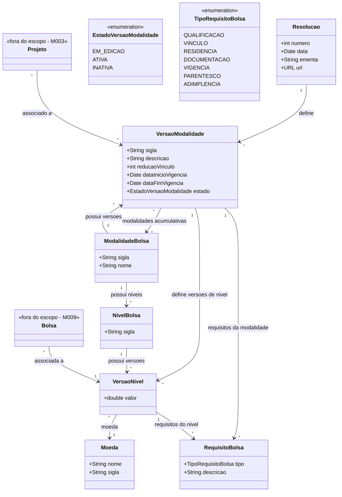

# Modelo Estrutural

Dominio e regras de negocio: ver [README.md](README.md)

### Diagrama de Classes

## Dicionario de Dados

| Classe | Atributo | Definicao | Obrig. | Tipo | Dominio | Tamanho | Unico |
|--------|----------|-----------|--------|------|---------|---------|-------|
| **Resolucao** | numero | Numero de identificacao da resolucao | Sim | Int | Ex: 332 | | Sim |
| | data | Data em que foi lancada a resolucao | Sim | Date | Ex: 17/03/2024 | | |
| | ementa | Descricao dos objetivos da resolucao | Sim | String | | 500 | |
| | url | Url de acesso a publicacao da resolucao | Sim | URL | | | |
| **ModalidadeBolsa** | sigla | Sigla de identificacao da modalidade | Sim | String | Ex: BPIG, DTI-A | | Sim |
| | nome | Nome da modalidade apresentada na resolucao | Sim | String | | | Sim |
| **VersaoModalidade** | sigla | Combinacao entre nome da modalidade, hifen, ano e resolucao | Gerado | String | Ex: BPIG-2023, DTI-A-2024 | | Sim |
| | descricao | Finalidade dessa modalidade definida na resolucao | Sim | String | | | |
| | reducaoVinculo | Percentual de valor da bolsa em caso de vinculo empregaticio | Sim | Int | 100% [default] ou 0% | | |
| | dataInicioVigencia | Data de inicio de vigencia da versao | Sim | Date | | | |
| | dataFimVigencia | Data de termino da versao | Sim | Date | | | |
| | estado | Estado da versao da modalidade | Gerado | EstadoVersaoModalidade | Em edicao, Ativa, Inativa | | |
| **NivelBolsa** | sigla | Sigla do nivel (formato: sigla modalidade + hifen + indice) | Sim | String | Ex: BPIG-I, DTI-A-1 | | Sim |
| **VersaoNivel** | valor | Valor monetario da versao do nivel | Sim | Double | | | |
| | moeda | Moeda em que o valor e cotado | Sim | Moeda | | | |
| **Moeda** | nome | Nome da moeda | Sim | String | | | |
| | sigla | Sigla da moeda | Sim | String | Ex: Real, Dolar, Euro, Libra | | |
| **RequisitoBolsa** | tipo | Tipo de requisito para implementacao da bolsa | Sim | TipoRequisitoBolsa | Qualificacao, Vinculo, Residencia, Documentacao, Vigencia, Parentesco, Adimplencia | | |
| | descricao | Descricao textual do requisito | Sim | String | | | |

## Notas de Implementacao

**Tipagem:**
- Atributos simples usam tipos da linguagem (int, Date, String, Double, URL)
- Conjuntos de valores bem definidos usam enums (EstadoVersaoModalidade, TipoRequisitoBolsa)
- Valores pre-definidos na base usam classes (Moeda — cadastro fora do escopo deste modulo)

**Navegabilidade:**
- Cardinalidade 1: atributo do tipo da classe destino (ex: VersaoModalidade.resolucao: Resolucao)
- Cardinalidade N: atributo lista do tipo da classe destino (ex: VersaoModalidade.requisitos: List&lt;RequisitoBolsa&gt;)
