# Modelo Comportamental

Dominio e regras de negocio: ver [README.md](README.md)

O comportamento do M002 se expressa em: (a) ciclos de vida dos recursos gerenciados (planilha, lock, tipo ativo, job de importacao) e (b) fluxos de orquestracao operacional, desde a producao diaria do dump SIGFAPES ate a geracao dos JSONLs de importacao.

## Ciclos de vida

### Planilha (por `kind + MM_YYYY + edital_id`)

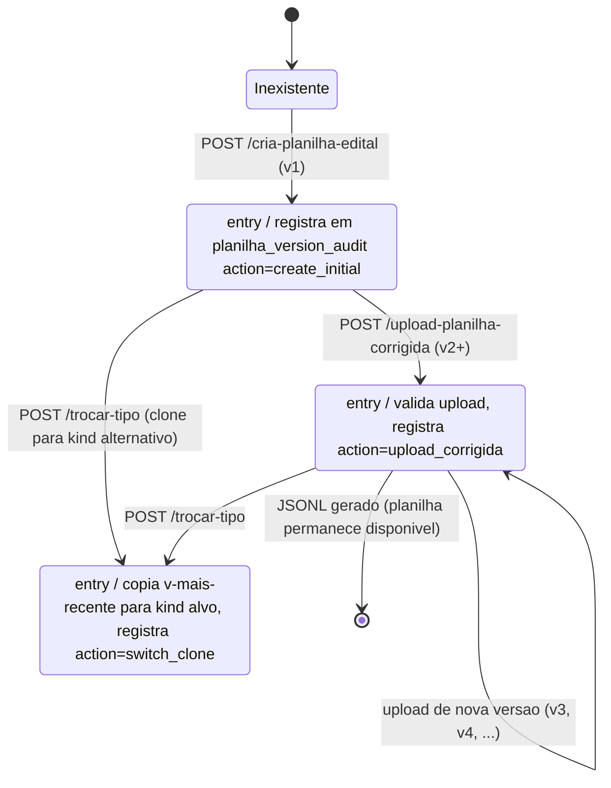

### ResourceLock

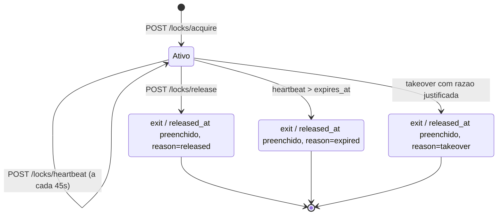

### ResourceKindState

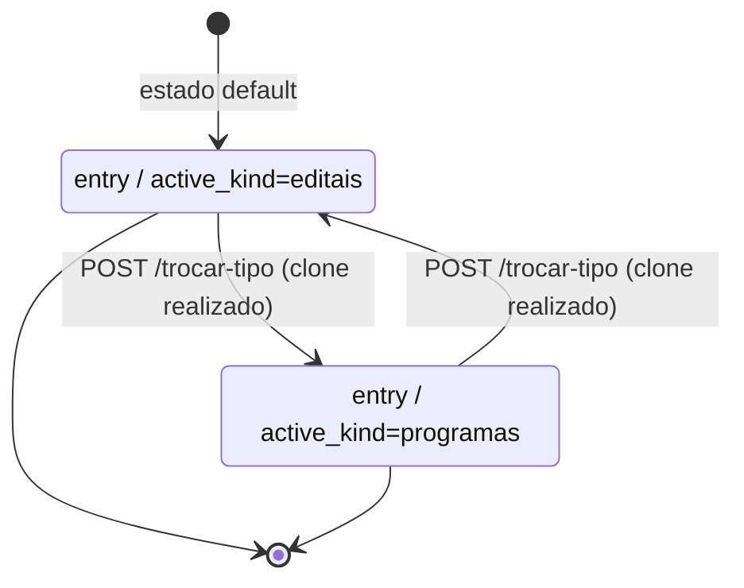

Cada transicao grava uma linha em `resource_kind_switch_log`.

### ImportJob

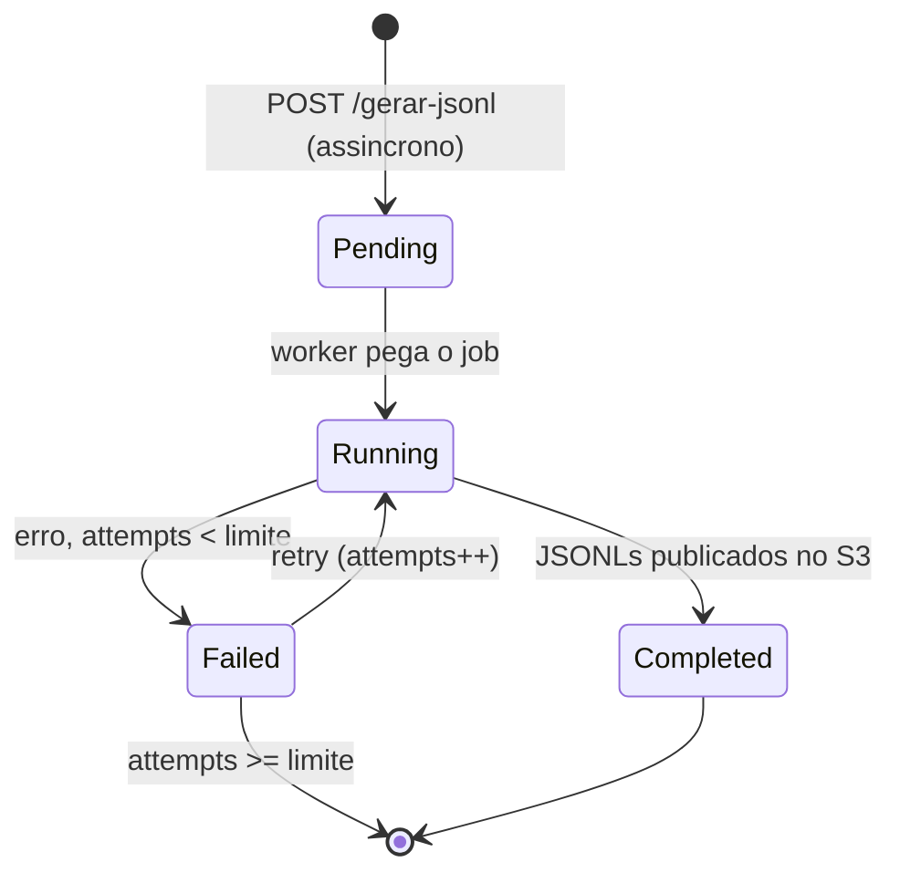

## Fluxo: Producao diaria dos dumps (SIGFAPES + Conecta)

Dois jobs independentes abastecem o S3 de trabalho. O backend nunca acessa o SIGFAPES em tempo de request — apenas le os Parquets e JSONs ja publicados.

### Dump SIGFAPES (API HTTP)

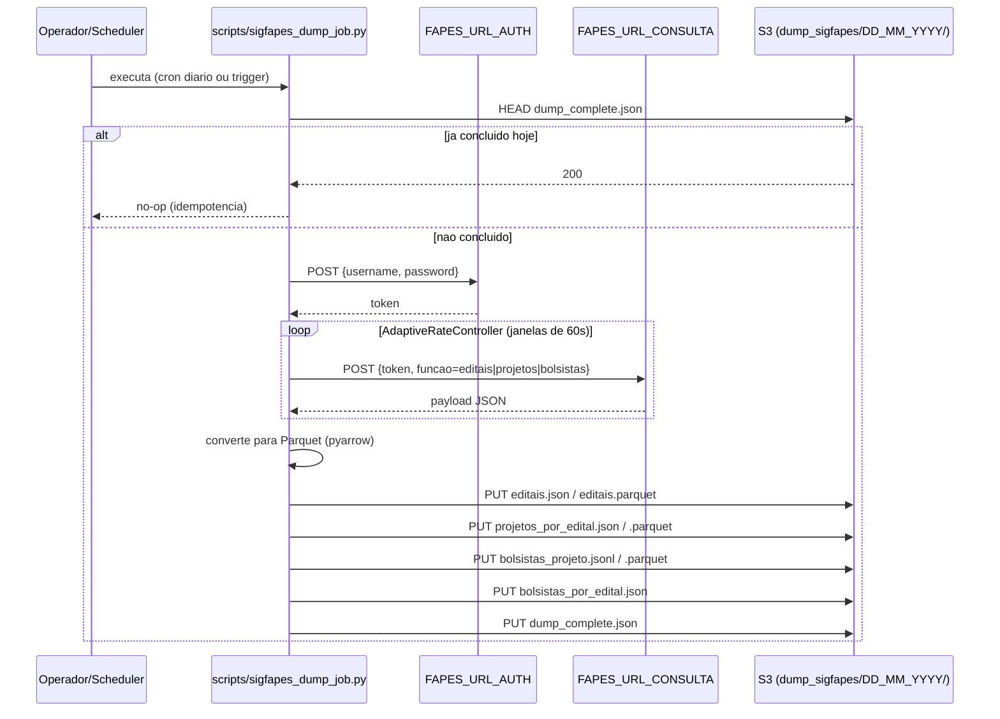

### Dump Conecta (MinIO -> S3)

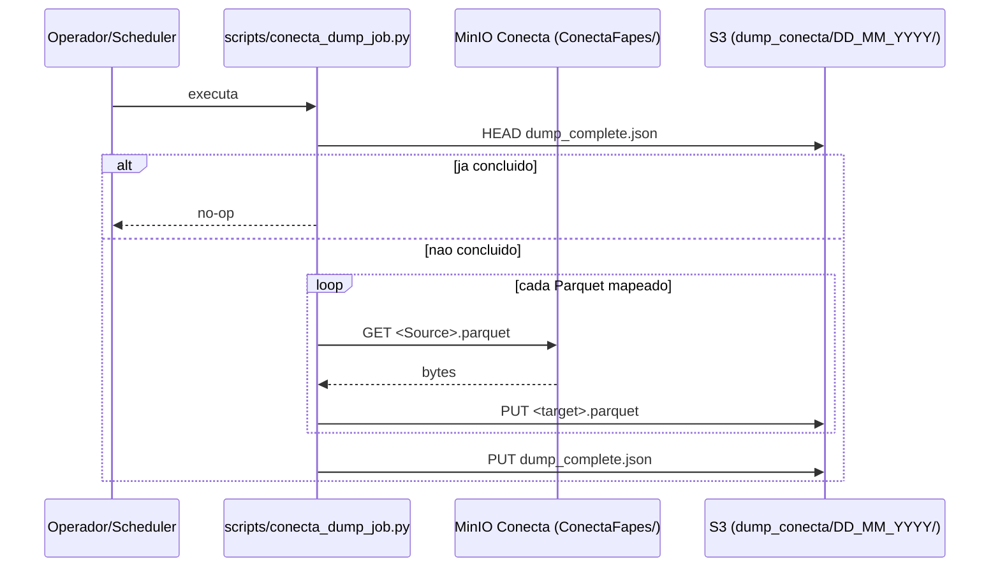

## Fluxo: Autenticacao e listagem de editais

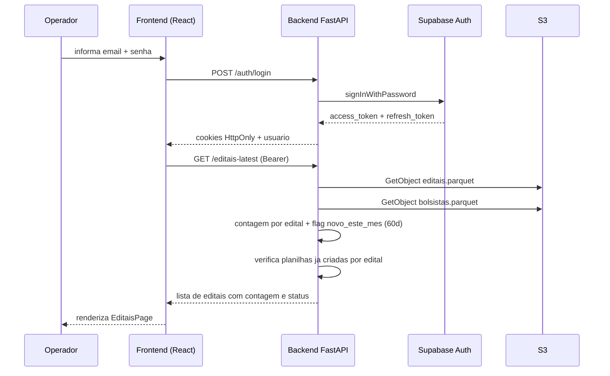

## Fluxo: Geracao da planilha inicial e ciclo de lock

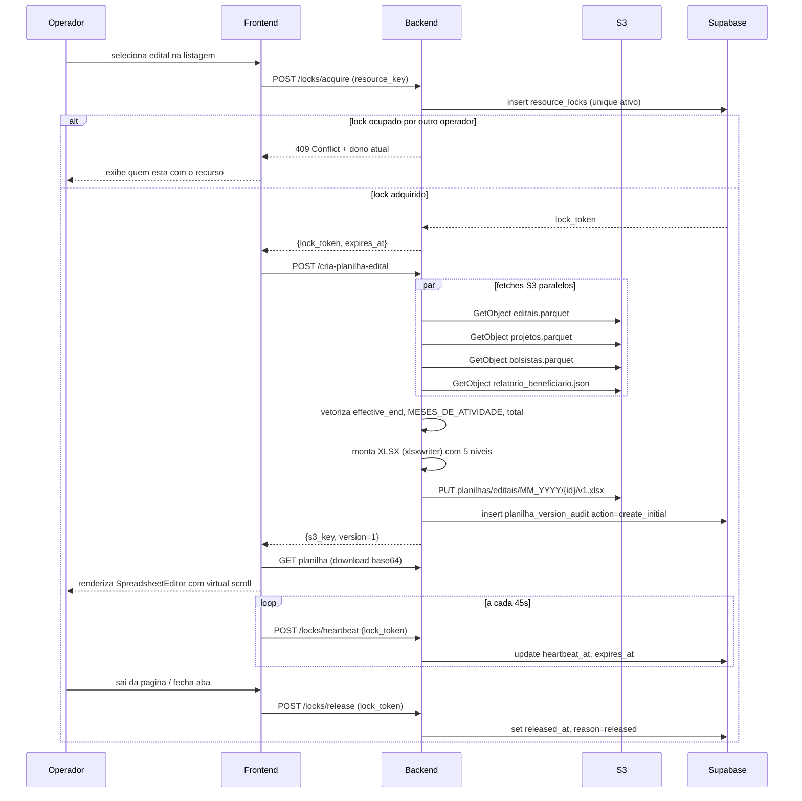

## Fluxo: Correcao, validacao e upload da planilha

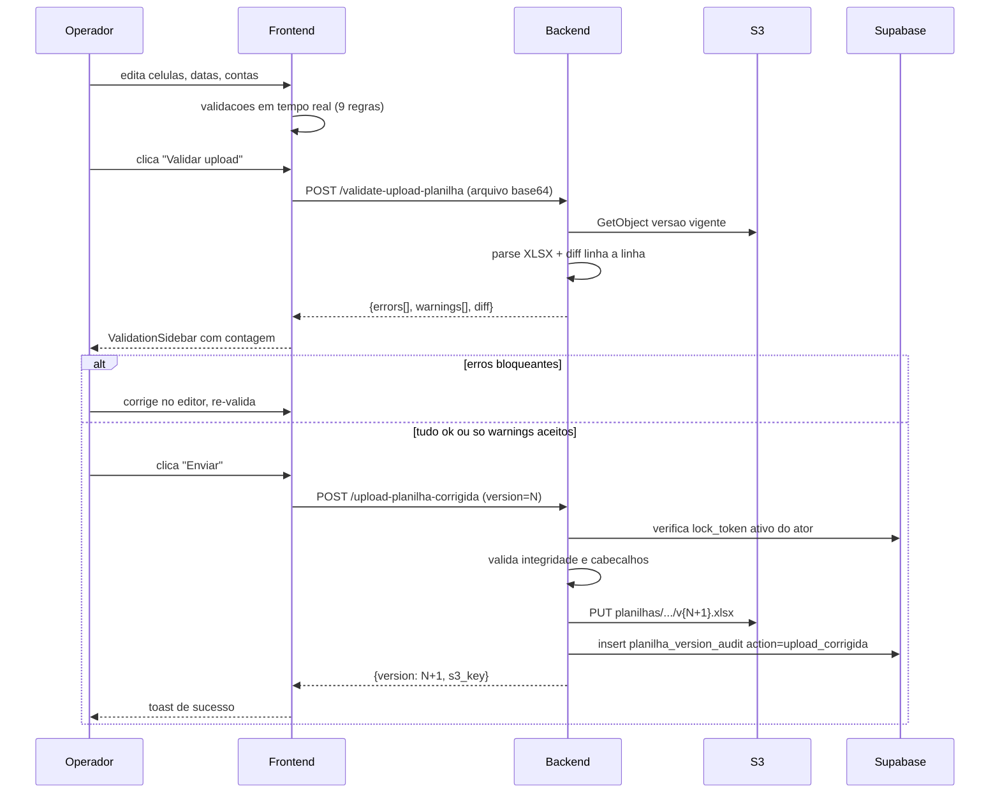

## Fluxo: Troca do tipo de recurso (editais <-> programas)

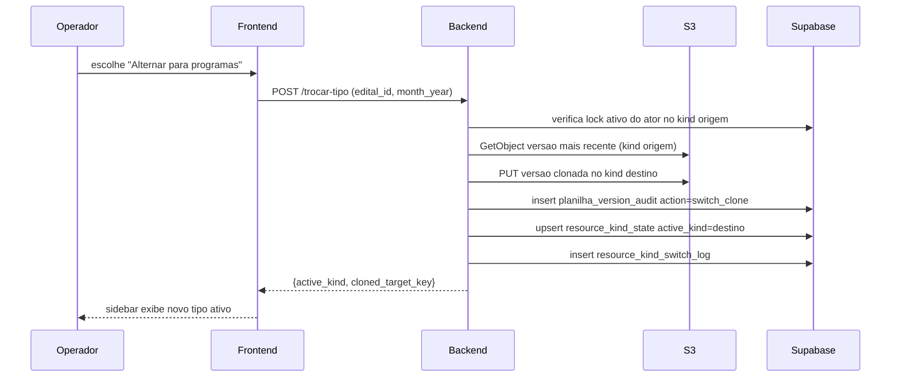

## Fluxo: Geracao dos arquivos de importacao (JSONL)

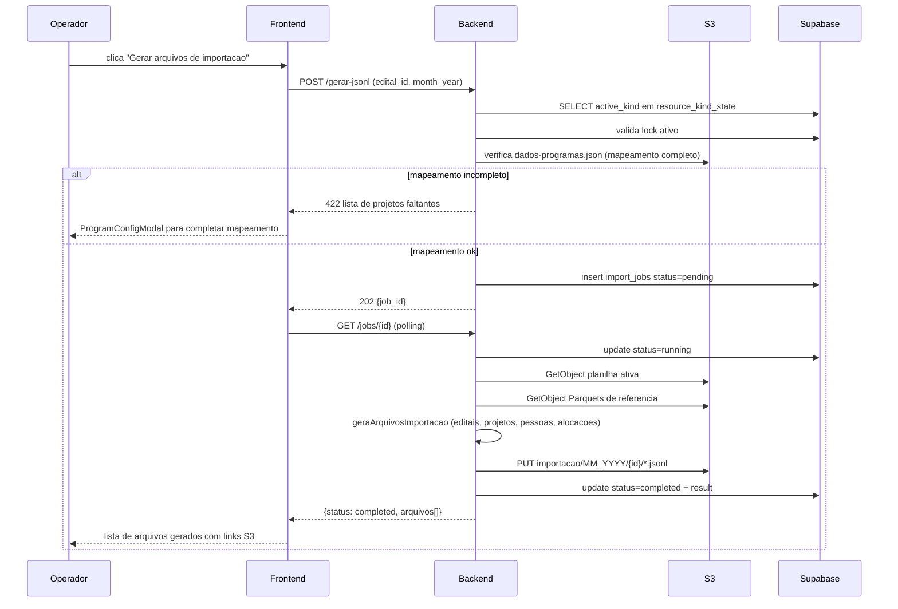

## Invariantes comportamentais

- **Exclusividade de edicao**: nenhuma operacao de escrita em planilha (cria-planilha, upload-corrigida, trocar-tipo) avanca sem lock_token ativo do ator solicitante.
- **Consistencia de tipo**: a geracao de JSONL sempre consulta `resource_kind_state` antes de escolher a planilha fonte, evitando divergencia entre o que foi corrigido e o que foi exportado.
- **Auditoria total**: toda versao produzida (inicial, upload, clone) tem uma linha em `planilha_version_audit` com ator, request_id e motivo.
- **Heartbeat obrigatorio**: falha em emitir heartbeat a cada 45s leva o lock a `expires_at` e permite takeover por outro operador.
- **Versionamento monotonico**: versoes so crescem; nao ha "rollback" destrutivo - para reverter, o operador sobe uma nova versao com o conteudo desejado.
