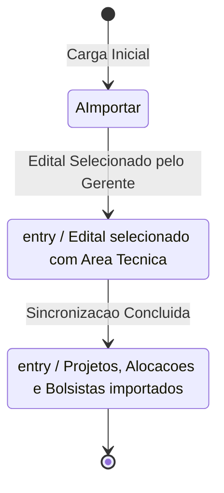
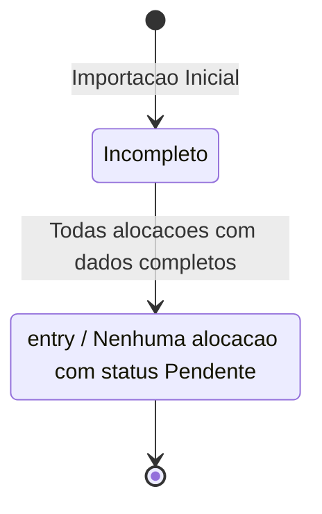
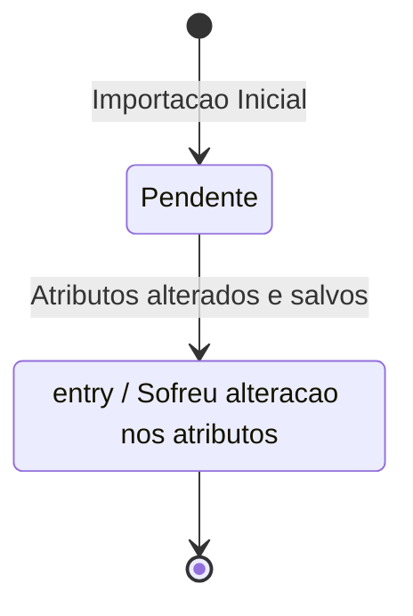

# Modelo Comportamental

Dominio e regras de negocio: ver [README.md](README.md)

### Ciclo de Vida: Edital

```mermaid
stateDiagram-v2
    [*] --> AImportar : Carga Inicial

    AImportar --> NaoImportado : Edital Selecionado pelo Gerente
    NaoImportado --> Importado : Sincronizacao Concluida

    NaoImportado : entry / Edital selecionado com Area Tecnica
    Importado : entry / Projetos, Alocacoes e Bolsistas importados

    Importado --> [*]
```

### Ciclo de Vida: Projeto

```mermaid
stateDiagram-v2
    [*] --> Incompleto : Importacao Inicial

    Incompleto --> Completo : Todas alocacoes com dados completos

    Completo : entry / Nenhuma alocacao com status Pendente
    Completo --> [*]
```

### Ciclo de Vida: AlocacaoBolsista

```mermaid
stateDiagram-v2
    [*] --> Pendente : Importacao Inicial

    Pendente --> Modificado : Atributos alterados e salvos

    Modificado : entry / Sofreu alteracao nos atributos
    Modificado --> [*]
```
