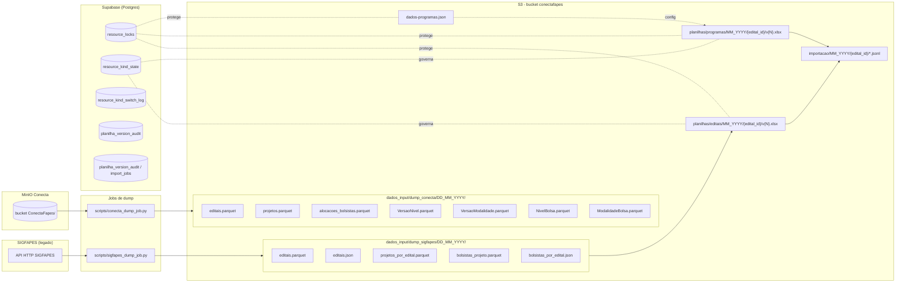
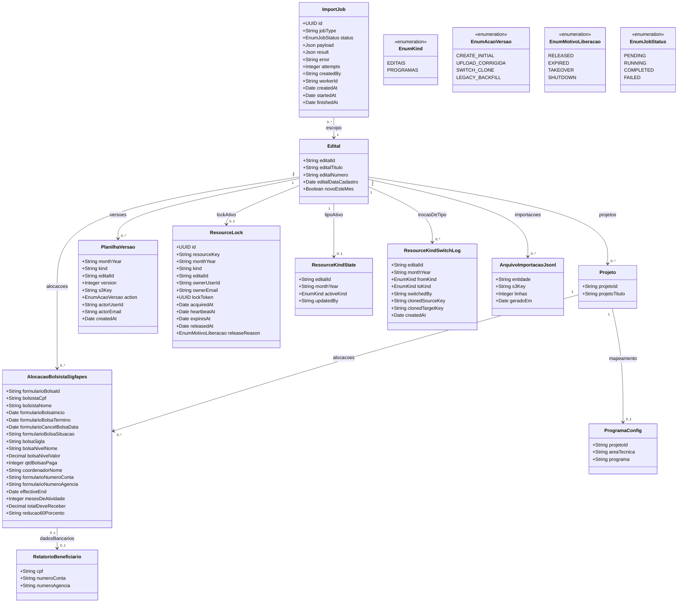

# Modelo Estrutural

Dominio e regras de negocio: ver [README.md](README.md)

O M002 nao possui banco de dados relacional proprio para o estado de negocio: a verdade dos bolsistas vem de dumps publicados no S3 por dois jobs Python (`scripts/sigfapes_dump_job.py` e `scripts/conecta_dump_job.py`), e o estado de edicao/colaboracao e persistido em tabelas Supabase auxiliares (locks, tipo de recurso ativo, auditoria de versoes e fila de jobs). As planilhas em si sao arquivos XLSX versionados no S3.

## Visao geral dos artefatos

## Artefatos no S3 (dump SIGFAPES via API HTTP)

Publicados pelo script `scripts/sigfapes_dump_job.py` em `s3://<bucket>/<SIGFAPES_DUMP_PREFIX>/<DD_MM_YYYY>/`. O job autentica por `POST {username, password}` em `FAPES_URL_AUTH`, consulta `FAPES_URL_CONSULTA` com `funcao in {editais, projetos, bolsistas}` e usa o `AdaptiveRateController` (janelas de 60s com backoff) para nao saturar o legado. Um marker `dump_complete.json` sinaliza idempotencia — execucoes posteriores no mesmo dia sao no-op.

Artefatos produzidos:

- `editais.json` e `editais.parquet` — lista completa de editais.
- `projetos_por_edital.json` e `projetos_por_edital.parquet` — projetos ligados a cada edital.
- `bolsistas_projeto.jsonl` e `bolsistas_projeto.parquet` — alocacoes de bolsa por projeto.
- `bolsistas_por_edital.json` — indice auxiliar para a UI.
- `dump_complete.json` — marker de conclusao.

### editais.parquet

Cada linha representa um edital ofertado pela agencia.

| Coluna | Tipo | Papel |
|--------|------|-------|
| edital_id | String | Identificador do edital no SIGFAPES (chave) |
| edital_titulo | String | Titulo oficial |
| edital_numero | String | Numero visivel (ex.: "18/2023") |
| edital_data_cadastro | Timestamp | Data de cadastro do edital no SIGFAPES (base para flag `novo_este_mes`) |

### projetos_por_edital.parquet

| Coluna | Tipo | Papel |
|--------|------|-------|
| projeto_id | String | Identificador do projeto no SIGFAPES |
| projeto_titulo | String | Titulo do projeto, usado no mapa Programas->Area Tecnica |

Apenas `projeto_id` e `projeto_titulo` sao lidos (`_PROJETOS_COLUMNS`).

### bolsistas_projeto.parquet

Cada linha representa uma alocacao de bolsa (bolsista + projeto + periodo).

| Coluna | Tipo | Papel |
|--------|------|-------|
| edital_id | String | FK para edital |
| projeto_id | String | FK para projeto |
| dados_pessoais | Struct | Nome, CPF, e demais dados pessoais do bolsista |
| bolsista_pesquisador_cpf | String | CPF do bolsista (chave de juncao com `relatorio_beneficiario.json`) |
| formulario_bolsa_id | String | Identificador da bolsa no formulario SIGFAPES |
| formulario_bolsa_situacao | String | Situacao da bolsa (ATIVA, CANCELADA etc.) |
| formulario_bolsa_inicio | Date | Data de inicio da bolsa |
| formulario_bolsa_termino | Date | Data prevista de termino |
| formulario_cancel_bolsa_data | Date | Data de cancelamento efetivo (quando existe) |
| bolsa_sigla | String | Sigla da bolsa/nivel |
| bolsa_nivel_nome | String | Nome do nivel (ex.: "Nivel 1", "60% Nivel 3") |
| bolsa_nivel_valor | Decimal | Valor mensal da bolsa |
| qtd_bolsas_paga | Integer | Quantidade de bolsas ja pagas para a alocacao |
| coordenador_nome | String | Coordenador responsavel pelo projeto |
| formulario_numero_conta | String | Conta bancaria informada no formulario |
| formulario_numero_agencia | String | Agencia bancaria informada no formulario |

Colunas efetivamente lidas estao em `_BOLSISTAS_COLUMNS` (planilha_edital.py).

### relatorio_beneficiario.json

JSON (array ou JSON lines) com dados bancarios atualizados do bolsista. Join por CPF sobrepoe `formulario_numero_conta` e `formulario_numero_agencia` durante a montagem da planilha.

## Artefatos no S3 (dump Conecta via MinIO)

Publicados pelo script `scripts/conecta_dump_job.py` em `s3://<bucket>/<CONNECTA_DUMP_PREFIX>/<DD_MM_YYYY>/`. O job copia Parquets ja materializados no bucket MinIO do Conecta (prefixo `ConectaFapes/`) para o S3 de trabalho, renomeando conforme a convencao do backend:

| Origem (MinIO) | Destino (S3) |
|----------------|--------------|
| `Edital.parquet` | `editais.parquet` |
| `Projeto.parquet` | `projetos.parquet` |
| `AlocacaoBolsista.parquet` | `alocacoes_bolsistas.parquet` |
| `VersaoNivel.parquet` | `VersaoNivel.parquet` |
| `VersaoModalidade.parquet` | `VersaoModalidade.parquet` |
| `NivelBolsa.parquet` | `NivelBolsa.parquet` |
| `ModalidadeBolsa.parquet` | `ModalidadeBolsa.parquet` |

Um marker `dump_complete.json` sinaliza conclusao e serve como guarda de idempotencia.

## Planilhas versionadas no S3

As planilhas corrigidas e as iniciais ficam no mesmo espaco, versionadas por inteiro incremental.

- **Chave**: `<EDITAIS_CORRIGIDOS_PREFIX>/<kind>/<MM_YYYY>/<edital_id>/v<N>.xlsx`
- **kind**: `editais` (uma linha por bolsista) ou `programas` (planilha reorganizada por programa/area).
- **MM_YYYY**: mes e ano da competencia (ex.: `04_2026`).
- **N**: inteiro monotonico por escopo; `v1` e a planilha inicial criada pelo sistema e `vN>1` sao uploads do operador.

### Layout do XLSX (`kind = editais`)

Gerado por `build_planilha_edital_xlsx_bytes()` em `planilha_edital.py`.

Cabecalho de cada bolsista: dados do edital, projeto, bolsista, periodo e conta bancaria. Em seguida, cinco grupos de colunas de nivel de bolsa (`MAX_NIVEIS_BOLSA = 5`):

| Coluna | Descricao |
|--------|-----------|
| BOLSA NIVEL_{1..5} | Nome do nivel para cada grupo |
| BOLSA VALOR_{1..5} | Valor mensal do nivel |
| 60 DA BOLSA_{1..5} | Flag SIM/NAO indicando reducao de 60% (nome do nivel contem "60") |
| MESES DE ATIVIDADE_{1..5} | Numero inteiro de meses ativos no nivel (vetorizado) |
| TOTAL DEVE RECEBER_{1..5} | `BOLSA VALOR * MESES DE ATIVIDADE` |

Apenas a coluna `_{5}` e inicialmente preenchida pelo sistema a partir do dump; as colunas `_{1..4}` ficam em branco e sao para o operador preencher em cenarios de bolsa com mais de um nivel no periodo.

### Layout do XLSX (`kind = programas`)

Versao clonada a partir de `editais` quando o operador alterna o tipo ativo. A estrutura fisica e identica; a semantica difere pelo agrupamento logico por programa/area. O clone e registrado em `resource_kind_switch_log`.

## Configuracao de programas

- **Arquivo**: `<EDITAIS_CORRIGIDOS_PREFIX>/dados-programas.json` (ou caminho derivado).
- **Estrutura**: mapa de `projeto_id` -> `{ area_tecnica, programa }` usado pelo endpoint `GET /dados-programas` e persistido via `POST /dados-programas`.
- **Uso**: necessario antes de gerar JSONLs, define o mapeamento obrigatorio de cada projeto para uma Area Tecnica (M008) conhecida.

## JSONLs de importacao

Gerados por `geraArquivosImportacao.py` via `POST /gerar-jsonl`.

- **Chave**: `importacao/<MM_YYYY>/<edital_id>/<entidade>.jsonl`
- **Entidades**: `editais.jsonl`, `projetos.jsonl`, `pessoas.jsonl`, `alocacoes.jsonl`, etc. (uma linha JSON por registro, pronta para consumo do M003 - Iniciativas Captadas).
- **Invariante**: toda geracao exige planilha existente (`v>=1`), mapeamento de programas completo e lock ativo do operador.

## Tabelas Supabase

### resource_locks

Lock exclusivo por recurso (planilha + mes + tipo) com heartbeat para detectar sessoes abandonadas.

| Coluna | Tipo | Definicao |
|--------|------|-----------|
| id | UUID (PK) | Identificador do lock |
| resource_key | Text | Chave canonica `<kind>/<MM_YYYY>/<edital_id>` |
| month_year | Text | Formato `MM_YYYY` (check regex) |
| kind | Text | `editais` ou `programas` |
| edital_id | Text | Somente digitos |
| owner_user_id | Text | ID Supabase do operador |
| owner_email | Text | Email cache para logs |
| lock_token | UUID | Token rotacionado que o cliente precisa apresentar em heartbeat/release |
| acquired_at | Timestamptz | Instante de aquisicao |
| heartbeat_at | Timestamptz | Ultimo heartbeat recebido |
| expires_at | Timestamptz | Instante em que o lock e considerado expirado |
| released_at | Timestamptz | Nulo quando ativo; preenchido em release ou takeover |
| release_reason | Text | `released` \| `expired` \| `takeover` \| `shutdown` |
| created_at / updated_at | Timestamptz | Auditoria de linha |

Indices:
- `idx_resource_locks_active_resource_key` (unique) em `resource_key` onde `released_at is null` - garante exatamente um lock ativo por recurso.
- `idx_resource_locks_owner_user_id`, `idx_resource_locks_expires_at`, `idx_resource_locks_scope` - parciais (so locks ativos) para consultas dos routers de `locks.py`.

### resource_kind_state

Fonte de verdade do tipo ativo (editais ou programas) por `edital_id + month_year`. Garante que a geracao de JSONL use a planilha consistente com a decisao mais recente.

| Coluna | Tipo | Definicao |
|--------|------|-----------|
| id | bigint (PK) | Identidade |
| edital_id | Text | Id numerico |
| month_year | Text | `MM_YYYY` |
| active_kind | Text | `editais` \| `programas` |
| updated_by | Text | Ultimo ator |
| created_at / updated_at | Timestamptz | Auditoria |

Unique `(edital_id, month_year)` - um unico tipo ativo por competencia.

### resource_kind_switch_log

Historico imutavel de cada troca de tipo, com referencia as chaves S3 envolvidas no clone da planilha.

| Coluna | Tipo | Definicao |
|--------|------|-----------|
| id | bigint (PK) | Identidade |
| edital_id | Text | Id numerico |
| month_year | Text | `MM_YYYY` |
| from_kind / to_kind | Text | Dominio `editais` \| `programas` |
| switched_by | Text | Usuario que trocou |
| cloned_source_key | Text | Chave da planilha original |
| cloned_target_key | Text | Chave da planilha clonada |
| created_at | Timestamptz | Instante da troca |

### planilha_version_audit

Registra cada versao de planilha com rastreabilidade do ator e motivo.

| Coluna | Tipo | Definicao |
|--------|------|-----------|
| id | UUID (PK) | |
| month_year / kind / edital_id | Text | Escopo |
| version | Integer | `>= 0`, unico no escopo |
| s3_key | Text | Unique - chave fisica da versao |
| action | Text | `create_initial` \| `upload_corrigida` \| `switch_clone` \| `legacy_backfill` |
| actor_user_id / actor_email | Text | Quem produziu a versao |
| request_id | Text | Correlacao com request HTTP |
| created_at | Timestamptz | |

Indices: `(month_year, kind, edital_id, version desc)` e `(actor_user_id, created_at desc)`.

### import_jobs

Fila de jobs assincronos (geracao de JSONL pesada, operacoes fora do ciclo request/response).

| Coluna | Tipo | Definicao |
|--------|------|-----------|
| id | UUID (PK) | Identificador do job |
| job_type | Text | Ex.: `gerar_jsonl` |
| status | Text | `pending` \| `running` \| `completed` \| `failed` |
| payload | JSONB | Parametros de entrada |
| result | JSONB | Saida resumida |
| error | Text | Mensagem em caso de falha |
| attempts | Integer | Contador de retries |
| created_by / worker_id | Text | Operador e worker |
| created_at / updated_at / started_at / finished_at | Timestamptz | Ciclo de vida |

## Diagrama de classes

## Regras derivadas (calculos)

### `effective_end`

Data efetiva de encerramento da bolsa usada em todo o relatorio. Vetorizada em `planilha_edital.py` via `np.where`:

1. Se existe `formulario_cancel_bolsa_data` e dia `<= 15`: primeiro dia do mes do cancelamento menos 1 dia.
2. Se existe `formulario_cancel_bolsa_data` e dia `> 15`: a propria data de cancelamento.
3. Se nao ha cancelamento e `formulario_bolsa_termino` e futuro (maior que `fake_today`): primeiro dia de `fake_today` menos 1 dia.
4. Caso contrario: `formulario_bolsa_termino`.

### `MESES_DE_ATIVIDADE`

`ceil(_spark_like_months_between(effective_end, formulario_bolsa_inicio))`, com clipe inferior em zero. A funcao replica a semantica do `months_between` do Spark, incluindo ajuste de fracao quando os dias dentro do mes diferem.

### `TOTAL_DEVE_RECEBER`

`bolsa_nivel_valor * MESES_DE_ATIVIDADE`.

### `60 DA BOLSA`

`SIM` se `bolsa_nivel_nome` contem o literal "60", caso contrario `NAO`.

### `novo_este_mes`

Calculado em `app/services/editais.py`: `True` quando `edital_data_cadastro` esta dentro dos ultimos 60 dias em relacao ao instante da listagem. Exposto no endpoint `GET /editais-latest` para renderizar o badge "Novo".

## Invariantes

- Exatamente uma versao ativa por `(month_year, kind, edital_id, version)` - garantida pela constraint composta em `planilha_version_audit`.
- Exatamente um lock ativo por `resource_key` - garantido pelo indice unico parcial em `resource_locks`.
- `resource_kind_state.active_kind` define qual `kind` e consultado na geracao de JSONL; alternar o tipo exige clone da planilha e registro em `resource_kind_switch_log`.
- JSONL so e gerado quando existe planilha com a versao referenciada, mapeamento completo de programas e lock ativo do operador solicitante.
