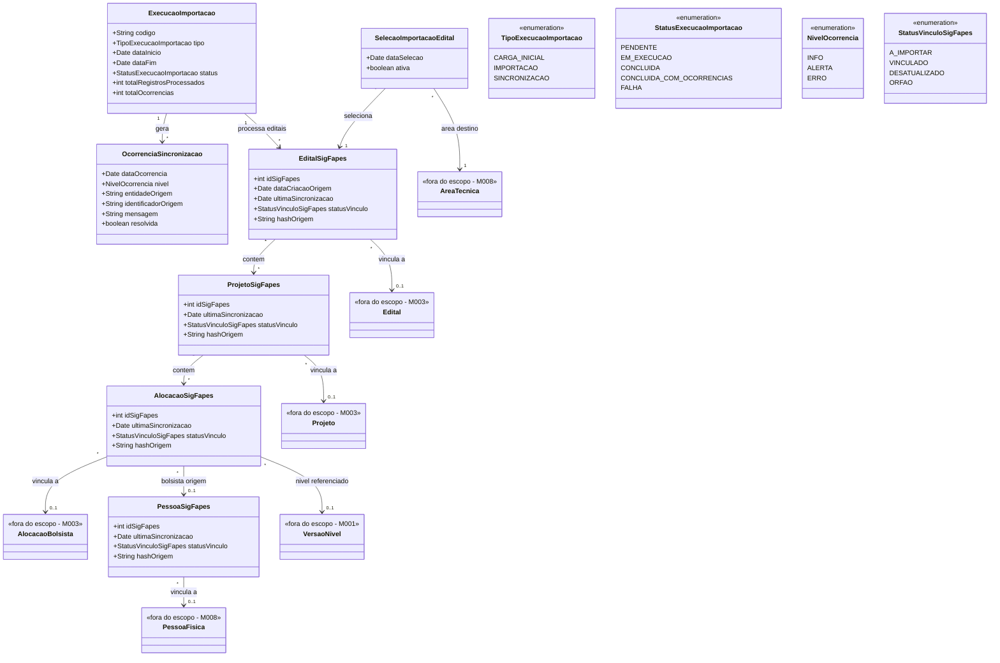

# Modelo Estrutural

Dominio e regras de negocio: ver [README.md](README.md)

### Diagrama de Classes

## Dicionario de Dados

| Classe | Atributo | Definicao | Obrig. | Tipo | Dominio | Tamanho | Unico |
|--------|----------|-----------|--------|------|---------|---------|-------|
| **SelecaoImportacaoEdital** | dataSelecao | Data em que o edital legado foi selecionado para entrar no fluxo tecnico de importacao | Gerado | Date | | | |
| | ativa | Indica se a selecao permanece valida para novas sincronizacoes | Sim | Boolean | true/false | | |
| **ExecucaoImportacao** | codigo | Codigo identificador da execucao tecnica | Gerado | String | Ex: IMP-2026-001 | | Sim |
| | tipo | Tipo da execucao realizada | Sim | TipoExecucaoImportacao | Carga Inicial, Importacao, Sincronizacao | | |
| | dataInicio | Data e hora de inicio do processamento | Gerado | Date | | | |
| | dataFim | Data e hora de conclusao do processamento | Cond. | Date | Preenchida ao finalizar | | |
| | status | Estado final da execucao | Gerado | StatusExecucaoImportacao | Ver enumeracao | | |
| | totalRegistrosProcessados | Quantidade total de registros tratados na execucao | Gerado | Int | | | |
| | totalOcorrencias | Quantidade de ocorrencias registradas na execucao | Gerado | Int | | | |
| **OcorrenciaSincronizacao** | dataOcorrencia | Data e hora do registro da ocorrencia | Gerado | Date | | | |
| | nivel | Severidade da ocorrencia | Sim | NivelOcorrencia | Info, Alerta, Erro | | |
| | entidadeOrigem | Nome tecnico da entidade de origem afetada | Sim | String | Ex: ProjetoSigFapes | 100 | |
| | identificadorOrigem | Identificador do registro de origem relacionado a ocorrencia | Sim | String | Ex: 123456 | 100 | |
| | mensagem | Descricao do problema ou evento observado | Sim | String | | 1000 | |
| | resolvida | Indica se a ocorrencia ja foi tratada | Gerado | Boolean | true/false | | |
| **EditalSigFapes** | idSigFapes | Identificador do edital na origem legado | Sim | Int | | | Sim |
| | dataCriacaoOrigem | Data de criacao do registro na origem | Nao | Date | | | |
| | ultimaSincronizacao | Data e hora da ultima sincronizacao bem-sucedida | Nao | Date | | | |
| | statusVinculo | Estado tecnico do vinculo com a entidade canonica | Gerado | StatusVinculoSigFapes | Ver enumeracao | | |
| | hashOrigem | Assinatura tecnica do payload de origem usada para detectar mudancas | Nao | String | | 255 | |
| **ProjetoSigFapes** | idSigFapes | Identificador do projeto na origem legado | Sim | Int | | | Sim |
| | ultimaSincronizacao | Data e hora da ultima sincronizacao bem-sucedida | Nao | Date | | | |
| | statusVinculo | Estado tecnico do vinculo com a entidade canonica | Gerado | StatusVinculoSigFapes | Ver enumeracao | | |
| | hashOrigem | Assinatura tecnica do payload de origem usada para detectar mudancas | Nao | String | | 255 | |
| **AlocacaoSigFapes** | idSigFapes | Identificador da alocacao na origem legado | Sim | Int | | | Sim |
| | ultimaSincronizacao | Data e hora da ultima sincronizacao bem-sucedida | Nao | Date | | | |
| | statusVinculo | Estado tecnico do vinculo com a entidade canonica | Gerado | StatusVinculoSigFapes | Ver enumeracao | | |
| | hashOrigem | Assinatura tecnica do payload de origem usada para detectar mudancas | Nao | String | | 255 | |
| **PessoaSigFapes** | idSigFapes | Identificador da pessoa na origem legado | Sim | Int | | | Sim |
| | ultimaSincronizacao | Data e hora da ultima sincronizacao bem-sucedida | Nao | Date | | | |
| | statusVinculo | Estado tecnico do vinculo com a entidade canonica | Gerado | StatusVinculoSigFapes | Ver enumeracao | | |
| | hashOrigem | Assinatura tecnica do payload de origem usada para detectar mudancas | Nao | String | | 255 | |

## Notas de Implementacao

**Entidades externas:**
- Edital, Projeto e AlocacaoBolsista: gerenciados por M003 (Gestao de Iniciativas Captadas)
- PessoaFisica e AreaTecnica: gerenciadas por M008 (Cadastros Corporativos)
- VersaoNivel: gerenciada por M001 (Modalidades de Bolsas)

**Navegabilidade:**
- Cardinalidade 1: atributo do tipo da classe destino (ex: ProjetoSigFapes.projeto: Projeto)
- Cardinalidade N: atributo lista do tipo da classe destino (ex: ExecucaoImportacao.ocorrencias: List<OcorrenciaSincronizacao>)
