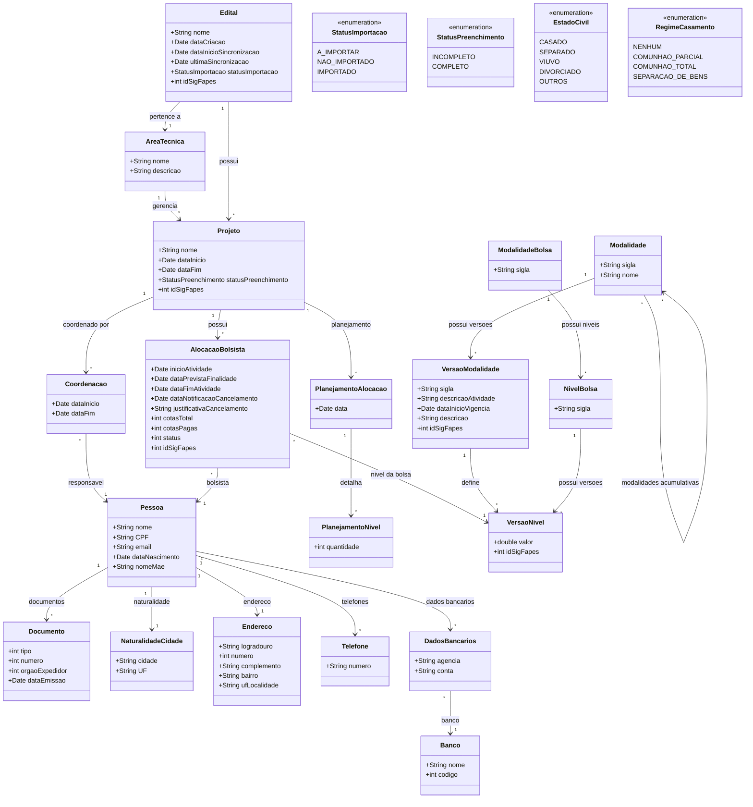

# Modelo Estrutural

Dominio e regras de negocio: ver [README.md](README.md)

### Diagrama de Classes

## Dicionario de Dados

| Classe | Atributo | Definicao | Obrig. | Tipo | Dominio | Unico |
|--------|----------|-----------|--------|------|---------|-------|
| **Edital** | nome | Nome do edital conforme cadastrado no SigFapes | Sim | String | | Nao |
| | dataCriacao | Data de criacao do edital no SigFapes | Sim | Date | | Nao |
| | dataInicioSincronizacao | Data em que o edital passou a ser sincronizado | Sim | Date | | Nao |
| | ultimaSincronizacao | Data e hora da ultima sincronizacao com SigFapes | Nao | Date | | Nao |
| | statusImportacao | Status atual da importacao do edital | Sim | StatusImportacao | A_IMPORTAR, NAO_IMPORTADO, IMPORTADO | Nao |
| | idSigFapes | Identificador do edital no SigFapes para sincronizacao | Sim | Int | | Sim |
| **AreaTecnica** | nome | Nome da area tecnica responsavel | Sim | String | | Sim |
| | descricao | Descricao da area tecnica | Nao | String | | Nao |
| **Projeto** | nome | Nome do projeto | Sim | String | | Nao |
| | dataInicio | Data de inicio do projeto | Sim | Date | | Nao |
| | dataFim | Data de termino do projeto | Nao | Date | | Nao |
| | statusPreenchimento | Indica se todas as alocacoes do projeto estao completas | Sim | StatusPreenchimento | INCOMPLETO, COMPLETO | Nao |
| | idSigFapes | Identificador do projeto no SigFapes para sincronizacao | Sim | Int | | Sim |
| **AlocacaoBolsista** | inicioAtividade | Data de inicio das atividades do bolsista | Sim | Date | | Nao |
| | dataPrevistaFinalidade | Data prevista para fim das atividades | Sim | Date | | Nao |
| | dataFimAtividade | Data efetiva de fim das atividades (obrigatoria em cancelamento local) | Nao | Date | | Nao |
| | dataNotificacaoCancelamento | Data da notificacao de cancelamento | Nao | Date | | Nao |
| | justificativaCancelamento | Motivo do cancelamento (obrigatorio em cancelamento local) | Nao | String | | Nao |
| | cotasTotal | Quantidade total de cotas previstas | Sim | Int | | Nao |
| | cotasPagas | Quantidade de cotas ja pagas (nao pode retornar a nulo apos preenchimento) | Nao | Int | | Nao |
| | status | Status da alocacao | Sim | Int | Pendente, Ativa, Cancelada, Finalizada | Nao |
| | idSigFapes | Identificador da alocacao no SigFapes para sincronizacao | Sim | Int | | Sim |
| **Pessoa** | nome | Nome completo do bolsista | Sim | String | | Nao |
| | CPF | CPF do bolsista | Sim | String | | Sim |
| | email | Endereco de e-mail | Nao | String | | Nao |
| | dataNascimento | Data de nascimento | Sim | Date | | Nao |
| | nomeMae | Nome da mae do bolsista | Nao | String | | Nao |
| **Documento** | tipo | Tipo do documento (RG, CNH, etc.) | Sim | Int | | Nao |
| | numero | Numero do documento | Sim | Int | | Nao |
| | orgaoExpedidor | Orgao expedidor do documento | Sim | Int | | Nao |
| | dataEmissao | Data de emissao do documento | Sim | Date | | Nao |
| **Endereco** | logradouro | Logradouro do endereco | Sim | String | | Nao |
| | numero | Numero do endereco | Sim | Int | | Nao |
| | complemento | Complemento do endereco | Nao | String | | Nao |
| | bairro | Bairro | Sim | String | | Nao |
| | ufLocalidade | UF e localidade | Sim | String | | Nao |
| **Telefone** | numero | Numero de telefone | Sim | String | | Nao |
| **DadosBancarios** | agencia | Numero da agencia bancaria | Sim | String | | Nao |
| | conta | Numero da conta bancaria | Sim | String | | Nao |
| **Banco** | nome | Nome do banco | Sim | String | | Nao |
| | codigo | Codigo do banco | Sim | Int | | Sim |
| **Coordenacao** | dataInicio | Data de inicio da coordenacao | Sim | Date | | Nao |
| | dataFim | Data de fim da coordenacao | Nao | Date | | Nao |
| **PlanejamentoAlocacao** | data | Data do planejamento | Sim | Date | | Nao |
| **PlanejamentoNivel** | quantidade | Quantidade de bolsas planejadas por nivel | Sim | Int | | Nao |

## Notas de Implementacao

**Integracao SigFapes:**
- Atributo `idSigFapes` presente em Edital, Projeto, AlocacaoBolsista, Pessoa e VersaoNivel serve como chave de referencia para sincronizacao
- Dados importados via Web Services (RNF02)

**Classes compartilhadas:**
- As classes Modalidade, VersaoModalidade, ModalidadeBolsa, NivelBolsa e VersaoNivel sao definidas no modulo M001 (Cadastro de Modalidades de Bolsas) e reutilizadas aqui para vincular alocacoes ao nivel de bolsa correspondente
- As classes Pessoa, Documento, Endereco, Telefone, DadosBancarios e Banco contem informacoes exigidas pelo Banestes para cadastro e envio de remessa de pagamento
