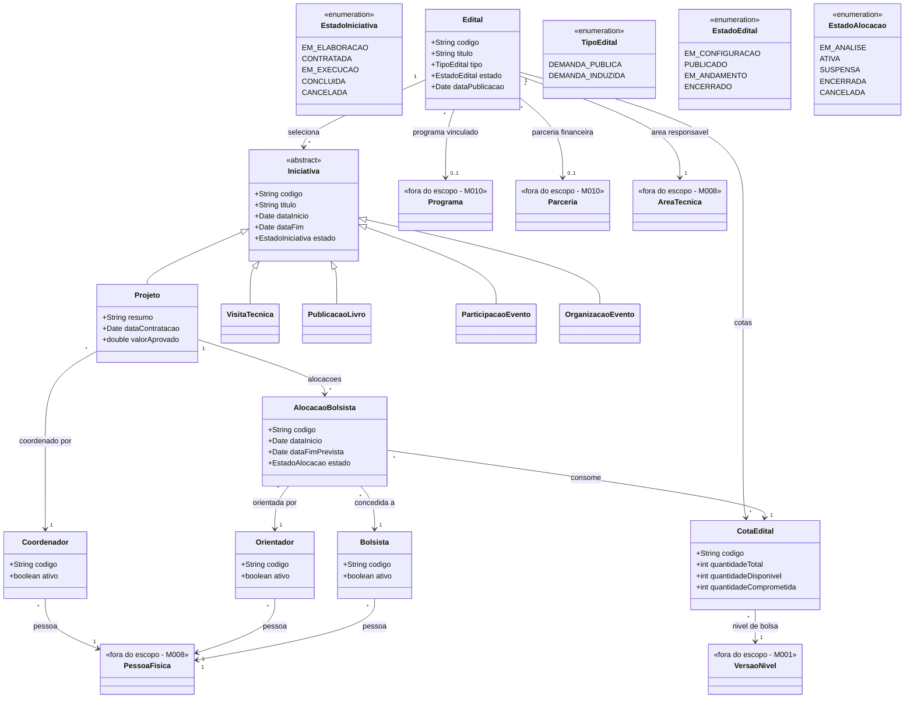

# Modelo Estrutural

Dominio e regras de negocio: ver [README.md](README.md)

### Diagrama de Classes

## Dicionario de Dados

| Classe | Atributo | Definicao | Obrig. | Tipo | Dominio | Tamanho | Unico |
|--------|----------|-----------|--------|------|---------|---------|-------|
| **Iniciativa** | codigo | Codigo identificador da iniciativa apoiada pela agencia | Gerado | String | Ex: INI-2026-001 | | Sim |
| | titulo | Titulo principal da iniciativa | Sim | String | | 300 | |
| | dataInicio | Data prevista ou efetiva de inicio da iniciativa | Sim | Date | | | |
| | dataFim | Data prevista ou efetiva de encerramento da iniciativa | Nao | Date | | | |
| | estado | Estado atual da iniciativa no ciclo operacional | Gerado | EstadoIniciativa | Ver enumeracao | | |
| **Projeto** | resumo | Resumo descritivo do projeto contratado | Sim | String | | 2000 | |
| | dataContratacao | Data em que o projeto foi formalmente contratado | Sim | Date | | | |
| | valorAprovado | Valor financeiro aprovado para o projeto, quando aplicavel | Nao | Double | | | |
| **Edital** | codigo | Codigo identificador do edital operacional | Gerado | String | Ex: EDT-2026-001 | | Sim |
| | titulo | Titulo do edital | Sim | String | | 300 | |
| | tipo | Tipo do edital | Sim | TipoEdital | Demanda Publica, Demanda Induzida | | |
| | estado | Estado atual do edital | Gerado | EstadoEdital | Ver enumeracao | | |
| | dataPublicacao | Data de publicacao oficial do edital | Nao | Date | | | |
| **CotaEdital** | codigo | Codigo identificador da cota vinculada ao edital | Gerado | String | Ex: COT-2026-001 | | Sim |
| | quantidadeTotal | Quantidade total de bolsas previstas para a cota | Sim | Int | | | |
| | quantidadeDisponivel | Quantidade ainda disponivel para novas alocacoes | Gerado | Int | | | |
| | quantidadeComprometida | Quantidade ja comprometida com alocacoes registradas | Gerado | Int | | | |
| **AlocacaoBolsista** | codigo | Codigo identificador da alocacao operacional | Gerado | String | Ex: ALC-2026-001 | | Sim |
| | dataInicio | Data de inicio prevista ou efetiva da alocacao | Sim | Date | | | |
| | dataFimPrevista | Data prevista de encerramento da alocacao | Sim | Date | | | |
| | estado | Estado atual da alocacao | Gerado | EstadoAlocacao | Ver enumeracao | | |
| **Coordenador** | codigo | Codigo identificador do papel de coordenador no contexto operacional | Gerado | String | Ex: COD-2026-001 | | Sim |
| | ativo | Indica se o coordenador esta ativo para operacoes no contexto | Gerado | Boolean | true/false | | |
| **Orientador** | codigo | Codigo identificador do papel de orientador no contexto operacional | Gerado | String | Ex: ORI-2026-001 | | Sim |
| | ativo | Indica se o orientador esta ativo para operacoes no contexto | Gerado | Boolean | true/false | | |
| **Bolsista** | codigo | Codigo identificador do papel de bolsista no contexto operacional | Gerado | String | Ex: BOL-2026-001 | | Sim |
| | ativo | Indica se o bolsista esta ativo para operacoes no contexto | Gerado | Boolean | true/false | | |

## Notas de Implementacao

**Entidades externas:**
- Programa e Parceria: gerenciados por M010 (Planejamento e Estrategia)
- AreaTecnica e PessoaFisica: gerenciadas por M008 (Cadastros Corporativos)
- VersaoNivel: gerenciada por M001 (Modalidades de Bolsas)

**Subtipos planejados:**
- `VisitaTecnica`, `PublicacaoLivro`, `ParticipacaoEvento` e `OrganizacaoEvento` existem como placeholders estruturais e ainda nao possuem dicionario completo nesta rodada.

**Navegabilidade:**
- Cardinalidade 1: atributo do tipo da classe destino (ex: Projeto.coordenador: Coordenador)
- Cardinalidade N: atributo lista do tipo da classe destino (ex: Edital.iniciativas: List<Iniciativa>)
