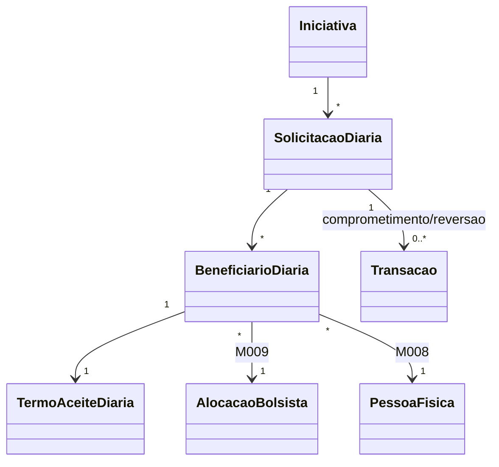

# Modelo Estrutural - Diarias da Iniciativa

[← Voltar](README.md)

## Entidades

O M003 mantem apenas entidades ligadas diretamente a solicitacao operacional de diaria. Cadastros corporativos usados para calculo e classificacao, como `TipoViagem` e `TipoDiaria`, pertencem ao M008 e sao referenciados por identificador/snapshot.

## Referencias Externas

| Referencia | Dono | Uso no M003 |
|------------|------|-------------|
| TipoViagem | M008 | Classifica o deslocamento selecionado pelo coordenador |
| TipoDiaria | M008 | Fornece valor unitario, fracao de calculo e vigencia usados no snapshot da solicitacao |
| PessoaFisica | M008 | Identifica o bolsista beneficiario |
| AlocacaoBolsista | M009 | Valida o vinculo do beneficiario com a iniciativa |
| RubricaProjeto | M013 | Informa saldo/limite da rubrica de diaria da iniciativa |
| Transacao | M013 | Registra comprometimento e reversao de saldo |

### SolicitacaoDiaria

Pedido operacional criado pelo coordenador/ortogado para um ou mais bolsistas.

| Campo | Tipo | Obrigatorio | Descricao |
|-------|------|-------------|-----------|
| codigo | String | Sim | Identificador da solicitacao, ex.: `SD-2026-001` |
| iniciativaId | IniciativaRef | Sim | Iniciativa vinculada |
| ortogadoId | OrtogadoRef | Sim | Coordenador/ortogado solicitante |
| dataHoraPartida | DateTime | Sim | Data/hora de partida |
| dataHoraChegada | DateTime | Sim | Data/hora de chegada |
| destino | String | Sim | Destino do deslocamento |
| motivo | String | Sim | Motivo da diaria |
| tipoViagemRef | TipoViagemRef | Sim | Tipo de viagem selecionado na criacao |
| tipoViagemSnapshot | String | Sim | Nome/abrangencia do tipo de viagem no momento da criacao |
| tipoDiariaRef | TipoDiariaRef | Sim | Cadastro de diaria vigente usado na criacao |
| quantidadeDiariasCalculada | Decimal | Sim | Quantidade calculada pelo sistema |
| valorUnitarioDiaria | Decimal | Sim | Snapshot do valor unitario efetivo no momento da criacao |
| fracaoCalculoSnapshot | String | Sim | Snapshot da fracao de calculo do tipo de diaria vigente |
| regraCalculoSnapshot | String | Sim | Snapshot textual da regra normativa aplicada |
| valorTotalCalculado | Decimal | Sim | Valor total calculado |
| rubricaProjetoRef | RubricaProjetoRef | Sim | RubricaProjeto de diaria correspondente ao tipo de viagem selecionado |
| transacaoComprometimentoRef | TransacaoRef | Condicional | Transacao de comprometimento gerada no M013 |
| justificativaCancelamento | String | Condicional | Obrigatoria ao remover/cancelar diaria alocada ou aprovada antes do inicio |
| justificativaRegularizacao | String | Condicional | Obrigatoria quando a diaria nao foi utilizada e o inicio previsto ja passou |
| justificativaRecusa | String | Condicional | Obrigatoria quando a viagem for recusada por bolsista beneficiario |
| transacaoReversaoRef | TransacaoRef | Condicional | Transacao de reversao/estorno do comprometimento |
| estado | EstadoSolicitacaoDiaria | Sim | Estado atual |

### BeneficiarioDiaria

Representa cada bolsista beneficiario da solicitacao.

| Campo | Tipo | Obrigatorio | Descricao |
|-------|------|-------------|-----------|
| solicitacaoDiariaId | SolicitacaoDiariaRef | Sim | Solicitacao vinculada |
| alocacaoBolsistaRef | AlocacaoBolsistaRef | Sim | Alocacao validada em M009 |
| pessoaFisicaRef | PessoaFisicaRef | Sim | Pessoa do bolsista |
| quantidadeDiariasCalculada | Decimal | Sim | Quantidade atribuida ao beneficiario |
| valorCalculado | Decimal | Sim | Valor calculado para o beneficiario |
| contaBancariaSnapshot | Object | Sim | Conta bancaria confirmada no aceite |

### TermoAceiteDiaria

Termo assinado pelo bolsista beneficiario.

| Campo | Tipo | Obrigatorio | Descricao |
|-------|------|-------------|-----------|
| beneficiarioDiariaId | BeneficiarioDiariaRef | Sim | Beneficiario vinculado |
| estado | EstadoTermoAceiteDiaria | Sim | Estado do termo |
| dataAssinatura | DateTime | Condicional | Data/hora da assinatura |
| dataRecusa | DateTime | Condicional | Data/hora da recusa |
| usuarioAssinanteRef | UsuarioRef | Condicional | Usuario que assinou |
| usuarioRecusaRef | UsuarioRef | Condicional | Usuario que recusou |
| justificativaRecusa | String | Condicional | Justificativa obrigatoria da recusa |
| versaoTermo | String | Sim | Versao do texto aceito |
| hashTermo | String | Condicional | Hash do termo assinado |

## Estados

### EstadoSolicitacaoDiaria

```text
ALOCADA
AGUARDANDO_ACEITES
APROVADA
CANCELADA
RECUSADA
REGULARIZADA_NAO_UTILIZADA
DISPONIVEL_PRESTACAO
```

`AGUARDANDO_ACEITES` fica mantido como compatibilidade de leitura. Novas solicitacoes com saldo comprometido e viagem futura devem usar `ALOCADA`.

### EstadoTermoAceiteDiaria

```text
PENDENTE
ASSINADO
RECUSADO
CANCELADO
EXPIRADO
```

## Relacionamentos



`tipoViagemRef` e `tipoDiariaRef` sao referencias externas para M008. O M003 nao modela nem persiste esses cadastros como entidades proprias.

## Invariantes

- Uma solicitacao deve possuir exatamente um `tipoViagemRef`.
- Uma solicitacao deve possuir exatamente um `tipoDiariaRef`.
- `tipoViagemRef` e `tipoDiariaRef` devem apontar para cadastros corporativos do M008.
- O `valorUnitarioDiaria` e snapshot e nao muda quando a FAPES altera o valor da diaria.
- O `fracaoCalculoSnapshot` e snapshot e nao muda quando a FAPES altera a fracao de calculo da diaria.
- O `tipoViagemSnapshot` nao muda quando a FAPES altera o cadastro de tipos de viagem.
- A chegada deve ser posterior a partida.
- A solicitacao deve possuir ao menos um beneficiario.
- A solicitacao somente pode ser criada quando houver orcamento e saldo disponivel na rubrica de diaria correspondente ao tipo de viagem selecionado.
- As rubricas operacionais de diaria previstas sao **Diaria dentro do Estado**, **Diaria nacional** e **Diaria internacional**.
- A tela do coordenador deve exibir apenas as rubricas de diaria que existirem no orcamento vigente do projeto com valor previsto maior que zero.
- A criacao da solicitacao gera `Transacao` de comprometimento vinculado a `RubricaProjeto` correspondente ao tipo de viagem, sem aprovacao manual da FAPES.
- Todos os beneficiarios obrigatorios devem assinar o termo antes de a solicitacao ficar `APROVADA` e disponivel para prestacao de contas.
- A recusa por qualquer bolsista beneficiario exige justificativa e gera `Transacao` de reversao quando ja houver comprometimento.
- A diaria `ALOCADA` representa valor comprometido na rubrica antes do inicio da viagem.
- O coordenador somente pode remover diaria `ALOCADA` ou `APROVADA` antes da data/hora de partida, sempre com justificativa.
- Depois da data/hora de partida, diaria nao utilizada deve seguir regularizacao propria, sem exclusao fisica, com justificativa, auditoria e transacao de reversao quando cabivel.
- O cancelamento/remocao de diaria alocada ou aprovada gera transacao de reversao vinculado a mesma `RubricaProjeto`.
- Rubrica e categoria: a solicitacao referencia `RubricaProjeto` para classificacao/limite e referencia `Transacao` para o movimento de comprometimento ou reversao. Pagamento bancario e `TransacaoFinanceira` e pertence a M014/M016.
