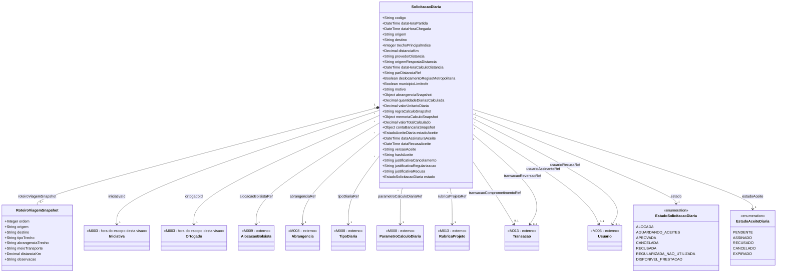

# Modelo Estrutural - Diarias da Iniciativa

[← Voltar](README.md)

## Entidades

O M003 mantem apenas entidades ligadas diretamente a solicitacao operacional de diaria. O cadastro corporativo usado para calculo, `TipoDiaria`, e seus `ParametroCalculoDiaria` vinculados pertencem ao M008 e sao referenciados por identificador/snapshot. A classificacao da viagem e feita por `Abrangencia`, classe corporativa definida no M008.

## Foco do Modelo M003

O modelo de diarias no M003 deve responder a uma pergunta principal: **quem solicitou diaria, para quem, para qual viagem, com qual aceite e com qual resultado operacional**. Ele nao deve virar cadastro de diaria, cadastro de rubrica ou livro de transacoes.

| Bloco | Elementos | Responsabilidade |
|-------|-----------|------------------|
| Solicitacao | `SolicitacaoDiaria` | Pedido operacional, bolsista do projeto, periodo, origem da missao, destino final, roteiro de viagem, motivo, abrangencia selecionada/calculada, snapshots de calculo, aceite, estado e justificativas |
| Referencias corporativas | `Abrangencia`, `TipoDiaria`, `ParametroCalculoDiaria` | Parametros externos do M008 usados para calcular e auditar a solicitacao |
| Orcamento e saldo | `RubricaProjeto`, `Transacao` | Referencias externas do M013 usadas para validar saldo e registrar movimentos |

## Referencias Externas

| Referencia | Dono | Uso no M003 |
|------------|------|-------------|
| Abrangencia | M008 | Classifica o deslocamento selecionado pelo coordenador |
| TipoDiaria | M008 | Fornece valor unitario e vigencia usados no snapshot da solicitacao |
| ParametroCalculoDiaria | M008 | Fornece parametros normativos vinculados ao TipoDiaria usado no calculo |
| AlocacaoBolsista | M009 | Identifica o bolsista do projeto/iniciativa que recebera a diaria; a propria alocacao ja contem a pessoa fisica |
| RubricaProjeto | M013 | Informa saldo/limite da rubrica de diaria da iniciativa |
| Transacao | M013 | Registra comprometimento e reversao de saldo |

### SolicitacaoDiaria

Pedido operacional criado pelo coordenador/ortogado para um bolsista do projeto. Quando a mesma viagem envolver mais de um bolsista, o sistema deve criar uma `SolicitacaoDiaria` por `AlocacaoBolsista`.

| Campo | Tipo | Obrigatorio | Descricao |
|-------|------|-------------|-----------|
| codigo | String | Sim | Identificador da solicitacao, ex.: `SD-2026-001` |
| iniciativaId | IniciativaRef | Sim | Iniciativa vinculada |
| ortogadoId | OrtogadoRef | Sim | Coordenador/ortogado solicitante |
| alocacaoBolsistaRef | AlocacaoBolsistaRef | Sim | Bolsista do projeto que recebera a diaria; entidade externa do M009 |
| dataHoraPartida | DateTime | Sim | Data/hora de partida |
| dataHoraChegada | DateTime | Sim | Data/hora de chegada |
| origem | String | Sim | Origem da missao selecionada em lista controlada de localidades |
| destino | String | Sim | Destino final da missao selecionado em lista controlada de localidades ou destino especial |
| roteiroViagemSnapshot | Array<Object> | Sim | Trechos informados/calculados para explicar a viagem; pode incluir deslocamento interno de apoio ate aeroporto/rodoviaria e trecho principal nacional/internacional |
| trechoPrincipalIndice | Integer | Sim | Indice do trecho que determina a abrangencia principal da diaria |
| distanciaKm | Decimal | Condicional | Distancia rodoviaria calculada automaticamente no backend, usada somente quando a abrangencia for dentro do Estado |
| provedorDistancia | String | Condicional | Provedor usado para calcular a distancia, ex.: `GOOGLE_ROUTES_API` ou `TABELA_DISTANCIAS_MEMORIA` |
| origemRespostaDistancia | String | Condicional | Origem da resposta usada no calculo, ex.: API externa, cache, tabela em memoria ou fallback operacional |
| dataHoraCalculoDistancia | DateTime | Condicional | Data/hora em que a distancia foi calculada e congelada no snapshot |
| parDistanciaRef | String | Condicional | Referencia ao par origem-destino usado na tabela de distancias em memoria, quando aplicavel |
| deslocamentoRegiaoMetropolitana | Boolean | Condicional | Indicador territorial aplicavel somente a diaria dentro do Estado |
| municipioLimitrofe | Boolean | Condicional | Indicador territorial aplicavel somente a diaria dentro do Estado |
| motivo | String | Sim | Motivo da diaria |
| abrangenciaRef | AbrangenciaRef | Sim | Abrangencia corporativa selecionada na criacao |
| abrangenciaSnapshot | Object | Sim | Snapshot de codigo e nome da abrangencia no momento da criacao |
| tipoDiariaRef | TipoDiariaRef | Sim | Cadastro de diaria vigente usado na criacao |
| parametroCalculoDiariaRef | ParametroCalculoDiariaRef | Sim | Parametros normativos vigentes vinculados ao tipo de diaria usado na criacao |
| quantidadeDiariasCalculada | Decimal | Sim | Quantidade calculada pelo sistema |
| valorUnitarioDiaria | Decimal | Sim | Snapshot do valor unitario efetivo no momento da criacao |
| regraCalculoSnapshot | String | Sim | Snapshot textual da regra normativa aplicada |
| memoriaCalculoSnapshot | Object | Sim | Snapshot dos parametros e fatores aplicados no calculo |
| valorTotalCalculado | Decimal | Sim | Valor total calculado |
| contaBancariaSnapshot | Object | Sim | Conta bancaria confirmada no aceite da diaria |
| estadoAceite | EstadoAceiteDiaria | Sim | Estado do aceite da diaria pelo bolsista |
| dataAssinaturaAceite | DateTime | Condicional | Data/hora do aceite |
| dataRecusaAceite | DateTime | Condicional | Data/hora da recusa |
| usuarioAssinanteRef | UsuarioRef | Condicional | Usuario que registrou o aceite |
| usuarioRecusaRef | UsuarioRef | Condicional | Usuario que recusou a diaria |
| versaoAceite | String | Sim | Versao do texto de aceite apresentado ao bolsista |
| hashAceite | String | Condicional | Hash do aceite registrado |
| rubricaProjetoRef | RubricaProjetoRef | Sim | RubricaProjeto de diaria correspondente a abrangencia selecionada |
| transacaoComprometimentoRef | TransacaoRef | Condicional | Transacao de comprometimento gerada no M013 |
| justificativaCancelamento | String | Condicional | Obrigatoria ao remover/cancelar diaria alocada ou aprovada antes do inicio |
| justificativaRegularizacao | String | Condicional | Obrigatoria quando a diaria nao foi utilizada e o inicio previsto ja passou |
| justificativaRecusa | String | Condicional | Obrigatoria quando a viagem for recusada pelo bolsista da alocacao |
| transacaoReversaoRef | TransacaoRef | Condicional | Transacao de reversao/estorno do comprometimento |
| estado | EstadoSolicitacaoDiaria | Sim | Estado atual |

### RoteiroViagemSnapshot

`roteiroViagemSnapshot` registra os trechos da viagem para explicar a logistica, apoiar auditoria e preservar a memoria de calculo. A decisao sobre transformar esses trechos em uma unica diaria ou em diarias separadas, quando houver trecho interno de apoio e trecho nacional/internacional, permanece como duvida aberta para o PO.

| Campo | Tipo | Obrigatorio | Descricao |
|-------|------|-------------|-----------|
| ordem | Integer | Sim | Ordem do trecho no roteiro |
| origem | String | Sim | Origem do trecho |
| destino | String | Sim | Destino do trecho |
| tipoTrecho | String | Sim | `APOIO_INTERNO`, `PRINCIPAL`, `RETORNO` ou `CONEXAO` |
| abrangenciaTrecho | String | Sim | `DENTRO_ESTADO`, `NACIONAL` ou `INTERNACIONAL` |
| meioTransporte | String | Nao | Aereo, terrestre, veiculo proprio, institucional ou outro |
| distanciaKm | Decimal | Condicional | Distancia usada somente em trecho dentro do Estado quando aplicavel |
| observacao | String | Nao | Informacao adicional do trecho |

## Estados

### EstadoSolicitacaoDiaria

```text
ALOCADA
AGUARDANDO_ACEITES
APROVADA
CANCELADA
RECUSADA
REGULARIZADA_NAO_UTILIZADA
DISPONIVEL_PRESTACAO
```

`AGUARDANDO_ACEITES` fica mantido como compatibilidade de leitura. Novas solicitacoes com saldo comprometido e viagem futura devem usar `ALOCADA`.

### EstadoAceiteDiaria

```text
PENDENTE
ASSINADO
RECUSADO
CANCELADO
EXPIRADO
```

## Relacionamentos



### Tabela de Relacionamentos

| Relacao | Cardinalidade | Tipo | Destino | Modulo dono | Descricao |
|---------|----------------|------|---------|-------------|-----------|
| `iniciativaId` | 1 | FK | `Iniciativa` | M003 | Iniciativa a qual a solicitacao pertence |
| `ortogadoId` | 1 | FK | `Ortogado` | M003 | Coordenador/ortogado solicitante |
| `alocacaoBolsistaRef` | 1 | FK externa | `AlocacaoBolsista` | M009 | Bolsista que recebera a diaria |
| `abrangenciaRef` | 1 | FK externa | `Abrangencia` | M008 | Abrangencia corporativa selecionada |
| `tipoDiariaRef` | 1 | FK externa | `TipoDiaria` | M008 | TipoDiaria vigente usado na criacao |
| `parametroCalculoDiariaRef` | 1 | FK externa | `ParametroCalculoDiaria` | M008 | Parametros normativos vigentes |
| `rubricaProjetoRef` | 1 | FK externa | `RubricaProjeto` | M013 | RubricaProjeto de diaria correspondente a abrangencia |
| `transacaoComprometimentoRef` | 0..1 | FK externa | `Transacao` | M013 | Transacao de comprometimento gerada na criacao |
| `transacaoReversaoRef` | 0..1 | FK externa | `Transacao` | M013 | Transacao de reversao em cancelamento/regularizacao |
| `usuarioAssinanteRef` | 0..1 | FK externa | `Usuario` | M005 | Usuario que assinou o aceite |
| `usuarioRecusaRef` | 0..1 | FK externa | `Usuario` | M005 | Usuario que recusou o aceite |
| `roteiroViagemSnapshot` | 1..* | Composicao | `RoteiroViagemSnapshot` | M003 | Trechos da viagem (entidade-valor embarcada) |
| `estado` | 1 | Enum | `EstadoSolicitacaoDiaria` | M003 | Estado atual da solicitacao |
| `estadoAceite` | 1 | Enum | `EstadoAceiteDiaria` | M003 | Estado do aceite pelo bolsista |

> **Donos das entidades externas:**
> - `Iniciativa`, `Ortogado`: M003
> - `AlocacaoBolsista`: M009
> - `Abrangencia`, `TipoDiaria`, `ParametroCalculoDiaria`: M008 (cadastros corporativos de Diarias)
> - `RubricaProjeto`, `Transacao`: M013 (gestao orcamentaria)
> - `Usuario`: M005 (autenticacao)
>
> M003 nao modela nem persiste essas entidades — apenas referencia via FK opaca. Snapshots (`abrangenciaSnapshot`, `valorUnitarioDiaria`, `regraCalculoSnapshot`, `memoriaCalculoSnapshot`, `contaBancariaSnapshot`) preservam os dados no momento da criacao para auditoria mesmo que os cadastros mudem.

## Relacao com Rubricas

Rubrica e categoria orcamentaria; transacao e movimento. Por isso, o M003 nao cria nem mantem a estrutura de rubricas. A `SolicitacaoDiaria` apenas referencia a `RubricaProjeto` aplicavel e dispara a criacao de `Transacao` quando precisa comprometer ou reverter saldo.

> **Regras de saldo aplicaveis**: ver [discovery/regras-saldo-alocado-disponivel.md](../../../../discovery/regras-saldo-alocado-disponivel.md). RN-SLD01 a RN-SLD05 + RI-SLD1/2 governam `valorTotal`/`valorAlocado`/`valorConsumido`/`valorDisponivel` da rubrica de diarias. Em M013, a terminologia operacional e: `valorAprovado` (Total), `valorComprometido` (Alocado), `valorExecutado` (Consumido), `saldoDisponivel` (Disponivel). Eventos: solicitacao `APROVADA` → +Alocado; pagamento → −Alocado, +Consumido; cancelamento antes do pagamento → −Alocado, +Disponivel; estorno → −Consumido, +Disponivel.

| Conceito | Dono | Papel no fluxo de diarias |
|----------|------|---------------------------|
| Rubrica | M008/M013 | Categoria orcamentaria corporativa, como **Diaria dentro do Estado**, **Diaria nacional** ou **Diaria internacional** |
| RubricaProjeto | M013 | Rubrica ja prevista no orcamento da iniciativa, com total, alocado, utilizado e saldo |
| Transacao | M013 | Movimento de comprometimento ou reversao de saldo vinculado a uma `RubricaProjeto` |
| SolicitacaoDiaria | M003 | Origem operacional que explica por que a transacao foi criada |

O fluxo esperado e:

1. O coordenador seleciona uma `abrangenciaRef` na nova solicitacao.
2. O M003 consulta o M008 para localizar `TipoDiaria` e `ParametroCalculoDiaria` vigentes.
3. O M003 identifica, no M013, a `RubricaProjeto` de diaria correspondente a abrangencia.
4. Se nao existir `RubricaProjeto` com orcamento ou se o saldo for insuficiente, a solicitacao e bloqueada antes do envio.
5. Se houver saldo, a solicitacao e criada e o M013 registra uma `Transacao` de comprometimento com origem na `SolicitacaoDiaria`.
6. Em recusa, remocao antes do inicio ou regularizacao de diaria nao utilizada, o M013 registra `Transacao` de reversao com a mesma origem operacional.

## Invariantes

- Uma solicitacao deve possuir exatamente uma `abrangenciaRef`.
- Uma solicitacao deve possuir exatamente um `tipoDiariaRef`.
- Uma solicitacao deve possuir exatamente um `parametroCalculoDiariaRef` vinculado ao `tipoDiariaRef`.
- Uma solicitacao deve possuir exatamente uma `alocacaoBolsistaRef`.
- `alocacaoBolsistaRef` deve apontar para entidade do M009 e deve pertencer a mesma iniciativa da solicitacao.
- `tipoDiariaRef` deve apontar para cadastro corporativo do M008 vigente para a `abrangenciaRef`.
- `parametroCalculoDiariaRef` deve apontar para parametros corporativos do M008 vigentes para o `tipoDiariaRef` e a data de referencia.
- O `valorUnitarioDiaria` e snapshot e nao muda quando a FAPES altera o valor da diaria.
- A chegada deve ser posterior a partida.
- Quando uma viagem possuir mais de um bolsista, deve existir uma `SolicitacaoDiaria` separada para cada `AlocacaoBolsista`.
- Quando a viagem possuir mais de um trecho logistico, a `SolicitacaoDiaria` deve preservar o roteiro informado/calculado para memoria e auditoria.
- **Duvida para PO:** deslocamentos internos de apoio, como Anchieta/ES ate Vitoria/ES para embarque em aeroporto em viagem internacional, devem gerar diaria propria ou compor a diaria principal? A decisao impacta diretamente o valor consumido da rubrica.
- Enquanto a duvida estiver aberta, `trechoPrincipalIndice` deve apontar para o trecho usado na regra de calculo aplicada, e `memoriaCalculoSnapshot` deve registrar a politica usada.
- A distancia entre municipios do ES deve ser calculada e persistida quando houver trecho dentro do Estado e usada conforme a politica de calculo decidida para a solicitacao.
- A solicitacao somente pode ser criada quando houver orcamento e saldo disponivel na rubrica de diaria correspondente a abrangencia selecionada.
- As rubricas operacionais de diaria previstas sao **Diaria dentro do Estado**, **Diaria nacional** e **Diaria internacional**.
- A tela do coordenador deve exibir apenas as rubricas de diaria que existirem no orcamento vigente do projeto com valor previsto maior que zero.
- A criacao da solicitacao gera `Transacao` de comprometimento vinculado a `RubricaProjeto` correspondente a abrangencia, sem aprovacao manual da FAPES.
- O aceite da diaria fica registrado na propria `SolicitacaoDiaria`; nao existe entidade separada de aceite.
- A diaria somente deve ficar `APROVADA` quando `estadoAceite` estiver `ASSINADO`, exceto quando regra especifica permitir aprovacao automatica.
- A recusa pelo bolsista exige justificativa e gera `Transacao` de reversao quando ja houver comprometimento.
- A diaria `ALOCADA` representa valor comprometido na rubrica antes do inicio da viagem.
- O coordenador somente pode remover diaria `ALOCADA` ou `APROVADA` antes da data/hora de partida, sempre com justificativa.
- Depois da data/hora de partida, diaria nao utilizada deve seguir regularizacao propria, sem exclusao fisica, com justificativa, auditoria e transacao de reversao quando cabivel.
- O cancelamento/remocao de diaria alocada ou aprovada gera transacao de reversao vinculado a mesma `RubricaProjeto`.
- Rubrica e categoria: a solicitacao referencia `RubricaProjeto` para classificacao/limite e referencia `Transacao` para o movimento de comprometimento ou reversao. Pagamento bancario e `TransacaoFinanceira` e pertence a M014/M016.
- Nenhuma entidade de rubrica deve ser duplicada no M003; o modulo deve armazenar apenas `rubricaProjetoRef`, `transacaoComprometimentoRef` e `transacaoReversaoRef`.
