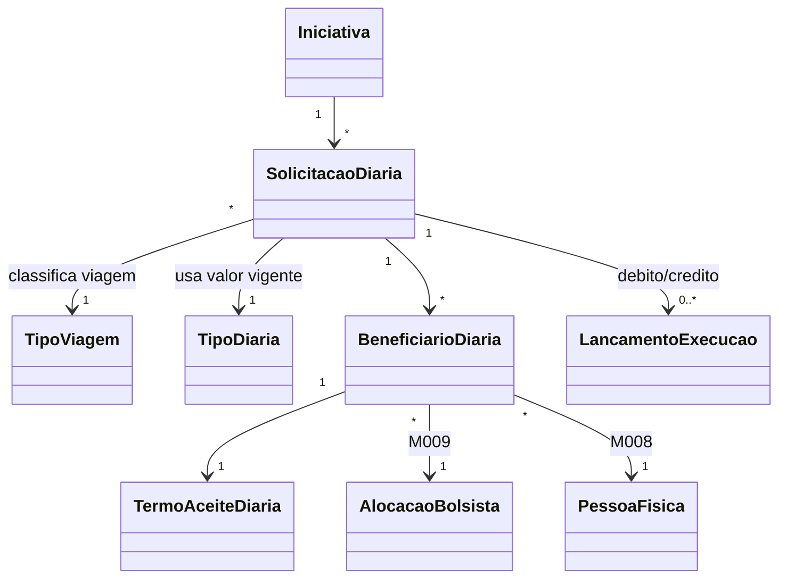

# Modelo Estrutural - Diarias da Iniciativa

[← Voltar](README.md)

## Entidades

### TipoDiaria

Cadastro mantido pela FAPES com o valor vigente da diaria e a fracao de calculo para um tipo de viagem. A solicitacao referencia o cadastro vigente do tipo de viagem selecionado no momento da criacao.

No Backoffice, a manutencao desse cadastro fica em **Configuracoes > Referencias Corporativas > Diarias**. A tela operacional **Diarias** nao deve expor formulario de manutencao de valores.

| Campo | Tipo | Obrigatorio | Descricao |
|-------|------|-------------|-----------|
| codigo | String | Sim | Identificador do cadastro, ex.: `DIA-2026-001` |
| tipoViagemRef | TipoViagemRef | Sim | Tipo de viagem ao qual o valor se aplica |
| valorUnitario | Decimal | Sim | Valor unitario vigente da diaria |
| fracaoCalculo | Enum | Sim | Fracao usada no calculo. Ex.: `12H` ou `24H` |
| vigenciaInicio | Date | Sim | Inicio da vigencia |
| vigenciaFim | Date | Nao | Fim da vigencia |
| ativo | Boolean | Sim | Indica se o cadastro esta ativo |
| criadoPor | UsuarioRef | Sim | Usuario FAPES responsavel |
| criadoEm | DateTime | Sim | Data/hora de criacao |

### TipoViagem

Cadastro mantido pela FAPES para classificar o deslocamento operacional. O valor unitario fica no cadastro de `TipoDiaria`, vinculado a cada tipo de viagem.

No Backoffice, a manutencao desse cadastro fica em **Configuracoes > Referencias Corporativas > Tipos de Viagem**.

| Campo | Tipo | Obrigatorio | Descricao |
|-------|------|-------------|-----------|
| codigo | String | Sim | Identificador do cadastro, ex.: `TVI-001` |
| nome | String | Sim | Nome do tipo de viagem, ex.: `Dentro do Estado`, `Fora do Estado`, `Internacional` |
| abrangencia | Enum | Sim | Abrangencia: `NACIONAL` ou `INTERNACIONAL` |
| descricao | String | Nao | Descricao administrativa do tipo |
| ativo | Boolean | Sim | Indica se o tipo esta disponivel para novas solicitacoes |
| criadoPor | UsuarioRef | Sim | Usuario FAPES responsavel |
| criadoEm | DateTime | Sim | Data/hora de criacao |

### SolicitacaoDiaria

Pedido operacional criado pelo coordenador/ortogado para um ou mais bolsistas.

| Campo | Tipo | Obrigatorio | Descricao |
|-------|------|-------------|-----------|
| codigo | String | Sim | Identificador da solicitacao, ex.: `SD-2026-001` |
| iniciativaId | IniciativaRef | Sim | Iniciativa vinculada |
| ortogadoId | OrtogadoRef | Sim | Coordenador/ortogado solicitante |
| dataHoraPartida | DateTime | Sim | Data/hora de partida |
| dataHoraChegada | DateTime | Sim | Data/hora de chegada |
| destino | String | Sim | Destino do deslocamento |
| motivo | String | Sim | Motivo da diaria |
| tipoViagemRef | TipoViagemRef | Sim | Tipo de viagem selecionado na criacao |
| tipoViagemSnapshot | String | Sim | Nome/abrangencia do tipo de viagem no momento da criacao |
| tipoDiariaRef | TipoDiariaRef | Sim | Cadastro de diaria vigente usado na criacao |
| quantidadeDiariasCalculada | Decimal | Sim | Quantidade calculada pelo sistema |
| valorUnitarioDiaria | Decimal | Sim | Snapshot do valor unitario efetivo no momento da criacao |
| fracaoCalculoSnapshot | String | Sim | Snapshot da fracao de calculo do tipo de diaria vigente |
| regraCalculoSnapshot | String | Sim | Snapshot textual da regra normativa aplicada |
| valorTotalCalculado | Decimal | Sim | Valor total calculado |
| rubricaDebitoRef | RubricaRef | Condicional | Rubrica Diarias e Passagens usada na aprovacao |
| lancamentoDebitoRef | LancamentoExecucaoRef | Condicional | Lancamento de debito/comprometimento |
| justificativaRejeicao | String | Condicional | Obrigatoria quando a FAPES rejeitar a solicitacao |
| justificativaCancelamento | String | Condicional | Obrigatoria ao cancelar diaria aprovada |
| justificativaRecusa | String | Condicional | Obrigatoria quando a viagem for recusada por bolsista beneficiario |
| lancamentoCreditoRef | LancamentoExecucaoRef | Condicional | Lancamento de credito de reversao |
| estado | EstadoSolicitacaoDiaria | Sim | Estado atual |

### BeneficiarioDiaria

Representa cada bolsista beneficiario da solicitacao.

| Campo | Tipo | Obrigatorio | Descricao |
|-------|------|-------------|-----------|
| solicitacaoDiariaId | SolicitacaoDiariaRef | Sim | Solicitacao vinculada |
| alocacaoBolsistaRef | AlocacaoBolsistaRef | Sim | Alocacao validada em M009 |
| pessoaFisicaRef | PessoaFisicaRef | Sim | Pessoa do bolsista |
| quantidadeDiariasCalculada | Decimal | Sim | Quantidade atribuida ao beneficiario |
| valorCalculado | Decimal | Sim | Valor calculado para o beneficiario |
| contaBancariaSnapshot | Object | Sim | Conta bancaria confirmada no aceite |

### TermoAceiteDiaria

Termo assinado pelo bolsista beneficiario.

| Campo | Tipo | Obrigatorio | Descricao |
|-------|------|-------------|-----------|
| beneficiarioDiariaId | BeneficiarioDiariaRef | Sim | Beneficiario vinculado |
| estado | EstadoTermoAceiteDiaria | Sim | Estado do termo |
| dataAssinatura | DateTime | Condicional | Data/hora da assinatura |
| dataRecusa | DateTime | Condicional | Data/hora da recusa |
| usuarioAssinanteRef | UsuarioRef | Condicional | Usuario que assinou |
| usuarioRecusaRef | UsuarioRef | Condicional | Usuario que recusou |
| justificativaRecusa | String | Condicional | Justificativa obrigatoria da recusa |
| versaoTermo | String | Sim | Versao do texto aceito |
| hashTermo | String | Condicional | Hash do termo assinado |

## Estados

### EstadoSolicitacaoDiaria

```text
RASCUNHO
AGUARDANDO_ACEITES
AGUARDANDO_APROVACAO
APROVADA
REJEITADA
CANCELADA
RECUSADA
DISPONIVEL_PRESTACAO
```

### EstadoTermoAceiteDiaria

```text
PENDENTE
ASSINADO
RECUSADO
CANCELADO
EXPIRADO
```

## Relacionamentos



## Invariantes

- Uma solicitacao deve possuir exatamente um `tipoViagemRef`.
- Uma solicitacao deve possuir exatamente um `tipoDiariaRef`.
- O `valorUnitarioDiaria` e snapshot e nao muda quando a FAPES altera o valor da diaria.
- O `fracaoCalculoSnapshot` e snapshot e nao muda quando a FAPES altera a fracao de calculo da diaria.
- O `tipoViagemSnapshot` nao muda quando a FAPES altera o cadastro de tipos de viagem.
- A chegada deve ser posterior a partida.
- A solicitacao deve possuir ao menos um beneficiario.
- Todos os beneficiarios obrigatorios devem assinar o termo antes da aprovacao.
- A recusa por qualquer bolsista beneficiario exige justificativa e impede o envio da solicitacao para aprovacao da FAPES enquanto nao houver ajuste pelo coordenador.
- A rejeicao pela FAPES exige justificativa obrigatoria e nao gera debito na rubrica.
- A aprovacao gera debito na rubrica **Diarias e Passagens**.
- O cancelamento de diaria aprovada gera credito de reversao na mesma rubrica.
