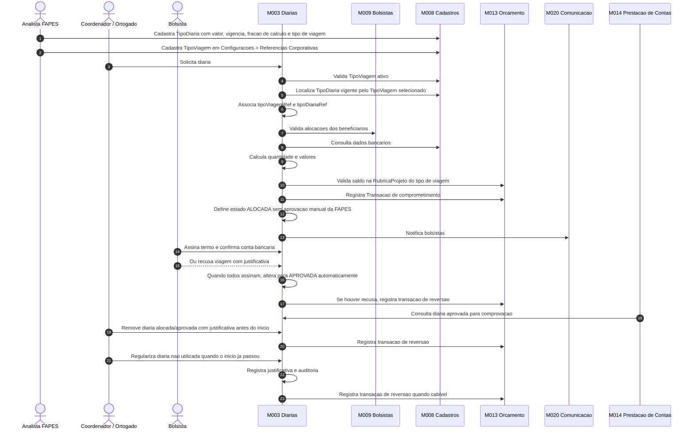
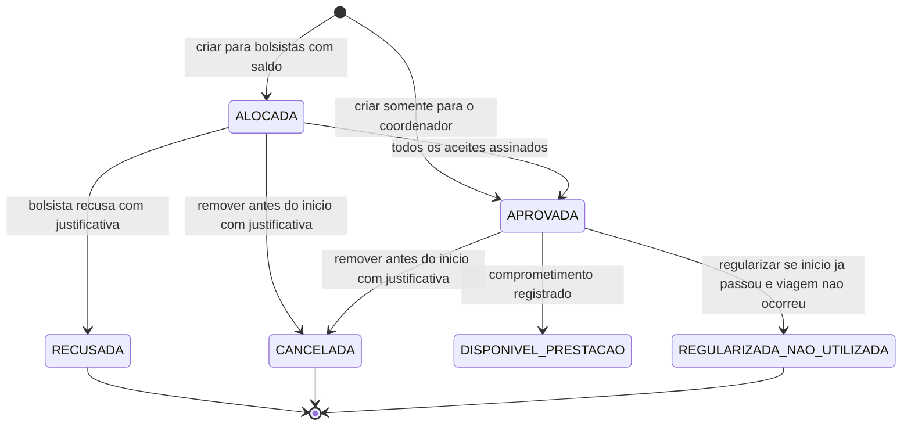

# Processo - Diarias da Iniciativa

[← Voltar](README.md)

## Fluxo operacional

## Estados e transicoes

## Pontos de controle

1. **Cadastro do valor vigente:** deve existir no M008 tipo de diaria vigente em **Configuracoes > Referencias Corporativas > Diarias**, contendo valor, data de vigencia, fracao de calculo e tipo de viagem ativo.
2. **Associacao obrigatoria:** a solicitacao grava `tipoDiariaRef`, `tipoViagemRef` e snapshots do valor unitario e da fracao de calculo do tipo de diaria.
3. **Beneficiarios validos:** bolsistas devem ter alocacao valida em M009.
4. **Aceite individual:** cada bolsista confirma termo e conta bancaria.
5. **Saldo na rubrica:** a solicitacao somente e criada quando a rubrica de diaria correspondente ao tipo de viagem existe no orcamento do projeto e possui saldo disponivel.
6. **Transacao da rubrica:** gerada no M013 como comprometimento vinculado a `RubricaProjeto` do tipo de viagem no ato da criacao.
7. **Visibilidade por orcamento:** o painel do coordenador deve listar uma linha por rubrica de diaria com orcamento no projeto: **Diaria dentro do Estado**, **Diaria nacional** e/ou **Diaria internacional**. Rubricas sem orcamento nao aparecem e nao ficam disponiveis para nova solicitacao.
8. **Pendente de aceite:** em diarias, pendente significa bolsista beneficiario que ainda nao aceitou a diaria. Nao representa aprovacao FAPES nem pendencia financeira.
9. **Estado alocado:** apos a criacao com saldo suficiente, a diaria fica `ALOCADA` enquanto a viagem nao iniciou e os aceites ainda estao pendentes.
10. **Aceite sem aprovacao FAPES:** quando todos os bolsistas assinam, a solicitacao passa automaticamente para `APROVADA`.
11. **Recusa individual:** quando o bolsista recusa, a justificativa e obrigatoria e o comprometimento e revertido por transacao de reversao.
12. **Remocao antes do inicio:** diaria `ALOCADA` ou `APROVADA` pode ser removida pelo coordenador com justificativa somente antes da data/hora de partida.
13. **Regularizacao apos inicio:** diaria nao utilizada depois do inicio previsto deve ser regularizada com justificativa e auditoria, sem exclusao fisica, gerando `Transacao` de reversao quando cabivel.
14. **Rubrica x transacao:** a rubrica classifica e limita o uso; a `Transacao` movimenta o saldo; a transacao financeira/bancaria so sera vinculada depois, na prestacao/conciliacao do pagamento em M014/M016.
