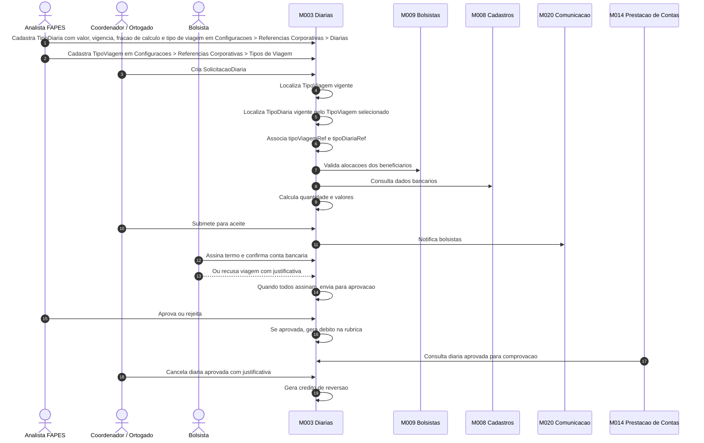
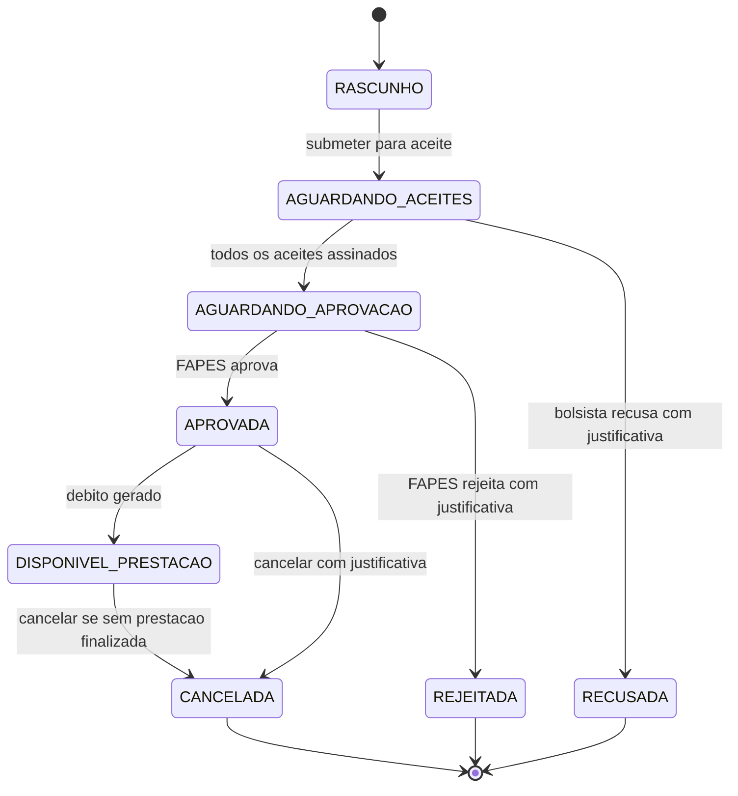

# Processo - Diarias da Iniciativa

[← Voltar](README.md)

## Fluxo operacional

## Estados e transicoes

## Pontos de controle

1. **Cadastro do valor vigente:** deve existir tipo de diaria vigente em **Configuracoes > Referencias Corporativas > Diarias**, contendo valor, data de vigencia, fracao de calculo e tipo de viagem ativo.
2. **Associacao obrigatoria:** a solicitacao grava `tipoDiariaRef`, `tipoViagemRef` e snapshots do valor unitario e da fracao de calculo do tipo de diaria.
3. **Beneficiarios validos:** bolsistas devem ter alocacao valida em M009.
4. **Aceite individual:** cada bolsista confirma termo e conta bancaria.
5. **Recusa individual:** quando o bolsista recusa, a justificativa e obrigatoria e a solicitacao nao segue para aprovacao.
6. **Aprovacao FAPES:** somente apos todos os aceites.
7. **Rejeicao FAPES:** exige justificativa obrigatoria e nao gera debito na rubrica.
8. **Lancamento de debito:** gerado na rubrica **Diarias e Passagens**.
9. **Cancelamento:** exige justificativa e gera credito se ja havia debito.
