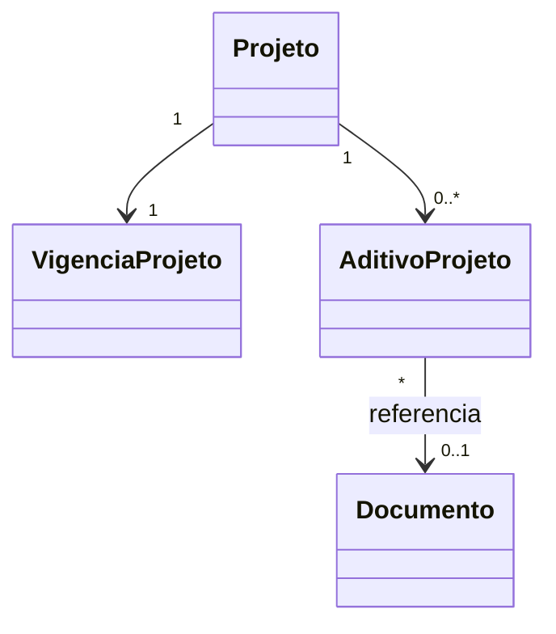

# Modelo Estrutural - Aditivos da Projeto

[← Voltar](README.md)

## Entidades

### VigenciaProjeto

Read model consultivo da vigencia e dados originais do projeto.

| Campo | Tipo | Obrigatorio | Descricao |
|-------|------|-------------|-----------|
| projetoId | ProjetoRef | Sim | Projeto vinculada |
| dataAprovacaoOriginal | Date | Sim | Data de aprovacao original do projeto |
| dataInicio | Date | Sim | Data inicial formal da projeto |
| dataFimOriginal | Date | Sim | Data final originalmente aprovada |
| dataFimVigente | Date | Sim | Data final atual, considerando aditivos de tempo aprovados |
| orcamentoOriginal | Decimal | Sim | Orcamento originalmente aprovado |
| possuiAditivoTempo | Boolean | Sim | Indica se existe aditivo de tempo aprovado |
| possuiAditivoFinanceiro | Boolean | Sim | Indica se existe aditivo financeiro aprovado |
| valorAditivadoTotal | Decimal | Nao | Soma dos valores aditivados financeiramente |

### AditivoProjeto

Registro consultivo de cada termo aditivo vinculado ao projeto.

| Campo | Tipo | Obrigatorio | Descricao |
|-------|------|-------------|-----------|
| id | String | Sim | Identificador do aditivo |
| projetoId | ProjetoRef | Sim | Projeto vinculada |
| tipo | TipoAditivoProjeto | Sim | Tempo, financeiro ou tempo e financeiro |
| situacao | SituacaoAditivoProjeto | Sim | Situacao atual do aditivo |
| dataFormalizacao | Date | Nao | Data de aprovacao, publicacao ou formalizacao |
| dataFimAnterior | Date | Condicional | Data final vigente antes do aditivo de tempo |
| dataFimAditada | Date | Condicional | Nova data final aprovada pelo aditivo de tempo |
| valorAditivado | Decimal | Condicional | Valor acrescido pelo aditivo financeiro |
| documentoReferencia | String | Nao | Numero, link ou identificacao do termo/documento |
| observacao | String | Nao | Observacao resumida do aditivo |

## Enumeracoes

### TipoAditivoProjeto

```text
TEMPO
FINANCEIRO
TEMPO_E_FINANCEIRO
```

### SituacaoAditivoProjeto

```text
RASCUNHO
EM_ANALISE
APROVADO
REJEITADO
CANCELADO
```

## Relacionamentos



## Invariantes

- `dataFimVigente` deve ser igual a `dataFimOriginal` quando nao houver aditivo de tempo aprovado.
- `orcamentoOriginal` nao deve ser sobrescrito por aditivo financeiro.
- A existencia de aditivo financeiro nao altera a data final vigente.
- A existencia de aditivo de tempo nao altera automaticamente o orcamento original.
- A lista de aditivos deve ser filtrada pela projeto selecionada e pelo perfil do usuario.
