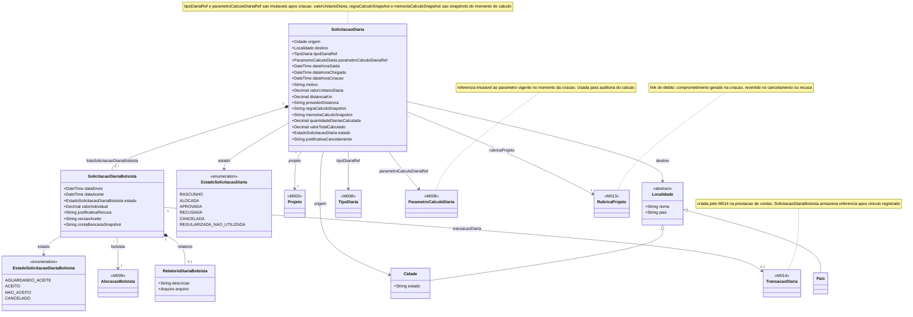

# Modelo Estrutural - Diarias da Projeto

[← Voltar](README.md)

## Modelo de Classes

## Dicionario de Dados

### SolicitacaoDiaria

| Campo | Tipo | Obrigatorio | Descricao |
|-------|------|:-----------:|-----------|
| origem | Cidade | Sim | Cidade de origem da viagem. Deve ser uma cidade do estado parametrizado no M008 (padrao: ES) |
| destino | Localidade (Cidade ou Pais) | Sim | Destino da viagem. Pode ser uma cidade ou um pais |
| tipoDiariaRef | TipoDiaria (M008) | Sim | Referencia ao TipoDiaria vigente no momento da criacao. Snapshot imutavel |
| parametroCalculoDiariaRef | ParametroCalculoDiaria (M008) | Sim | Referencia ao ParametroCalculoDiaria vigente no momento da criacao. Snapshot imutavel |
| dataHoraSaida | DateTime | Sim | Data e hora de partida. Deve ser anterior a dataHoraChegada |
| dataHoraChegada | DateTime | Sim | Data e hora de chegada. Deve ser posterior a dataHoraSaida |
| dataHoraCriacao | DateTime | Sim | Data e hora em que a solicitacao foi criada |
| motivo | String | Sim | Motivo da viagem declarado pelo coordenador |
| valorUnitarioDiaria | Decimal | Sim | Valor unitario da diaria no momento da criacao. Snapshot imutavel de TipoDiaria.valorUnitario |
| distanciaKm | Decimal | Nao | Distancia calculada entre origem e destino. Preenchida apenas para abrangencia DENTRO_ESTADO |
| provedorDistancia | String | Nao | Identificador do provedor usado para calcular a distancia (ex: google_routes_v2). Preenchido quando distanciaKm for preenchido |
| regraCalculoSnapshot | String | Sim | Texto da norma/parametro vigente aplicado no calculo. Snapshot imutavel para auditoria |
| memoriaCalculoSnapshot | String | Sim | Entradas, parametros, formula aplicada e resultado do calculo. Snapshot imutavel para auditoria |
| quantidadeDiariasCalculada | Decimal | Sim | Quantidade de diarias calculada pelo sistema. Snapshot imutavel apos criacao |
| valorTotalCalculado | Decimal | Sim | Valor total calculado pelo sistema. Snapshot imutavel apos criacao |
| estado | EstadoSolicitacaoDiaria | Sim | Estado atual da solicitacao |
| justificativaCancelamento | String | Nao | Justificativa preenchida pelo coordenador ao cancelar. Obrigatorio quando estado = CANCELADA |
| projeto | Projeto (M003) | Sim | Projeto ao qual a solicitacao pertence |
| rubricaProjeto | RubricaProjeto (M013) | Sim | Rubrica do tipo viagem debitada na criacao da solicitacao. Mesma rubrica usada na reversao por cancelamento ou recusa |
| listaSolicitacaoDiariaBolsista | SolicitacaoDiariaBolsista[] | Sim | Lista de aceites por bolsista. Minimo 1 |

### SolicitacaoDiariaBolsista

| Campo | Tipo | Obrigatorio | Descricao |
|-------|------|:-----------:|-----------|
| bolsista | AlocacaoBolsista (M009) | Sim | Bolsista que deve aceitar ou recusar a viagem |
| dataEnvio | DateTime | Sim | Data e hora em que a solicitacao foi enviada ao bolsista |
| dataAceite | DateTime | Nao | Data e hora em que o bolsista registrou a manifestacao. Nulo enquanto AGUARDANDO_ACEITE |
| estado | EstadoSolicitacaoDiariaBolsista | Sim | Estado do aceite |
| valorIndividual | Decimal | Sim | Valor calculado para este bolsista. Snapshot imutavel apos criacao |
| justificativaRecusa | String | Nao | Justificativa preenchida pelo bolsista ao recusar. Obrigatorio quando estado = NAO_ACEITO |
| versaoAceite | String | Nao | Versao do texto de aceite apresentado ao bolsista no momento da assinatura. Snapshot imutavel |
| contaBancariaSnapshot | String | Nao | Snapshot da conta bancaria confirmada pelo bolsista no momento do aceite. Snapshot imutavel |
| transacaoDiaria | TransacaoDiaria (M014) | Nao | Referencia a transacao financeira registrada no M014 apos pagamento pelo M004. Nulo enquanto nao houver pagamento processado |
| relatorio | RelatorioDiariaBolsista | Nao | Comprovacao da realizacao da viagem preenchida apos o retorno. Nulo enquanto nao registrado |

### RelatorioDiariaBolsista

| Campo | Tipo | Obrigatorio | Descricao |
|-------|------|:-----------:|-----------|
| descricao | String | Sim | Descricao da viagem realizada pelo bolsista. Preenchida apos o retorno |
| arquivo | Arquivo | Sim | Comprovante da realizacao da viagem (imagem ou PDF) |

### EstadoSolicitacaoDiaria

| Valor | Descricao |
|-------|-----------|
| RASCUNHO | Solicitacao criada pelo coordenador mas ainda nao enviada aos bolsistas. Nenhum SolicitacaoDiariaBolsista criado |
| ALOCADA | Solicitacao enviada aos bolsistas. Pelo menos um aceite pendente. SolicitacaoDiariaBolsistas criados e notificados |
| APROVADA | Todos os bolsistas aceitaram. Viagem confirmada. Solicitacao pronta para execucao |
| RECUSADA | Pelo menos um bolsista recusou. Coordenador deve revisar ou cancelar |
| CANCELADA | Solicitacao cancelada pelo coordenador. Todos os SolicitacaoDiariaBolsista sao automaticamente marcados como CANCELADO |
| REGULARIZADA_NAO_UTILIZADA | Data da viagem passou sem utilizacao. Comprometimento revertido na rubrica |

### EstadoSolicitacaoDiariaBolsista

| Valor | Descricao |
|-------|-----------|
| AGUARDANDO_ACEITE | Bolsista ainda nao se manifestou |
| ACEITO | Bolsista confirmou a viagem |
| NAO_ACEITO | Bolsista recusou a viagem |
| CANCELADO | Aceite cancelado por consequencia do cancelamento da SolicitacaoDiaria |
