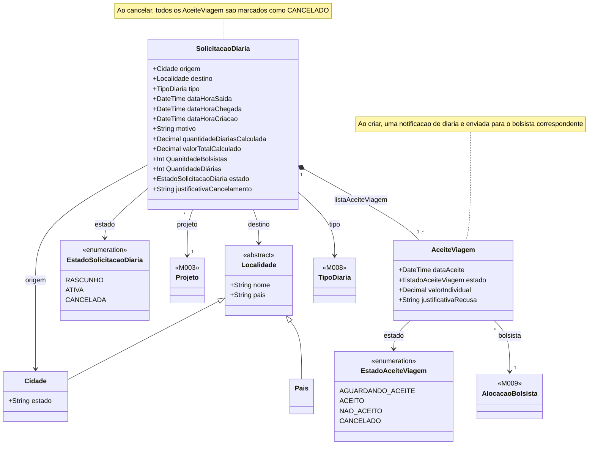

# Modelo Estrutural - Diarias da Projeto

[← Voltar](README.md)

## Modelo de Classes

## Dicionario de Dados

### SolicitacaoDiaria

| Campo | Tipo | Obrigatorio | Descricao |
|-------|------|:-----------:|-----------|
| origem | Cidade | Sim | Cidade de origem da viagem |
| destino | Localidade (Cidade ou Pais) | Sim | Destino da viagem. Pode ser uma cidade ou um pais |
| tipo | TipoDiaria (M008) | Sim | Tipo de diaria: DENTRO_ESTADO, NACIONAL ou INTERNACIONAL |
| dataHoraSaida | DateTime | Sim | Data e hora de partida. Deve ser anterior a dataHoraChegada |
| dataHoraChegada | DateTime | Sim | Data e hora de chegada. Deve ser posterior a dataHoraSaida |
| dataHoraCriacao | DateTime | Sim | Data e hora em que a solicitacao foi criada |
| motivo | String | Sim | Motivo da viagem declarado pelo coordenador |
| quantidadeDiariasCalculada | Decimal | Sim | Quantidade de diarias calculada pelo sistema. Snapshot imutavel apos criacao |
| valorTotalCalculado | Decimal | Sim | Valor total calculado pelo sistema. Snapshot imutavel apos criacao |
| estado | EstadoSolicitacaoDiaria | Sim | Estado atual da solicitacao |
| projeto | Projeto (M003) | Sim | Projeto ao qual a solicitacao pertence |
| listaAceiteViagem | AceiteViagem[] | Sim | Lista de aceites por bolsista. Minimo 1 |

### AceiteViagem

| Campo | Tipo | Obrigatorio | Descricao |
|-------|------|:-----------:|-----------|
| bolsista | AlocacaoBolsista (M009) | Sim | Bolsista que deve aceitar ou recusar a viagem |
| dataAceite | DateTime | Nao | Data e hora em que o bolsista registrou a manifestacao. Nulo enquanto AGUARDANDO_ACEITE |
| estado | EstadoAceiteViagem | Sim | Estado do aceite |

### EstadoSolicitacaoDiaria

| Valor | Descricao |
|-------|-----------|
| RASCUNHO | Solicitacao iniciada pelo coordenador mas ainda nao enviada aos bolsistas |
| ATIVA | Solicitacao enviada. Aceites podem estar pendentes, aceitos ou recusados |
| CANCELADA | Solicitacao cancelada pelo coordenador. Todos os AceiteViagem sao automaticamente marcados como CANCELADO |

### EstadoAceiteViagem

| Valor | Descricao |
|-------|-----------|
| AGUARDANDO_ACEITE | Bolsista ainda nao se manifestou |
| ACEITO | Bolsista confirmou a viagem |
| NAO_ACEITO | Bolsista recusou a viagem |
| CANCELADO | Aceite cancelado por consequencia do cancelamento da SolicitacaoDiaria |
