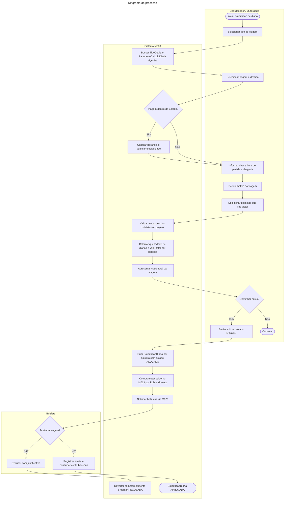
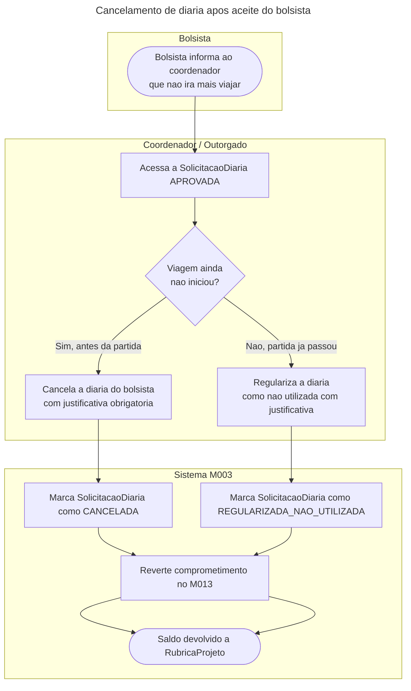
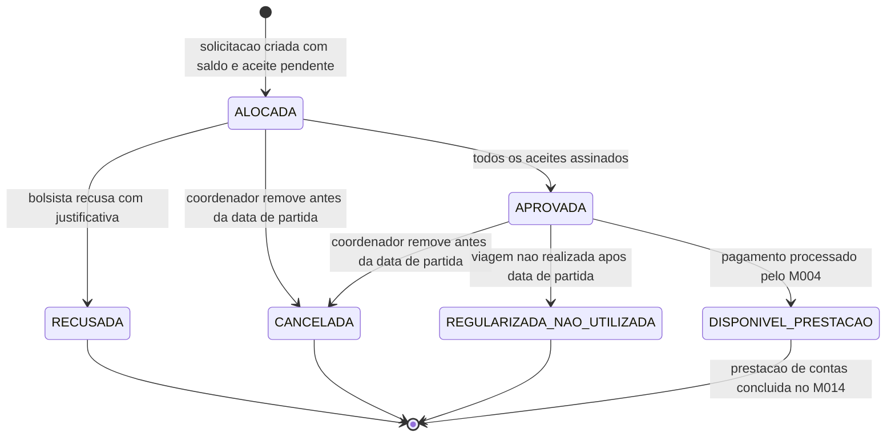

# Processo - Alocacao de Diaria de Passagem

[← Voltar](README.md)

## Diagrama de processo

## Cancelamento apos aceite

## Estados e transicoes

## Pontos de controle

1. **Tipo de viagem:** define a abrangencia (Dentro do Estado, Nacional ou Internacional) e determina o `TipoDiaria` e `ParametroCalculoDiaria` vigentes usados no calculo.
2. **Elegibilidade dentro do Estado:** o sistema calcula automaticamente a distancia rodoviaria e verifica regiao metropolitana e municipios limitrofes; pode bloquear a diaria quando nao houver pernoite.
3. **Calculo automatico:** quantidade de diarias, acrescimos e valor total calculados pelo sistema; coordenador nao informa valores.
4. **Revisao antes do envio:** coordenador ve o custo total por bolsista e total geral antes de confirmar; pode cancelar nesse ponto.
5. **Uma SolicitacaoDiaria por bolsista:** cada bolsista gera solicitacao independente com comprometimento e aceite proprios.
6. **Saldo insuficiente:** se o saldo da `RubricaProjeto` for insuficiente para qualquer bolsista, a solicitacao e bloqueada antes da criacao.
7. **Aceite obrigatorio:** bolsista confirma ciencia da viagem e conta bancaria; nao ha aprovacao manual da FAPES.
8. **Recusa individual:** bolsista que recusa gera reversao do comprometimento; os demais que aceitaram permanecem APROVADOS.
9. **Snapshot imutavel:** valor unitario, parametros e conta bancaria ficam gravados no momento da criacao; mudancas posteriores no M008 nao afetam a solicitacao.
10. **Pagamento e prestacao:** pagamento bancario ocorre no M004; associacao da saida financeira ocorre no M014; o M003 nao executa nem registra a transacao financeira.
