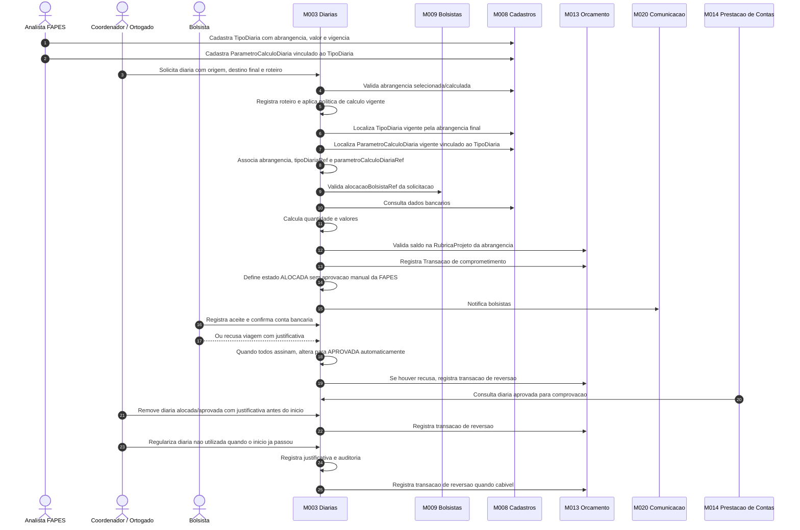
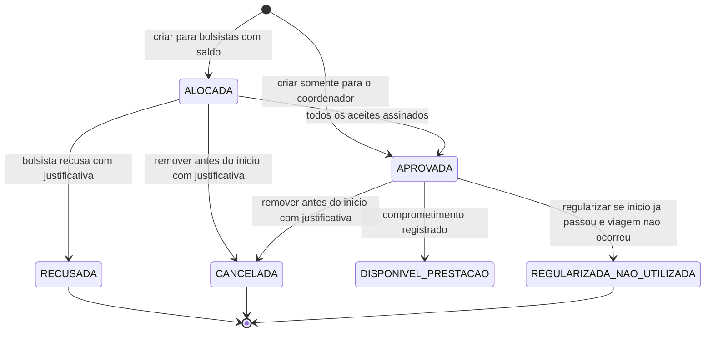

# Processo - Diarias da Projeto

[← Voltar](README.md)

## Fluxo operacional

## Estados e transicoes

## Pontos de controle

1. **Cadastro do valor vigente:** deve existir no M008 tipo de diaria vigente em **Configuracoes > Referencias Corporativas > Diarias**, contendo abrangencia, valor e data de vigencia.
2. **Parametros vinculados:** deve existir no M008 `ParametroCalculoDiaria` vigente vinculado ao `TipoDiaria` localizado.
3. **Associacao obrigatoria:** a solicitacao grava `abrangenciaRef`, `tipoDiariaRef`, `parametroCalculoDiariaRef` e snapshots da abrangencia, do valor unitario e da memoria de calculo.
4. **Roteiro da viagem:** quando houver mais de um trecho logistico, a solicitacao registra o roteiro para memoria de calculo e auditoria.
5. **Duvida para PO:** confirmar se trecho interno de apoio ate aeroporto/rodoviaria em viagem nacional/internacional gera diaria propria ou compoe a diaria principal. A decisao impacta o valor consumido da rubrica.
6. **Abrangencia e distancia:** enquanto a duvida estiver aberta, a abrangencia aplicada, a distancia usada e o comprometimento de saldo devem seguir a politica de calculo vigente e ficar registrados em `memoriaCalculoSnapshot`.
7. **Beneficiarios validos:** bolsistas devem ter alocacao valida em M009.
8. **Aceite:** o bolsista confirma a diaria e a conta bancaria na propria `SolicitacaoDiaria`.
9. **Saldo na rubrica:** a solicitacao somente e criada quando a rubrica de diaria correspondente a abrangencia existe no orcamento do projeto e possui saldo disponivel.
10. **Transacao da rubrica:** gerada no M013 como comprometimento vinculado a `RubricaProjeto` da abrangencia no ato da criacao.
11. **Visibilidade por orcamento:** o painel do coordenador deve listar uma linha por rubrica de diaria com orcamento no projeto: **Diaria dentro do Estado**, **Diaria nacional** e/ou **Diaria internacional**. Rubricas sem orcamento nao aparecem e nao ficam disponiveis para nova solicitacao.
12. **Pendente de aceite:** em diarias, pendente significa que o bolsista da `alocacaoBolsistaRef` ainda nao aceitou a diaria. Nao representa aprovacao FAPES nem pendencia financeira.
13. **Estado alocado:** apos a criacao com saldo suficiente, a diaria fica `ALOCADA` enquanto a viagem nao iniciou e os aceites ainda estao pendentes.
14. **Aceite sem aprovacao FAPES:** quando todos os bolsistas assinam, a solicitacao passa automaticamente para `APROVADA`.
15. **Recusa individual:** quando o bolsista recusa, a justificativa e obrigatoria e o comprometimento e revertido por transacao de reversao.
16. **Remocao antes do inicio:** diaria `ALOCADA` ou `APROVADA` pode ser removida pelo coordenador com justificativa somente antes da data/hora de partida.
17. **Regularizacao apos inicio:** diaria nao utilizada depois do inicio previsto deve ser regularizada com justificativa e auditoria, sem exclusao fisica, gerando `Transacao` de reversao quando cabivel.
18. **Rubrica x transacao:** a rubrica classifica e limita o uso; a `Transacao` movimenta o saldo; a transacao financeira/bancaria so sera vinculada depois, na prestacao/conciliacao do pagamento em M014/M016.
