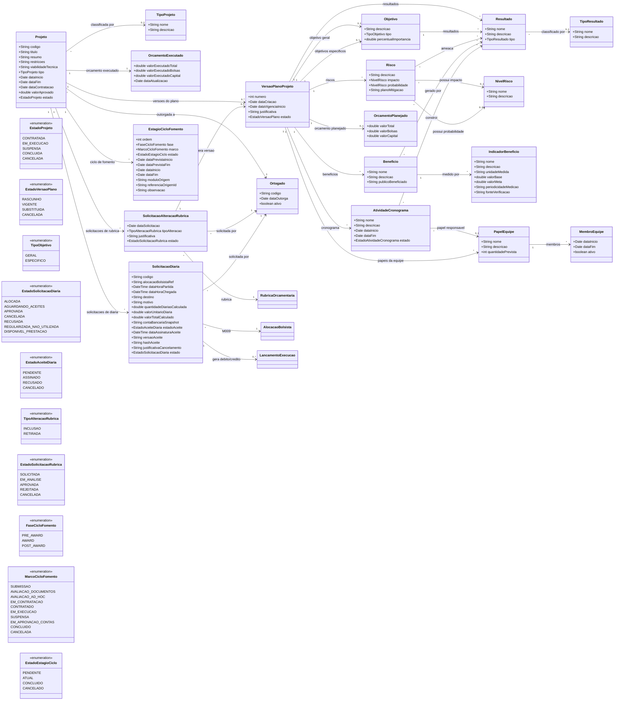
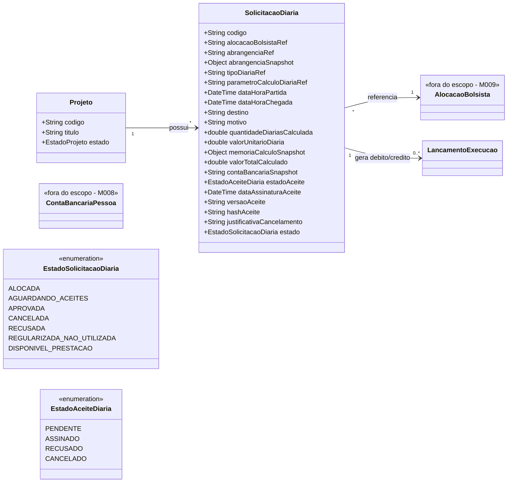
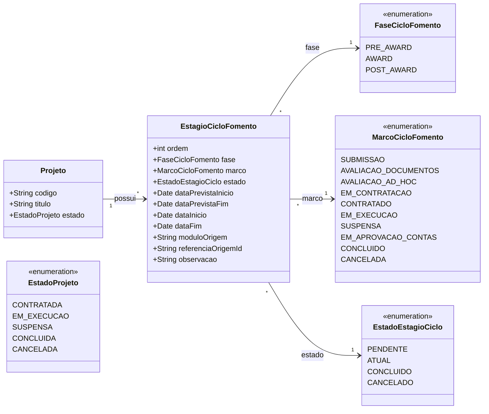
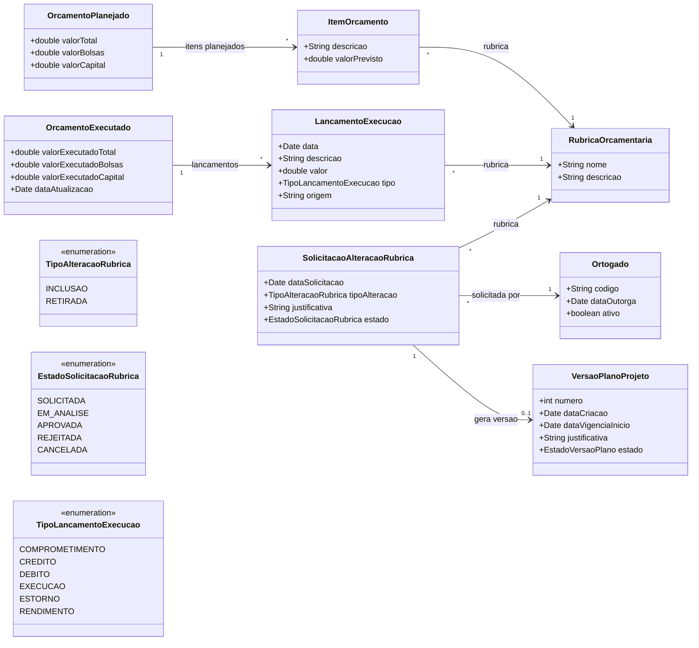
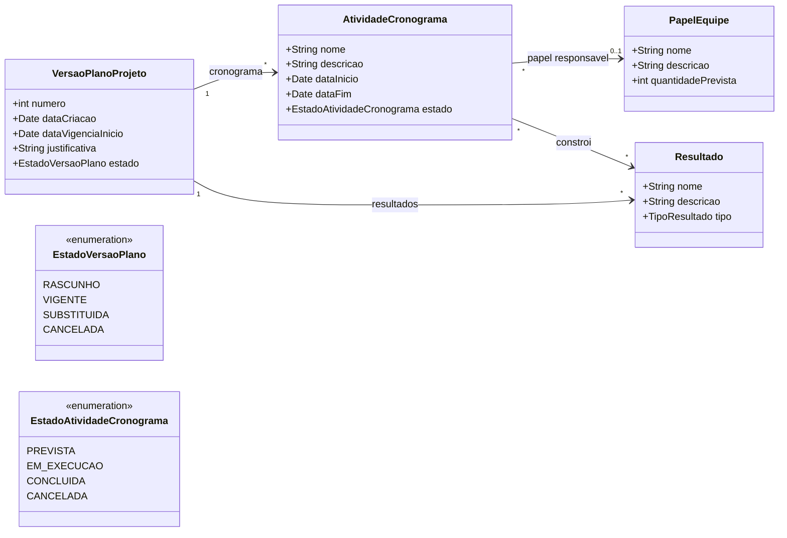
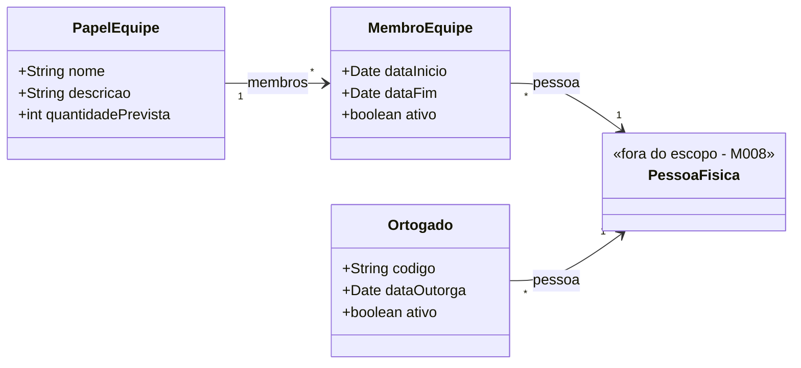

# Modelo Estrutural

Dominio e regras de negocio: ver [README.md](README.md)

## Descricao do Modelo

Este modelo representa a `Projeto` como o conceito central do modulo M003. Uma projeto e o item apoiado pela agencia apos a contratacao, podendo representar projeto de pesquisa, projeto de inovacao, visita tecnica ou outro tipo cadastrado em `TipoProjeto`.

O modelo estrutural do M003 representa a **estrutura maxima possivel** de uma projeto. A obrigatoriedade de tipo de projeto, objetivos, resultados, riscos, beneficios, equipe, cronograma, orcamento, rubricas e demais blocos planejaveis e definida pela configuracao da captacao no M011. Portanto, esses blocos podem existir ou nao, e podem ser obrigatorios ou opcionais conforme a regra da captacao que originou a projeto.

A `Projeto` concentra os dados estaveis do apoio: codigo, titulo, resumo, restricoes, viabilidade tecnica, datas gerais, valor aprovado, estado atual e o `Ortogado` responsavel pela outorga. O `Ortogado` e um papel assumido por uma `PessoaFisica` cadastrada no M008 e registra a data da outorga.

Os elementos planejaveis da projeto ficam em `VersaoPlanoProjeto`. Essa classe existe para permitir alteracoes ao longo da execucao sem apagar o historico. Resultados, cronograma, objetivos, riscos, beneficios, orcamento agregado e papeis planejados da equipe pertencem a uma versao do plano quando tiverem sido exigidos ou informados. Quando algum desses elementos configurados muda, uma nova versao deve ser criada com justificativa, mantendo a versao anterior como historico.

Quando a captacao exigir objetivos, a versao do plano pode possuir objetivo geral e objetivos especificos. Os objetivos especificos podem indicar percentual de importancia e podem estar associados a `Resultado`, quando resultados forem exigidos ou informados. O `Resultado` descreve entregas esperadas da projeto e pode ser classificado por `TipoResultado`, como servico, processo ou produto.

Os `Risco` tambem podem ser vinculados aos resultados, pois um risco pode ameacar uma ou mais entregas esperadas. Impacto e probabilidade usam a mesma classe de referencia, `NivelRisco`, permitindo configurar niveis como pequeno, medio e grande sem duplicar estruturas.

Os `Beneficio` representam ganhos esperados ou gerados pela projeto e podem se conectar aos resultados que os sustentam. Cada beneficio pode possuir `IndicadorBeneficio`, usado para medir seu alcance por unidade de medida, valor base, valor meta, periodicidade e fonte de verificacao.

O `OrcamentoPlanejado` representa a previsao aprovada de recursos necessarios para implementar a projeto quando a captacao exigir orcamento. Ele pode ter valores agregados para total, bolsas e capital, e tambem pode possuir `ItemOrcamento` em nivel inicial. Cada item de orcamento, quando informado, deve estar associado a uma `RubricaOrcamentaria`. O detalhamento por nivel de bolsa, subrubricas de capital ou itens especificos de compra nao foi incluido neste momento.

O `OrcamentoExecutado` representa uma visao consolidada da execucao financeira da projeto. Como o valor executado muda ao longo do tempo, ele e calculado a partir de `LancamentoExecucao`, preservando historico, data, rubrica, tipo de movimento e origem do registro. Dessa forma, o total executado nao e sobrescrito manualmente; ele deriva dos lancamentos de execucao, estorno, comprometimento ou rendimento.

O `Ortogado` pode solicitar a inclusao ou retirada de rubrica por meio de `SolicitacaoAlteracaoRubrica`. Essa solicitacao nao altera automaticamente o orcamento planejado; ela passa por analise e, quando aprovada, deve gerar uma nova `VersaoPlanoProjeto` para refletir a mudanca autorizada no planejamento de recursos.

O submodelo estrutural de diarias foi isolado em [diarias/modelo-estrutural.md](diarias/modelo-estrutural.md). Em resumo, a `SolicitacaoDiaria` nasce no M003 durante a execucao da projeto, usa a abrangencia selecionada pelo coordenador, calcula o valor a partir do `TipoDiaria` vigente e do `ParametroCalculoDiaria` vinculado consultados no M008, valida saldo na rubrica de diaria e gera alocacao/comprometimento sem aprovacao manual da FAPES. Diarias futuras ficam `ALOCADA` ate os aceites obrigatorios, podem ser removidas com justificativa antes do inicio da viagem, e, depois do inicio previsto, devem seguir regularizacao auditavel quando nao utilizadas. `Abrangencia`, `TipoDiaria` e `ParametroCalculoDiaria` nao sao entidades do M003; sao referencias corporativas do M008.

A equipe e planejada por `PapelEquipe`, que define o papel esperado e a quantidade prevista de pessoas para esse papel. Depois, `MembroEquipe` associa pessoas reais (`PessoaFisica`) aos papeis planejados. Dessa forma, primeiro se define a necessidade da equipe e depois se preenche essa necessidade com pessoas.

O `AtividadeCronograma` representa uma atividade planejada na versao do plano quando a captacao exigir cronograma. Cada atividade pode possuir nome, descricao, datas inicial e final, estado, papel responsavel e resultados que ajuda a construir, conforme a configuracao da captacao.

O `EstagioCicloFomento` registra a linha do tempo transversal da projeto desde a submissao ate a conclusao, suspensao ou cancelamento. Ele separa a fase macro do fomento (`PRE_AWARD`, `AWARD`, `POST_AWARD`) do marco exibido na jornada (`SUBMISSAO`, `AVALIACAO_DOCUMENTOS`, `AVALIACAO_AD_HOC`, `EM_CONTRATACAO`, `CONTRATADO`, `EM_EXECUCAO`, `SUSPENSA`, `EM_APROVACAO_CONTAS`, `CONCLUIDO`, `CANCELADA`). Cada estagio possui datas planejadas e efetivas, estado do marco, modulo de origem e referencia externa. Essa entidade funciona como read model de timeline e nao transfere ownership dos eventos: M011 continua dono do pre-award, M022 da contratacao/outorga, M014 da prestacao de contas e M015 da finalizacao.

### Obrigatoriedade Configuravel

A obrigatoriedade dos blocos abaixo nao e fixa no M003. Ela deve ser herdada da configuracao da captacao no M011:

| Bloco | Pode ser exigido pela captacao? | Observacao |
|-------|----------------------------------|------------|
| Tipo de projeto | Sim | A captacao pode fixar ou dispensar a classificacao por `TipoProjeto`. |
| Objetivos | Sim | Pode exigir objetivo geral, especificos ou nenhum detalhamento de objetivos. |
| Resultados | Sim | Pode exigir resultados esperados ou permitir projeto sem resultados declarados. |
| Riscos | Sim | Pode exigir matriz de riscos ou dispensar riscos na proposta. |
| Beneficios e indicadores | Sim | Pode exigir beneficios, indicadores ou ambos como opcionais. |
| Equipe | Sim | Pode exigir papeis de equipe, membros ou nenhum detalhamento de equipe. |
| Cronograma | Sim | Pode exigir atividades e datas ou dispensar cronograma. |
| Orcamento e rubricas | Sim | Pode exigir orcamento agregado, itens, rubricas ou dispensar detalhamento orcamentario. |

### Diagrama de Classes

#### Visao Geral da Projeto

#### Solicitacao de Diaria

#### Ciclo de Fomento

#### Orcamento

#### Cronograma

#### Equipe e Papeis

## Dicionario de Dados

O dicionario de dados detalha as classes do modelo, seus atributos, obrigatoriedade, tipo de dado, dominio esperado, tamanho recomendado e regra de unicidade quando aplicavel. Classes marcadas como referencia, como `TipoProjeto`, `TipoResultado` e `NivelRisco`, representam cadastros controlados usados para classificar os dados principais.

Na coluna **Obrig.**, o valor `Cond.` indica obrigatoriedade condicional: o campo ou bloco e obrigatorio apenas quando a configuracao da captacao no M011 exigir aquela informacao. Quando a captacao dispensar o bloco, a projeto pode existir sem esse detalhamento.

| Classe | Atributo | Definicao | Obrig. | Tipo | Dominio | Tamanho | Unico |
|--------|----------|-----------|--------|------|---------|---------|-------|
| **Projeto** | codigo | Codigo identificador da projeto apoiada pela agencia | Gerado | String | Ex: INI-2026-001 | | Sim |
| | titulo | Titulo principal da projeto | Sim | String | | 300 | |
| | resumo | Resumo descritivo da projeto contratada | Sim | String | | 2000 | |
| | restricoes | Restricoes conhecidas para execucao da projeto | Nao | String | | 2000 | |
| | viabilidadeTecnica | Analise ou justificativa da viabilidade tecnica da projeto | Nao | String | | 2000 | |
| | tipo | Tipo da projeto apoiada | Cond. | TipoProjeto | Obrigatorio quando a captacao exigir classificacao por tipo | | |
| | dataInicio | Data prevista ou efetiva de inicio da projeto | Sim | Date | | | |
| | dataFim | Data prevista ou efetiva de encerramento da projeto | Nao | Date | | | |
| | dataContratacao | Data em que a projeto foi formalmente contratada | Sim | Date | | | |
| | valorAprovado | Valor financeiro aprovado para a projeto, quando aplicavel | Nao | Double | | | |
| | estado | Estado atual da projeto no ciclo operacional | Gerado | EstadoProjeto | Ver enumeracao | | |
| **DiariasDaProjeto** | modeloDetalhado | A estrutura detalhada de SolicitacaoDiaria foi movida para a pasta propria de diarias; Abrangencia, TipoDiaria e ParametroCalculoDiaria pertencem ao M008; AlocacaoBolsista pertence ao M009 | Sim | Documento | [diarias/modelo-estrutural.md](diarias/modelo-estrutural.md) | | |
| **EstagioCicloFomento** | ordem | Posicao do estagio na timeline da projeto | Sim | Int | Sequencia iniciando em 1 | | Sim por projeto |
| | fase | Macrofase do ciclo de fomento | Sim | FaseCicloFomento | `PRE_AWARD`/`AWARD`/`POST_AWARD` | | |
| | marco | Marco especifico exibido na timeline | Sim | MarcoCicloFomento | `SUBMISSAO`/`AVALIACAO_DOCUMENTOS`/`AVALIACAO_AD_HOC`/`EM_CONTRATACAO`/`CONTRATADO`/`EM_EXECUCAO`/`SUSPENSA`/`EM_APROVACAO_CONTAS`/`CONCLUIDO`/`CANCELADA` | | Sim por projeto |
| | estado | Estado atual do marco na timeline | Gerado | EstadoEstagioCiclo | `PENDENTE`/`ATUAL`/`CONCLUIDO`/`CANCELADO` | | |
| | dataPrevistaInicio | Data planejada para inicio do marco, quando houver cronograma | Nao | Date | | | |
| | dataPrevistaFim | Data planejada para conclusao do marco, quando houver cronograma | Nao | Date | | | |
| | dataInicio | Data efetiva em que o marco foi iniciado ou atingido | Nao | Date | | | |
| | dataFim | Data efetiva em que o marco foi concluido | Nao | Date | | | |
| | moduloOrigem | Modulo dono do evento que originou o marco | Sim | String | Ex: M011, M022, M003, M014, M015 | 20 | |
| | referenciaOrigemId | Identificador do objeto dono no modulo de origem | Nao | String | Ex: propostaId, termoOutorgaId, prestacaoId | 100 | |
| | observacao | Detalhe opcional para exibicao ou auditoria do marco | Nao | String | | 1000 | |
| **TipoProjeto** | nome | Nome do tipo de projeto | Sim | String | Ex: Projeto de Pesquisa, Projeto de Inovacao, Visita Tecnica | 150 | Sim |
| | descricao | Descricao do tipo de projeto e sua finalidade | Nao | String | | 500 | |
| **VersaoPlanoProjeto** | numero | Numero sequencial da versao do plano da projeto | Cond. | Int | Obrigatorio quando houver plano configurado | | Sim por projeto |
| | dataCriacao | Data em que a versao do plano foi criada | Gerado | Date | | | |
| | dataVigenciaInicio | Data a partir da qual a versao do plano passa a valer | Sim | Date | | | |
| | justificativa | Justificativa para criacao ou alteracao da versao do plano | Nao | String | | 2000 | |
| | estado | Estado atual da versao do plano | Gerado | EstadoVersaoPlano | Ver enumeracao | | |
| **Objetivo** | descricao | Objetivo declarado para a projeto | Cond. | String | Obrigatorio quando objetivos forem exigidos | 1000 | |
| | tipo | Tipo do objetivo | Cond. | TipoObjetivo | `GERAL`/`ESPECIFICO`; obrigatorio quando objetivos forem exigidos | | |
| | percentualImportancia | Percentual de importancia do objetivo especifico em relacao aos demais objetivos especificos | Nao | Double | 0 a 100 | | |
| **Resultado** | nome | Nome do resultado esperado da projeto | Cond. | String | Obrigatorio quando resultados forem exigidos | 200 | |
| | descricao | Descricao do resultado esperado da projeto | Cond. | String | Obrigatorio quando resultados forem exigidos | 1000 | |
| | tipo | Tipo do resultado esperado | Cond. | TipoResultado | Obrigatorio quando a captacao exigir classificacao do resultado | | |
| **TipoResultado** | nome | Nome do tipo de resultado | Sim | String | Ex: Servico, Processo, Produto | 150 | Sim |
| | descricao | Descricao do tipo de resultado e sua finalidade | Nao | String | | 500 | |
| **Risco** | descricao | Risco identificado para a execucao da projeto | Cond. | String | Obrigatorio quando riscos forem exigidos | 1000 | |
| | impacto | Nivel de impacto previsto caso o risco ocorra | Cond. | NivelRisco | Obrigatorio quando a captacao exigir impacto | | |
| | probabilidade | Nivel de probabilidade estimada de ocorrencia | Cond. | NivelRisco | Obrigatorio quando a captacao exigir probabilidade | | |
| | planoMitigacao | Plano de mitigacao ou resposta ao risco | Nao | String | | 1000 | |
| **NivelRisco** | nome | Nome do nivel usado para impacto ou probabilidade do risco | Sim | String | Ex: Pequeno, Medio, Grande | 100 | Sim |
| | descricao | Descricao do nivel e seus criterios de enquadramento | Nao | String | | 500 | |
| **Beneficio** | nome | Nome do beneficio esperado ou gerado pela projeto | Cond. | String | Obrigatorio quando beneficios forem exigidos | 200 | |
| | descricao | Descricao do beneficio esperado ou gerado pela projeto | Cond. | String | Obrigatorio quando beneficios forem exigidos | 1000 | |
| | publicoBeneficiado | Publico, instituicao ou grupo beneficiado | Nao | String | | 300 | |
| **IndicadorBeneficio** | nome | Nome do indicador usado para medir o beneficio | Cond. | String | Obrigatorio quando indicadores forem exigidos | 200 | |
| | descricao | Descricao do que o indicador mede | Nao | String | | 1000 | |
| | unidadeMedida | Unidade usada na medicao do indicador | Cond. | String | Obrigatorio quando indicadores forem exigidos | 50 | |
| | valorBase | Valor de referencia antes da projeto ou no inicio da medicao | Nao | Double | | | |
| | valorMeta | Valor esperado para demonstrar o alcance do beneficio | Cond. | Double | Obrigatorio quando indicadores forem exigidos | | |
| | periodicidadeMedicao | Frequencia de medicao do indicador | Nao | String | Ex: Mensal, Trimestral, Anual, Final | 50 | |
| | fonteVerificacao | Fonte dos dados usados para verificar o indicador | Nao | String | | 300 | |
| **PapelEquipe** | nome | Nome do papel planejado para a equipe da projeto | Cond. | String | Obrigatorio quando equipe for exigida | 150 | |
| | descricao | Descricao das responsabilidades esperadas para o papel | Nao | String | | 500 | |
| | quantidadePrevista | Quantidade prevista de pessoas para este papel na equipe | Cond. | Int | Obrigatorio quando a captacao exigir quantidade por papel | | |
| **MembroEquipe** | dataInicio | Data de inicio da participacao da pessoa na equipe | Nao | Date | | | |
| | dataFim | Data de encerramento da participacao na equipe | Nao | Date | | | |
| | ativo | Indica se o membro esta ativo na equipe | Gerado | Boolean | true/false | | |
| **OrcamentoPlanejado** | valorTotal | Valor total planejado para a projeto | Cond. | Double | Obrigatorio quando orcamento for exigido | | |
| | valorBolsas | Valor planejado para bolsas | Nao | Double | | | |
| | valorCapital | Valor planejado para capital | Nao | Double | | | |
| **ItemOrcamento** | descricao | Descricao do item orcamentario planejado | Cond. | String | Obrigatorio quando item de orcamento for informado | 500 | |
| | valorPrevisto | Valor previsto para o item orcamentario | Cond. | Double | Obrigatorio quando item de orcamento for informado | | |
| **OrcamentoExecutado** | valorExecutadoTotal | Valor total executado consolidado a partir dos lancamentos | Gerado | Double | | | |
| | valorExecutadoBolsas | Valor executado consolidado em rubricas de bolsa | Gerado | Double | | | |
| | valorExecutadoCapital | Valor executado consolidado em rubricas de capital | Gerado | Double | | | |
| | dataAtualizacao | Data da ultima atualizacao da visao consolidada de execucao | Gerado | Date | | | |
| **LancamentoExecucao** | data | Data do lancamento de execucao financeira | Sim | Date | | | |
| | descricao | Descricao do movimento financeiro executado | Sim | String | | 500 | |
| | valor | Valor do lancamento financeiro | Sim | Double | Maior que zero | | |
| | tipo | Tipo do lancamento de execucao | Sim | TipoLancamentoExecucao | `COMPROMETIMENTO`/`CREDITO`/`DEBITO`/`EXECUCAO`/`ESTORNO`/`RENDIMENTO` | | |
| | origem | Origem do lancamento financeiro | Nao | String | Ex: Prestacao de contas, extrato bancario, importacao | 200 | |
| **SolicitacaoAlteracaoRubrica** | dataSolicitacao | Data em que o ortogado solicitou inclusao ou retirada de rubrica | Gerado | Date | | | |
| | tipoAlteracao | Tipo de alteracao solicitada para a rubrica | Sim | TipoAlteracaoRubrica | `INCLUSAO`/`RETIRADA` | | |
| | justificativa | Justificativa apresentada pelo ortogado para alterar a rubrica | Sim | String | | 2000 | |
| | estado | Estado atual da solicitacao de alteracao de rubrica | Gerado | EstadoSolicitacaoRubrica | Ver enumeracao | | |
| **RubricaOrcamentaria** | nome | Nome da rubrica associada ao item planejado ou lancamento executado | Sim | String | Ex: Bolsa, Capital | 150 | Sim |
| | descricao | Descricao da finalidade da rubrica orcamentaria | Nao | String | | 500 | |
| **AtividadeCronograma** | nome | Nome da atividade planejada no cronograma da projeto | Cond. | String | Obrigatorio quando cronograma for exigido | 200 | |
| | descricao | Descricao da atividade planejada no cronograma da projeto | Cond. | String | Obrigatorio quando cronograma for exigido | 500 | |
| | dataInicio | Data prevista ou efetiva de inicio da atividade | Cond. | Date | Obrigatorio quando cronograma exigir datas | | |
| | dataFim | Data prevista ou efetiva de encerramento da atividade | Cond. | Date | Obrigatorio quando cronograma exigir datas | | |
| | estado | Estado atual da atividade do cronograma | Gerado | EstadoAtividadeCronograma | Ver enumeracao | | |
| **Ortogado** | codigo | Codigo identificador do papel de ortogado no contexto operacional | Gerado | String | Ex: ORT-2026-001 | | Sim |
| | dataOutorga | Data em que a projeto foi outorgada ao ortogado | Sim | Date | | | |
| | ativo | Indica se o ortogado esta ativo para operacoes no contexto | Gerado | Boolean | true/false | | |

## Notas de Implementacao

**Entidades externas:**
- PessoaFisica: gerenciada por M008 (Cadastros Corporativos)
- Edital: gerenciado por M011 (Configuracao da Captacao)
- Bolsas, bolsistas, cotas e alocacoes de bolsa: gerenciados por M009 (Gestao Bolsista)
- Documentos fiscais, extratos, transacoes bancarias e prestacao de contas detalhada: gerenciados por M014 (Prestacao de Contas)

**Restricoes estruturais:**
- A projeto pode possuir versoes do plano quando a captacao exigir ou quando houver planejamento registrado.
- A projeto deve possuir uma colecao ordenada de `EstagioCicloFomento` para representar a timeline transversal de pre-award, award e post-award quando houver origem rastreavel.
- A ordem base dos estagios deve seguir a sequencia: `SUBMISSAO`, `AVALIACAO_DOCUMENTOS`, `AVALIACAO_AD_HOC`, `EM_CONTRATACAO`, `CONTRATADO`, `EM_EXECUCAO`, `SUSPENSA`, `EM_APROVACAO_CONTAS`, `CONCLUIDO`.
- `SUSPENSA` e um marco intermediario de post-award; ele pode ser concluido quando a projeto for reativada, cancelada ou encaminhada para finalizacao conforme M015.
- `CANCELADA` e um marco terminal alternativo e pode ocorrer a partir de qualquer fase, conforme regra do modulo dono da transicao.
- Uma projeto nao pode possuir simultaneamente `CONCLUIDO` e `CANCELADA` com estado `CONCLUIDO`.
- Cada marco do `EstagioCicloFomento` deve aparecer no maximo uma vez por projeto.
- Apenas um `EstagioCicloFomento` por projeto pode estar com estado `ATUAL`.
- Um estagio com estado `CONCLUIDO` deve possuir `dataInicio` ou `dataFim`; quando ambas existirem, `dataFim` nao pode ser anterior a `dataInicio`.
- O `moduloOrigem` do estagio deve indicar o contexto dono do evento que originou a transicao, preservando as fronteiras entre M011, M022, M003, M014 e M015.
- Apenas uma versao do plano da projeto pode estar com estado `VIGENTE`.
- Alteracoes em resultados, cronograma, objetivos, riscos, beneficios, orcamento ou papeis planejados devem gerar uma nova versao do plano quando esses blocos existirem na projeto.
- O orcamento planejado pertence a uma versao do plano da projeto quando a captacao exigir orcamento.
- O orcamento executado pertence a projeto e deve ser calculado a partir dos lancamentos de execucao financeira.
- Todo lancamento de execucao deve estar associado a uma rubrica orcamentaria.
- O valor executado consolidado deve considerar os lancamentos do tipo `EXECUCAO` e `DEBITO`, deduzir `CREDITO` e `ESTORNO` e preservar `COMPROMETIMENTO` e `RENDIMENTO` como movimentos identificaveis para acompanhamento financeiro.
- A FAPES deve cadastrar `Abrangencia`, `TipoDiaria` e `ParametroCalculoDiaria` no M008 antes de permitir o calculo de novas solicitacoes de diaria.
- Apenas um `TipoDiaria` ativo no M008 deve ser aplicavel para uma mesma data de referencia e abrangencia.
- Solicitacao de diaria deve estar associada a uma projeto ativa e ser solicitada pelo `Ortogado` ativo.
- Solicitacao de diaria deve possuir exatamente uma `alocacaoBolsistaRef` valida em M009.
- `dataHoraChegada` deve ser posterior a `dataHoraPartida`.
- Quantidade de diarias deve ser calculada pelo sistema a partir do periodo informado e dos parametros de calculo vigentes; o valor unitario deve vir do `TipoDiaria` vigente do M008 para a abrangencia no momento da criacao da solicitacao.
- `abrangenciaSnapshot`, `valorUnitarioDiaria`, `memoriaCalculoSnapshot`, `quantidadeDiariasCalculada` e `valorTotalCalculado` devem ser preservados como snapshot da solicitacao.
- A solicitacao de diaria nao depende de permissao ou aprovacao manual da FAPES; o bloqueio ocorre por ausencia de rubrica ou saldo.
- Quando criada com saldo suficiente, a solicitacao deve gerar `LancamentoExecucao` do tipo `DEBITO` ou `COMPROMETIMENTO` na rubrica de Diarias e Passagens, usando `origem = M003:SolicitacaoDiaria:{id}`.
- O aceite deve ficar registrado na propria `SolicitacaoDiaria`; a solicitacao passa automaticamente para `APROVADA` quando `estadoAceite = ASSINADO`.
- O debito gerado pelo comprometimento deve reduzir o saldo disponivel da rubrica de Diarias e Passagens na execucao consolidada.
- O coordenador pode remover solicitacao de diaria `ALOCADA` ou `APROVADA` com justificativa obrigatoria somente antes da data/hora de partida.
- Depois da data/hora de partida, diaria nao utilizada deve seguir regularizacao auditavel, sem exclusao fisica.
- A remocao ou regularizacao deve gerar `LancamentoExecucao` do tipo `CREDITO` na rubrica de Diarias e Passagens quando havia comprometimento anterior.
- O credito gerado deve recompor o saldo disponivel da rubrica de Diarias e Passagens na execucao consolidada.
- Recusa de aceite pelo bolsista deve registrar justificativa e gerar credito de reversao quando houver debito/comprometimento anterior.
- O aceite deve preservar a versao do aceite e a conta bancaria usada no momento da assinatura.
- M014 deve referenciar a `SolicitacaoDiaria` ao registrar `JustificativaDiaria` e comprovantes de pagamento.
- Somente o `Ortogado` ativo da projeto pode solicitar inclusao ou retirada de rubrica orcamentaria.
- Toda solicitacao de alteracao de rubrica deve possuir justificativa e estar associada a uma rubrica.
- Aprovacao de solicitacao de inclusao ou retirada de rubrica deve gerar nova `VersaoPlanoProjeto`.
- Retirada de rubrica deve ser bloqueada quando houver lancamento de execucao impeditivo para a rubrica.
- Objetivo geral, objetivos especificos, resultados, riscos, beneficios, equipe, cronograma e orcamento sao blocos condicionais definidos pela configuracao da captacao no M011.
- Quando objetivos especificos e resultados forem exigidos juntos, a configuracao pode exigir associacao entre eles.
- Quando riscos e resultados forem exigidos juntos, a configuracao pode exigir que riscos indiquem quais resultados podem ser impactados.
- Quando beneficios e resultados forem exigidos juntos, a configuracao pode exigir associacao entre beneficios e resultados.
- Quando equipe for exigida, membro da equipe deve estar associado a uma PessoaFisica e pode estar associado a um papel planejado.
- Quando a captacao definir quantidade prevista por papel, a quantidade de membros vinculados nao deve exceder a quantidade prevista para esse papel.
- Quando cronograma, equipe e resultados forem exigidos juntos, a configuracao pode exigir que atividades indiquem papel responsavel e resultados relacionados.

**Navegabilidade:**
- Cardinalidade 1: atributo do tipo da classe destino (ex: Projeto.ortogado: Ortogado)
- Cardinalidade N: atributo lista do tipo da classe destino (ex: Projeto.versoesPlano: List<VersaoPlanoProjeto>)
