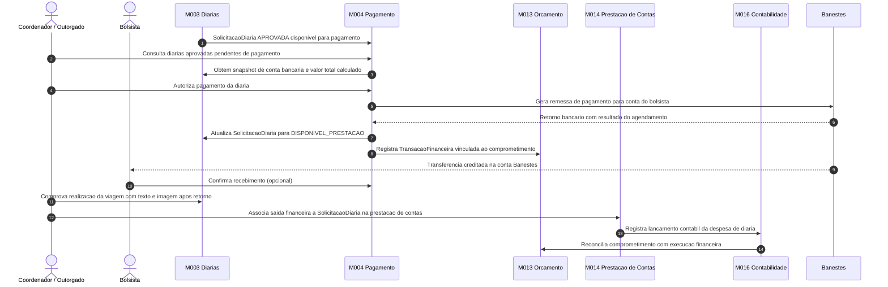
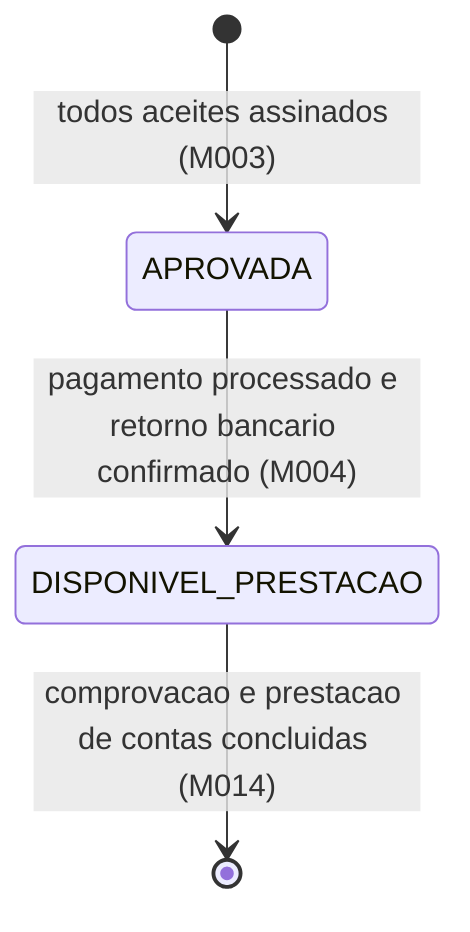

# Processo - Pagamento de Diarias

[← Voltar](README.md)

## Fluxo de pagamento

## Estados relevantes da SolicitacaoDiaria no fluxo M004

## Responsabilidades por ator

| Ator | Responsabilidade no fluxo de pagamento |
|------|----------------------------------------|
| Coordenador / Outorgado | Consulta diarias aprovadas, autoriza pagamento e comprova realizacao da viagem |
| Bolsista | Confirma recebimento quando solicitado |
| M003 Diarias | Fonte da SolicitacaoDiaria APROVADA com snapshot de conta bancaria, valor e regra de calculo |
| M004 Pagamento | Gera e processa remessa bancaria para Banestes, registra retorno e atualiza estado da solicitacao |
| M013 Orcamento | Registra TransacaoFinanceira vinculada ao comprometimento existente |
| M014 Prestacao de Contas | Associa saida financeira a SolicitacaoDiaria aprovada para comprovacao |
| M016 Contabilidade | Registra lancamento contabil da despesa de diaria e reconcilia execucao |
| Banestes | Processa a transferencia bancaria para a conta do bolsista |

## Pontos de controle

1. **Pre-condicao:** `SolicitacaoDiaria` deve estar `APROVADA` com `estadoAceite = ASSINADO` e `contaBancariaSnapshot` preenchido.
2. **Conta bancaria:** M004 usa o `contaBancariaSnapshot` gravado no aceite da `SolicitacaoDiaria`, nao consulta conta atual do bolsista no momento do pagamento.
3. **Valor:** M004 usa `valorTotalCalculado` do snapshot; nao recalcula nem consulta valores vigentes do M008.
4. **Remessa:** gerada pelo M004 com os dados do snapshot, seguindo o mesmo fluxo de remessa Banestes do pagamento de bolsas mensais.
5. **Retorno bancario:** ao processar o retorno com sucesso, M004 atualiza `SolicitacaoDiaria` para `DISPONIVEL_PRESTACAO` e registra `TransacaoFinanceira` no M013.
6. **Comprovacao obrigatoria:** apos a data de retorno da viagem, o coordenador ou bolsista deve comprovar a realizacao da viagem com texto e imagem antes de encerrar a prestacao de contas.
7. **Prestacao de contas:** o coordenador associa a saida financeira a `SolicitacaoDiaria` em M014; M014 usa o snapshot de valor e regra — nunca recalcula.
8. **Falha bancaria:** se o retorno Banestes indicar falha, a `SolicitacaoDiaria` nao avanca para `DISPONIVEL_PRESTACAO` e o coordenador deve corrigir os dados e reprocessar.
