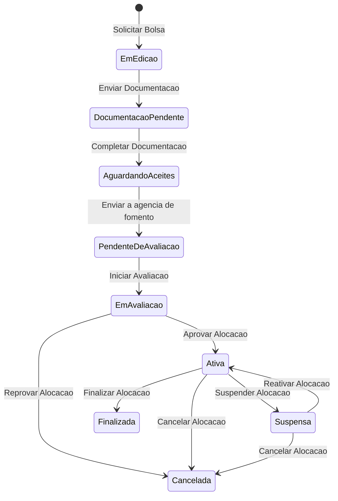
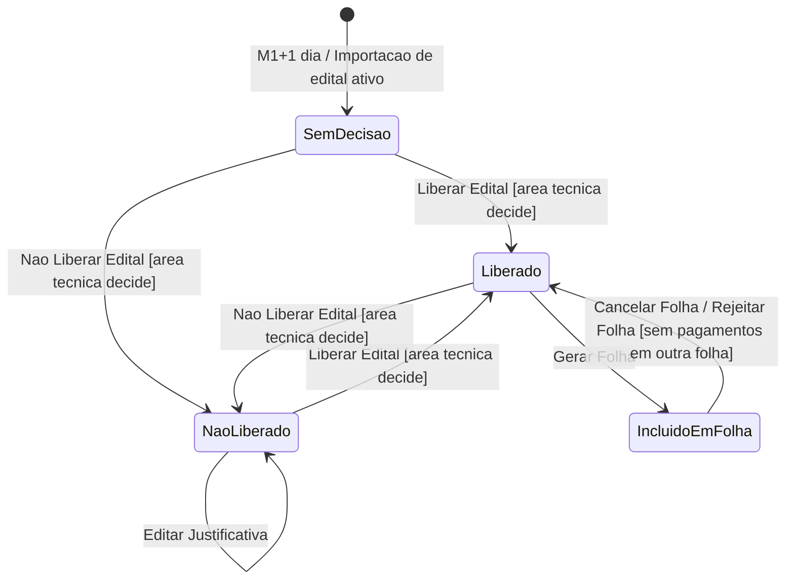
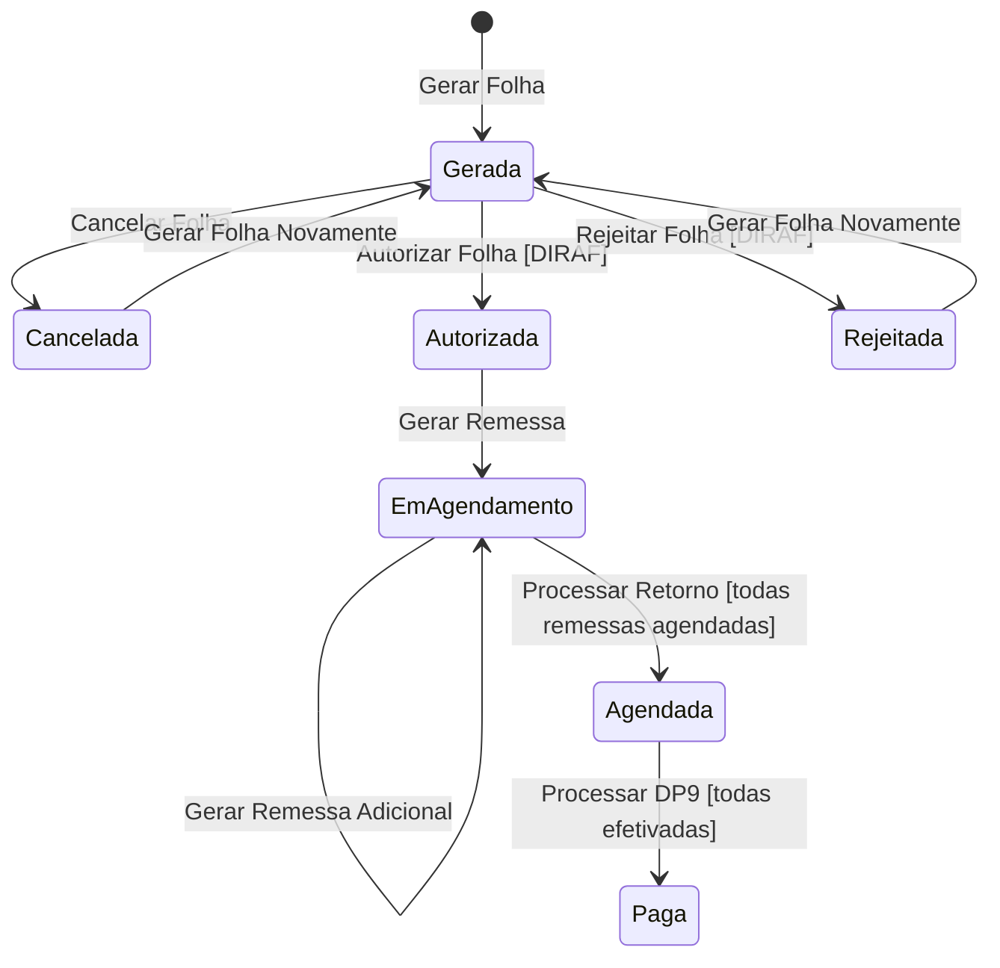
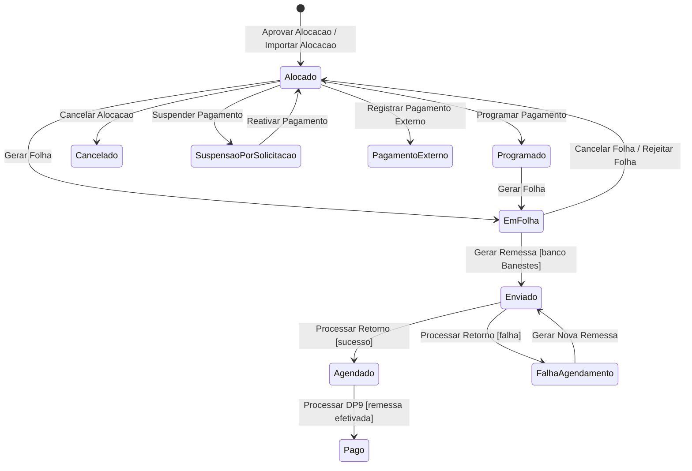
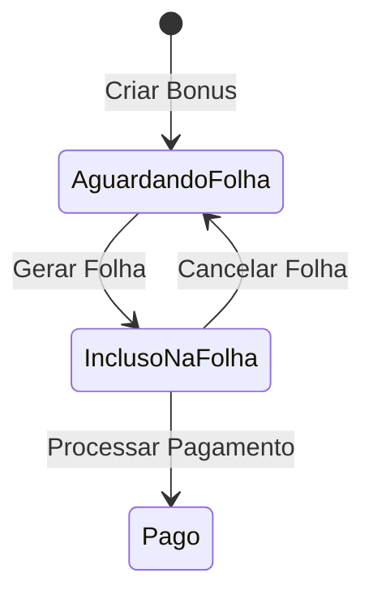
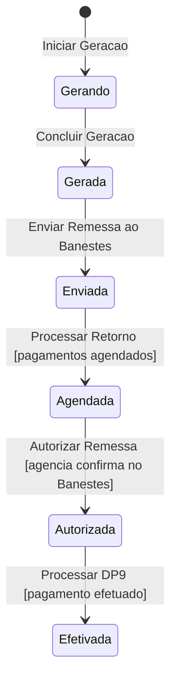
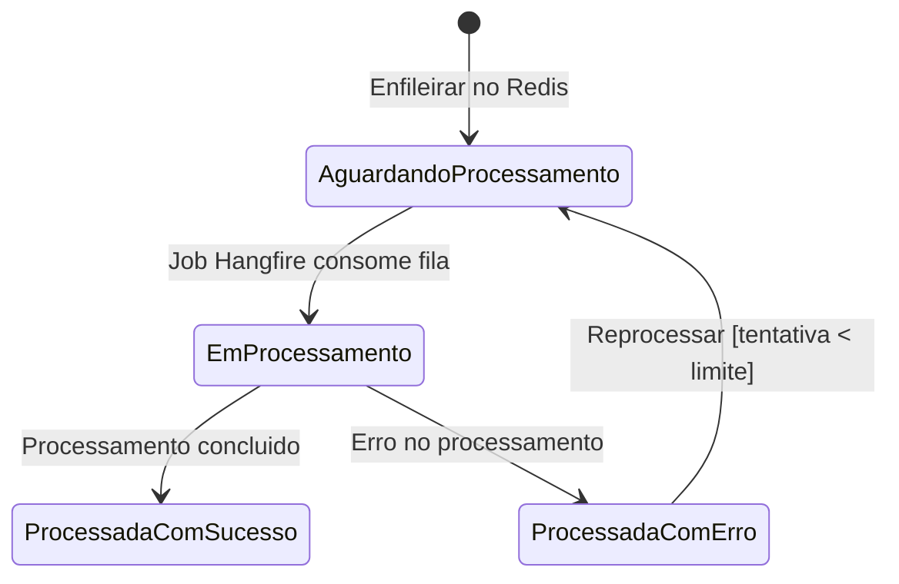
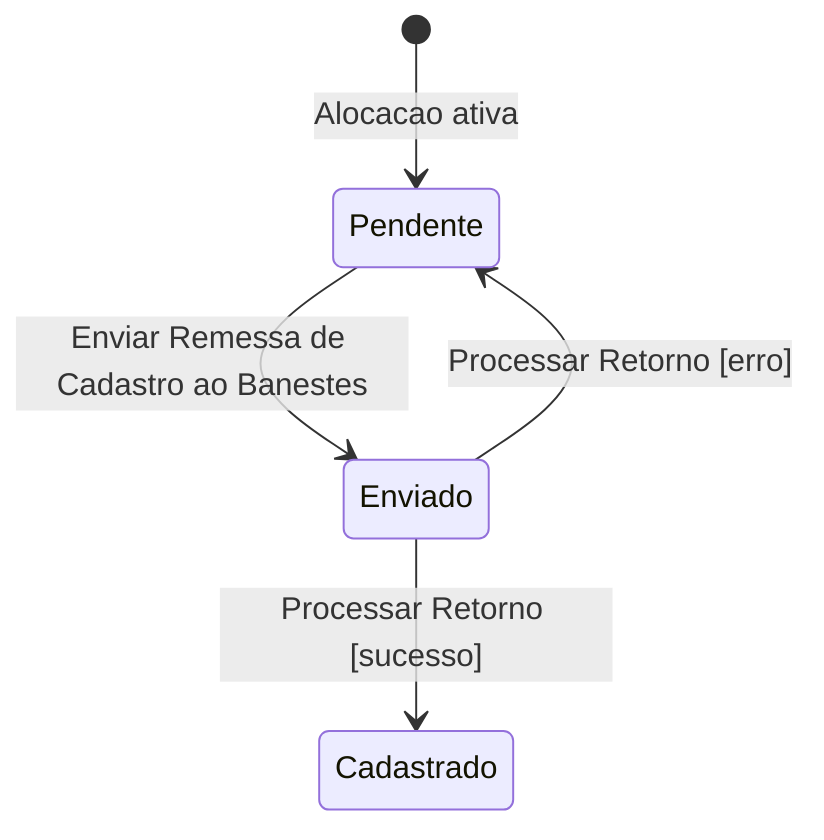

# Modelo Comportamental

Dominio e regras de negocio: ver [README.md](README.md)

### Ciclo de Vida: AlocacaoBolsista

### Ciclo de Vida: EditalCompetencia

### Ciclo de Vida: Folha

> **Nota:** Os estados `SOLICITADO_AO_BANDES` e `REMESSAS_AUTORIZADAS` estao previstos no design para o fluxo completo Bandes (entre Agendada e Paga), mas ainda nao foram implementados no codigo.

### Ciclo de Vida: PagamentoBolsista

> **Nota:** O estado `INCLUIDO_EM_GL_ALTERNATIVA` esta previsto no design para pagamentos via banco diferente de Banestes (Guia de Liberacao Alternativa), mas ainda nao foi implementado no codigo.

### Ciclo de Vida: BonusPagamento

### Ciclo de Vida: Remessa

### Ciclo de Vida: ProcessoRemessa

### Ciclo de Vida: AlocacaoBolsista (Cadastro Banestes)

