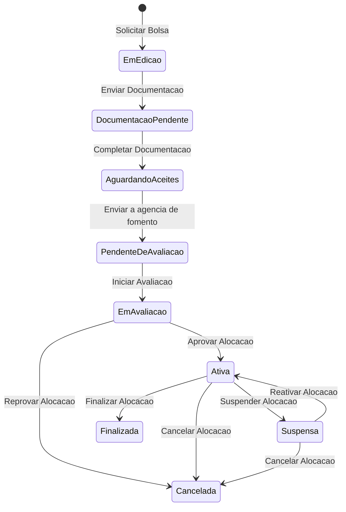
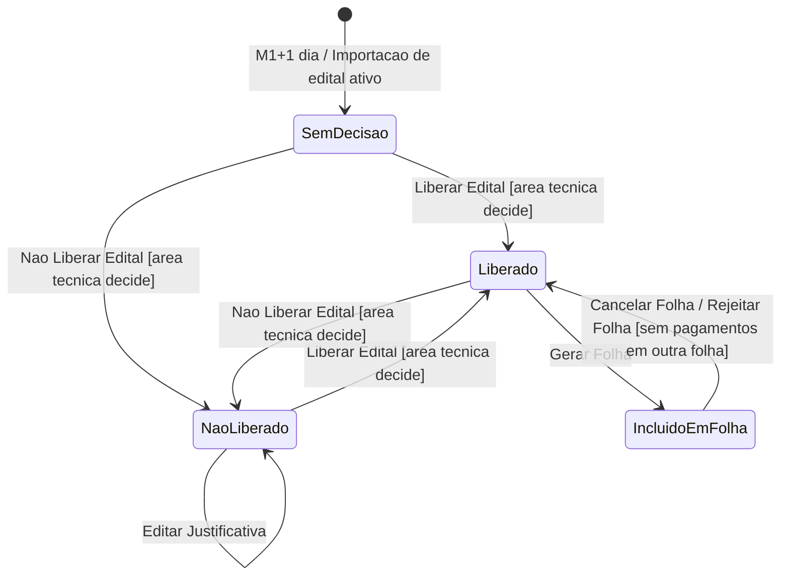
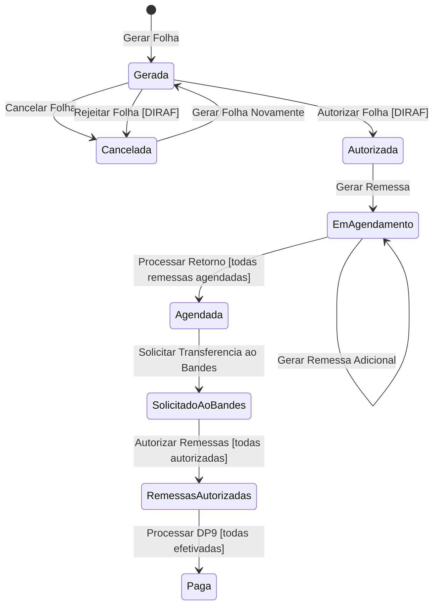
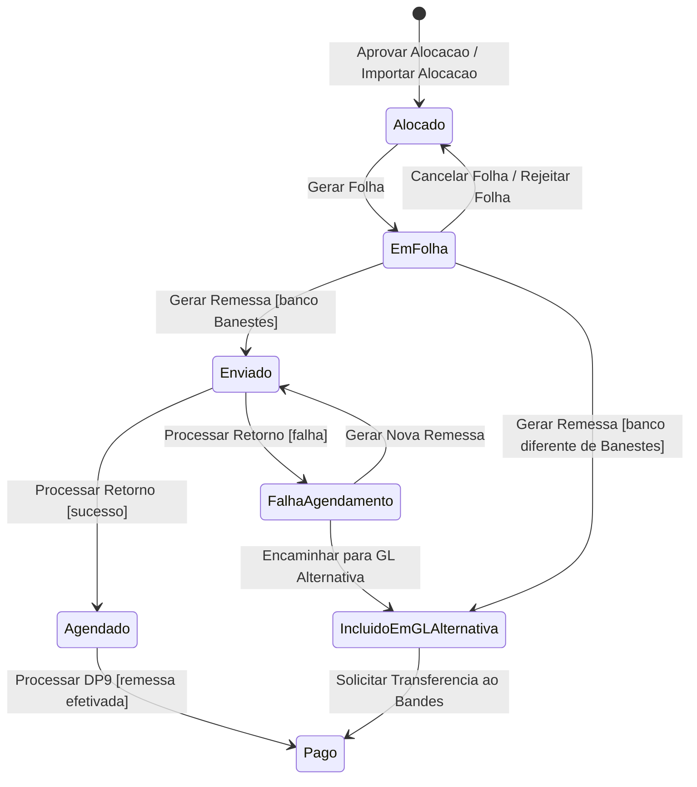
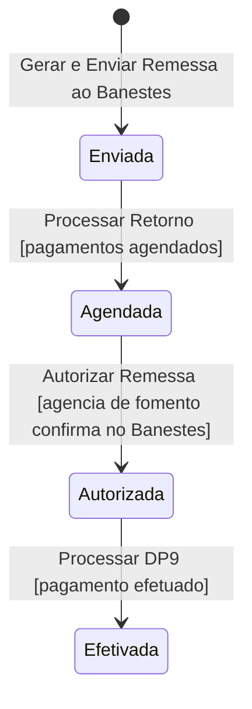
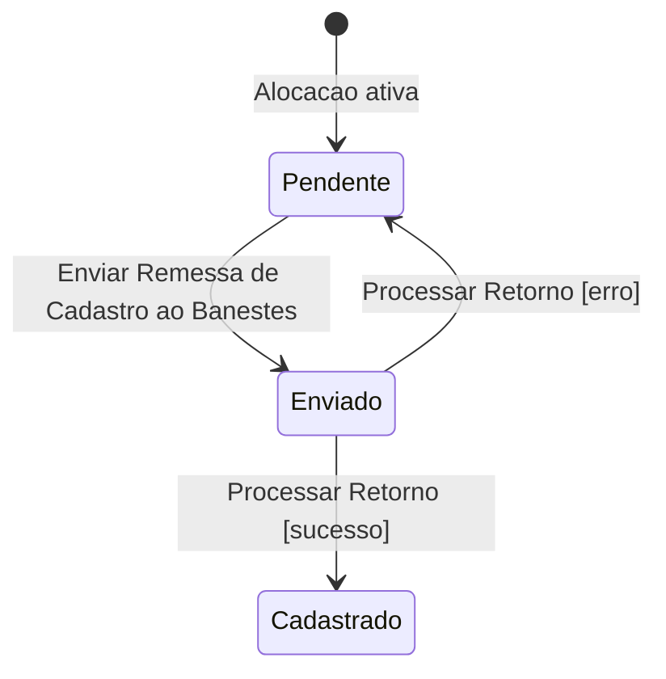

# Modelo Comportamental

Dominio e regras de negocio: ver [README.md](README.md)

### Ciclo de Vida: AlocacaoBolsista

### Ciclo de Vida: EditalCompetencia

### Ciclo de Vida: Folha

### Ciclo de Vida: PagamentoBolsista

### Ciclo de Vida: Remessa

### Ciclo de Vida: AlocacaoBolsista (Cadastro Banestes)

