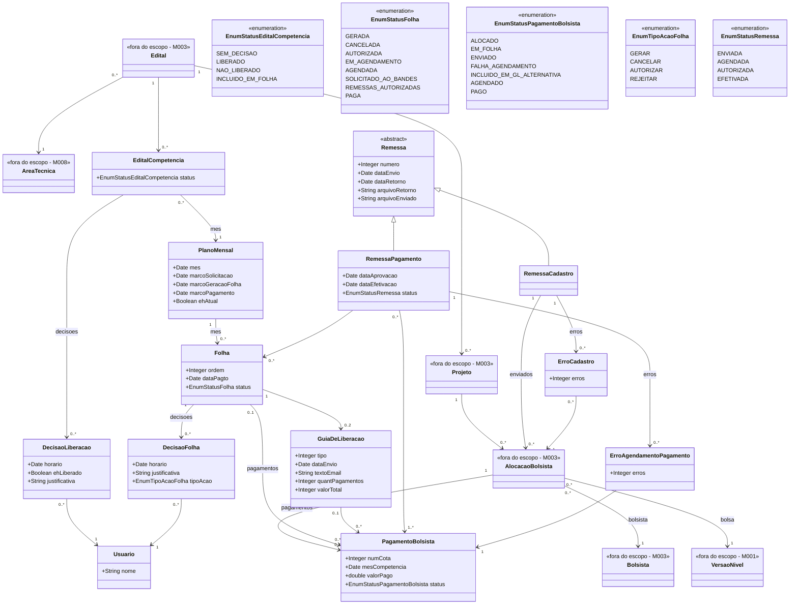

# Modelo Estrutural

Dominio e regras de negocio: ver [README.md](README.md)

### Diagrama de Classes

## Dicionario de Dados

| Classe | Atributo | Definicao | Obrig. | Tipo | Dominio | Unico |
|--------|----------|-----------|--------|------|---------|-------|
| **PlanoMensal** | mes | Mes de competencia do plano | Sim | Date | Ex: 2024-10 | Sim |
| | marcoSolicitacao | Data limite de solicitacao de bolsas (M1) | Sim | Date | | |
| | marcoGeracaoFolha | Data prevista de geracao da folha normal (M2) | Sim | Date | | |
| | marcoPagamento | Data de pagamento da folha normal (M3) | Sim | Date | | |
| | ehAtual | Indica se este e o mes atual para efeito de pagamentos | Gerado | Boolean | | |
| **EditalCompetencia** | status | Status de liberacao do edital na competencia | Gerado | EnumStatusEditalCompetencia | Sem Decisao, Liberado, Nao Liberado, Incluido em Folha | |
| **DecisaoLiberacao** | horario | Data e hora da decisao | Sim | Date | | |
| | ehLiberado | Indica se a decisao foi de liberar (true) ou nao liberar (false) | Sim | Boolean | | |
| | justificativa | Justificativa obrigatoria para decisoes de nao liberacao | Cond. | String | | |
| **Folha** | ordem | Ordem da folha no mes (1=Normal, 2+=Complementar) | Gerado | Integer | | |
| | dataPagto | Data de pagamento a ser enviada ao banco | Sim | Date | | |
| | status | Status atual da folha | Gerado | EnumStatusFolha | Gerada, Cancelada, Autorizada, Em Agendamento, Agendada, Solicitado ao Bandes, Remessas Autorizadas, Paga | |
| **DecisaoFolha** | horario | Data e hora da decisao | Sim | Date | | |
| | justificativa | Justificativa da decisao (obrigatoria para cancelamento) | Cond. | String | | |
| | tipoAcao | Tipo de acao da decisao | Sim | EnumTipoAcaoFolha | Gerar, Cancelar, Autorizar, Rejeitar | |
| **PagamentoBolsista** | numCota | Numero sequencial da cota de pagamento | Sim | Integer | | |
| | mesCompetencia | Mes de competencia do pagamento | Sim | Date | | |
| | valorPago | Valor efetivamente pago ao bolsista | Sim | Double | | |
| | status | Status atual do pagamento | Gerado | EnumStatusPagamentoBolsista | Alocado, Em Folha, Enviado, Falha Agendamento, Incluido em GL Alternativa, Agendado, Pago | |
| **GuiaDeLiberacao** | tipo | Tipo da guia de liberacao | Sim | Integer | | |
| | dataEnvio | Data de envio da guia | Sim | Date | | |
| | textoEmail | Texto do email associado a guia | Sim | String | | |
| | quantPagamentos | Quantidade de pagamentos incluidos | Sim | Integer | | |
| | valorTotal | Valor total da guia | Sim | Integer | | |
| **Remessa** | numero | Numero identificador da remessa | Sim | Integer | | Sim |
| | dataEnvio | Data de envio da remessa | Sim | Date | | |
| | dataRetorno | Data de retorno do processamento | Sim | Date | | |
| | arquivoRetorno | Caminho do arquivo de retorno | Sim | String | | |
| | arquivoEnviado | Caminho do arquivo enviado | Sim | String | | |
| **RemessaPagamento** | dataAprovacao | Data de aprovacao da remessa | Sim | Date | | |
| | dataEfetivacao | Data de efetivacao do pagamento | Sim | Date | | |
| | status | Status atual da remessa | Gerado | EnumStatusRemessa | Enviada, Agendada, Autorizada, Efetivada | |
| **ErroCadastro** | erros | Codigo(s) de erro do cadastro | Sim | Integer | | |
| **ErroAgendamentoPagamento** | erros | Codigo(s) de erro do agendamento | Sim | Integer | | |
| **Usuario** | nome | Nome do usuario que realizou a acao | Sim | String | | |

## Notas de Implementacao

**Entidades externas:**
- AreaTecnica: gerenciada por M008 (Cadastros Corporativos) como especializacao de UnidadeOrganizacional da Instituicao agencia.
- Edital, Projeto, Bolsista e AlocacaoBolsista: gerenciados por M003 (Gerenciar Editais).
- VersaoNivel: gerenciada por M001 (Modalidade de Bolsa).

**Navegabilidade:**
- Cardinalidade 1: atributo do tipo da classe destino (ex: EditalCompetencia.edital: Edital)
- Cardinalidade N: atributo lista do tipo da classe destino (ex: Folha.pagamentos: List<PagamentoBolsista>)
