# Modelo Estrutural

Dominio e regras de negocio: ver [README.md](README.md)

### Diagrama de Classes

```mermaid
classDiagram
    direction TB

    class AreaTecnica {
        <<fora do escopo - M008>>
    }

    class Edital {
        <<fora do escopo - M003>>
    }

    class Projeto {
        <<fora do escopo - M003>>
    }

    class Pessoa {
        <<fora do escopo - M003>>
    }

    class AlocacaoBolsista {
        <<fora do escopo - M003/M009>>
    }

    class VersaoNivel {
        <<fora do escopo - M001>>
    }

    class VersaoModalidade {
        <<fora do escopo - M001>>
    }

    class PlanoMensal {
        +Date mes
        +Date marcoSolicitacao
        +Date marcoGeracaoFolha
        +Date marcoPagamento
        +Boolean ehAtual
    }

    class EditalCompetencia {
        +Decimal valorPrevisto
        +Decimal valorPago
        +Integer bolsasVigentes
        +Integer bolsasPendentes
        +Integer? ordemFolha
        +Date mesCompetencia
        +EnumStatusEditalCompetencia status
    }

    class DecisaoLiberacao {
        +Date horario
        +Boolean ehLiberado
        +String? justificativa
    }

    class Usuario {
        +String nome
        +String email
        +String cpf
    }

    class Folha {
        +Integer ordem
        +String titulo
        +Date dataPagamento
        +Decimal valorPrevisto
        +Decimal valorPago
        +EnumStatusFolha status
    }

    class DecisaoFolha {
        +Date horario
        +String? justificativa
        +EnumTipoAcaoFolha tipoAcao
    }

    class PagamentoBolsista {
        +Integer ordem
        +Date? dataPagamento
        +Decimal valorPago
        +Decimal valorOriginal
        +Decimal valorBonus
        +Date mesCompetencia
        +EnumStatusPagamentoBolsista status
    }

    class BonusPagamento {
        +String nome
        +Decimal? valorFixo
        +Decimal? porcentagem
        +EnumTipoBonus tipoBonus
        +EnumStatusBonusPagamento statusBonus
    }

    class GuiaDeLiberacao {
        +EnumTipoGuiaLiberacao tipo
        +Date dataEnvio
        +String textoEmail
        +Integer quantPagamentos
        +Double valorTotal
    }

    class Remessa {
        <<abstract>>
        +String nome
        +Integer? numero
        +Date? dataEnvio
        +Date? dataRetorno
        +String arquivoEnviado
        +String arquivoRetorno
        +Boolean ehRemessaEnviada
        +Integer bolsistasEnviados
        +Integer bolsistasComErros
        +String? hash
    }

    class RemessaCadastro {
    }

    class RemessaPagamento {
        +EnumStatusRemessaPagamento status
        +Integer bolsistasAgendados
        +Decimal valorAgendado
    }

    class ErroCadastro {
        +List~Integer~ erros
    }

    class ErroAgendamentoPagamento {
        +List~Integer~ erros
    }

    class ProcessoRemessa {
        +Date dataInicio
        +Date? dataFinalizacao
        +Integer tentativa
        +Integer limite
        +EnumStatusProcessoRemessa status
        +EnumTipoRemessa tipo
        +String pathMinio
        +String? pathProcesso
    }

    class Contratante {
        +String codigoContratante
        +String nomeContratante
        +String cnpj
        +String contaBancaria
        +String agenciaBancaria
        +String nomeBanco
        +String codigoBanco
    }

    class EnumStatusEditalCompetencia {
        <<enumeration>>
        SEM_DECISAO
        LIBERADO
        NAO_LIBERADO
        INCLUIDO_EM_FOLHA
    }

    class EnumStatusFolha {
        <<enumeration>>
        GERADA
        AUTORIZADA
        CANCELADA
        REJEITADA
        EM_AGENDAMENTO
        AGENDADA
        PAGA
    }

    class EnumStatusPagamentoBolsista {
        <<enumeration>>
        ALOCADO
        PROGRAMADO
        AGENDADO
        EM_FOLHA
        ENVIADO
        PAGO
        CANCELADO
        SUSPENSAO_POR_SOLICITACAO
        FALHA_AGENDAMENTO
        PAGAMENTO_EXTERNO
    }

    class EnumTipoAcaoFolha {
        <<enumeration>>
        GERAR
        CANCELAR
        AUTORIZAR
        REJEITAR
    }

    class EnumStatusRemessaPagamento {
        <<enumeration>>
        GERANDO
        GERADA
        ENVIADA
        AGENDADA
        AUTORIZADA
        EFETIVADA
    }

    class EnumTipoGuiaLiberacao {
        <<enumeration>>
        NORMAL
        ALTERNATIVA
    }

    class EnumTipoBonus {
        <<enumeration>>
        VALOR_FIXO
        PORCENTAGEM
    }

    class EnumStatusBonusPagamento {
        <<enumeration>>
        AGUARDANDO_FOLHA
        INCLUSO_NA_FOLHA
        PAGO
    }

    class EnumStatusProcessoRemessa {
        <<enumeration>>
        AGUARDANDO_PROCESSAMENTO
        EM_PROCESSAMENTO
        PROCESSADA_COM_SUCESSO
        PROCESSADA_COM_ERRO
    }

    class EnumTipoRemessa {
        <<enumeration>>
        REMESSA_CADASTRO_BOLSISTAS
        REMESSA_PAGAMENTO
    }

    Edital "0..*" --> "1" AreaTecnica
    Edital "1" --> "0..*" EditalCompetencia
    Edital "1" --> "0..*" Projeto
    Projeto "1" --> "0..*" AlocacaoBolsista
    AlocacaoBolsista "0..*" --> "1" Pessoa : pessoa
    AlocacaoBolsista "0..*" --> "1" VersaoNivel : bolsa
    AlocacaoBolsista "1" --> "0..*" PagamentoBolsista : pagamentos
    AlocacaoBolsista "1" --> "0..*" ErroCadastro : erros
    AlocacaoBolsista "1" --> "0..*" RemessaCadastro : remessas
    EditalCompetencia "0..*" --> "1" PlanoMensal : mes
    EditalCompetencia "0..*" --> "1" Edital : edital
    EditalCompetencia "1" --> "0..*" DecisaoLiberacao : decisoes
    DecisaoLiberacao "0..*" --> "1" Usuario
    PlanoMensal "1" --> "0..*" Folha : mes
    PlanoMensal "1" --> "0..*" EditalCompetencia : competencias
    PlanoMensal "1" --> "0..*" BonusPagamento : bonus
    Folha "1" --> "0..*" DecisaoFolha : decisoes
    Folha "0..1" --> "0..*" PagamentoBolsista : pagamentos
    Folha "1" --> "0..*" GuiaDeLiberacao : guias
    Folha "1" --> "0..*" RemessaPagamento : remessas
    DecisaoFolha "0..*" --> "1" Usuario
    GuiaDeLiberacao "0..1" --> "0..*" PagamentoBolsista
    PagamentoBolsista "*" --> "0..1" BonusPagamento : bonus
    BonusPagamento "*" <--> "*" VersaoModalidade : versaoModalidades
    Remessa <|-- RemessaCadastro
    Remessa <|-- RemessaPagamento
    RemessaCadastro "1" --> "0..*" ErroCadastro : erros
    RemessaCadastro "1" --> "0..*" AlocacaoBolsista : enviados
    ErroCadastro "0..*" --> "1" AlocacaoBolsista
    RemessaPagamento "0..*" --> "0..*" Folha
    RemessaPagamento "0..*" --> "1..*" PagamentoBolsista
    ErroAgendamentoPagamento "0..*" --> "1" PagamentoBolsista
    RemessaPagamento "1" --> "0..*" ErroAgendamentoPagamento : erros
    ProcessoRemessa "*" --> "1" Remessa : remessa
```

## Dicionario de Dados

| Classe | Atributo | Definicao | Obrig. | Tipo | Dominio | Unico |
|--------|----------|-----------|--------|------|---------|-------|
| **PlanoMensal** | mes | Mes de competencia do plano | Sim | Date | Ex: 2024-10 | Sim |
| | marcoSolicitacao | Data limite de solicitacao de bolsas (M1) | Sim | Date | | |
| | marcoGeracaoFolha | Data prevista de geracao da folha normal (M2) | Sim | Date | | |
| | marcoPagamento | Data de pagamento da folha normal (M3) | Sim | Date | | |
| | ehAtual | Indica se este e o mes atual para efeito de pagamentos | Gerado | Boolean | | |
| **EditalCompetencia** | valorPrevisto | Valor previsto para o edital na competencia | Sim | Decimal | | |
| | valorPago | Valor efetivamente pago | Sim | Decimal | | |
| | bolsasVigentes | Quantidade de bolsas vigentes | Sim | Integer | | |
| | bolsasPendentes | Quantidade de bolsas pendentes | Sim | Integer | | |
| | ordemFolha | Ordem na folha de pagamento | Nao | Integer | | |
| | mesCompetencia | Mes de competencia | Sim | Date | | |
| | status | Status de liberacao do edital na competencia | Gerado | EnumStatusEditalCompetencia | Sem Decisao, Liberado, Nao Liberado, Incluido em Folha | |
| **DecisaoLiberacao** | horario | Data e hora da decisao | Sim | Date | | |
| | ehLiberado | Indica se a decisao foi de liberar (true) ou nao liberar (false) | Sim | Boolean | | |
| | justificativa | Justificativa obrigatoria para decisoes de nao liberacao | Cond. | String | | |
| **Folha** | ordem | Ordem da folha no mes (0=Normal, >0=Complementar) | Gerado | Integer | | |
| | titulo | Titulo da folha (gerado automaticamente: FOLHA-NORMAL-DD/MM/YYYY ou FOLHA-COMPLEMENTAR-N-DD/MM/YYYY) | Gerado | String | | |
| | dataPagamento | Data de pagamento a ser enviada ao banco | Sim | Date | | |
| | valorPrevisto | Valor previsto para pagamento | Sim | Decimal | | |
| | valorPago | Valor efetivamente pago | Sim | Decimal | | |
| | status | Status atual da folha | Gerado | EnumStatusFolha | Gerada, Autorizada, Cancelada, Rejeitada, Em Agendamento, Agendada, Paga | |
| **DecisaoFolha** | horario | Data e hora da decisao | Sim | Date | | |
| | justificativa | Justificativa da decisao (obrigatoria para cancelamento) | Cond. | String | | |
| | tipoAcao | Tipo de acao da decisao | Sim | EnumTipoAcaoFolha | Gerar, Cancelar, Autorizar, Rejeitar | |
| **PagamentoBolsista** | ordem | Numero sequencial da cota de pagamento | Sim | Integer | | |
| | dataPagamento | Data em que o pagamento foi efetuado | Nao | Date | | |
| | valorPago | Valor efetivamente pago (original + bonus) | Sim | Decimal | | |
| | valorOriginal | Valor original da bolsa | Sim | Decimal | | |
| | valorBonus | Valor de bonus | Sim | Decimal | | |
| | mesCompetencia | Mes de competencia do pagamento | Sim | Date | | |
| | status | Status atual do pagamento | Gerado | EnumStatusPagamentoBolsista | Alocado, Programado, Agendado, Em Folha, Enviado, Pago, Cancelado, Suspensao por Solicitacao, Falha Agendamento, Pagamento Externo | |
| **BonusPagamento** | nome | Nome do bonus (gerado automaticamente) | Gerado | String | | |
| | valorFixo | Valor fixo do bonus (quando tipo VALOR_FIXO) | Cond. | Decimal | | |
| | porcentagem | Porcentagem do bonus (quando tipo PORCENTAGEM) | Cond. | Decimal | | |
| | tipoBonus | Tipo do bonus | Sim | EnumTipoBonus | Valor Fixo, Porcentagem | |
| | statusBonus | Status do bonus de pagamento | Gerado | EnumStatusBonusPagamento | Aguardando Folha, Incluso na Folha, Pago | |
| **GuiaDeLiberacao** | tipo | Tipo da guia de liberacao | Sim | EnumTipoGuiaLiberacao | Normal, Alternativa | |
| | dataEnvio | Data de envio da guia | Sim | Date | | |
| | textoEmail | Texto do email associado a guia | Sim | String | | |
| | quantPagamentos | Quantidade de pagamentos incluidos | Sim | Integer | | |
| | valorTotal | Valor total da guia | Sim | Double | | |
| **Remessa** | nome | Nome da remessa | Sim | String | | |
| | numero | Numero identificador da remessa (via arquivo de retorno) | Nao | Integer | | Sim |
| | dataEnvio | Data de envio da remessa | Nao | Date | | |
| | dataRetorno | Data de retorno do processamento | Nao | Date | | |
| | arquivoEnviado | Conteudo/referencia do arquivo enviado | Sim | String | | |
| | arquivoRetorno | Conteudo/referencia do arquivo de retorno | Sim | String | | |
| | ehRemessaEnviada | Indica se a remessa foi enviada | Sim | Boolean | | |
| | bolsistasEnviados | Quantidade de bolsistas enviados | Sim | Integer | | |
| | bolsistasComErros | Quantidade de bolsistas com erros | Sim | Integer | | |
| | hash | Hash SHA256 do arquivo para garantir integridade | Nao | String | | |
| **RemessaPagamento** | status | Status atual da remessa de pagamento | Gerado | EnumStatusRemessaPagamento | Gerando, Gerada, Enviada, Agendada, Autorizada, Efetivada | |
| | bolsistasAgendados | Quantidade de bolsistas agendados | Sim | Integer | | |
| | valorAgendado | Valor total agendado | Sim | Decimal | | |
| **ErroCadastro** | erros | Lista de codigos de erros | Sim | List\<Integer\> | | |
| **ErroAgendamentoPagamento** | erros | Lista de codigos de erros | Sim | List\<Integer\> | | |
| **ProcessoRemessa** | dataInicio | Data de inicio do processamento | Sim | Date | | |
| | dataFinalizacao | Data de finalizacao do processamento | Nao | Date | | |
| | tentativa | Numero da tentativa atual | Sim | Integer | | |
| | limite | Limite de tentativas | Sim | Integer | | |
| | status | Status do processamento | Gerado | EnumStatusProcessoRemessa | Aguardando Processamento, Em Processamento, Processada com Sucesso, Processada com Erro | |
| | tipo | Tipo de remessa | Sim | EnumTipoRemessa | Remessa Cadastro Bolsistas, Remessa Pagamento | |
| | pathMinio | Caminho do arquivo no MinIO | Sim | String | | |
| | pathProcesso | Caminho do processo | Nao | String | | |
| **Contratante** | codigoContratante | Codigo do contratante | Sim | String | | |
| | nomeContratante | Nome do contratante | Sim | String | | |
| | cnpj | CNPJ do contratante | Sim | String | | |
| | contaBancaria | Numero da conta bancaria | Sim | String | | |
| | agenciaBancaria | Numero da agencia bancaria | Sim | String | | |
| | nomeBanco | Nome do banco | Sim | String | | |
| | codigoBanco | Codigo do banco | Sim | String | | |
| **Usuario** | nome | Nome do usuario que realizou a acao | Sim | String | | |
| | email | Email do usuario | Sim | String | | |
| | cpf | CPF do usuario | Sim | String | | |

## Notas de Implementacao

**Entidades externas:**
- AreaTecnica: gerenciada por M008 (Cadastros Corporativos) como especializacao de UnidadeOrganizacional da Instituicao agencia.
- Edital, Projeto, Pessoa e AlocacaoBolsista: gerenciados por M003 (Gerenciar Editais) e M009 (Gestao Bolsista).
- VersaoNivel e VersaoModalidade: gerenciadas por M001 (Modalidade de Bolsa).

**Navegabilidade:**
- Cardinalidade 1: atributo do tipo da classe destino (ex: EditalCompetencia.edital: Edital)
- Cardinalidade N: atributo lista do tipo da classe destino (ex: Folha.pagamentos: List<PagamentoBolsista>)

**Convencao de Folha.ordem:**
- `0` = Folha Normal (primeira folha do mes)
- `> 0` = Folha Complementar (sequencial)

**Enums planejados (nao implementados):**
- `EnumStatusFolha.SOLICITADO_AO_BANDES` e `REMESSAS_AUTORIZADAS` — previstos no modelo comportamental para o fluxo completo Bandes, ainda nao implementados no codigo.
- `EnumStatusPagamentoBolsista.INCLUIDO_EM_GL_ALTERNATIVA` — previsto para fluxo de Guia de Liberacao Alternativa, ainda nao implementado no codigo.
